## Part 1

Source note: AI-literacy-frameworks (Part 1)

Original range: lines 1-107
Original chars: 0-8269

<!-- source: AI-literacy-frameworks (Part 1).md -->

### 翻譯與對照報告

#### 摘要

本文件翻譯自一份為英國皇家學會（Royal Society）準備的報告摘要。該報告針對全球「人工智慧素養」（AI Literacy）框架進行了快速回顧，並提出了具體的政策建議。報告指出，目前兒童對 AI 的使用程度已大幅超越其對 AI 運作原理、使用時機及對人權與環境影響的理解。研究發現，現有的 AI 素養框架過度集中於技術層面（如演算法、機器學習），而忽略了 AI 對人類社會、倫理、民主及環境等「人文維度」的影響。因此，報告建議英國政策制定者應建立一個涵蓋技術、實務與人文維度的全面性框架，並透過教師培訓、資源開發及試辦計畫來落實。

#### 翻譯內文

### <span id="page-0-1"></span><span id="page-0-0"></span> **AI 素養框架快速回顧與政策建議**

為皇家學會（Royal Society）準備之報告

<span id="page-0-6"></span><span id="page-0-3"></span><span id="page-0-2"></span>*Dr Veli Hillman, Professor Wayne Holmes, Tania Duarte* (*We and AI*)

<span id="page-0-4"></span>準備單位：

<span id="page-0-5"></span>Hanna Barakat & Cambridge Diversity Fund

本報告係為倫敦皇家學會準備。報告中所表達之觀點僅代表作者個人，並不代表皇家學會之立場。封面圖像：Hanna Barakat & Cambridge Diversity Fund https://betterimagesofai.org / https://creativecommons.org/licenses/by-4.0

#### 目錄

| 序號 | 章節名稱 | 頁碼 |
|----|---------------------------------------|------|
| 1. | 引言 | |
| 2. | 何謂 AI 素養？ | 9 |
| 3. | 研究方法 | 13 |
| 4. | 各類框架分析 | 17 |
| 5. | 個案研究 | 31 |
| 6. | 國際與國內比較 | 35 |
| 7. | 影響與啟示 | 40 |
| 8. | 政策建議與執行槓桿 | 46 |
| 9. | 結語 | 51 |

#### **作者介紹**

**Dr Veli Hillman** 為倫敦大學金史密斯學院（Goldsmiths, University of 런던）講師，同時也是教育數據數位防護研究所（Education Data Digital Safeguards Institute）的創辦人，致力於研究與評估教育技術及 AI 產品的倫理、合法性與安全性。她著有《馴服教育科技：為何受監管不足的數位化教室會讓孩子蒙受損失》（*Taming Edtech: Why Children Stand to Lose in an Unregulated Digitised Classroom*），由 Bloomsbury Academic 出版。

**Professor Wayne Holmes** 為倫敦大學學院（UCL）教育學院「人工智慧與教育批判研究」教授。他同時擔任聯合國教科文組織（UNESCO）人工智慧與教育倫理主席（斯洛維尼亞國際人工智慧研究中心）。其研究領域涵蓋使用人工智慧進行教學與學習時，對倫理、人權及社會正義所帶來的影響。

**Tania Duarte** 領導了 IEEE P7015 「數據與人工智慧（AI）素養、技能與準備度標準」的定義小組，並擔任 Springer 旗下《AI 與倫理》（AI and Ethics）期刊的編輯委員會成員。她是 We and AI（https://weandai.org）的創辦人，該非營利組織致力於鼓勵、賦能並強化大眾對 AI 的批判性思考。

#### **執行摘要**

人工智慧正日益形塑兒童的生活與學習方式。然而，他們對 AI 的參與度（包括在學校的使用）正大幅領先於他們對 AI 運作原理、何時及如何使用，以及 AI 對人權、社會能動性、民主未來及環境意義的理解。換言說，兒童對 AI 的參與程度，與其具備的 AI 素養水平之間存在著日益嚴重的脫節。

近幾個月來，全球多位研究人員與機構開發了可統稱為「AI 素養框架」的方法，用以支持兒童的 AI 素養發展。這既是機遇也是挑戰：機遇在於教育部門與學校現在擁有了越來越多元的方法可供參考；挑戰則在於越來越難以辨別哪些內容才是真正關鍵的。正是在此背景下，皇家學會委託進行了這項全球 AI 素養框架的快速回顧，以期為英國各部會、學校及其他相關單位提供參考資訊。

我們的回顧共識別出 115 篇文獻，其中我們針對 20 篇進行了深入分析。首先，我們發現文獻中對於「AI 素養」並無全球統一的定義；且通常不清楚目標對象是誰（是對計算感興趣的兒童，還是所有人）。

事實上，在所分析的 20 個框架中，幾乎所有框架都聚焦於 AI 的技術基礎（數據、演算法、機器學習等）以及如何「有效地」使用 AI。對於 AI 對人類與社會的意義——例如對公平、包容、工作、地球、和平、民主等的影響——關注則相對較少。我們認為，這種過度強調技術（主要對計算領域感興趣的人重要）而相對排除 AI 對人類影響（對所有人皆重要）的做法是有問題的。

同時，框架的交付模式從高層次的原則到詳細的進度規劃不等，而缺乏充足的證據，使得政策制定者缺乏可供大規模實施或具備系統性路徑的方案。

在英國的四個組成國中，各項方法仍顯破碎。英格蘭已為學校與教師發布了廣泛的指導方針；蘇格蘭投資於公共素養與透明度的公民參與基礎設施；威爾斯將 AI 與負責任的公民身份進行了鬆散的連結；北愛爾文則正在探索各種手段。目前尚無任何一種方法能提供一致性的路徑，將 AI 素養嵌入各學科中，並內建適當的評估、資源與包容機制，或建立共同的倫理與公民責任。同時，國際案例提供了一些具前景的方法（例如：教師優先的專業發展、與學校共同設計、地區試辦計畫及公民計畫），但這些方法仍需調整以適應英國的國情。

我們的報告為英國設定了一條明確的路徑：首先清晰==定義 AI 素養（從技術、實務與人文維度出發）；將其嵌入現有學科中，且不擠壓核心素養或批判性思考的空間；資助教師培訓並優先考慮特殊教育需求（SEN）的調整；設定最低的無障礙標準；並透過「先試辦、後擴張」且經過獨立評估的方式，來規模化成功的模式==。

#### **給英國政策制定者的建議摘要**

完整建議請參閱第 47 頁開始的第八章。

以下建議旨在支持四個關鍵成功要素，重點關注有效教育、經濟與社會進步之間的聯繫。

- **1. 應對英國的需求**
- **2. 建立教育成功的基礎設施**
- **3. 採取迭代且具應變性的執行方式**
- **4. 打造面向未來的英國**

#### **應對英國的需求**

###### **明確 AI 素養的受眾**

英國的 AI 素養框架必須為「所有兒童」開發（而非僅針對對計算或其他技術學科感興趣的兒童）。

##### **清晰且全面地定義 AI 素養**

採用一個涵蓋 AI 技術與實務維度，且特別強調「人文維度」（即 AI 如何影響人類與社會）的英國定義。

###### **優先考慮 AI 的人文維度**

將人權、倫理、包容、民主及環境影響作為 AI 素養的核心驅動力與成果。

###### **建立一致的全英統一方法**

建立全英國統一的 AI 素養基準，並針對兒童「應知、應能、應重視」的內容設定具體且可執行的標準。

#### **建立教育成功的基礎設施**

#### **成立國家級多方利害關係人 AI 素養工作小組**

召集政府、教育工作者、研究人員、產業界與公民社會，以協調 AI 素動標準、證據、倫理與透明度。

###### **優先進行教師培訓與發展**

提供資金與持續專業發展（CPD/ITE）資源，確保每位教師、教育行政人員、學校領導者及教育政策制定者都具備真正的 AI 素養。

###### **教材資源**

投入充足資金用於開發與改編 AI 素養教材及資源。

###### **防範過度的企業影響**

確保產業提供的任何 AI 素養資源在採用前，皆經過透明化處理、符合適當標準，並通過獨立評估。

#### **採取迭代且具應變性的執行方式**

#### **委託試辦計畫與長期研究**

在進行大規模推廣 AI 素養工作之前，先在多元且具挑戰性的地區進行試辦，並收集獨立的評估結果。

###### **與現有的數位素養工作接軌**

建立在數位素養、數據素養與媒體素養的基礎之上，以避免重複工作並減輕工作量。

#### 詞彙與關鍵術語

| 英文術語 | 繁體中文翻譯 | 說明 |
| :--- | :--- | :--- |
| AI Literacy | 人工智慧素養 | 指理解 AI 運作原理、應用能力及倫理判斷的綜合能力。 |
| Human Dimension | 人文維度 / 人類維度 | 指 AI 對於人權、社會、倫理與環境等非技術性的影響。 |
| Technical Dimension | 技術維度 | 指演算法、數據、機器學習等底層技術層面。 |
| Policy Recommendations | 政策建議 | 為政府或機構提供的行動指南。 |
| Stakeholders | 利害關係人 | 受政策影響或參與政策制定的各方（如政府、學校、企業）。 |
| CPD (Continuing Professional Development) | 持續專業發展 | 教師或專業人士在職期間的進修與技能提升。 |
| ITE (Initial Teacher Education) | 教師培訓 / 初任教師教育 | 指新進教師接受的專業教育與訓練。 |

#### 邏輯架構圖

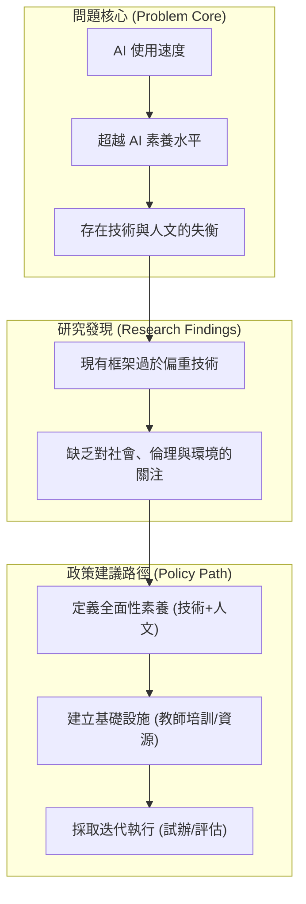

---

## Part 2

Source note: AI-literacy-frameworks (Part 2)

Original range: lines 85-180
Original chars: 7247-15563

<!-- source: AI-literacy-frameworks (Part 2).md -->

### 翻譯與對照報告

#### 摘要

本文件探討了建立 AI 素養（AI Literacy）框架的必要性與策略，特別著重於英國教育體系的現狀。隨著生成式 AI（GenAI）在教育領域的快速普及，教學能力卻未能同步跟進。報告提出了三大核心維度：使用 AI 進行教學（AIED）、為了 AI 進行教學，以及關於 AI 的教學（即 AI 素養）。為了應對技術帶來的挑戰，報告建議應優先進行教師培訓、開發適當的資源、防止企業不當影響，並透過迭代式的實施策略（如試辦計畫與縱向研究）來建立一個具備公平性、安全性且能與社會接軌的未來教育體系。

#### 翻譯內文

（接續前文）...社會以協調 AI 素養標準、證據、倫理與透明度。

###### **優先進行教師培訓與發展**

提供資金與持續專業發展（CPD）及初任教師教育（ITE），以確保每位教師、教育行政人員、學校領導者及教育決策者都能真正具備 AI 素養。

###### **教材資源**

投入充足資金用於開發與改編 AI 素養教材及相關資源。

###### **防止不當的企業影響**

確保由產業提供的任何 AI 素養資源在採用前，皆經過透明化處理、符合適當標準，並通過獨立評估。

#### **採取迭代且具回應性的實施方法**

#### **委託試辦計畫與縱向研究**

在於大規模推行 AI 素養計畫之前，先在多元且具挑戰性的地區進行試辦，並收集獨立的評估結果。

###### **與現有的數位素養計畫接軌**

建立在現有的數位、數據與媒體素養基礎之上，以避免功能重複並減輕工作量。

##### **開發 AI 素養專用評估工具**

評估應採輕量化設計，嵌入現有的學科與教學計畫中，並與更廣泛的素養與公民教育目標相結合。

##### **梳理並支持草根性的 AI 素養倡議**

支持現有的由下而上的實踐與目前的相關努力。

#### **打造面向未來的英國**

###### **將 AI 素養融入全科課程**

將學習內容與成果與現有學科進行對齊（例如：PSHE/公民教育、英語/媒體研究、設計與技術、數學與科學，以及資訊科學）。

###### **解決公平性與可及性問題**

將資金重點投放於資源匱乏與弱勢學校，並要求在設計階段即納入「公平、多元與包容」（EDI）。

###### **保障兒童安全**

針對學校中的 AI 素養，制定並強制執行具約束力的安全、隱私、倫理、法律與透明度標準。

###### **連結教室與社會**

透過兒童的參與，將 AI 素養與現實世界的公民、環境、社會、政治及經濟相關專案緊密結合。

#### **1. 引言**

隨著 2022 年底 ChatGPT 的發布，人工智慧（AI）正日益影響著兒童的生活與學習方式。在英國，AI 系統的使用已廣泛存在於公共服務、各類娛樂設備，以及兒童與青少年的日常生活中。然而，教室在教授「AI 如何運作」、「是否/何時/如何使用」以及「其對人類、社會、環境、經濟與政治的影響」方面的能力，卻未能跟上技術進步的步伐。換句話說，教育領域對 AI 系統的採用與使用速度，正快於教師與學生變得「具備 AI 素養」的速度。

在 2025 年 1 月的一次皇家學會（Royal Society）圓桌會議上，與會者一致認為學校需要幫助孩子們具備 AI 素養。學校必須裝備所有孩子，使他們不僅僅是知道「如何使用」AI，還要能夠理解、參與 AI 的塑造並對其提出質疑。因此，本報告回顧了全球如何構思與實施 AI 素養，為英國如何確保所有孩子都能在日益受 AI 影響的世界中生存，提供基礎與初步指導。

###### **使用 AI 進行教學與學習 (AIED)**

鑑於教育領域 AI 採用模式的日益增長（例如：使用適應性輔導系統、電子監考系統及生成式 AI 應用），政策缺口顯得尤為迫切。英國近半數的教師已在使用生成式 AI 來輔助教學規劃、生成教材及自動化批改——儘管大多對該技術具爭議性的起源或潛在後果僅有有限的了解。與此同時，目前仍缺乏系統性的基礎設施來支持教師。

英國政府與公開大學（Open University）的一項合作計畫正在建立一個共享內容庫（包含匿名學生數據、課程內容與教案），並設立 100 萬英鎊的獎金，以激勵開發適用於教師的 AI 工具。

近期，教育部推出了《在教育環境中使用 AI：支援教材》，並隨附兩份委託報告（《教育中的生成式 AI：教育工作者與專家的觀點》以及《生成式 AI 在教育中的應用案例》），共同描繪了 AI 工具使用的態度與範例。然而，截至 2025 年中，目前仍不清楚這些出版物（基於自我報告且缺乏批判性分析）是否會轉化為正式的政策或課程改革。

同時，近期的調查顯示，大多數教師日益看好 AI 的價值，但仍對其在偏見、透明度及對學習影響方面的風險感到擔憂。與此同時，職前教師表示信心不足，並偏好實作型、同儕導向的培訓；而 AI 生成的內容則日益由上而下地推行，導致教師的專業自主權受限，且未能真正減輕工作負擔。

至關重要的是，教師日益將 AI 作為「節省時間」與「腦力激盪」的工具，這並不意味著教師或學生正被裝備去理解、質疑或批判性地評估 AI 本身。換言之，「使用 AI 進行教學與學習 (AIED)」並不等同於「為了 AI 進行教學與學習」或「關於 AI 的教學與學習（即 AI 素養）」。本報告的重點並非「使用 AI 進行教學與學習」。

###### **為了 AI 進行教學與學習**

前述 AI 與教育之間的第二種聯繫是「為了 AI 進行教學與學習」。這涉及教導那些正在探索計算機科學或 AI 開發職涯可能性的孩子，或是對編程、統計、演算法、基礎 AI 技術（如機器學習）及 AI 技術（如生成式 AI）等主題有特定興趣的孩子。同樣地，如後文所述，這並非本報告的重點。

###### **關於 AI 的教學與學習 (AI 素養)**

雖然教師與孩子對 AI 系統的參與度正在迅速提升，但學習「關於 AI 及其影響」（對兒童、更廣泛的社會及環境的影響）的機會卻非常有限。特別是，必須支持教師學習 AI 的三個維度（技術、實務與人文維度），以便他們能在全科課程中進行批判性教學，從而培養學生的 AI 素養，並使他們（及學生）能夠在教育內外，針對是否、何時以及如何使用 AI 做出明智的決策。

英國政府首份關於教育中生成式 AI 的政策文件，認可了「為學生做好應對變動的工作場所的準備」以及「如何安全地使用新興技術」的必要性。然而，這份工具主義色彩濃厚的論文並未提供明確的指導、培訓策略或實施計畫，也未解決資源獲取、公平性或能力問題——特別是針對資源匱礙或弱勢社群。

這些英國的研究結果反映了國際上的證據：若缺乏針對性且資訊充足的持續專業發展（CPD），僅有對 AI 的意識與倫理擔憂，並不代表能自動轉化為評估或負責任地參與 AI 的能力。

總結來說，英國教育體系目前面臨著以下領域的脫節：

*   政策對 AI 與教育的關注，
*   對 AI 起源與影響的批判性意識，
*   學校內部的草根性實驗，以及
*   缺乏系統性的能力、清晰度或一致性。

###### **本報告的起源與理據**

對於 AI 與教育（AI&ED）而言，事態正朝著兩個方向快速變化。例如，在撰寫本報告時，Google 才剛宣布推出「Google for Education」（推進 AI 驅動的教育），而南韓則剛取消了其 AI 教科書計畫。

一個核心問題是，儘管人們幾乎每天都在接觸 AI，但很少有人理解它究竟是什麼、如何運作、它的能力與局限、其機會與挑戰，以及它現在或未來可能產生的影響。因此，教育必須迫切地讓孩子掌握在快速變遷的環境中航行的技術、批判性、社會倫理知識、技能與價值觀。換句話說，教育必須迫切地培養學生的「AI 素養」。

#### 詞彙與關鍵術語

| 英文術語 | 繁體中文翻譯 | 說明 |
| :--- | :--- | :--- |
| AI Literacy | AI 素養 | 理解 AI 技術、應用及其社會影響的能力。 |
| AIED (Teaching and learning *with* AI) | 使用 AI 進行教學與學習 | 將 AI 作為工具來輔助教學流程、減輕負擔。 |
| Teaching and learning *for* AI | 為了 AI 進行教學與學習 | 培養未來從事 AI 或計算相關職業的專業技能。 |
| Teaching and learning *about* AI | 關於 AI 的教學與學習 | 學習 AI 的技術原理、倫理、社會與環境影響。 |
| CPD (Continuing Professional Development) | 持續專業發展 | 教師在職期間的進修與專業技能提升。 |
| ITE (Initial Teacher Education) | 初任教師教育 | 培訓新進教師的專業教育過程。 |
| GenAI (Generative AI) | 生成式 AI | 能夠生成文本、圖像、音訊等新內容的人工智慧技術。 |
| Longitudinal research | 縱向研究 / 長期追蹤研究 | 針對同一對象在長時間跨度內進行的觀察研究。 |
| EDI (Equity, Diversity and Inclusion) | 公平、多元與包容 | 確保資源與機會能平等地分配給不同背景的群體。 |

#### 邏輯架構圖

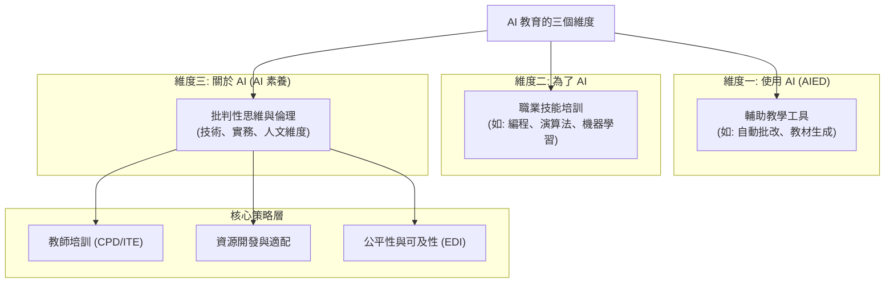

---

## Part 3

Source note: AI-literacy-frameworks (Part 3)

Original range: lines 169-239
Original chars: 14541-23094

<!-- source: AI-literacy-frameworks (Part 3).md -->

### 翻譯與對照報告

#### 摘要

本文件節錄自一份關於 AI 素養框架的研究報告。報告指出，隨著人工智慧技術的快速發展，教育系統正面臨巨大的挑戰。核心問題在於，大眾雖然日常接觸 AI，卻普遍缺乏對其運作原理、能力邊界、機會與風險的深刻理解。因此，建立「AI 素養」已成為當務之急。報告強調，AI 素養不應僅限於培養技術開發人才（即「為了 AI 的學習」），而應致力於讓所有學生都能理解 AI 的技術、實務與人文維度（即「關於 AI 的學習」），以應對 AI 帶來的社會、環境與倫理影響。

#### 翻譯內文

###### **本報告的起源與理據**

對於人工智慧與教育（AI&ED）而言，現況正朝著兩個方向快速變動。例如，在本報告撰寫時，Google 才剛宣布推出「Google 教育版」（Advancing education with AI），而南韓則剛取消了其 AI 教科書計畫。

一個關鍵問題是，儘管人們幾乎每天都在與 AI 互動，但很少有人理解其本質、運作方式、能力範圍與局限性，以及其帶來的機會、挑戰及對現在與未來的潛在影響。因此，教育界必須迫切地為兒童做好準備，賦予他們在快速演變的環境中航行所需的技術、批判性思維以及社會倫理方面的知識、技能與價值觀。換句話說，教育必須迫切地培養學生的「AI 素養」。

在先前提到的皇家學會（Royal Society）圓桌會議中，與會者一致認為，AI 素養必須超越對工具的熟悉程度；若缺乏明確的政策路線圖與持續的教師培訓，英國將面臨不平等加劇的風險，並導致兒童在面對 AI 衝擊的社會時準備不足。

為了回應圓桌會議的成果，皇家學會委託進行了這項快速審查，旨在強化有效且公平的 AI 教育之證據基礎，並幫助英國的四個國家讓兒童能夠自信、批判且謹慎地應對 AI 技術及其後果。

為此，我們審查了針對 5 至 18 歲年齡層的 AI 素養框架與政策槓桿，識別其趨同與分歧之處，並針對課程、學生、教師發展、評量及領導力提出了實務建議。我們同時也考量了這些提案如何與英國的分權教育體系及更廣泛的教育目標相契合。

###### **研究問題**

本報告旨在回答以下高層次的研究問題：

* **在目前的 AI 素養框架、課程以及將 AI 素養整合至教育系統的倡議中，存在哪些共識、不一致之處以及缺口？**
* **關於必要的 AI 素養知識、技能與價值觀，以及其教學與評量的證據為何？**

###### **研究方法**

為了進行此次快速審查，我們採用了系統性搜索協議、定性映射與敘事綜合法，最終對 AI 素養框架及其執行情況進行了集中分析。我們首先對學術文獻與灰色文獻進行了廣泛搜索，並經過多次篩選與增補（隨著新框架與方法的出現）。

此過程產生了 115 個可能的框架供我們深入探討，並從中選出了下方呈現的 20 個框架與 6 個案例研究（我們分析的其他框架與方法可於線上實時儲存庫中查閱）。

必須注意的是，我們的快速審查必然涉及許多選擇。因此，雖然研究結果具有參考價值，但我們並不聲稱其具有決定性。

#### **2. 何謂 AI 素養？**

> 「AI 素養位於科學素養、資訊素養與數據素養的交匯點。它不僅是培養技術技能的問題，更是賦予個人批判性地參與 AI 的倫理、社會與經濟維度的能力。」—— 皇家學會，202開發 2025 年 1 月

雖然對於 AI 素養的含義已有廣泛共識（參見歐盟、OECD 與 UNESCO 等全球組織對 AI 素養的呼籲），但深入觀察後會發現存在多種理解方式——有些互補，有些則相互衝突。

就本研究而言，我們首先應區分：對對計算機科學或 AI 開發感興趣的兒童所需的知識與理解，與所有兒童所需的知識與理解之間的區別。

本報告主張，AI 素養不應僅限於對計算機科學感興趣的兒童（即：AI 素養並非「為了」AI 的教學與學習）。相反地，鑑於 AI 正日益影響每個人的生活各個層面，且具有深遠的人類、環境與社會後果，某種形式的 AI 素養（即：「關於」AI 的教學與學習）對於所有兒童而言都是必要的，無論其興趣或職業抱負為何。

對於所有兒童（以及他們的教師與更廣泛的社會），掌握適當程度的 AI 技術知識（AI 的技術維度）以及知道如何有效且負責任地使用 AI 系統（AI 的實務維度）至關重要。然而，我們的立場是，深入理解 AI 對人類、環境與社會的影響（AI 的人文維度）對於所有兒童而言都是「必不可少」的。

##### **AI 素養與其他素養**

AI 素養、數位素養與其他素養之間的關係尚不明確。事實上，近幾十年來，相互關聯的素養數量激增——從傳統的印刷素養開始，隨後發展到包含媒體素養、資訊素養與數位素養等。其中，數位素養已成為關鍵，旨在使個人能夠在日益數位化的世界中導航並批判性地評估資訊。

雖然 AI 素養可被視為數位素養的一個子集，但由於 AI 具有「擬人化」的呈現方式，仍值得給予獨特的關注。眾所周知，AI 系統是首個且唯一成功模仿人類行為、溝通與決策過程的技術，這往往導致人們誤以為它們具有類人的意圖或理解力。這種擬人化特質為個人如何解讀、信任及批判性地與 AI 系統互動帶來了特定挑戰。

##### **AI 素養與 AI 能力之辨析**

在本審查所識別的框架中，「素養」（Literacy）與「能力」（Competences）經常被混為一談。換句話說，具備 AI 素養通常被呈現為具備適當的 AI 能力。

然而，雖然「素養」傾向於指對核心概念的認知或意識（即「知其然」，例如：在 AI 背景下，知道生成式 AI 僅是重新混合歷史數據）；而「能力」則傾向於指可以應用且可衡量的特定技能（即「知其所以然」，例如：在 AI 背景下，知道如何編寫或應用 AI 演算法）。換言之，從這個角度來看，素養是能力的基礎（但兩者並非同一回事）。

更複雜的是，最廣泛採用的數位素養框架之一——歐盟的 DigComp20，將「能力」定義為「結合了適用於特定情境的知識、技能與態度」。這旨在透過將能力擴展到包含素養的核心要素（知識/意識與價值觀），來解決僅關注「如何做」的局限性。

另一種來自歐洲理事會（Council of Europe）的方法則解釋說，「能力」（理解為「專業技能」，例如：如何編寫 AI 演算法）並不總是與每個人相關或為每個人所需。相比之下，「意識」是普遍重要的。它包含了對概念與原則更廣泛的理解，使個人能夠批判性地應對技術並做出明智的決策。

在 AI 的背景下，大多數人不需要開發演算法的技術能力。然而，重要的是要意識到這些演算法是如何設計的、它們依賴的數據為何、潛在的偏見以及它們可能產生的影響。這種意識（可能透過參與編寫簡單演算法來促進理解，而非追求技術精通）使個人能夠負責任地評估 AI 系統，並對其應用做出深思熟慮的判斷（是否應用、僅在何種情況下應用、在哪裡應用以及如何應用）。

###### **AI 的技術、實務與人文維度**

根據歐洲理事會的說法，AI 素養可以有效地圍繞 AI 的三個相互關聯的維度來構建： **技術維度** 、 **實務維度** 與 **人文維度**。每個與 AI 相關的主題都會涉及這三個維度的議題；它們本質上是相互連結的。例如，若不理解技術如何運作及其對人的影響，就無法實現 AI 的安全使用。

#### 詞彙與關鍵術語

| 英文術語 | 繁體中文翻譯 | 定義/語境說明 |
| :--- | :--- | :--- |
| AI Literacy | AI 素養 | 指理解 AI 技術、應用及其社會影響的綜合能力。 |
| AI Competence | AI 能力 | 指具體的、可操作與可衡量的 AI 技能（如編寫演算法）。 |
| Technological Dimension | 技術維度 | 關於 AI 如何運作、其底層原理與技術架構的知識。 |
| Practical Dimension | 實務維度 | 關於如何有效、安全且負責任地使用 AI 工具的技能。 |
| Human Dimension | 人文維度 | 關於 AI 對人類、社會、倫理與環境影響的批判性意識。 |
| Knowing that | 知其然 | 指對知識、概念與原理的認知與意識層面。 |
| Knowing how | 知其所以然 | 指將知識轉化為具體技能與應用能力的層面。 |
| Anthropomorphic | 擬人化 | AI 模擬人類行為、語言或決策過程的特性。 |
| Grey literature | 灰色文獻 | 非正式出版的文獻，如報告、政策文件或工作論文。 |

#### 視覺化邏輯圖

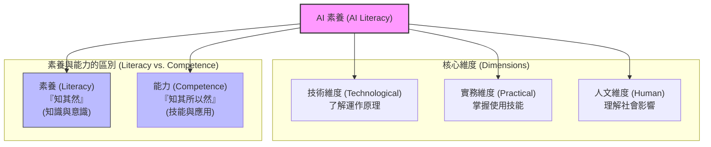

---

## Part 4

Source note: AI-literacy-frameworks (Part 4)

Original range: lines 233-329
Original chars: 22072-30271

<!-- source: AI-literacy-frameworks (Part 4).md -->

### 翻譯與對照報告

#### 摘要

本文件探討了 AI 素養（AI Literacy）的核心架構及其研究方法。AI 素養並非要求個人具備開發演算法的技術能力，而是強調對演算法設計、數據依賴性、潛在偏見及其影響的認知。研究將 AI 素養劃分為三個相互關聯的維度： **技術維度** （著重於「去神話化」，理解 AI 的運作原理）、 **實務維度** （著重於倫理、安全與負責任的使用決策）以及 **人文維度** （探討 AI 對人權、環境、社會及人類自主權的影響，包含正面與負面影響）。此外，本文詳細說明了採用 PRISMA 標準進行的快速回顧（Rapid Review）研究方法，透過搜尋、篩選與分析三個階段，從大量文獻中識別並分析 AI 素養框架。

#### 翻譯內文

個人不需要具備開發演算法的技術能力。然而，重要的是要意識到這些演算法是如何設計的、它們依賴的數據、潛在的偏見以及可能產生的影響。這種意識（可能透過撰寫簡單演算法的有限參與來支持，以此促進理解而非追求技術精通）使個人能夠負責任地評估 AI 系統，並對其應用做出深思熟慮的判斷（包括是否應用、僅在何種情況下應用、應用於何處以及如何應用）。

###### **AI 的技術、實務與人文維度**

根據歐洲委員會（Council of Europe）的說法，AI 素養可以有效地圍繞 AI 三個相互關聯的維度來構建： **技術** 、 **實務** 與 **人文**。任何與 AI 相關的主題都會涉及這三個維度的議題；它們在本質上是相互連結的。例如，若不了解技術如何運作或其對人的影響，就無法實現 AI 的安全使用。

#### **AI 的技術維度**

**AI 的技術維誠** 關注 AI 如何運作以及如何被開發。然而，為了讓此維度對所有青少年及其教師都具有相關性，而不僅限於對計算機感興趣的人，技術維度側重於 AI 的「去神話化」（demythologising）。例如，它會強調生成式 AI（GenAI）如何僅僅是預測下一個最可能的單詞，而不像人類那樣理解提示詞（prompt）或其回應。這種去神話化的教學可以透過編寫簡單的演算法來實現，但編寫演算法並非最終目標。

#### **AI 的實務維度**

**AI 的實務維度** 側重於賦能青少年及其教師，使他們能夠針對是否使用 AI 做出明智的決定，並且在決定使用時，能夠以符合倫理、安全且負責任的方式進行。

##### **AI 的人文維度**

**AI 的人文維度** 檢視 AI 對個人、人權、環境及整個社會的影響。然而，就目前所能查證的範圍而言，目前尚無主要的 AI 素養倡議或課程能充分應對這些影響（儘管歐洲委員會正朝此方向努力）。鑑於 AI 影響的複雜性且往往具有隱蔽性，這一點尤其令人擔憂。

任何 AI 素養框架中都應包含的關鍵人文維度議題包括：AI 對人類福祉、性別、尊嚴、包容性、信任及數位落差的影響；AI 的地緣政治、軍事及剝削性起源；對人類主體性、自主權、隱私、公平、多樣性及歧視的影響；諸如假新聞、AI 從業人員的勞動條件、監控、選舉干預及就業等問題；對永續發展、環境及氣候的影響；以及對人權、社會正義、民主及社會能動性的更廣泛影響。

同樣重要的是，必須認識到 AI 的人文維態並不總是負面的。應考慮的正面但較不直接的影響包括：利用 AI 預測自然災害、監測海洋健康、減少工業能源浪費、識別作物疾病、研發新藥、優化交通流量以及管理森林火災風險。

##### **AI 素養框架**

AI 素養框架通常以一組結構化的能力（結合知識、技能、態度/價值觀——儘管這些術語的使用並不一致）來表達，通常分為特定領域，並通常由描述符或熟練度等級/學習進程來支持；其設計初衷通常是為了在整個系統（國家、區域或多校規模）中使用，且廣泛保持「實施中立性」（implementation-neutral）。

為了清晰起見，在本報告中， **我們將 AI 素養框架定義為一種規範，規定了兒童應該知道（或意識到）、應該能夠做到的以及應該珍視的內容。它還應（顯式或隱式地）涵蓋 AI 的技術、實務與人文維度**。

更詳細地說，AI 素養框架是為教育利害關係人（學生、教師、學校領導者、課程與在職培訓開發者）提供必要的知識、技能與價值觀，以便他們能夠與 AI 進行有效、負責任且符合倫理的互動。

我們還假設 AI 素養框架是圍繞明確的領域/維度構建的，通常具有基於年齡或角色的進階性，旨在指導課程設計、評估、教師發展與系統規劃，並可能包含其實施的促成條件（例如：資源、在職培驗、治理），儘管框架本身是實施中立的，並不規定具體的教案或產品。

#### **3. 研究方法論**

我們採用基於 PRISMA 標準的快速回顧（Rapid Review）方法（見附錄 2），包含三個主要階段：搜尋、篩選與分析（見圖 1）。

我們承認這種方法論（涉及本報告兩位主筆作者頻繁的交叉引用與檢查）無法且並未識別出一個決定性的框架清單。在每個子階段，我們所做的選擇（例如：使用哪些搜尋詞與資料庫）都會深刻影響最終清單，而不同的選擇可能會揭示其他框架。然而，透過這種方法，我們能夠識別出廣泛的框架，這些框架既適合分析，也對政策制定具有啟發作用。關於此方法論產生的其他結果（趨勢與國家），請參閱附錄 4 與 5。

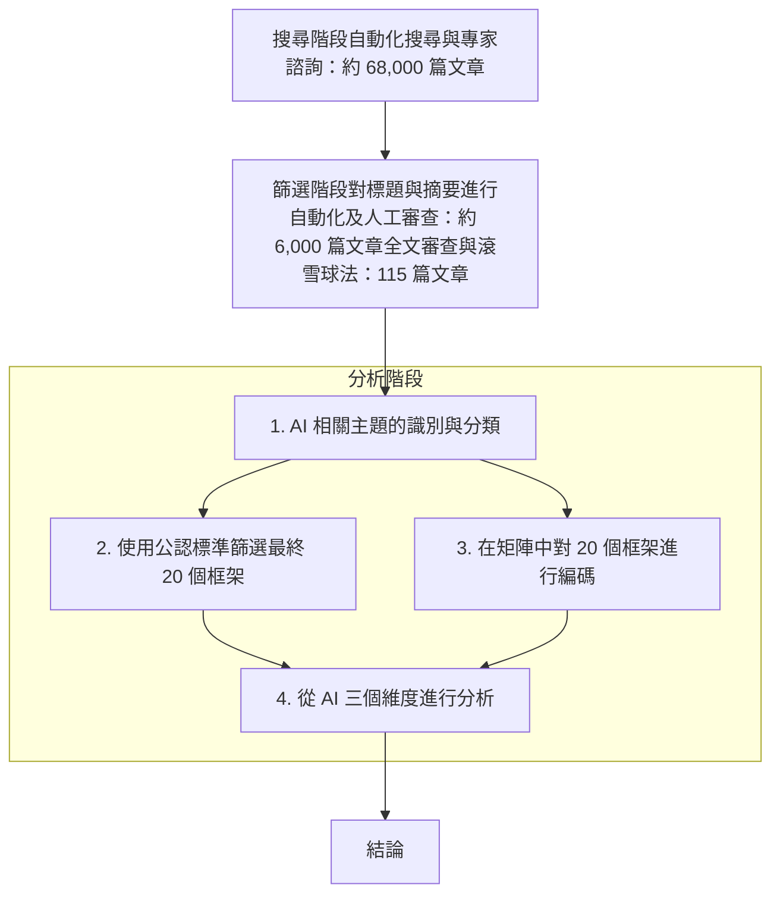

> [!NOTE]
> 原始圖片比對: 

圖 1：研究階段概覽

###### **搜尋**

我們透過主要資料庫（如 IEEE, Springer, MDPI）的自動化搜尋與範圍界定方法開始這項快速回顧。我們還諮詢了專家網絡（包括全球約 600 名研究人員組成的 AI 與教育批判研究社群）以及灰色文獻。在去除重複項後，這揭示了約 68,000 篇文章的長名單。請注意，這是一個快速變化的領域，新文獻不斷出現，這也是我們將所有數據公開於公共存儲庫的原因之一。

###### **篩選**

使用一組納入/排除標準（例如：符合皇家學會的要求，如與學齡相關性），我們對標題和摘要進行了自動化及隨後的人工審查。這將文章數量從約 6,000 篇減少到...（此處原文內容不完整）。對所有 6,000 篇文章進行人工文本審查（使用相同標準）後，識別出 101 篇高度相關的文章，而引用滾雪球法進一步識別出 14 篇，最終形成 115 篇的文獻庫。

##### **分析**

我們對 115 篇文章的深入分析分為四個子階段。

###### **分析子階段 1**

透過對所有 115 篇文章的仔細閱讀，我們識別出了一份 AI 相關主題的長名單，並將其歸類為三個維度：技術維度（AI 如何運作）、實務維度（AI 的負責任使用）以及人文維度（例如：社會影響）。參見表 1。

表 1：將 AI 相關主題歸類為三個維度

| AI 的技術維度 (AI 如何運作) | | | | | | | | | |

#### 詞彙與關鍵術語

| 英文術語 | 繁體中文翻譯 | 說明 |
| :--- | :--- | :--- |
| AI Literacy | AI 素養 | 理解、使用及評估人工智慧的能力與意識。 |
| Technological Dimension | 技術維度 | 關注 AI 的運作原理、演算法與開發過程。 |
| Practical Dimension | 實務維度 | 關注如何安全、倫理且負責任地應用 AI。 |
| Human Dimension | 人文維度 | 關注 AI 對社會、人權、環境及人類自主權的影響。 |
| Demythologising | 去神話化 | 消除對 AI 技術（如「理解力」）的錯誤認知或過度神化。 |
| Implementation-neutral | 實施中立性 | 指框架提供標準與目標，但不規定具體的教學計畫或產品。 |
| Rapid Review | 快速回顧 | 一種在有限時間內，透過特定程序進行的系統性文獻綜述。 |
| PRISMA-informed | 基於 PRMA 標準 | 遵循「系統回顧與元分析首選報告事項」的規範進行研究。 |
| Stakeholders | 利害關係人 | 受該框架影響或參與其中的群體（如學生、教師、政策制定者）。 |

#### 視覺化邏輯


---

## Part 5

Source note: AI-literacy-frameworks (Part 5)

Original range: lines 313-355
Original chars: 29249-37516

<!-- source: AI-literacy-frameworks (Part 5).md -->

### 翻譯與對照報告

#### 摘要

本文件記錄了關於 AI 素養框架研究的文獻篩選流程與分析維度。研究者透過人工審查與「引用滾雪球法」從 6,000 篇文章中精煉出 115 篇核心語料庫。分析過程將 AI 相關主題歸納為三個維度：技術維度（AI 如何運作）、實務維度（AI 的負責任使用）以及人文維度（例如：社會影響）。文中詳細列出了技術維度中的演算法、機器學習流程與評估指標，以及實務維度中的提示詞工程、隱私安全與倫理使用等關鍵要素。

#### 翻譯內文

這項工作節省了大量時間，這也是為什麼我們將所有數據都公開在公共儲存庫中的原因之一。

從約 6,000 篇文章中，透過對所有 6,000 篇文章進行人工文本審查（使用相同的標準），識別出 101 篇高度相關的文章；隨後透過「引用滾雪球法」（citation snowballing）又進一步識別出 14 篇，最終構成了一個包含 115 篇文章的語料庫。

##### **分析**

我們對這 115 篇文章的深入分析分為四個子階段。

###### **分析子階段 1**

透過對所有 115 篇文章的細讀，我們識別出了一份長清單形式的 AI 相關主題，並將其分為三個維度：

技術維度（AI 如何運作）、實務維度（負責任地使用 AI）以及人文維度（例如：社會影響）。詳見表 1。

**表 1：將 AI 相關主題歸類為三個維度**

| AI 技術維度 (AI 如何運作) |                                                                                                        |     |     |     |     |     |     |     |     |
| :---------------- | :----------------------------------------------------------------------------------------------------- | :-- | :-- | :-- | :-- | :-- | :-- | :-- | :-- |
| **AI 的定義**        | 定義、範圍、弱人工智慧 (Narrow AI)、通用人工智慧 (AGI)                                                                   |     |     |     |     |     |     |     |     |
| **AI 的功能 (高層次)**  | 預測、推薦、分類、生成、優化、自動化、翻譯、異常檢測、個人化、決策支持                                                                    |     |     |     |     |     |     |     |     |
| **AI 的功能 (實務層次)** | 自然語言處理 (NLP)、電腦視覺 (CV)、生成式 AI (GenAI)、推薦系統、預測分析、欺詐檢測、醫療診斷、虛擬助手、機器人技術、自動駕駛車輛                            |     |     |     |     |     |     |     |     |
| **AI 的類型**        | 符號式 AI、機器學習、深度學習、生成式 AI、神經符號 AI                                                                        |     |     |     |     |     |     |     |     |
| **機器學習流程**        | 資料收集 $\rightarrow$ 預處理 $\rightarrow$ 訓練 $\rightarrow$ 部署 $\rightarrow$ 評估                              |     |     |     |     |     |     |     |     |
| **機器學習所需資料**      | 角色、來源、品質、數量、多樣性                                                                                        |     |     |     |     |     |     |     |     |
| **機器學習的演算法與模型**   | 梯度下降、線性回歸、邏輯回歸、決策樹、隨機森林、支持向量機 (SVM)、單純貝氏 (Naïve Bayes)、K-近鄰演算法 (k-NN)、神經網路、Transformer                 |     |     |     |     |     |     |     |     |
| **機器學習的訓練過程**     | 資料收集、資料清洗、資料標記、特徵提取、特徵工程、資料增強、訓練/驗證/測試集分割、超參數調優、模型評估、交叉驗證                                              |     |     |     |     |     |     |     |     |
| **評估 AI**         | 準確度 (Accuracy)、精準率 (Precision)、敏感度 (Sensitivity)、穩健性 (Robustness)、公平性 (Fairness)、可解釋性 (Explainability) |     |     |     |     |     |     |     |     |
| **局限性**           | 偏見、對齊 (Alignment)、問責制、隱私、倫理、信任、包容性                                                                     |     |     |     |     |     |     |     |     |

| AI 實務維度 (負責任的使用) | | | | | | | | | |
| :--- | :--- | :--- | :--- | :--- | :--- | :--- | :--- | :--- | :--- |
| **何時該使用 AI，何時不該使用** | 將 AI 作為工具而非替代品、為任務選擇正確的工具、人類判斷的重要性、評估潛在風險、權衡 AI 與傳統方法的成本效益、評估錯誤帶來的影響 | | | | | | | | |
| **理解 AI 技術維度的關鍵要素** | 理解生成式 AI 的運作原理（即它是在預測最可能的下一個字——它並不理解其輸入或輸出內容） | | | | | | | | |
| **理解 AI 的局限性** | 識別準確度較低的領域、識別數據與輸出中的偏見、訓練數據的品質與數量、對人類監督的依賴、缺乏像人類一樣的推理或理解能力、不可預測行為的潛在風險、處理上下文或細微差別的限制 | | | | | | | | |
| **提示詞撰寫（提示工程）** | 清晰度的重要性（避免歧義）、提供上下文、迭代優化 | | | | | | | | |
| **解讀 AI 輸出** | 識別缺乏證據支持的主張、識別偏見或扭曲的框架、評估回應的完整性 | | | | | | | | |
| **驗證 AI 輸出** | 與可靠來源進行交叉比對 | | | | | | | | |
| **在節省時間與品質之間取得平衡** | 審查輸出結果、在需要時優先考慮準確度而非速度、持續改進循環 | | | | | | | | |
| **隱私與安全** | 資料最小化、安全地處理資料、合規性、限制資料共享 | | | | | | | | |
| **人類與 AI** | 監督/控制、避免過度依賴、人類在控制與行銷 AI 工具中的角色 | | | | | | | | |
| **倫理使用** | 避免傷害、確保公平、使用 AI 時的透明度、尊重智慧財產權、對結果負責、匿名化、管理同意權、限制資料保留期限 | | | | | | | | |

#### 詞彙與關鍵術語

| 英文術語 | 繁體中文翻譯 | 說明 |
| :--- | :--- | :--- |
| Citation snowballing | 引用滾雪球法 | 一種文獻回溯方法，透過檢查論文的引用文獻來尋找更多相關研究。 |
| Corpus | 語料庫 | 用於語言分析或機器學習的結構化文本集合。 |
| Generative AI (GenAI) | 生成式人工智慧 | 能夠根據訓練數據生成新內容（如文字、圖像）的 AI 技術。 |
| Prompt Engineering | 提示工程 / 提示詞工程 | 設計、優化輸入文字（提示詞）以引導 AI 模型產生更準確輸出的技術。 |
| Machine learning pipeline | 機器學習流程 | 機器學習從數據處理到模型部署的完整自動化工作流。 |
| Alignment | 對齊 | 確保 AI 系統的目標與人類價值觀及意圖一致的過程。 |
| Feature Engineering | 特徵工程 | 從原始數據中提取或轉換出對機器學習模型有用的特徵的過程。 |

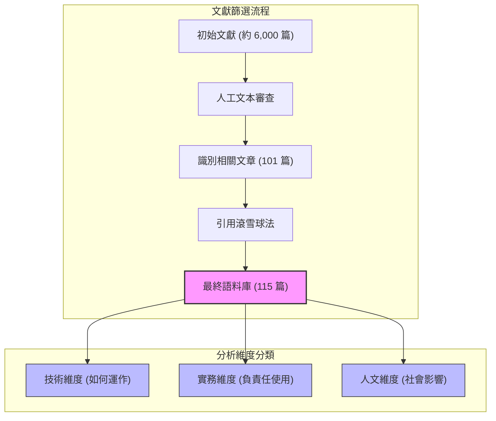

---

## Part 6

Source note: AI-literacy-frameworks (Part 6)

Original range: lines 351-400
Original chars: 36587-44772

<!-- source: AI-literacy-frameworks (Part 6).md -->

### 翻譯與對照報告

#### 摘要

本文件詳細記錄了針對 AI 素養框架（AI Literacy Frameworks）進行篩選、分類與評估的研究方法論。內容涵蓋了 AI 對人類社會影響的多個維度（如倫理、民主、經濟、環境、文化等），並說明了研究者如何透過四個分析子階段（Analysis Substages），從大量文獻中篩選出具備適用性、清晰度與實施可行性的框架，最後透過矩陣編碼與量化評分，從技術、實務與人類三個維度對這些框架進行深度評估。

#### 翻譯內文

##### AI 影響維度摘要（節錄）

| 範疇 | 關鍵要素 |
| :--- | :--- |
| **隱私與安全** | 資料最小化、安全資料處理、合規性、限制資料共享 |
| **人類與 AI** | 監督/控制、避免過度依賴、人類在控制與行銷 AI 工具中的角色 |
| **倫理使用** | 避免傷害、確保公平、使用 AI 時的透明度、尊重智慧財產權、對結果負責、匿名化、管理同意權、限制資料保留期限 |

##### AI 的人類維度（社會影響）

| 維度 | 具體影響因素 |
| :---| :--- |
| **AI 中的倫理與人權** | 問責制、偏見與公平、隱私侵蝕、自主權 vs. 控制、歧視風險、人類尊嚴、軍事 AI、弱勢群體、透明度、救濟機制、開發與部署的倫理框架 |
| **民主、治理與法治** | AI 在選舉中的應用、公共部門 AI、權力集中、虛假訊息、數位主權、公眾信任、全球治理 |
| **社會能動性與批判性思考** | 演算法助推、過濾氣泡、認知依賴、創造力侵蝕、社會孤立、文化同質化、倫理拒絕 |
| **經濟不平等與勞動力擾動** | 就業取代、零工經濟剝削、技能過時、企業壟斷、全球差距、不穩定就業 |
| **環境與永續成本** | 碳足跡、電子廢棄物、資源開採、漂綠、用於氣候解決方案的 AI、耗水量、生物多樣性風險、企業責任 |
| **文化與語言影響** | 語言滅絕、文化偏見、歷史扭曲、數位殖民主義 |
| **心理與行為影響** | AI 成癮、同理心侵蝕、監控、決策疲勞、身份操縱、信任崩解、行為剖析、能動性喪失 |
| **地緣政治與 AI 權力鬥爭** | 美中競爭、武器化 AI、AI 作為軟實力、數位鐵幕、全球南方（Global South）的能動性 |
| **公眾意識與公民抵抗** | 草根運動、公民審計、工人罷工、學校課程、媒體揭露、抵制、公眾論壇、去中心化技術 |
| **未來情境與人類適應** | 存在風險、世代差異、新社會契約、精神影響、反烏托邦防禦、烏托邦潛力 |

###### **分析子階段 2**

使用公認的評估與實施標準（見表 1），我們根據以下準則從 115 篇文章中選出了 30 篇：對皇家學會（Royal Society）簡報的適用性（針對兒童的 AI 素養框架）、清晰度、易於實施性、「有根據性」、連貫性以及適應性。詳見表 2。

*表 2：分析子階段 2 的篩選準則*

| 準則 | 說明 | 來源 |
| :--- | :--- | :--- |
| **適用性** | 呈現的框架/課程提案是否解決了與皇家學會商定的研究問題（RQs）與標準？ | 本計畫簡報 |
| **清晰度** | 呈現的框架/課程提案是否語言清晰、易懂且極少使用術語？ | 見註腳 25, 26 |
| **預期實施難易度** | 該框架/課程提案是否可能在不需要過度資源或專業知識的情況下執行？ | 見註腳 27, 28 |
| **全面性** | 該框架/課程提案是否涵蓋了所有必要的面向？ | 見註腳 29, 26 |
| **有根據性** | 該框架/課程提案是否基於同儕審查的文獻、理論或專家共識？ | 見註腳 26, 28 |
| **連貫性** | 框架/課程提案的組成部分是否一致且邏輯連貫？ | 見註腳 30, 29 |
| **適應性** | 該框架/課程提案是否能跨文化與制度背景進行調整？ | 見註腳 27, 29 |

###### **分析子階段 3**

我們在矩陣中對這 30 篇文章進行了編碼（見附錄 6），首先將其分類為「框架」（20 篇）或「可能的案例研究」（10 篇）。隨後，該矩陣記錄了：目標受眾、交付模式、實施狀態、影響證據、課程銜接、教學取向、跨學科/課堂實踐的整合情況、學科/認識論立場、AI/數據素養、工具/技術、共同設計/參與、人類/倫理/批判性要素（包括生態、權力/政治、未來、創造力）以及包容性（特殊教育需求與身心障礙，簡稱 SEND）。此外，我們也追蹤了促成條件（教師培訓、課程銜接、評量、基礎設施、SEND 的包容性以及平等、多元與包容性 (EDI)），以期為政策手段提供參考。完整的映射矩陣可在公開的線上儲存庫中取得。

###### **分析子階段 4**

接著，我們根據分析子階段 1 中的 AI 主題分類，從技術、實務與人類這三個維度對這 20 個框架進行了分析。

每個框架在每個維度的 10 個主題上進行評分，分數從 0（缺失）到 1（透過清晰的理論、實務與實施路徑完全涵蓋）。

#### **4. 框架概覽**

在本章中，我們將簡要回顧在分析子階段 2 中識別出的 20 個針對學齡兒童與教育工作者的框架，隨後將對其中的 8 個進行深入探討。

#### 詞彙與關鍵術語

| 英文術語 | 繁體中文譯名 | 註解 |
| :--- | :--- | :--- |
| **Algorithmic nudging** | 演算法助推 | 指利用演算法設計來誘導使用者行為的技術。 |
| **Digital sovereignty** | 數位主權 | 指國家或個人對其數位數據與技術架構的控制權。 |
| **Social agency** | 社會能動性 | 指個人或群體在社會結構中採取行動並產生影響的能力。 |
| **Groundedness** | 有根據性 / 實證性 | 指研究或理論建立在紮實的證據或既有文獻之上。 |
| **Special Educational Needs and Disabilities (SEND)** | 特殊教育需求與身心障礙 | 教育領域中針對有特殊需求學生的專有名詞。 |
| **Equality, Diversity and Inclusion (EDI)** | 平等、多元與包容 | 組織與社會政策中強調的公平性標準。 |
| **Digital colonialism** | 數位殖民主義 | 指大型科技公司透過數據與技術控制他國文化與資源的現象。 |

#### 邏輯流程圖

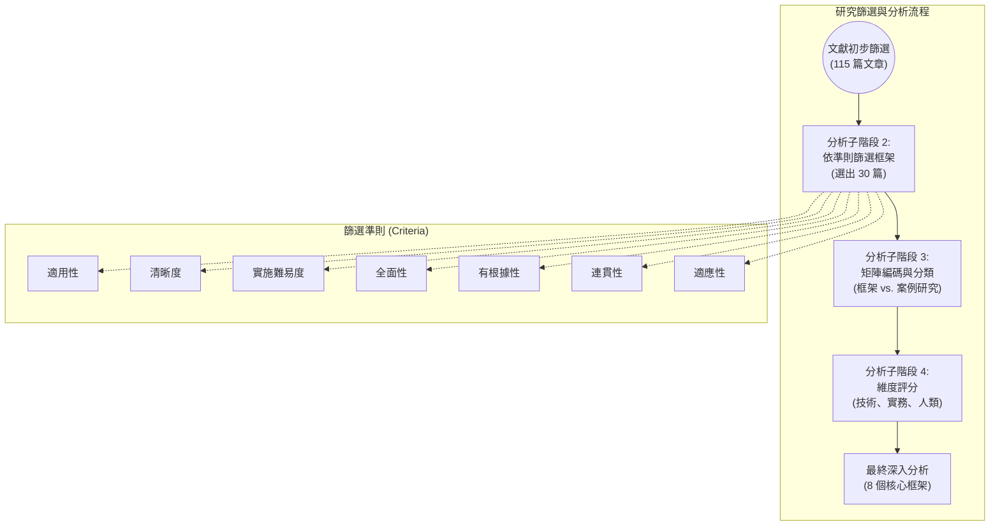

---

## Part 7

Source note: AI-literacy-frameworks (Part 7)

Original range: lines 390-431
Original chars: 43750-52051

<!-- source: AI-literacy-frameworks (Part 7).md -->

### 翻譯與對照報告

#### 摘要

本文件節錄自一份關於 AI 素養（AI Literacy）框架的研究報告。研究人員針對 20 個針對學齡兒童與教育工作者的 AI 素養框架進行了量化分析，從「技術」、「實務」與「人文」三個維度進行評分。研究結果顯示，目前的 AI 素養框架存在明顯的失衡現象：大多數框架過度側重於技術層面的知識（如機器學習流程、演算法等），對於實務應用（如提示工程、隱私安全）的關注程度次之，而對於「人文維度」（如倫理、人權、社會影響、地緣政治等）的探討則最為薄弱且流於表面，缺乏具體的教學與評量建議。

#### 翻譯內文

（包含生態、權力/政治、未來、創造力等要素）；以及包容性（特殊教育需求與身心障礙，簡稱 SEND）。此外，研究也追蹤了促成條件（教師培訓、課程銜接、評量、基礎設施、SEND 的包容性以及平等、多元與共適應性（EDI）），以期為政策手段提供參考。完整的對照矩陣可於公開的線上儲存庫中取得。

###### **分析子階段 4**

接著，研究人員根據分析子階段 1 所使用的 AI 主題分類法，從技術、實務與人文三個維度，對這 20 個框架的涵蓋範圍進行了分析。

每個框架在每個維度的 10 個主題上皆進行了評分，分值從 0（缺失）到 1（完全涵蓋，且具有明確的理論、實務與實施路徑）不等（參見表 1）。

#### **4. 框架概覽**

在本章中，我們將簡要回顧在分析子階段 2 中識別出的 20 個針對學齡兒童與教育工作者的框架，並對其中的 8 個進行深入探討。

#### **二十個框架摘要**

本節摘要了 20 個針對學齡兒童與教育工作者的 AI 素養框架。我們首先對整理在試算表中的框架進行了詳細分析（亦可參見附錄 6），並以此作為下文摘要的依據。

隨後，我們開發了一份「熱點圖」（見圖 2），用以展示每個框架在 AI 的技術、實務與人文維度中所包含的主題平衡狀況。

如分析子階段 2 所述，「技術維度」的主題包括：AI 的定義與功能、AI 的類型、機器學習流程（數據、演算法、訓練模型）、評估與局限性。同時，「實務維度」包括：何時該使用與不該使用 AI、理解關鍵技術概念與限制、提示撰寫（亦稱為「提示工程」）、解讀與驗證 AI 輸出、時間與品質的權衡、隱私與安全、人機互動，以及倫理使用。最後，「人文維度」涵蓋了：倫理與人權、民主、治理與法治、社會能動性與批判性思考、經濟不平等與勞動力擾動、環境與永續成本、文化與語言影響、心理與行為影響、地緣政治與 AI 權力鬥爭、大眾意識與公民抵抗，以及未來情境與人類適應。

研究採用中間分數來捕捉部分或表層的涵蓋範圍。例如，若一個框架鼓勵批判性地檢查 AI 輸出，但未解釋如何在實務上執行，則評分為 0.5；若僅簡略提到語言學習中的翻譯工具，而未討論文化或語言影響，則評分為 0.25。相比之下，若一個框架針對倫理、人權與 AI 提供了詳細指南（包括定義、應用、課堂實踐及涵蓋誤用、歧視、偏見與排斥的評量策略），則會獲得滿分 1 分。此評分機制被用於生成熱點圖（見圖 2），圖中顏色越深，代表該框架對該主題的重視程度越高。

不可避免地，雖然本報告的兩位作者對每個主題/框架的單元都進行了詳細討論，但這是一種高度具解釋性的方法，不應被視為字面上的絕對真理。儘管如此，此方法仍具啟發意義。

熱點圖顯示出明顯向「技術維度」傾斜的趨勢，其次是「實務維度」，而「人文維度」的發展最不成熟。換言之，大多數框架最關注技術性主題，對實務性主題的關注程度參差不齊，而對人文主題的關注則微乎其微。倫理與人權雖然時常被提及，但大多僅停留在表面。此外，極少有具體的措施、具體的部署建議、目標、課堂案例、評量標準，甚至缺乏能使這些議題變得可教、可評、可問責的治理信號。框架間的差異性也很大，且在操作指南（包容性/SEND、評量、課程契合度）方面表現得不夠完整。

總而言之，這種不平衡強化了研究結論：目前的框架過度偏向技術與實務知識，對於公平性、包容性、教學法及社會影響等方面的關注明顯不足。

*(註：表格內容因原始文本格式破碎，僅翻譯關鍵維度與評分邏輯)*

| 維度/主題 | 框架評分範例 (部分) |
| :--- | :--- |
| **技術維度** (AI 是什麼、AI 的功能、AI 類型、機器學習流程、數據) | 評分範圍 0 ~ 1 |
| **實務維度** (提示工程、隱私安全、驗證輸出、倫理使用) | 評分範圍 0 ~ 1 |
| **人文維度** (人權、民主、社會影響、地緣政治、環境成本) | 評分範圍 0 ~ 1 |

#### 詞彙與關鍵術語

| 英文術語 | 繁體中文翻譯 | 說明 |
| :--- | :--- | :--- |
| AI Literacy | AI 素養 | 理解、使用及批判性評估人工智慧的能力。 |
| Machine Learning Pipeline | 機器學習流程 (管線) | 機器學習從數據處理到模型訓練的完整程序。 |
| Prompt Engineering | 提示工程 | 透過設計特定輸入（提示詞）來引導 AI 產生高品質輸出的技術。 |
| SEND (Special Educational Needs and Disabilities) | 特殊教育需求與身心障礙 | 指學生在學習上需要額外支持或因身心障礙需特殊安排。 |
| EDI (Equality, Diversity and Inclusion) | 平等、多元與共融 | 組織或教育環境中推動公平與包容性的核心價值。 |
| Social Agency | 社會能動性 | 個人在社會結構中採取行動、產生影響並推動變革的能力。 |
| Heatmap | 熱點圖 / 熱力圖 | 利用顏色深淺來表示數據強度或關注程度的視覺化圖表。 |

#### 視覺化邏輯

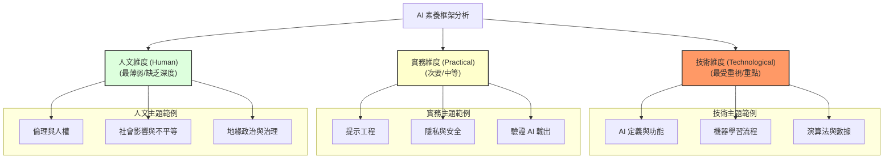

---

## Part 8

Source note: AI-literacy-frameworks (Part 8)

Original range: lines 429-446
Original chars: 51028-59521

<!-- source: AI-literacy-frameworks (Part 8).md -->

### 翻譯與對照報告

#### 摘要

本文件整理並翻譯了關於「AI 素養框架」（AI Literacy Frameworks）的評估數據。內容主要分為兩個核心維度： **技術維度（如何運作）** 與 **實務與負責任的使用維度**。數據涵蓋了從機器學習流程、演算法、提示工程（Prompt Engineering）到數據隱私、倫理使用等關鍵指標。此報告旨在將破碎的原始數據結構化，以便於理解 AI 素養在不同技術與應用層面的評估權重。

#### 翻譯內文

以下為根據原始素材整理後的結構化內容，已修復原始文本中斷裂的字詞：

##### 1. 技術維度 (Technological Dimension: How AI Works)

此維度關注 AI 的底層運作邏輯與技術組成。

| 評估項目 | 說明 |
| :--- | :--- |
| **機器學習流程** | Machine learning pipeline |
| **機器學習數據** | Data for machine learning |
| **機器學習演算法與模型** | Algorithms and models for machine learning |
| **機器學習訓練** | Training for machine learning |
| **AI 評估** | Evaluating AI |
| **技術侷限性** | Limitations |
| **AI 使用決策** | 何時該使用 AI 以及何時不該使用 AI (When to use AI and when not to use AI) |
| **技術要素理解** | 理解 AI 技術維度的關鍵要素 (Understanding key elements of the technological dimension of AI) |
| **AI 侷限性理解** | 理解 AI 的侷限性 (Understanding the limitations of AI) |
| **提示詞撰寫（提示工程）** | Prompt writing (engineering) |
| **AI 輸出解讀** | 解讀 AI 輸出結果 (Interpreting AI outputs) |

##### 2. 實務與負責任的使用維度 (Practical & Responsible Use Dimension)

此維度關注在實際應用中如何確保安全、倫理與品質。

| 評估項目 | 說明 |
| :--- | :--- |
| **AI 輸出驗證** | 驗證 AI 輸出結果 (Verifying AI outputs) |
| **效率與品質平衡** | 在節省時間與維持品質之間取得平衡 (Balancing time saving with quality) |
| **隱私與安全** | Privacy and security |
| **人類與 AI 的互動** | Humans and AI |
| **倫理使用** | Ethical use |

#### 詞彙與關鍵術語

| 英文原文 | 繁體中文翻譯 | 註解 |
| :--- | :--- | :--- |
| Machine learning pipeline | 機器學習流程 / 流水線 | 指數據從輸入到模型產出的完整作業鏈。 |
| Prompt engineering | 提示工程 | 透過設計特定輸入來引導 AI 產生高品質輸出的技術。 |
| Technological Dimension | 技術維度 | 關注 AI 運作原理的層面。 |
| Responsible Use | 負責任的使用 | 關注倫理、安全與社會影響的層面。 |
| Interpreting AI outputs | 解讀 AI 輸出 | 對 AI 生成內容的邏輯與準確性進行分析。 |
| Verifying AI outputs | 驗證 AI 輸出 | 透過外部事實或邏輯檢查來確認 AI 內容的真偽。 |

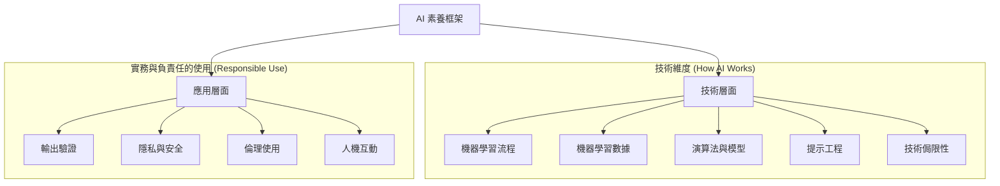

---

## Part 9

Source note: AI-literacy-frameworks (Part 9)

Original range: lines 444-468
Original chars: 58498-66971

<!-- source: AI-literacy-frameworks (Part 9).md -->

### 翻譯與對照報告

#### 摘要

本文件節錄自關於 AI 素養框架（AI Literacy Frameworks）的研究報告。內容主要透過「熱圖」（Heatmap）的形式，呈現了 20 個入選的 AI 素養框架在三個核心維度—— **技術維度** 、 **實務維度** 與 **人文維度** 下的權重分配。此外，文中也預告了將針對八個具代表性的框架進行深入的詳細解析。

#### 翻譯內文

##### 數據呈現：AI 框架維度熱圖（摘要版）

*註：由於原始數據為大型矩陣，以下整理其維度與主題之邏輯結構。*

| 維度分類 | 涵蓋主題 |
| :--- 核心維度 | 包含主題 |
| **技術維度 (Technological Dimension)** | 人類與人工智慧、倫理使用 |
| **實務維度 (Practical Dimension)** | 倫理與人權、民主、治理與法治、社會能動性與批判性思考、經濟不平等與勞動力破壞、環境與永續成本 |
| **人文維度 (Human Dimension)** | 文化與語言影響、心理與行為影響、地緣政治與 AI 權力鬥爭、公眾意識與公民抵抗、未來情境與人類適應 |

---

**圖 2：20 個入選框架在 AI 技術、實務與人文維度下的熱圖。**

此熱圖呈現了 20 個入選框架（每一欄代表一個框架）在 AI 三大維度下的分布情況。
*   **第一組列（紅色部分）**：代表 AI 技術維度中所包含的各項主題（參見表 1）。
*   **第二組列（綠色部分）**：代表 AI 實務維度中所包含的各項主題。
*   **第三組列（藍色部分）**：代表 AI 人文維度中所包含的各項主題。

每個儲存格的分數由作者評定（範圍從 0 到 1），用以衡量該框架對特定主題的重視程度。 **儲存格顏色越深，代表該框架對該特定主題的強調程度越高。** 每組列的底端行代表上方所有項目的總和（即每個維度的總分範圍為 0 到 10）。儲存格顏色越深，代表該框架對該 AI 維度的重視程度越高。此熱圖旨在說明整體 AI 素養框架呈現出的各種側重點。詳細資訊可參閱線上儲存庫。<sup{31</sup>>

###### **八個框架的詳細解析**

本節將詳細介紹八個 AI 素養框架範例。這些範例是根據地理位置、研究方法及成熟度選出的，旨在提供一個廣泛且易於理解的範圍。

這八個框架按字母順序排列如下：
AI-GO、AI4K12、AILit、Chiu 等人 (Chiu *et al.*)、歐洲委員會 (Council of Europe)、與 AI 共存 (Living with AI)、Song 等人 (Song *et al.*) 以及聯合國教科文組織 (UNESCO)。

#### 詞彙與關鍵術語

| 英文原文 | 繁體中文翻譯 | 語境說明 |
| :--- | :--- | :--- |
| AI literacy frameworks | AI 素養框架 | 指用於評估或教導 AI 相關知識與能力的架構。 |
| Heatmap | 熱圖 | 透過顏色深淺來表示數據強度的圖表。 |
| Technological Dimension | 技術維度 | 涉及 AI 技術原理與運作層面的維度。 |
| Practical Dimension | 實務維度 | 涉及 AI 在社會、經濟與治理層面的應用維度。 |
| Human Dimension | 人文維度 | 涉及 AI 對人類文化、心理與社會結構影響的維度。 |
| Social agency | 社會能動性 | 指個人或群體在社會結構中採取行動並產生影響的能力。 |
| Rule of law | 法治 | 法律的權威性與公平性。 |
| Shortlisted frameworks | 入選框架 | 經過初步篩選後進入決選名單的框架。 |

#### 邏輯結構圖

```mermaid
graph TD
    root["AI 素養框架分析"]

    subgraph "技術維度 (Technological)"
        tech_1["人類與 AI"]
        tech_2["倫理使用"]
    end

    subgraph "實務維度 (Practical)"
        prac_1["倫理與人權"]
        prac_2["民主、治理與法治"]
        prac_3["社會能動性與批判性思考"]
        prac_4["經濟不平等與勞動力破壞"]
        prac_5["環境與永續成本"]
    end

    subgraph "人文維度 (Human)"
        human_1["文化與語言影響"]
        human_2["心理與行為影響"]
        human_3["地緣政治與權力鬥爭"]
        human_4["公眾意識與公民抵抗"]
        human_5["未來情境與人類適應"]
    end

    root --> 技術維度Technological["技術維度 (Technological)"]
    root --> 實務維度Practical["實務維度 (Practical)"]
    root --> 人文維度Human["人文維度 (Human)"]

    技術維度Technological["技術維度 (Technological)"] --> tech_1
    技術維度Technological["技術維度 (Technological)"] --> tech_2

    實務維度Practical["實務維度 (Practical)"] --> prac_1
    實務維度Practical["實務維度 (Practical)"] --> prac_2
    實務維度Practical["實務維度 (Practical)"] --> prac_3
    實務維度Practical["實務維度 (Practical)"] --> prac_4
    實務維度Practical["實務維度 (Practical)"] --> prac_5

    人文維度Human["人文維度 (Human)"] --> human_1
    人文維度Human["人文維度 (Human)"] --> human_2
    人文維度Human["人文維度 (Human)"] --> human_3
    人文維度Human["人文維度 (Human)"] --> human_4
    人文維度Human["人文維度 (Human)"] --> human_5
```

---

## Part 10

Source note: AI-literacy-frameworks (Part 10)

Original range: lines 462-635
Original chars: 65949-75535

<!-- source: AI-literacy-frameworks (Part 10).md -->

### 翻譯與對照報告

#### 摘要

本文件整理並翻譯了多個主要的 AI 素養框架（AI Literacy Frameworks）之研究內容。內容涵蓋了透過熱圖（Heatmap）呈現的框架維度比較，並詳細介紹了四個具代表性的框架：來自荷蘭的 **AI-GO** 、來自美國的 **AI4K12** 、歐盟/OECD 合作的 **AlLit**，以及來自香港的 **Chiu et al.** 框架。翻譯重點在於精準呈現各框架在「技術維度」、「實務維度」與「人類維度」上的側重點差異，以及其對英國教育體系的潛在影響（Implications for the UK）。

#### 翻譯內文

##### AI 素養框架之維度比較

熱圖（Heatmap）的第一至第三列（藍色部分）代表了 AI 的「人類維度」中所包含的各個主題。每個框架皆由作者針對每個主題進行評分（範圍從 0 到 1）。單元格顏色越深，代表該框架對該特定主題的重視程度越高。每一組列的最後一列代表上方各列的總和（即每個維度的總分為 0 到 10）。單元格顏色越深，代表該框架對該 AI 維度的重視程度越高。此熱圖之目的在於說明整體 AI 素養框架在各方面的側重點分布。詳細資訊可參閱線上資料庫。<sup{31</sup>

###### **八個框架之詳細說明**

本節提供了八個範例 AI 素驗框架的詳細資訊，這些框架的選擇旨在提供廣泛且易於理解的範圍（基於地理位置、方法論與成熟度）。

這八個框架按字母順序排列如下：AI-GO、AI4K12、AILit、Chiu *et al.*、歐洲委員會（Council of Europe）、Living with AI、Song *et al.* 以及 UNESCO。

---

#### **AI-GO**

[連結](https://npuls.nl/en/knowledge-base/ai-go-ai-literacy-in-education-a-practical-framework)

**AI-GO** （荷蘭）提供了原則、指南、指標與實務案例，旨在幫助教育工作者與課程團隊針對 AI 進行教學、課程與機構政策的調整。它具有「教學法與教學論」（pedagogical-didactic）的導向，使機構能夠根據其獨特的在地情境量身定制 AI 素養。

###### **對英國的啟示**
AI-GO 可在考慮進修教育（FE）與學徒制的情況下應用，特別是在與 16 歲以下 AI 素養培訓進行銜接時。

*   **目標族群**：16 歲以上教育階段（進修教育、職業教育）的教師與青少年。
*   **定義**：AI 素養被定義為四個要素的相互作用：知識（AI 基礎與社會影響）、技能（技術、認知與與 AI 的互動）、態度（開放性、自主性、反思性傾向）以及倫理（明確地作為 AI 判斷與負責任使用的基礎）。它承認了跨學科進行情境敏感性調整的需求。
*   **局限性**：對 16 歲以下兒童的應用有限；未定義分層的素養等級；缺乏正式的實施指南或評估機制。

---

#### **AI4K12**

[連結](http://ai4k12.org)

作為最早的 AI 素養框架之一<sup{34</sup>，來自美國的 AI4K12 為 K-12（幼兒園至高中）階段提供了教學指南與資源，透過專題式學習（Project-based learning）教授 AI 的運作原理。其架構圍繞著「五大核心概念」（Five Big Ideas）<sup{35</sup>展開：感知、表示與推理、學習、自然互動以及社會影響。

###### **對英國的啟示**
AI4K12 主要侷限於 AI 的技術維度。它可以作為一個「參考主軸」（reference spine），但不能直接作為現成的課程。英國可以在擴大規模之前，以此核心概念為基礎，並將其對應到各個教學階段。

| 維度 | 重點 |
<!-- | --- | ---  -->
| 技術維度 | (AI 如何運作) |
| 實務維度 | (負責任的使用) |
| 人類維度 | (社會影響) |

*   **目標族群**：K-12 學生。
*   **定義**：AI4K12 透過其「五大核心概念」來定義 AI 素養，這些概念建立了基礎的知識與能力。其內容以技術知識為導向。
*   **局限性**：AI4K12 的技術性較重，對學生的認知負荷要求較高，且對教師的準備工作要求較多，同時缺乏正式的評估或影響力證據。對於人類維度中的部分主題關注有限。

---

#### **AlLit**

[連結](https://ailiteracyframework.org)

AlLit 是一個由歐盟（EU）、OECD 與 Code.org 共同參與的初等與中等教育框架草案<sup{36</sup>。它概述了 22 項 AI 素養能力，這些能力是根據 DigComp、UNESCO、Digital Promise 及 AI4K12 的「五大核心概念」所整理而成（知識、技能與態度），最終版本預計於 2026 年發布。

###### **對英國的啟示**
英國可以將其 22 項能力對應到現有的教育基礎設施中。此外，也需要加強教師的持續專業發展（CPD），並在教學中更強調 AI 的實務維度及其影響。

*   **目標族群**：初等與中等教育階段的教師、教育領導者、政策制定者及課程設計者。
*   **定義**：AlLit 採用 OECD/歐盟《AI 法案》的定義；將 AI 同時視為技術與社會議題；並將素養定義為具備倫理判斷力來參與、創造、管理與設計 AI 的知識、技能與態度。
於此。
*   **局限性**：作為草案，AlLit 主要關注 AI 的技術維度。此外，它尚未提供可直接用於課堂的教學路徑或正式評估，且僅僅是「暗示」而非「設計」了對於教育公平與特殊教育需求（SEND）的考量。它缺乏關於如何在國家層級進行整合的營運與資源指南。

---

#### **Chiu *et al.***

[連結](https://doi.org/10.1016/j.caeo.2024.100171)

**Chiu *et al.*** （香港）提出了一個基於從業者經驗的框架，該框架區分了「AI 素養」（理解與判斷）與「AI 能力」（自信且具情境察覺力的應用），並將「自信」與「自我反思」明確列為學習成果。其學習架構圍繞著技術、社會影響、倫理、與 AI 的協作以及自我反思展開，並採取探究式與專題式學習的導向。

###### **對英國的啟示**
可以成立類似的區域性「AI 素養設計實驗室」（與多學院信託 MATs、師資培訓 ITE 提供者及學科協會合作），在現有的 KS3 至 KS5 及進修教育（FE）科目中，共同設計並開放授權的教學單元與評量；並進行分階段的 CPD 微證照培訓與試點案例驗證。

*   **目標族群**：K-12 學生與教師；對非技術背景的受眾亦具易讀性。
*   **定義**：AI 素養被定義為理解 AI 運作原理及其對社會影響、安全且合乎倫理地使用 AI，以及解釋或批判其輸出結果的知識、判斷力與傾向。AI 能力則被定義為將上述素養自信且具情境察覺力地應用於解決問題、與人及 AI 協作、評估風險，並隨著時間推移進行自我評估與更新實務的能力。其中，「自信」與「自我反思」是核心成果，而非附加項目。
*   **局限性**：缺乏大規模的課堂試點、缺乏對應的教師專業發展路徑，且缺乏評量或監測框架。課程銜接未按教學階段或學科進行明確說明，且缺乏明確的 SEND 設計。該框架不特定於任何工具（tool-agnostic），這雖然符合英國情境，但缺乏數據治理的討論，且未提及生態與政治經濟的影響。

#### 詞彙與關鍵術語

| 英文術語 | 繁體中文翻譯 | 說明 |
| --- | --- | --- |
| AI Literacy | AI 素養 | 理解與使用 AI 的基本能力與知識。 |
| AI Competency | AI 能力 | 將 AI 素養應用於實際問題解決的實踐能力。 |
| Technological Dimension | 技術維度 | 關注 AI 的運作原理、演算法與技術架構。 |
| Practical Dimension | 實務維度 | 關注如何負責任、安全且有效地使用 AI 工具。 |
| Human Dimension | 人類維度 | 關注 AI 對社會、倫理、法律與文化的影響。 |
| Pedagogical-didactic orientation | 教學法與教學論導向 | 強調教學方法與教學理論的應用。 |
| K-12 | K-12 (幼兒園至高中) | 涵蓋幼兒園、小學、初中至高中的教育階段。 |
| Further Education (FE) | 進修教育 | 高於中學教育但非大學學位課程的教育。 |
| CPD (Continuing Professional Development) | 持續專業發展 | 教師在職期間的專業技能提升與培訓。 |
| SEND (Special Educational Needs and Disabilities) | 特殊教育需求與身心障礙 | 針對有特殊學習需求之學生的教育支援。 |

#### 邏輯架構圖

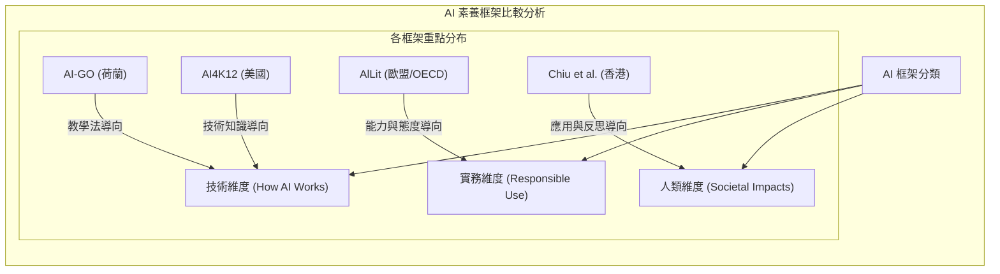

---

## Part 11

Source note: AI-literacy-frameworks (Part 11)

Original range: lines 621-727
Original chars: 74513-83002

<!-- source: AI-literacy-frameworks (Part 11).md -->

### 翻譯與對照報告

#### 摘要

本文件整理並翻譯了多個全球性的 AI 素養（AI Literacy）框架研究，內容涵蓋了 AlLit 框架、歐洲理事會（Council of Europe）的提案、蘇格蘭的「與 AI 共生」（Living with AI）計畫，以及 Song 等人的研究。這些框架從技術維度、實務維度與人文維度出發，探討了如何將 AI 知識轉化為具備倫理、社會責任感且具備適應能力的素養。翻譯重點在於精準呈現「素養」（Literacy）與「能力」（Competency）之間的差異，以及各框架對於教育實務（如 UDL 通用學習設計）的具體啟示。

#### 翻譯內文

##### **AlLit 框架**

###### **目標族群**
K-12（幼兒園至高中）學生與教師；內容需易於非技術背景的受眾理解。

###### **定義**
**AI 素養** 被定義為：理解 AI 運作原理及其對社會影響的知識、判斷力與傾向；能安全且符合倫理地使用 AI，並能解釋或批判其輸出結果。
**AI 能力** 則被定義為：能自信且具備情境意識地運用上述素養來解決問題、進行協作（與人類及 AI 協作）、評估風險，並能隨著時間進行自我評估與實踐更新。其中，「自信心」與「自我反思」是核心成果，而非附加項目。

###### **局限性**
目前缺乏大規模的課堂試點、缺乏規劃完善的教師專業發展路徑，且缺乏評量或監測框架。課程銜接未按學段或學科進行明確說明，亦缺乏針對特殊教育需求與身心障礙（SEND）的專門設計。該框架具有「工具無關性」（tool-agnostic），雖然符合英國現況，但缺乏數據治理的討論，且未提及生態與政治經濟層面的影響。

---

#### **歐洲理事會 (Council of Europe)**
[https://www.coe.int/en/web/education/artificial-intelligence](https://www.coe.int/en/web/education/artificial-intelligence)

歐洲理事會正在制定一項關於「AI 素養促進人權、民主與社會能動性」的部長會議建議（尚未通過），特別關注 AI 對人類造成的影響。

###### **對英國的啟示**
英國在採納此建議時，應著重於將「以人為本」的強調轉化為具體的學習目標、教師發展與品質保證，而非僅僅引進技術性的能力。

在實務上，英國的實施方案應為學生、教師及大眾建立普遍性的意識——涵蓋 AI 的基本運作原理、使用方式，以及其如何影響權利、能動性、包容性、資訊完整性與環境——同時將進階能力路徑設為選修且具備角色特定性。這與草案中的謹慎態度一致：即「能力清單可能會擠壓掉意識層面的發展」，且其核心邏輯在於「技術技能會迅速過時，而人文維度既是核心且持久的」。教學實施應將人文維度的成果嵌入現有的培訓中，並以「權利為本」作為核心支柱。

###### **目標族群**
支持成員國在教育領域推動國家與地方的 AI 素養倡議。

###### **定義**
從技術、實務與人文三個維度定義 AI 素養，同時將 AI 置於更廣泛的社會政治、文化與歷史背景中進行批判性審視。

###### **局限性**
內容層級較高且不具強制性；缺乏學科對應，且許多技術與實務維度的內容交由其他框架（例如 AlLit）負責。

---

#### **與 AI 共生 (Living with AI)**
[https誠https://livingwithai.me/](httpshttps://livingwithai.me/)

蘇格蘭的「與 AI 共生」是一項針對大眾的公民素養計畫（同時提供教育者與學生的資源），由多方利益相關者（兒童議會、顧問小組）支持，並結合蘇格蘭 AI 註冊表（Scottish AI Register）。

###### **對英國的啟示**
此模式可被視為課程或教師發展的「公民補充」，而非替代品。該模型展示了如何動員合作夥伴、針對生態系統層級的利益相關者，並透過面向不同受眾的公開 AI 課程，實現全社會的參與。

###### **目標族群**
大眾，並為教育者與學生提供資源。

###### **定義**
將 AI 視為一個與經濟成長、倫理創新與公平性息息相關的社會政治議題。

###### **局限性**
採用非正式、自我引導的模式，並結合了讓社會為 AI 驅動的未來做好準備的整體策略。該倡議傾向於「經濟準備度」，缺乏對「數據化」（datafencation）、「數據提取」（data extraction）以及 AI 對環境與人類影響的深入批判。

---

#### **Song 等人的研究 (Song *et al.*)**
[https://doi.org/10.1016/j.caeai.2024.100212](https://doi.org/10.1016/j.caeai.2024.100212)

Song 等人提出了一個基於 K-12 通用學習設計（UDL）的框架，將「五大核心概念」（Five Big Ideas）嵌入 UDL 原則（參與、呈現、行動/表達）中，並透過課堂實例展示「AI 特有的教學實踐」。中學計畫的部署證據顯示，學生在能力、信念、分享意願及持久性方面均有進步。該框架將「包容性」與「可及性」（而非工具本身）定位為 AI 學習的組織邏輯。

###### **對英國的啟示**
這是一個強大的「包容優先」教學層級，英國可以在採用成果框架的同時納入此模式。然而，該框架將 AI 素養保留在現有學科內（如電腦科學、數學、媒體研究），並透過 UDL 明確化了可及性與 SEND 設計。實務應用應包括：委託英國本土案例，將「五大核心概念」與符合 UGL 的策略（多模態教材、鷹架式專案、真實性評量）相結合；為 SEND 與 EAL（英語為第二語言）兒童製作適應性教材；並在廣泛採用前，在多元化學校進行短期試點，使教師獲得具體的、可直接用於課堂的模式，而非僅僅是新的規範。

###### **目標族群**
多元背景的兒童（不同的文化/語言背景）、K-12 教育者、學習設計師與研究人員。

###### **定義**
該框架不拘泥於單一的技術定義，而是將 AI 視為一個由 AI4K12「五大核心概念」組織的學校領域：感知、表示與推理、學習、自然互動、社會影響。接著利用 UDL 圍繞這些內容設計包容性教學。

###### **局限性**
證據尚處於早期且非正式階段。缺乏與國家標準的詳細對應；規模化可能需要教師投入更多時間進行個別化引導，並需更深入地處理數據素養與倫理問題。

#### 詞彙與關鍵術語

| 英文術語 | 繁體中文翻譯 | 說明 |
| :--- | :--- | :--- |
| AI Literacy | AI 素養 | 理解 AI 運作、倫理及社會影響的知識與態度。 |
| AI Competency | AI 能力 / 勝任力 | 運用素養解決問題、協作與自我評估的實際應用能力。 |
| Universal Design for Learning (UDL) | 通用學習設計 | 一種旨在提供靈活學習環境，以滿足所有學習者需求的教學法。 |
| SEND (Special Educational Needs and Disabilities) | 特殊教育需求與身心障礙 | 指需要額外支持以克服學習障礙的學生。 |
| EAL (English as an Additional Language) | 英語為第二語言 | 指母語非英語的學生。 |
| Agency | 能動性 / 主體性 | 個體在社會或技術環境中採取行動並產生影響的能力。 |
| Datafication | 數據化 | 將社會行為轉化為可量化數據的過程。 |
| Tool-agnostic | 工具無關性 | 指不特定依賴於某種特定軟體或工具，具有通用性。 |

#### 框架維度邏輯圖

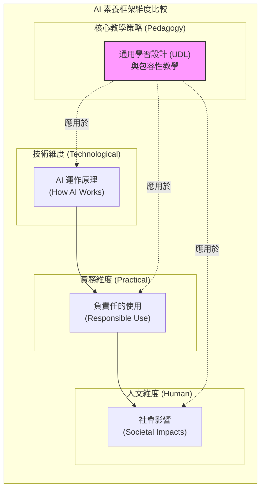

---

## Part 12

Source note: AI-literacy-frameworks (Part 12)

Original range: lines 711-819
Original chars: 81980-90250

<!-- source: AI-literacy-frameworks (Part 12).md -->

### 翻譯與對照報告

#### 摘要

本文件整理並翻譯了關於 AI 素養（AI Literacy）框架的研究分析。內容涵蓋了多個國際指標性框架（如 AI4K12 與 UNESCO）的核心維度、目標群體、定義及局限性。研究指出，目前的 AI 素養框架多聚焦於「技術維度」（如何運作），對於「人文維度」（社會影響）的關注相對不足，且多數框架仍偏向計算機科學導向，對於如何將 AI 素養落實於所有學科及全體學生的教學實務仍面臨挑戰。

#### 翻譯內文

（接續前文）...並在多樣化的學校進行短期試點，以便教師獲得具體的、可直接應用於課堂的模式，而非僅僅是新的規範。


##### **技術維度** (AI 如何運作) | **實務維度** (負責任的使用) | **人文維度** (社會影響)

###### **目標群體**
具有多樣化文化與語言背景的兒童、K–12 教育者、學習設計師與研究員。

###### **定義**
該框架並非執著於單一的技術定義，而是將 AI 視為一個由 AI4K12 「核心概念」（Big Ideas）所構成的學校領域，包含：感知、表示與推理、學習、自然互動、社會影響。隨後利用「通用學習設計」（UDL）圍繞這些內容來設計包容性的教學法。

###### **局限性**
目前的證據仍處於早期且非正式階段。目前尚無與各州/國家標準的詳細對應；規模化擴展可能需要教師投入更多時間進行個別化引導，並對數據素養與倫理進行更深入的探討。

---

#### **UNESCO (聯合國教科文組織)**

[https://www.unesco.org/en/articles/ai-competency-framework-students](https://www.unesco.org/en/articles/ai-competency-framework-students)

UNESCO 提供了兩個參考框架：一個針對 **學生** （包含四個維度的 12 項素養，層級分為：理解、應用、創造）；另一個針對 **教師** （包含五個維度的 15 項素養：以人為本的心態、AI 倫理、基礎與影響、AI 教學法、以及 AI 用於專業學習）。其目標在於指導課程整合，強調包容性、人權與批判性判斷，且旨在進行在地化調整，而非直接套用單一計畫。

###### **對英國的啟示**
學生框架提供了一個以價值觀為導向的素養骨幹。其四個維度與三個層級可以對應到 KS3 – KS5 以及教育進修（FE）計畫中的計算機科學、PSHE/公民教育、英語/媒體、設計與技術，以及數學/統計學。與國家持續專業發展（CPD）路徑相一致的、涵蓋知識、實踐與價值觀的進階評量指標，亦可與此框架接軌。

> [!NOTE]
 原始文件圖片比對: 

| 維度 | 圖示 |
| --- | --- |
| 技術維度 (AI 如何運作) | |
| 實務維度 (負責任的使用) | |
| 人文維度 (社會影響) | |

> [!NOTE]
  原始表格圖片比對: 

###### **目標群體**
課程設計者與政策制定者、處於不同職業階段與學科領域的職前與在職教師。

###### **定義**
AI 被框架化為一個「社會技術領域」（socio-technical domain），結合了透過進階層級所獲得的價值觀、知識與技能。以學生為中心的框架涵蓋了公民代理權、倫理、基礎知識與應用；而教師框架則將 AI 視為一種重塑「教師—學習者」關係的動力，轉化為「教師—AI—學生」的三方互動，這需要從心態與倫理到課堂整合及持續專業學習的各項素養。

###### **局限性**
這兩個框架皆屬於全球性、複雜且非指令性的指南，需要進行國家級的在地化，以完成課程對應、評量、資源開發、教師培訓、基礎設施建設、監測與評估。雖然框架是以「人」為核心進行構建，但其涵蓋的內容實際上並未完全達成其宣稱的目標。此外，目前尚不清楚為何教師與學生被指定了不同的素養集（理論上教師應具備與學生相同的素養，並加上其專業角色所需的額外素養）。

###### **八個框架之總結**
圖 2 根據 AI 的技術、實務與人文維度總結了這八個框架（摘自圖 2）。圖 3 中的每個圖示代表該維度得 1 分（例如：7.5 個圖示等於 7.5 分）。同樣地，結果僅具指標意義，而非定論。

|                   | 技術維度<br>(AI 如何運作) | 實務維度<br>(負責任的使用) | 人文維度<br>(社會影響) |
|-------------------|-----------------------|-----------------------|-------------------|
| AI-GO             |                       |                       |                   |
| AI4K12             |                       |                       |                   |
| AILit             |                       |                       |                   |
| Chui et al.       |                       |                       |                   |
| 歐洲委員會 (CoE)   |                       |                       |                   |
| Living with AI    |                       |                       |                   |
| Song et al.       |                       |                       |                   |
| UNESCO            |                       |                       |                   |

*圖 3：選定的八個框架在 AI 三個維度上的表現。*

在圖 3 中，呈現出與圖 2（20 個 AI 素養框架的熱點圖）互補的模式。這八個框架大多強調 **技術維度** （透過針對技術主題學習與評量的具體提案）。 **實務維度** 則處於中間位置，而 **人文維度** （歐洲委員會是一個顯著的例外）所獲得的重視程度最低。

#### **5. AI 素養框架分析的研究發現總結**

透過對二十個框架的分析以及八個範例框架的總結，可以得出一些關鍵發現。特別是存在著各種差距與不一致之處。

###### **1. 大多數框架對於對計算機科學感興趣的孩子比對於所有孩子更有用**
在所審查的國際框架中，對於核心技術基礎（數據、演算法與機器學習）存在共識，並包含有限的倫理與社會反思，且具備將學習融入各學科的雄心。然而，各方法在深度與重點上存在分歧，極少有框架關注 AI 的「人文維度」（唯一的例外是歐洲委員會的方法）。倫理雖然經常被提及，但很少有框架能深入探討表面倫理以外的內容，且幾乎沒有框架將其轉化為可評量的學習成果。事實上，大多數框架仍以「計算機科學」為中心，很少涉及民主、治理、勞動力市場、環境成本或 AI 對心理健康的影響。因此，大多數框架對於想要從事計算機或 AI 職業的孩子來說可能更有用，而非針對所有兒童及其教師。

###### **2. 對於「何謂框架」缺乏共識**
定義往往模糊不清，「框架」一詞的使用也並不一致——有時指概念結構，有時指一系列教案，有時指半實驗性的專案。同時，一些倡議試圖將先前的成果重新構建為新版本，例如歐盟/經濟合作暨發展組織（EU/OECD）的 AILit 框架，旨在整合 DigComp、UNESCO、Digital Promise 與 AI4K12 的方法。
然而，這些仍屬於高層次的藍圖：缺乏實施細節、課程整合，且未考慮技術基礎設施等背景因素。大眾素養推廣工作（如蘇格蘭的 *Living with AI*）雖然觸及範圍更廣、能與社會互動，但無法取代課堂就緒的課程或教師培訓。

###### **3. 起點狹窄**
多個 AI 素養框架高度依賴於三個早期的框架：Touretzky *et al.* (2019) (即 AI4K12)、Long & Magerko (2020) 以及 Ng *et al.* (2023)。

#### 詞彙與關鍵術語

| 英文術語 | 繁體中文翻譯 | 說明 |
| --- | --- | --- |
| Technological Dimension | 技術維度 | 關注 AI 的運作原理、演算法與數據。 |
| Practical Dimension | 實務維度 | 關注如何負責任地使用 AI 技術。 |
| Human Dimension | 人文維度 | 關注 AI 對社會、倫理、法律與心理的影響。 |
| Universal Design for Learning (UDL) | 通用學習設計 | 一種旨在提供靈活性以滿足不同學習需求之教學法。 |
| Pre-service/In-service Teachers | 職前/在職教師 | 指尚未入職與已經在教學崗位上的教師。 |
| Socio-technical domain | 社會技術領域 | 強調技術與社會結構、價值觀之間相互影響的領域。 |
| Computing-centric | 以計算機科學為中心 | 課程內容過度偏重程式設計與演算法，忽略人文素養。 |

#### 視覺化邏輯圖

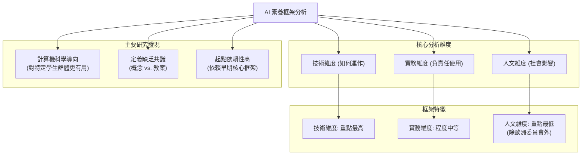

---

## Part 13

Source note: AI-literacy-frameworks (Part 13)

Original range: lines 809-876
Original chars: 89228-98550

<!-- source: AI-literacy-frameworks (Part 13).md -->

### 翻譯與對照報告

#### 摘要

本文件分析了當前 AI 素養框架面臨的主要挑戰，包括定義缺乏共識、研究視角過於狹隘（過度依賴計算思維）、交付形式不一以及包容性不足等問題。此外，文件透過芬蘭與南韓的案例研究，探討了如何透過跨學科協作與基礎設施建設來落實 AI 素養教育，並提醒政策制定者應避免陷入「資訊同溫圈」，應納入全球南方、環境永續及社會公平等多元維度。

#### 翻譯內文

### AI 素養框架：挑戰、現狀與案例研究

##### 1. 框架定義的缺乏共識

目前對於何謂「框架」的定義仍相當模糊，且該術語的使用並不一致——有時指涉概念性結構，有時指一套教案，有時則是指半實驗性的專案。同時，部分倡議試圖將既有的研究整合為新版本，例如歐盟與經濟合作暨發展組織（EU/OECD）的 AILit 框架，其目標是整合 DigComp、UNESCO、Digital Promise 以及 AI4K1lon 等方法。

然而，這些框架目前仍停留在高層次的藍圖階段：缺乏具體的實施細節、課程整合方案，且未充分考慮技術基礎設施等環境因素。相較之下，如蘇格蘭的 *Living with AI* 等大眾素養計畫，雖然觸及範圍更廣、能動員社會參與，但仍無法取代具備課堂實作能力的課程或教師專業發展計畫。

##### 2. 起點過於狹隘

多個 AI 素養框架高度依賴於三個早期框架：Touretzky 等人 (2019)（即 AI4K12）、Long & Magerko (2020) 以及 Ng 等人 (2023)。

這引發了三個關鍵問題：
* **知識基礎狹隘**：這些框架代表了極少數的聲音與脈絡（美國電腦科學、人機互動研究、亞洲評論文獻），這可能導致 AI 素養的定義變得狹隘。目前缺失了來自「全球南方」（Global South）的視角、針對特殊教育需求（SEND）、通用學習設計（UDL）或公平、多元與包容（EDI）的考量，也缺乏對公民素養、媒體素養、生態與永續發展脈絡（即 AI 的人類維度）的關注。
* **缺乏教學與社會維度**：Touretzky 等人 (2019) 專注於「五大核心概念」（感知、表示、學習、自然互動、社會影響），但缺乏對教學法、政治權力不平等、企業介入及環境成本等關鍵議題的關注。
* **政策盲點**：僅基於這三個視點的建設，可能導致政策制定者忽視成本實施、教師培訓、學校資源分配、SEND 適應性，甚至對於「是否該使用 AI」的討論。這些框架對於企業影響力、數據治理或 AI 的政治經濟學幾乎隻字未提，也未處理 AI 的投機性質（如超人工智慧、炒作週期），使政策制定者在快速變化的領域中僅持有靜態的定義。

換言說，建立在現有（多為計算導向）框架之上的 AI 素養框架，面臨著「垃圾進，垃圾出」（garbage-in, garbage out）的風險，可能使英國政策制定者誤將「共識」當作「知識同溫圈」。AI 素養面臨被侷限於「計算思維」的風險，而缺乏清晰的學習進度、文化脈絡、公平衡量標準、政治、未來、社會、生態及人類影響。

總結來說，僅僅整合現有框架只會強化既有的差距與偏見（例如過度關注培養未來電腦科學家的主題，而非所有兒童的主題）。因此，批判性地分析現有框架（最好從技術、實務與人類維度進行）以識別應保留與擴展的部分，以及目前缺失且至關重要的部分（通常包含 AI 的人類維度議題），才是更為重要的任務。

##### 3. 交付形式隨目標而異

框架的交付形式各異——從詳細的學習進度到高層次的原則，或是專業發展（CPD）與大眾素養計畫。這種不一致性使得政策制定者在定義 AI 素養時缺乏明確方向，且在不造成課程負擔、教師壓力或檢查框架負擔的情況下，難以在各學科中落實。

另一個分歧來源是動機與影響力。資金來源大多未被公開，且在某些情況下，企業贊助或技能需求優先級明顯形塑了目標。由大型科技公司支持的框架（例如 Digital Promise）往往強調「使用 AI 的信心」與工具的快速採用，而非批判性地探討「是否該使用 AI」，這存在著鼓勵「決定論式採納」而非培養「批判性與倫理素養」的風險。若能透明且準確地標註框架的性質（公眾、企業、草根或混合型），將使影響力更加清晰。

##### 4. 需整合既有的相關倡議

另一個反覆出現的缺口是未能說明 AI 素養如何與既有的素養（數位、數據、媒體、公民素養）相結合。在多數框架中，這種聯繫是模糊或缺失的。當 AI 素養被歸類在數據或媒體素養之下時，整合的實際路徑仍不明確。若缺乏基礎素養實踐有效性的證據，直接疊加 AI 素養不僅可能導致重複或政策混亂，還可能加劇學習負擔。此外，英國一些具影響力的資源中心（如 Raspberry Pi 和 Oak National Academy）使情況更複雜。它們本身並非框架，但透過提供廣泛使用的教學資源，深刻地影響著教學實務。政策制定者需要清楚辨析這種差異。

##### 5. 包容性議題尚未妥善處理

其他幾個缺口亦需正視。包容性仍是最薄弱的領域之一。針對特殊教育需求（SEND）的設計極其罕見，而更廣泛的公平、多元與包容（EDI）考量幾乎完全缺失。同時，草根與同儕主導的實踐（如校園工作坊或學生主導的 AI 專案）記錄不足。在制定新的政策指令之前，應仔細地對這些成功的自下而上活動進行梳理與評估。此外，整個領域幾乎完全缺乏獨立的評估機制。

##### 6. 案例研究

為了深入了解 AI 素養如何在英國落實，我們回顧了六個現有的案例研究。這些實例的選擇標準包括地理與系統的多樣性、對包容性的關注、實施證據、創新教學法以及與英國教育的相關性。每個案例研究均遵循以下引導問題：
* 背景與系統層級的條件為何？
* 使用了哪些教學與交付模式？
* 如何處理公平性問題？有哪些影響力的證據？
* 此模式是否可轉移至英國？發現了哪些張力或批評？

綜合而言，這些案例研究展示了大規模嵌入 AI 素養的機遇與挑戰。它們並非可直接複製的藍圖，而是關於系統條件、教學法與公平性如何在實務中互動的洞察來源，可為英國的政策與實務提供教訓。

###### **芬蘭 (Finland)**
芬蘭透過將 AI 映射到各學科的數位能力與多重素養（multiliteracy）來實施。其「共同設計模型」透過「共同構思、共同設計、共同實施、共同評估」的四階段循環，讓教師、學生與培訓師合作，產出兼具概念、技術與倫理目標的課堂教材。此模式建立在國家的「橫向能力」之上，特別是數位能力與多重素養。初步的課堂試驗顯示，這種方法具有強烈的教師自主性與可行性，但規模仍小，且除了參與式方法外，尚未明確處理 SEND 或公平性措施。

###### **南韓 (South Korea)**
南韓 202於 2020 年的政府計畫旨在將 AI 嵌入中小學教育，建設「智慧」學校基礎設施，並透過 38 所研究所的新碩士課程，在 2025 年前培訓至少 5,000 名 AI 整合專業教師。南韓刻意將 AI 素養的重點放在教師身上，優先建立其專業能力。

南韓的許多倡議始於小學教室，從「遊戲化」開始。四年級學生先透過手動分類圖片，再觀察螢幕上的分類器如何執行同樣的操作；他們嘗試語音轉文字、翻譯與影像濾鏡，並探討系統為何有時會出錯。國家計畫定義了核心概念（搜尋與推理、視覺與語音、翻譯、影像分類），並將每個概念與具體活動及現實情境（「我們應該在哪裡使用它？哪裡不該使用？」）相結合。由於許多任務是「不插電式」（unplugged）且低門檻的，教師可以快速上手並跨學科應用。然而，其風險在於若每堂課沒有配合對數據、限制與偏見的討論，教學可能會淪為單純的「工具演示」。

#### 詞彙與關鍵術語

| 英文術語 | 繁體中文翻譯 | 說明 |
| :--- | :--- | :--- |
| AI Literacy | AI 素養 | 理解、使用及批判性評估人工智慧的能力。 |
| Global South | 全球南方 | 指發展中國家或低收入國家，常用於討論地緣政治與資源分配。 |
| SEND (Special Educational Needs and Disabilities) | 特殊教育需求與身心障礙 | 指需要額外支持以達成學習目標的學生。 |
| EDI (Equity, Diversity, and Inclusion) | 公平、多元與包容 | 確保所有群體在教育環境中獲得平等機會的原則。 |
| UDL (Universal Design for Learning) | 通用學習設計 | 一種旨在減少學習障礙、提供靈活學習路徑的教學框架。 |
| HCI (Human-Computer Interaction) | 人機互動 | 研究人類與電腦系統之間互動的學科。 |
| Unplugged | 不插電式教學 | 不使用電腦或電子設備，透過實體活動學習計算概念的教學法。 |
| CPD (Continuing Professional Development) | 持續專業發展 | 教師在職期間不斷提升專業技能的過程。 |

#### 視覺化圖表

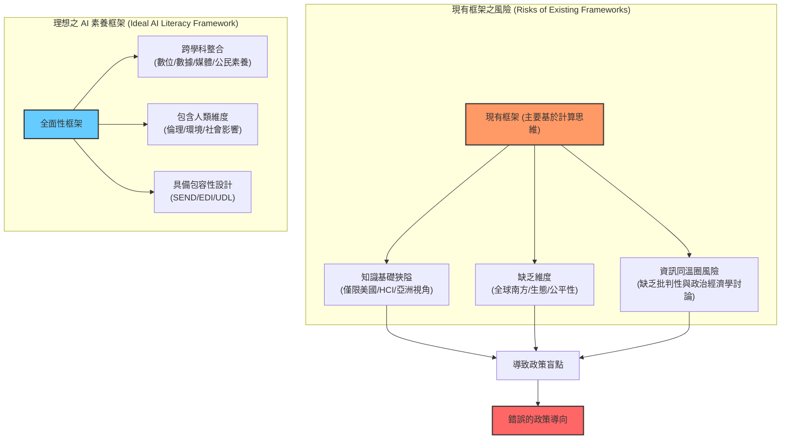

---

## Part 14

Source note: AI-literacy-frameworks (Part 14)

Original range: lines 874-926
Original chars: 97528-105783

<!-- source: AI-literacy-frameworks (Part 14).md -->

### 翻譯與對照報告

#### 摘要

本文件整理了全球多個國家在推動「AI 素養」（AI Literacy）方面的實踐案例，涵蓋南韓、美國、義大利、新加坡、烏拉圭及英國。這些案例展示了不同的策略模型：從南韓的「教師先行與遊戲化學習」，到美國蒙哥馬利郡的「價值導向治理」，以及新加坡的「全社會參與策略」。文件強調了 AI 素養不應僅僅是工具的使用，而應與教育價值、倫理審查、基礎設施建設及社區參與深度結合。最後，文件也對英國目前的政策缺口提出了反思，建議建立一個具備協調性、跨學科且有資金支持的國家級骨幹架構。

#### 翻譯內文

##### **南韓：教師培訓與遊戲化學習**
南韓的目標是透過 38 所研究生院的新碩士課程，到 2025 年培訓至少 5,000 名 AI 匯聚專家教師。AI 素養的推動策略是有意地將重心先放在教師身上，致力於先建立教師的專業能力。

南韓的許多計畫始於小學教室，透過「遊戲」來啟發 AI 學習。四年級學生先透過手動分類圖片，接著觀察螢幕上的簡單分類器如何進行同樣的操作；他們嘗試語音轉文字、翻譯和影像濾鏡，並探討為什麼系統有時會出錯。國家級框架定義了核心概念（搜尋與推理、視覺與語音、翻譯、影像分類），並將每個概念與具體活動及現實生活的情境（例如：「我們應該在哪裡使用這個技術？哪些地方不適合？」）相結合。由於許多任務採用「非插電式」（unplugged）且低門檻的設計，教師可以快速上手並應用於不同學科。然而，其中的風險在於，若每堂課沒有配合檢查、數據分析以及對局限性與偏見的討論，教學可能會淪為單純的「工具演示」。

##### **美國：價值導向的系統化治理**
**蒙哥馬利郡公立學校（美國馬里蘭州）** 採用了一套全系統的「AI 指引原則」，將 AI 的使用與學區的核心價值相結合，包括「個人化學習路徑」、安全且快樂的學校、尊重、仁愛、多元化、學生倡議、利益相關者發聲、透明度及社區夥伴關係等。AI 被定位為「教職員的輔助工具」，而非教師的替代品。馬里蘭州學區設定了公平性、隱私與無障礙性的最低標準（減少偏見、保護數據、確保所有兒童皆可使用），並分配了明確的治理角色。例如，校董會負責制定明確的願景與政策，並建立策略、對齊政策與資助專業發展。

此案例展示了學區如何試圖將價值觀、防護機制、角色分工與推行流程整合為一個系統。其核心在於將 AI 錨定於「人類教學法」，從第一天起就植入公平與安全（以避免擴大數位落差），並透過從校董會到教室的特定角色目標來建立問責制。開放的溝通與回饋機制使實務操作具備應變能力，而分階段的交付（領導層 $\rightarrow$ 教職員 $\rightarrow$ 學生/家長）旨在全面推行前先建立能力。此外，該學區還加入了社區層面：其素養框架的推行時程包含了對社區成員與家長的 AI 素養工作坊，將學習延伸至校園之外，旨在建立信任、對齊家校規範，並及早發現公平性需求。這並非一個「工具優先」的計畫，而是一個「價值導向」的營運模式，旨在提升教師能力、保護兒童，並將 AI 素養與實際課程及社區優先事項相結合。

##### **義大利：教師先行與模組化培訓**
義大利的 *InnovaMenti* 計畫透過「國家數位教育計畫」下成立的區域性「領土培訓團隊」（EFTs）來執行，其目標是從教師端著手建立 AI 素養，隨後再進入教室進行「共同教學」。

其培訓結構圍繞著「關於 AI (About AI)」、「使用 AI (With AI)」與「為了 AI (For AI)」三個維度，以及四個日常模組：溝通（文字/自然語言處理）、視覺（影像）、感知（物理/虛擬互動）與行動（自動化）。這些模組與 DigComp 2.2 標準對齊，提供即插即用的技術套件，主要透過線上方式交付，並同時針對 STEM 與人文科教師設計。EFT 培訓師支援教室實踐，目標是減輕工作量與風險。報告顯示其影響包括教師的參與度與信心顯著提升，但目前的證據多為自我報告，長期學生的學習成果尚待觀察。

對於英國而言，此案例提供了一個實用的範本，即區分「關於/使用/為了」AI 的教學層次。持續專業發展（CP動）團隊可以透過教學聯盟（MATs）或地方當局（LAs）運行模組化線上培訓與輔導式教室試驗；發布對應於關鍵階段（KS stages）與多學科的開放式教材包；並從一開始就加入針對英國特定需求及「特殊教育需求優先」（SEND-first）的設計。

##### **新加坡：全社會參與的策略**
新加坡的「智慧國」策略將 AI 素養視為一個「全社會參與」的計畫。在「全民 AI」（AI4E）計畫以及配套的學生/教育者軌道下，該計畫建構了從大眾化的、自主進度的入門介紹，到結構化的學校課程、具證照的學習路徑、實習以及年度挑戰賽的學習階梯；同時，教師則遵循由國家教育研究院（Institute of Education）與 AI Singapore 共同設計的平行路徑（包含「AI 基礎」與「AI 在教育中的應用」以及豐富的自學資源）。高年級至高等教育階段的學生則處理真實的城市問題，例如與交通、能源使用、永續發展相關的在地化問題，透過結合數據素養、機器學習概念、設計思考與公民責任的專題式學習（PBL）來進行。

此案例的重要之處在於「倫理」被貫穿於實務工作中。一個 AI 專題會包含快速的數據審計（例如：誰被遺漏或被錯誤代表）、簡單的公平性檢查、易懂的模型解釋，以及對隱私與「何時不應使用該工具」的簡短反思——這些評量是與程式碼並行的，並輔以展示如何建立此類倫理檢查的教師培訓。

##### **烏拉圭：AI 作為公共服務**
烏拉圭將 AI 素養轉化為一種「公共服務」，首先建立全民性的存取權（為每個孩子提供設備、網路與平台），接著疊加與 AI4K12 標準一致的國家級計算思維（CT）/AI 課程，由遠端專家教育者跨年級共同授課。

到 2023 年，烏拉圭的計畫已觸及約 80,000 名學生與 3,600 名教師（約佔城市公立學校的 80%），透過專題式學習解釋 AI 的運作原理並引發倫理反思。其核心啟示是：基礎設施 + 專家支持 + 連貫的教學法，比單純的新課程大綱更為重要；這種方式可以在不增加單一學校負擔的情況下，實現大規模的能力提升。

##### **英國的挑戰與展望**
生成式 AI（GenAI）在各領域的快速普及，促使包括科學、創新與技術大臣在內的英國高層決策者呼籲採取國家級應對措施。202於 2024 年提出的《AI 機遇行動計畫》反映了跨部門的共識，即 AI 將塑造英國的經濟與公民未來。

雖然該計畫旨在刺激公私部門對 AI 的採用，但目前尚不清楚是否會包含針對學校的具體、結構化措施——不僅是關於學校決定是否使用該技術的自主權，還包括為了實現這些雄心壯志，需要建立何種素養課程來準備教師與學生。

目前，儘管教育在培養下一代方面扮演著基礎性角色，但在英國的 AI 政策中，教育領域仍是定義最不明確的領域之一。

#### 詞彙與關鍵術語

| 英文術語 | 繁體中文翻譯 | 語境說明 |
| :--- | :--- | :--- |
| AI Literacy | AI 素養 | 指理解、使用及批判性評估 AI 技術的能力。 |
| Unplugged | 非插電式 | 指不使用電腦，透過實體活動學習計算思維的概念。 |
| Whole-of-society | 全社會參與 | 強調政策不應僅限於學校，而應涵蓋社區、家庭與產業。 |
| CPD (Continuing Professional Development) | 持續專業發展 | 教師在職期間的專業技能培訓與進修。 |
| SEND (Special Educational Needs and Disabilities) | 特殊教育需求與身心障學 | 指需要額外支持與調整的學生群體。 |
| EDI (Equity, Diversity, and Inclusion) | 平等、多元與包容 | 確保教育資源與機會對所有背景的學生公平。 |
| Project-based Learning (PBL) | 專題式學習 / 專案式學習 | 以解決真實問題為核心的教學方法。 |
| Scaffolding | 鷹架式教學 | 透過由易到難的結構化支持，引導學習者達成目標。 |

#### 邏輯架構圖

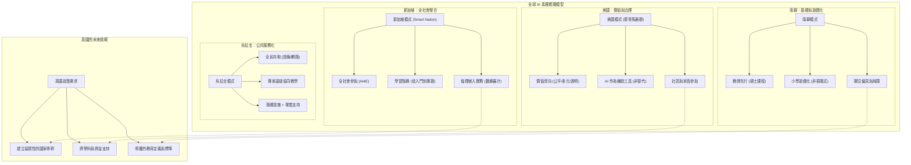

---

## Part 15

Source note: AI-literacy-frameworks (Part 15)

Original range: lines 918-964
Original chars: 104761-113129

<!-- source: AI-literacy-frameworks (Part 15).md -->

### 翻譯與對照報告

#### 摘要

本文件探討了英國各成員國（英格蘭、北愛爾蘭、威爾斯、蘇格蘭）以及全球層面在人工智慧（AI）素養框架建構上的差異化策略。文中指出，儘膀英國政府在推動 AI 產業應用方面投入大量資源，但在教育領域的投資卻顯得不足，且政策導向存在顯著分歧：部分地區傾向於「技術樂觀主義」與工具應用，而其他地區則試圖將 AI 素養與倫理、責任感及公民權利掛鉤。此外，文件批判了現行全球框架（如 OECD、UNESCO）過於簡化 AI 素養，忽略了背後的權力不對稱、數據殖民主義及社會政治張力。

#### 翻譯內文

（接續前文）...這不僅僅是一份新的教學大綱：它能在不增加個別學校負擔的情況下，實現大規模的素養提升。

#### **7. 國內與國際之比較**

生成式 AI（GenAI）在各產業的快速普及，促使包括英國科學、創新與技術大臣在內的高層決策者，紛紛呼籲採取國家級的應對措施。202 4 年《AI 機遇行動計畫》（AI Opportunities Action Plan）的制定，反映了跨部門日益增長的共識，即 AI 將形塑英國的經濟與公民未來。

雖然此計畫旨在刺激公私部門對 AI 的採用，但目前尚不清楚該計畫是否會針對學校提供具實質意義且結構化的措施——這不僅涉及學校決定是否使用或如何使用該技術的自主權，還涉及為了實現上述目標，需要建立何種素養課程，以應對教師與學生的需求。

目前，儘管教育在培養下一代公民與勞動力方面扮演著基礎性角色，但在英國 AI 政策中，教育領域仍是最缺乏明確定義的領域之一。雖然科學、創新與技術部（DSIT）已宣布一項 740 萬英鎊的試點計畫，用於資助中小企業（SMEs）的 AI 培訓，旨在提升私營部門的 AI 採用率與生產力，但針對教育工作者的類似投資卻付之闕如。

鑑於教育勞動力的規模，即便僅與商業投資達成適度的對等，也需要專款用於持續專業發展（CPD）、基礎設施與課程設計。若缺乏專屬預算，學校在產業能力加速提升的同時，恐面臨被拋在後頭的風險。此外，在學校與學院快速嵌入 AI 素養的雄心，與其說是基於實證需求與現有基礎設施，不如說更像是為了反映政府「親創新」的目標。同時，英國的四個組成國在發展 AI 素養方面正採取不同的路徑。

###### **英格蘭**

英國教育局（DfE）正在為英格蘭建立一個廣泛的生成式 AI 與教育國家框架。然而，整體政策似乎受到狹隘的「技術樂觀主義」預測所主導（通常來自如 Tony Blair Institute 等智庫），這些預測推廣投機性的收益（例如：學習成效提升 6%），卻忽略了誰是受益者、在何種條件下受益，以及付出了多少成本（預期「初始設置成本為 4 億英鎊，且以今日價格計算，每年維護成本約為 12 億英鎊」）。與此同時，新興證據指出其影響是複雜的，包括畢業生就業機會減少以及準備程度不足等問題。教育局已發布在教育環境中使用 AI 的國家指南，並與教學特許學院（Chartered College of Teaching）及 Chiltern Learning Trust 合作開發 CPD 工具包；國家計算教育中心（NCCE）也已將 AI 與機器學習整合至課程中（KS1-KS4）。然而，關於採用 AI 所產生的影響，目前證據仍相當匱乏，且早期發現指出 AI 對教師的教學法與工作量產生了負面影響。Ofqual 與 JCQ 的法規致力於維護評量的完整性，但在 AI 素養的具體內容、原因、方法以及應在哪些階段或透過何種方式教授等方面，仍存在空白。目前對於「AI 素養」的定義及其針對的對象也尚不明確。儘管口號上強調「人類控制」與技能發展，但學校仍缺乏一致的保證與批判性的 AI 素養方法，過度強調 AI 工具的使用，卻忽略了其必要性與倫理問題。

###### **北愛爾蘭**

北愛爾蘭採取了更具探索性的方法，委託進行研究以尋找發展 AI 素養技能的最佳途徑。這與北愛爾蘭議會關於生成式 AI 的研究，以及教育局（Education Authority）的 *EdIS* 教師 CPD 計畫、研討會及專注於教室負責任使用的夏季培訓相結合。與英格蘭類似，北愛爾蘭也尋求收集關於採用 AI（如生成式 AI 工具）之成效與益處的證據，但對於將 AI 作為批判性素養與技能的教學關注較少。教育部正資助一項與牛津布魯克斯大學（Oxford Brobooks）合作的素養導向 AI 研究，顯示其願意將創新與弱勢兒童的公平性聯繫起來；但同樣地，重點仍放在「利用 AI 工具輔助素養」，而非「教授 AI 素養」。阿爾斯特大學（Ulster University）的戰略概覽同樣側重於強調 AI 在教育中的機遇，但也警告存在一個「金髮姑娘區」（Goldilocks zone）的風險，即技術採用速度可能超越治理能力。在評量方面，CCEA 正與全英國的資格聯合委員會（JCQ）保持大體一致，但目前仍處於討論階段。整體而言，從幼兒教育到 16 歲後的教育環境，目前都缺乏結構化的 AI 素養框架，批判性觀點仍不成熟。

###### **威爾斯**

威爾斯正將 AI 素養與其培養「負責任公民」的目標相結合。威爾斯政府透過其 HWB 平台，在其廣泛的數位戰略中提出了生成式 AI 的基本指南。資源包括一套混合式學習工具包，其中包含如 SAFE（設定、行動、格式、範例）等提示詞設計框架，以及一個「混合式學習專家機器人」來支援教師。較新的指南強調安全、倫理且合法的 AI 使用，將 AI 素養與威爾斯課程的「四大目標」及「數位能力框架」相連結。然而，實質性的整合仍取決於學校對基礎設施、數位專業知識與專業學習支援的獲取能力。2025 年初，Estyn（威爾斯教育檢查局）啟動了一項全國性審查，旨在了解 AI 目前在威爾斯學校的使用情況，以作為未來全系統政策與實務的參考。

###### **蘇格蘭**

蘇格蘭似乎採取了一條專注於 AI 倫理與包容性的協調路徑。2021 年 3 月，蘇格蘭 AI 聯盟發布了《蘇格蘭 AI 戰略》，其中包括擴大學校 AI 學習機會的承諾（儘管缺乏強大的證據證明 AI 在教育中是有效且安全的）、投資數位基礎設施以及教師技能提升。蘇格蘭學生考評局（SQA）於 2024 年進行的調查顯示，79% 的教育工作者認為學生應被教導如何負責任地使用生成式 AI。蘇格蘭教職員學院（Staff College Scotland）呼籲在政策、基礎設施與倫理方面採取緊急行動，這呼應了 2023 年 6 月的一項獨立審查，該審查敦促成立一個跨部門的教育 AI 委員會。地方當局（包括格拉斯哥、南蘭arkshire 與西洛錫安）已制定了地方性的 AI 策略或政策，範圍從指南文件到倫理使用政策不等。這些由下而上的努力，與英格蘭在學校層級缺乏同等戰略規劃的情況形成了鮮明對比。

###### **全球視野**

2022 年的一項聯合國教科文組織（UNESCO）調查顯示，在 193 個國家中，僅有 11 個國家實施了國家級的 K-12 AI 課程，另有 5 個國家正在開發中。同時，較新的 UNESCO AI 能力框架（針對教師與學生）明確要求各國政府支持教師培訓、基礎設施投資以及 AI 的包容性獲取，並強調 AI 能力是一項基本的公民權利（儘管主要集中在技術與實務維度）。然而，儘管有這些呼籲，英國政府尚未以具體措施做出正式回應。

經濟合作暨發展組織（OECD）與歐盟的《AILit》草案旨在針對中小學師生，以確保這些機構為 202於 2029 年將「媒體與人工智慧素養」納入 OECD PISA 評量做好準備。這也符合歐盟委員會在《2021-2027 年數位教育行動計畫》下，關於教育公平與技能供應的廣泛努力。雖然這些都是令人期待的嘗試，但對於「AI 素養」的定義及其應讓孩子為何種未來做好準備，始終存在侷限性與缺乏共識的問題。

至關重要的是，這些框架將 AI 素養呈現為一種中立、線性且去政治化的技能組合（例如：OECD 關注參與、創造、管理、設計），卻未承認其中的「權力不對稱」（誰設計、擁有並從 AI 系統中獲益）；未探討教育與社會中 AI 使用與整合背後的倫理與社會政治張力（其必要性與理想性）；也未探討偏見、監控、勞動力取代或「數據殖民主義」等議題如何與 AI 素養交織在一起。

#### 詞彙與關鍵術語

| 英文術語 | 繁體中文翻譯 | 說明 |
| :--- | :--- | :--- |
| GenAI (Generative AI) | 生成式人工智慧 | 指能產生文字、圖像、音訊等新內容的 AI 技術。 |
| CPD (Continuous Professional Development) | 持續專業發展 | 教師或專業人士在職期間進行的持續學習與技能提升。 |
| SMEs (Small and Medium-sized Enterprises) | 中小企業 | 指規模較小的商業組織，文中指受 AI 培訓補助的對象。 |
| Techno-optimist | 技術樂觀主義者 | 傾向於相信技術進步能自動解決社會問題並帶來正面效益的人。 |
| Power asymmetries | 權力不對稱 | 指在 AI 系統開發與使用過程中，資源與控制權分配不均的現象。 |
| Data colonialism | 數據殖民主義 | 指大型科技公司透過提取與利用全球數據，從而實施數位化控制與剝削的現象。 |
| Goldilocks zone | 金髮姑娘區 | 原指「恰到好處」的範圍；在此指技術採用與治理之間必須維持的平衡點。 |
| K-12 | K-12 教育 | 指從幼兒園到高中的基礎教育階段。 |

#### 文化解析

1.  **英國的「四國」政治結構**：
    文中提到的「UK's four nations」是指英國由英格蘭、蘇格蘭、威爾斯與北愛爾蘭組成的政治實體。在教育政策上，蘇格蘭與威爾斯擁有高度的自主權，因此可以發展出與英格蘭截然不同的 AI 策略（如蘇格蘭的倫理導向與威爾斯的公民導向）。理解此背景對於理解為何英國內部政策呈現「碎片化」至關重要。

2.    **「技術樂觀主義」vs. 「批判性素養」**：
    文中存在一種深刻的學術對抗。英格蘭的政策被批評為「技術樂觀主義」（Techno-optimism），即將 AI 視為一種可以量化成效率提升的「工具」；而批判性觀點則強調「AI 素養」不應只是學會使用工具，更應包含對偏見、監控與權力結構的批判思考能力。

3.  **「金髮姑娘區」（Goldilocks zone）的隱喻**：
    這是一個源自童話故事的文化隱喻，意指「不冷不熱、剛剛好」。在政策語境下，它用來形容技術發展的速度與法律監管的速度必須達成一種精確的平衡，既不能因監管過度而扼殺創新，也不能因放任自流而導致失控。

#### 邏輯架構圖

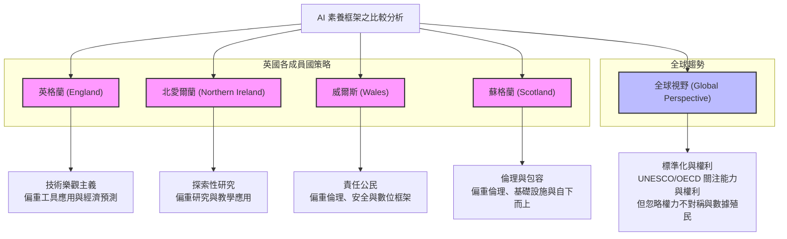

---

## Part 16

Source note: AI-literacy-frameworks (Part 16)

Original range: lines 962-1002
Original chars: 112107-120305

<!-- source: AI-literacy-frameworks (Part 16).md -->

### 翻譯與對照報告

#### 摘要

本文件提供了一份關於現行國際 AI 素養（AI Literacy）框架的批判性評論。文章指出，目前的框架（如 OECD 的 PISA 評量）過度側重於技術性的技能開發（如參與、創造、管理、設計），卻忽視了權力不對．稱、倫理爭議、數據殖民主義以及社會政治影響等核心議題。相比之下，歐洲委員會（Council of Europe）則提倡關注「人文維度」。文章最後警告，若英國（特別是英格蘭）缺乏一致的國家戰略，且過度依賴企業資金與技術導向的框架，恐將加劇教育不平等，並使課程變得狹隘，僅限於工具的使用而非批判性思考。

#### 翻譯內文

這些在中小學教育中的舉措，旨在確保相關機構能為 2029 年 OECD PISA 評量中新增的「媒體與人工智慧素養」評量做好準備。同時，這也符合歐盟委員會在《2021-2027 數位教育行動計畫》下，推動教育公平與技能供應的廣泛努力。儘管這些嘗試前景看好，但對於「AI 素養」的定義及其應培養兒童具備哪些能力，仍普遍存在局限性與缺乏共識的問題。

至關重要的是，這些框架將 AI 素養呈現為一種中立、線性且去政治化的技能組合（例如 OECD 關注的參與、創造、管理、設計），卻未承認其中的 **權力不對稱** （誰設計、誰擁有、誰從 AI 系統中獲益）；亦未探討支撐 AI 在教育與社會中整合的倫理與社會政治緊張關係（其必要性與理想性）；更未提及偏見、監控、勞動力取代或 **數據殖民主義** 等議題如何與 AI 素養交織，特別是對於弱勢學生與教師而言。

與此同時，歐洲委員會關於 AI 素養的部長級委員會建議（目前正在進行中，本報告的一位作者正積極參與此發展）承認了 AI 在技術與實務維度的素養重要性，但（與其他國際機構的方法不同）其重點放在 **AI 的人文維態** （其對人類、人權、環境、民主、法治及就業等的影響）。其方法基於一種信念：關注 AI 的人文維度，並結合適度但多為高層次的技術與實務維度，對於所有兒童及其教師而言都更為適切，而不僅僅是針對那些對計算科學感興趣的人。

最後，幾乎所有現有的國際 AI 框架與實施方案，都缺乏能在真實教室環境中使用的驗證式實施機制與評量工具。大多數方案仍停留在理論層面（有些甚至過於複雜），且缺乏關於課程整合、教師培訓（及其成本）或評估的明確指導。實務上的案例研究非常零星，這使得人們難以評估現有框架的真實潛力與成效。

事實上，我們上述分享的案例研究顯示了各種令人期待的成果——無論是透過提升教師信心、擴大影響範圍，還是將學習與職業路徑接軌。即便如此，來自個別實施案例的證據仍不一致，且往往需要龐大的基礎設施與策略支持。

###### **核心要點**

儘管前景看好，但這些國內與國際的倡議仍顯得零碎。以英國為例，有意義的 AI 素養應考慮到不同學校類型、地區及社會經濟群體之間現有的基礎設施差異、教學挑戰與需求。在學校快速採用 AI 的同時推行 AI 素養（若缺乏對學習或教學正面影響的明確證據），只會增加不平等的風險，並加深數位鴻溝與學習成果的差距。

國家層級的努力（例如蘇格蘭與威爾斯）以及全球性的考量（理論性與去政治化）與英格蘭目前明顯缺乏一致的國家戰略或基礎設施支持形成對比。採用程度的差異——存在於不同學校類型、地區、社會經濟群體之間——構成了擴大教育不平等的風險。此外，目前尚無強而有力的證據顯示 AI 在學校中的正面影響，甚至其「必要性」仍存疑。相反地，一些報告提出了對公平結果的真實威脅：例如，Indeed 最近的數據顯示，由於企業「尋求透過使用 AI 來降低成本」，畢業生職缺已降至 2018 年以來的新低。AI 專家撰寫的技術文獻也日益警告 AI 對教育可能產生的負面影響。

這種碎片化凸顯了建立一個 **全面、公平且以證據為基礎** 的 AI 素養政策框架的迫切需求——而這正是本皇家學會（Royal Society）受託進行的這項審查旨在提供資訊的方向。

#### 8. 影響 (Implications)

我們在開始這項快速審查時提出了兩個核心問題。第一個問題是：一致、不一致與缺口之處在哪裡？對此，我們發現對於 AI 素養的「技術核心」、將其嵌入各學科以及促進「負責任使用」方面，已達成了更清晰的共識。然而，不一致之處在於文獻中對 AI 素養（甚至對 AI 本身）的定義、應包含的內容、深度（從高層次原則到密集的進度與支架架構）以及操作細節（薄弱的課程對照、持續專業發展、評量、初期與維護成本，以及企業影響力）。至於人文維度（涉及權利、公平、工作未來、環境與民主）僅被輕微提及；針對特殊教育需求（SEND）與權益、多樣性及包誠（EDI）的設計則極其罕見或完全被忽略。此外，與現有素養（數位、媒體、數據、公民素養）的銜接尚不明確，而資金來源與企業影響力往往不透明。

整體而言，獨立評估非常匱乏，且對於基礎設施假設的成本估算鮮少被提及。針對第二個問題（關於必要知識、技能、價值觀及其教學與評量的證據為何），我們發現技術知識與工具使用方面（例如 AI4K12 風格的內容）已有較具體的具現化，且某些案例研究展現了可行性（例如：教師優先的持續專業發展、基於通用學習設計 (UDL) 的包容性 AI 素養考量、與教師共同設計，以及學區層級的全社區努力）。報告中的進步主要體現在參與度、信心與基本理解力，但研究規模較小、週期較短，且多為自我報告。在所審查的文獻中，「評量」整體而言是最薄弱的領域，缺乏經過驗證的衡量標準（儘管 AILit 將在 2029 年 PISA 評量中進行評估）。

###### **對英國政策的影響**

儘管我們已識別出諸多努力，但對於 AI 素養的理解仍不明確且處於演變中。在本次研究審查的文獻中，並不存在統一的定義。大多數框架傾向於關注運算思維與電腦科學（AI 的技術維度），而很少有框架優先考慮批判性理解與社會影響。即便如此，定義之間仍存在顯著差異，特別是在關注點上（較少涉及環境與社會經濟影響、政治權力失衡以及如何緩解這些問題），甚至對於整合數位自動化與 AI 的「必要性」也存在分歧。

此外，如前所述，大多數受檢視的素養框架僅建立在三篇基礎論文之上，這強化了各框架的局限性。雖然它們可能提供了一個有用的「起點」（儘管主要集中在技術維度），但對於英國政策而言，它們並未提供一個穩健的「終點」。

若不採取批判性且以人為本的立場，英國政策面臨著僅是「引進」那些對學校而言理論不足的學術定義，而非設計出屬於自己的、紮根於實務的框架之風險。綜上所述，英國需要的是具體的證據、明確的定義，以及有意義、系統化、且具脈絡性的 AI 素養定義與發展，而非盲目採用文獻中被大量引用的少數模板。

另一個問題是，企業的資金與影響力已經正在形塑全球 AI 素養的方向，這往往推動了「使用 AI 工具的技能與信心」之議程，而非支持兒童與教師首先做出「是否使用 AI」的知情決策。雖然這可能旨在服務國家生產力優先事項，但也存在著縮減課程範圍並淡化批判性素養的風險。英國教育界對於企業投入的透明度需要進一步提升——且如果 AI 素養框架是在企業影響下設計的，必須確保三個維度之間（即基礎知識、技術維度與人文維度）能達成平衡。

一個缺乏明確交付與評估手段的國家框架，也面臨著使任何政策努力碎片化的風險。

#### 詞彙與關鍵術語

| 英文術語 | 繁體中文翻譯 | 說明 |
| :--- | :--- | :--- |
| AI Literacy | AI 素養 | 理解、使用及批判性評估人工智慧的能力。 |
| Power asymmetries | 權力不對稱 | 指技術開發者、擁有者與使用者之間不平等的權力關係。 |
| Data colonialism | 數據殖民主義 | 指大型科技公司利用數據榨取資源，形成新型態剝削的現象。 |
| Human dimension | 人文維度 | 關注 AI 對人類權利、民主、環境與社會結構的影響。 |
| Continuous Professional Development (CPD) | 持續專業發展 | 教師在職期間的專業技能提升與培訓。 |
| Universal Design for Learning (UDL) | 通用學習設計 | 一種旨在提供靈活學習環境，以滿足所有學生需求（包含特殊需求）的教學框架。 |
| SEND (Special Educational Needs and Disabilities) | 特殊教育需求與身心障礙 | 指需要額外支持以達成學習目標的學生。 |
| EDI (Equity, Diversity, and Inclusion) | 權益、多樣性與包容性 | 確保教育環境公平、尊重差異並具備包容性的原則。 |
| PISA (Programme for International Student Assessment) | 國際學生能力評量計畫 | 由 OECD 組織的全球性學生能力評量。 |

#### 邏輯架構圖

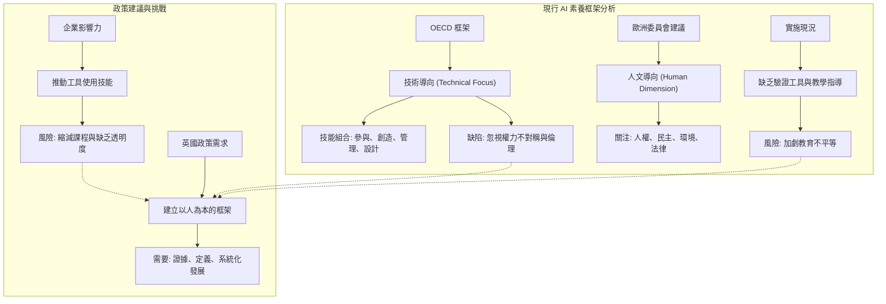

---

## Part 17

Source note: AI-literacy-frameworks (Part 17)

Original range: lines 996-1068
Original chars: 119283-129204

<!-- source: AI-literacy-frameworks (Part 17).md -->

### 翻譯與對照報告

#### 摘要

本文件探討了建立 AI 素養（AI Literacy）框架時面臨的複雜挑戰，並分析了這些挑戰對學校與教師的具體影響。核心議題在於如何避免 AI 素養被企業影響力所主導（僅追求工具使用技能），轉而追求具備批判性思維、系統化且具包容性的發展。文件強調了國家級協調機制的重要性、跨學科整合的必要性，以及針對特殊教育需求（SEND）學生進行包容性設計的迫切需求。對於教師而言，成功的框架必須建立在「共同設計」的基礎上，並提供充足的資源、時間與專款預算，以確保 AI 素養能真正落實於教學現場，而非僅僅成為教師額外的工作負擔。

#### 翻譯內文

需要對 AI 素養進行具意義、系統化且結合情境的定義與發展，而非僅僅是全面採用目前文獻中頻繁引用的少數現有模板。

另一個問題是，企業資金與影響力已在全球範圍內形塑著 AI 素養的方向，這往往傾向於推動「使用 AI 工具的技能與信心」之議程，而非支持兒童及其教師在最初階段就能做出是否使用 AI 的明智決策。雖然這可能旨在服務於國家的生產力優先事項，但也存在著縮減課程範圍並弱化批判性素養的風險。英國教育界需要進一步提高企業投入的透明度；且若 AI 素養框架是在企業影響下設計的，則必須確保其三個維度（即基礎知識、技能與批判性思考）之間能達成平衡。

缺乏明確執行與評估手段的國家級框架，也可能導致任何政策努力走向碎片化。可以考慮建立一個專門的協調機構或「AI 素養單位」作為一種治理形式，負責監督課程設計、監控企業參與、設定最低標準與安全防護線，並發布評估模板。蘇格蘭模式下的獨立機構提供了一個先例。然而，唯有當該機構包含廣泛的聲音時，此舉才能奏效——不僅要有產業與倡導者（例如許多研究人員和部分早期採用技術的教師），也必須包含批判性的聲音。

一個具影響力的 AI 素養框架，其關鍵條件在於所需基礎設施的成本。框架往往假設各區域背景下皆具備現有的基礎設施，但各校之間的資源甚至教育環境存在差異。實施的真實成本（設備、教師時間、持續專業發展 (CPD)、安全防護）應反映出與其他政策優先事項之間的明確權衡。

###### **對學校的影響**

###### **1. 目前的實驗缺乏協調且帶有風險**
在缺乏國家級指導的情況下，學校與多校聯動信託（MATs）已在各自進行獨立實驗，導致整合 AI 素碼的努力在品質與能見度上呈現參差不齊的狀態。這展現了對 AI 素養與技能發展的需求，但最終極有可能導致資源重複、浪費，且缺乏針對最初嘗試之成效與安全防護的適當衡量標準。國家級的協調應提供一個清晰的進度主軸（從 KS2 到 KS5），並能適應在地情境。

###### **2. 跨學科試點計畫需要跨利害關係人的參與**
國際案例（例如芬蘭、義大利、烏拉圭）顯示，AI 素養最理想的嵌入方式是跨學科的（如計算機科學、PSHE/公民教育、人文學科、設計與技術），而非僅限於 STEM 領域。因此，英國應鼓勵將 AI 與現有素養優先事項相結合的跨學科試點計畫。然而，為了妥善且有意義地達成此目標，必須納入教師、學校領導者、課程設計者與批判性聲音，以識別何時、何地以及如何整合此類 AI 素養組件最為理想。

###### **3. 特殊教育需求（SEND）嵌入的機會**
對於任何 AI 素養框架的包容性發展，公平性、SEND/EDI（平等、多元與包規）與 ULL（通用學習設計）應被列為優先事項。目前的框架鮮少明確提及 SEND，但包容性的共同設計（如芬蘭與義大利）在素養開發方式（透過共同參與）以及納入新素養計畫的平衡觀點上展現了前景。學校應獲得資源支持，從一開始就落實無障礙設計。

以特殊教育需求為考量來教授 AI 素養，並非要設計一套不同的課程，而是採用不同的教學方法來教授相同的內容。這可能涉及教學進度的調整、針對可能造成障礙的工具（例如文字過多的內容、字幕品質不佳、介面複雜）的應對，以及針對身心障礙與特殊需求個體的偏見消除。針對 SEND/EDI 的 AI 素養從一開始就需要在多個層面進行仔細考量。例如：考慮多種內容獲取方式（文字、音訊、視覺、觸覺）、展示學習成果的方式（語音、影片、圖表），以及保持注意力集中並允許循序漸進地建立知識（例如鷹架教學、清晰的常規）。考量應與特定需求相關的策略相匹配（例如：應明確教導自閉症兒童如何應對聊天機器人的溝通誤解，並提供低感官刺激的任務；對於閱讀障礙學生，則應提供易讀、易用的工具等）。公平性也要求針對數位落差最嚴重的資源匱乏社區進行重點扶持。

###### **4. AI 素養將幫助學校領導層決定是否以及如何使用 AI**
專注於 AI 素養將幫助學校決定是否以及如何安全地在教室中使用 AI 工具（例如：避免對生成式 AI、 「AI 心理治療師」或未受監督的平台產生盲目依賴）。例如，一個新興的問題是在教室或家庭中盲目使用生成式 AI 或聊天機器人。在某些框架、實施案例或特別是具有企業贊助的案例中，教師與兒童被鼓勵「直接嘗試 AI 工具」，其學習目標被框架化為「培養使用 AI 的信心」。這可能導致在缺乏對風險、局限性或倫活性問題進行充分討論的情況下，走向決定論式的「工具優先」採用模式。例如，由科技公司資助、鼓勵教師與兒童在缺乏防護措施下探索 AI 的資源；或是主要專注於效率提升（如教案規劃與評分）的培訓課程，而缺乏對批判性審視、數據隱私或學生福祉的討論空間。此類問題正迅速浮現，並與現有的課程過載與教師工作量壓力等問題交織在一起，進一步推動了技術發展與企業影響力或採用壓力。

###### **對教師的影響**

###### **5. 建立基於教師共同設計的實用模型**
教師是 AI 素養的最前線，然而在我們審閱的許多框架、實施案例與研究中，教師幾乎被視為事後的補充。過往常有一種假設，認為教師只需極少的準備即可交付新內容。事實證明，目前大多數的專業發展機會都是非正式、一次性且自發性的，這使得教師準備不足且缺乏信心。若要在英國學校中有意義地落實 AI 素養，起點必須是教師本身。

國際經驗提供了清晰的前進路徑。例如，在義大利的 *InnovaMenti* 計畫與歐洲的 *AI4T* 專案中，教師獲得了由國家協調的模組化、鷹架式培訓。這種方法確保了專業發展不僅涵蓋技術知識，還涵蓋了 AI 的批判性維度：倫理、偏見與負責任的使用。對於英國而言，這指向了一種「教師優先」的策略，即將 AI 素養系統性地整合到持續專業發展 (CPD) 與教師培訓 (ITE) 中。

除了培訓，有強有力的證據表明「共同設計」是關鍵。在芬蘭與荷蘭，教師直接參與了與研究人員、學生及其他利害關係人共同制定課程與教案。共同設計強化了代理權（Agency）、確保了情境契合度，並避免了由上而下的框架可能帶來的弊端（即在實踐中顯得外加或不切實際）。英國的框架應從一開始就納入此原則，確保教師是積極的夥伴，而非被動的接受者。

###### **攜帶 6. 需要充足的教師培訓與資源供應**
工作量壓力亦不容忽視。教師已承受巨大壓力，若缺乏保障的時間與資源，AI 素養恐將成為清單上「又一項新任務」。其他系統的經驗顯示，當 CPD 未能妥善安排時間或資源時，參與度將維持在極低水平。為了讓 AI 素養得以扎根，培訓必須獲得充足的資金支持、在學校課時內妥善安排，並由代課資源提供保障，而非留給教師在晚上與週末處理。

###### **7. 鼓勵教師培養批判性素養**
此外，存在著緊迫的安全防護疑慮。某些企業資助的資源鼓勵教師採用 AI 技術以追求顯著的效率提升（如教案規劃或批改作業），在某些情況下甚至推廣在教室中盲目使用聊天機器人作為「AI 心理治療師」。文獻顯示這帶來了嚴重風險：它削弱了教師的專業性，可能危害學生福祉，並使缺乏批判性審視的工具依賴常態化。因此，英國的教師培訓必須嵌入批判性素養（專注於 AI 的人性維度，包括理解 AI 的局限性、偏見與倫理影響），而非僅狹隘地專注於工具的採用。

###### **8. 提供特定學科的支持**
教師需要特定學科的支持。目前許多國際工作都集中在計算機科學與 STEM 領域。然而，AI 素養在人文、PSHE 與藝術領域同樣佔有一席之地，在這些領域中，它可以啟發更廣泛的社會、倫理與創意維度。此外，如我們所指出的，SEND 在 AI 框架中鮮少被提及，導致教師缺乏指導。因此，英國的方法應在多個學科中提供實務範例，並確保從一開始就為有 SEND 需求的兒童提供包容性設計。

###### **於 9. 為 CPD 預算設立專款專用制度**
最後，AI 素養的專業發展不僅需要培訓設計，還需要專款專用的資源保障。目前的 CPD 預算已極度吃緊；若沒有專門的資金撥款，學校實際上無法吸收額外的工作量。

#### 詞彙與關鍵術語

| 英文術語 | 繁體中文翻譯 | 語境說明 |
| :--- | :--- | :--- |
| AI Literacy | AI 素養 | 指理解、使用、評估及批判性思考 AI 技術的能力。 |
| Critical Literacy | 批判性素養 | 指對資訊進行審視、質疑其背後偏見與倫理影響的能力。 |
| SEND (Special Educational Needs and Disabilities) | 特殊教育需求與身心障礙 | 指需要額外支持以應對學習障礙或身體障礙的學生。 |
| CPD (Continuing Professional Development) | 持續專業發展 | 教師在職期間進行的專業技能提升與培訓。 |
| Co-design | 共同設計 | 由教師、研究者與利害關係人共同參與開發課程的過程。 |
| Ringfenced | 專款專用 / 撥款專用 | 指預算或資源被限制於特定用途，不得挪作他用。 |
| EDI (Equality, Diversity, and Inclusion) | 平等、多元與包容 | 確保教育環境對所有背景與能力的人士皆具公平性的原則。 |
| UDL (Universal Design for Learning) | 通用學習設計 | 一種旨在提供靈活學習環境，以滿足所有學生需求的教學框架。 |
| Multi-Academy Trusts (MATs) | 多校聯動信託 / 學區聯盟 | 英國一種由多所學校組成、共享資源與管理架構的組織形式。 |

#### 邏輯結構圖

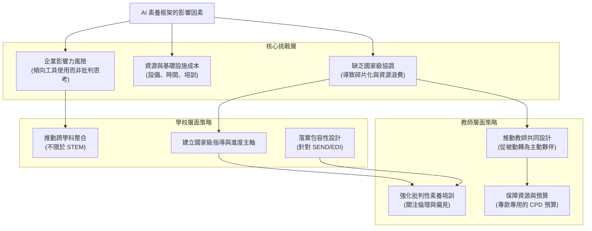

---

## Part 18

Source note: AI-literacy-frameworks (Part 18)

Original range: lines 1056-1116
Original chars: 128182-136416

<!-- source: AI-literacy-frameworks (Part 18).md -->

### 翻譯與對照報告

#### 摘要

本文件探討了在英國教育體系中建立 AI 素養框架的策略。內容強調 AI 素養不應僅限於工具的使用或技術性的學習，而應擴展至「人本維度」（Human Dimension），涵蓋倫理、偏見、社會影響及包容性。文件提出了「先試辦、以包容為驅動」的實施路徑，建議透過小規模的試辦計畫（Learning Labs）來測試教學內容與評估方法，並強調必須為特殊教育需求（SEND）學生提供適當的支持。此外，政策建議指出，英國需要建立一個清晰且共享的 AI 素養定義，將技術、實務與人本維度結合，並確保專業發展（CPD）預算的專款專用。

#### 翻譯內文

（接續前文）……重點在於 AI 的人本維度，包括理解 AI 的局限性、偏擬與倫理影響，而非僅僅侷限於工具的採用。

###### **8. 提供特定學科的支持**

教師需要針對特定學科的支持。目前許多國際性的研究工作多集中在計算機科學與 STEM 領域。然而，AI 素養在人文學科、個人、社交、健康與經濟教育（PSHE）以及藝術領域同樣佔有一席之地，在這些領域中，AI 素養可以啟發更廣泛的社會、倫理與創意維度。此外，正如我們所指出的，現有的 AI 框架極少提及特殊教育需求與身心障礙（SEND），導致教師缺乏指導。因此，英國的方案應在多個學科中提供實務案例，並從一開始就確保針對 SEND 兒童的包容性設計。

###### **9. 專款專用於在職專業發展（CPD）預算**

最後，AI 素養的專業發展不僅需要培訓設計，還需要專款專用的資源保障。目前的在職專業發展（CPD）預算已經捉襟見肘；若沒有專門的資金撥款，學校實際上無法承受額外的教學工作量。

##### **實施路徑**

若英國要認真對待 AI 素養，實施路徑必須經過謹慎的分階段規劃。國際案例顯示，在缺乏充分準備的情況下匆忙推行國家課程，會導致教學實踐碎片化、不平等以及教師信心下降。因此，英國需要一種「先試辦、以包容為驅動」的策略，並從一開始就嵌入評估機制。

「先試辦」的方法允許學校、教師和兒童在真實的課堂環境中探索 AI 素養，在規模化擴大之前測試哪些方法行之有效。這至關重要，因為 AI 素養並非單一學科，而是一套跨越計算機科學、PSHE、人文、藝術、社會科學與 STEM 的多維度知識、技能與價值觀。在某一學科、年齡層或學校情境下有效的方法，未必能自動轉移到另一種情境。透過從少數區域性試辦計畫開始（例如在三到五個多校聯動信託（MATs）或地方政府中進行），決策者可以產生大規模採用所需的證據與實務模型。

這些試辦計畫應充當「學習實驗室」，測試教學內容、評估方法和專業發展套件，並以可於全國分享的方式進行。

包容性必須從一開始就是指導原則。AI 素養倡議往往首先出現在資源豐富的學校，而弱勢社群與 SEND 兒童則被拋在後頭。為了避免擴大數位與教育不平等，英國的試辦計畫應刻意針對資源匱顯的學校，並將 SEND 適應性調整作為設計要求，而非事後補救。應嵌入「共同設計」流程——匯集教師、學生、課程開發者與公民社會的力量——以確保課程對所有兒童而言都是相關、易於取得且具賦權作用的。

評估是另一個關鍵要素。目前的國際現況提供的長期成效證據非常有限，大多數框架仍依賴回饋表或小規模的定性研究。對於英國而言，每個試辦計畫都必須包含清晰、可靠的評估，以追蹤不同年齡層與社群的進展。正如 Brookings (2025) 所言，影響力衡量不僅要捕捉工具的熟練度，還要捕捉批判性理解、倫理意識與公民準備度。評估應具備獨立性、透明度、規模化且公開發布，以建立信任與共享學習。

從試辦到全國推廣需要協調與治理。新加坡等國際案例展示了國家進程框架的力量，但英國的分權式教育體系需要更靈活的處理方式。建立一個中央 AI 素養諮詢小組（成員包括教師、研究人員、公民社會、決策者與批判性聲音）可以提供監督，確保企業參與的透明度，並維持與更廣泛素養（數位、數據、媒體、公民素養）的一致性。這也能防止各多校聯動信託（MATs）、地方政府與私人供應商之間的重複與碎片化。

最終，實施路徑並非要在一夜之間引入 AI 素養，而是要建立一個深思熟慮的序列：試辦、評估、調整與擴展。透過從優先考慮包容性與共同設計的試辦計畫開始，英國可以避免國際上出現的錯誤，並為建立一個穩健、公平且受信任的國家框架奠定基礎。

#### **9. 政策建議與槓桿**

文獻綜述收集到的證據顯示，在英國教育中開發與實施 AI 素養既具迫切性又具複雜性。雖然存在許多國際框架、實施案例與研究，但它們仍然是碎片化的、過於技術化的，且往往受限於狹隘或企業的議程。很少有框架能認真處理 AI 的人本維度（包括公平、人權、SEND、成本與教師發展）。

對於英國而言，機會在於採取一種更平衡、更深思熟誠的方法——這種方法將 AI 素養視為不僅是技術知識的問題，也是公民能力、批判性理解與民主韌性的問題。

最重要的起點是「清晰度」。英國目前缺乏對 AI 素養的共同定義，缺乏定義會使政策面臨碎片化與不一致的風險。建立一個涵蓋 AI 技術與實務維度，特別是涵蓋人本維度的工作定義，是至關重要的。但僅有定義是不夠的。教師必須做好準備、獲得支持並被賦予權力來共同設計課程內容。學校必須獲得資源以實現包容性的 AI 素養教學，並具備安全使用的保障與明確指南。在系統層面上，英國需要一個分階段的路徑——從試辦開始，嵌入評估，並在透明的治理下負責任地擴展。

##### **應對英國的需求**

###### **1. 明確 AI 素養的受眾**

明確 AI 素養是為誰而設計的至關重要。本次評論顯示，雖然聲稱 AI 素養是為了所有兒童，但框架似乎主要適用於對計算機科學感興趣的人（這可以從對技術的關注中得到證明——見下一項建議）。這並不是說不應該支持或不應該讓對計算機科學感興趣的人具備 AI 素養，而是說 AI 素養是為了每個人——因為每個人的生活各個層面都日益受到 AI 的影響。承認這一點將改變 AI 素養構成內容的重點。

###### **2. 明確且全面地定義 AI 素養**

英國的首要任務是建立一個清晰、共享的 AI 素養定義。這個定義應反映 AI 素養的多維度現實：包括對 AI 技術、數據與演算法運作的基本理解（技術維度）、負責任且批判性地使用這些系統的能力（實務維度），以及對其更廣泛的人類、倫理、社會、政治與環境影響的意識（人本維度）。AI 素養必須被定位為與數位素養、計算機科學素養及媒體素養相輔相成的獨立領域。它不能被簡化為編程或工具的使用。相反，它應該被框架化為一種廣泛的公民與教育能力，使所有兒童能夠在自信、批判且安全的前提下，就是否、何時以及如何與 AI 互動做出明智的決定。

AI 素養的定義還應明確承認公平與包容性，包括對 SEND 兒童的需求，以及 AI 的民主、永續性與政治經濟維度。唯有從一開始就嵌入這些考量，英國才能避免狹隘的「僅限技能」式方法，並確保 AI 素養能支持所有兒童在日益受 AI 影響的世界中成長，並服務於更廣泛的公共利益。在實務上，可以透過與學生和教師共同設計試辦計畫（如芬蘭與義大利的案例研究），並利用結果來最終確定英國的定義。

###### **3. 優先考慮 AI 的人本維度**

---

#### 詞彙與關鍵術語

| 英文術語 | 繁體中文翻譯 | 說明 |
| :--- | :--- | :--- |
| AI Literacy | AI 素養 | 指理解、使用及批判性評估人工智慧技術的能力。 |
| Human Dimension | 人本維度 / 人文維度 | 強調 AI 對倫理、社會、法律與個人權利影響的層面。 |
| SEND (Special Educational Needs and Disabilities) | 特殊教育需求與身心障礙 | 指在學習或發展上需要額外支持的學生。 |
| CPD (Continuing Professional Development) | 在職專業發展 | 教師在職期間持續進行的專業技能培訓。 |
| Ringfenced | 專款專用 / 劃定專用 | 指將預算或資源限制在特定用途內，不被挪用。 |
| Pilot-first, inclusion-driven | 先試辦、以包容為驅動 | 強調先透過小規模實驗，並以確保弱勢群體參與為核心的策略。 |
| Learning Labs | 學習實驗室 | 指作為實驗、測試與學習新教學法的場域。 |
| MATs (Multi-Academy Trusts) | 多校聯動信託 | 英國的一種學校組織架構，由多所學校組成一個信託。 |
| PSHE | 個人、社交、健康與經濟教育 | 英國學校中關於個人發展與社會責任的課程科目。 |

#### 邏輯架構圖

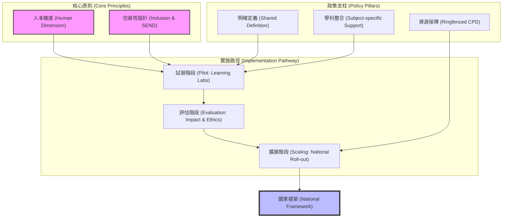

---

## Part 19

Source note: AI-literacy-frameworks (Part 19)

Original range: lines 1110-1170
Original chars: 135394-143809

<!-- source: AI-literacy-frameworks (Part 19).md -->

### 翻譯與對照報告

#### 摘要

本文件探討了建立全面性 AI 素養（AI Literacy）框架的策略建議，特別針對英國（UK）的教育情境。核心觀點認為 AI 素養不應僅限於編程技術或工具使用，而應被視為一種公民與教育能力，涵蓋倫理、社會、環境及人權等維度。文件強調了建立全國性統一框架的重要性，以避免英國四個組成國（英格蘭、蘇格蘭、威爾斯、北愛爾蘭）之間出現教育不平等。此外，文件提出了建立多方利害關係人專案小組、強化教師培訓、確保充足資金，以及建立透明機制以防止企業利益過度主導教育內容等關鍵策略。

#### 翻譯內文

AI 素養應與數位素養、計算素養及媒體素養並列，成為一個補充性的領域。它不能僅僅被簡化為編程技術或工具的使用；相反地，它應被框架化為一種廣泛的公民與教育能力，使所有兒童都能在面對 AI 時，能夠自信、批判且安全地做出是否參與、何時參與以及如何參與的明智決策。

AI 素養的定義亦應明確承認公平性與包容性，包括針對具有特殊教育需求與身心障礙（SEND）兒童的需求，以及 AI 在民主、永續性與政治經濟維度的影響。唯有在起步階段便嵌入這些考量，英國才能避免陷入狹隘的「僅限技能」模式，並確保 AI 素養能支持所有兒童在日益受 AI 影響的世界中成長，同時服務於更廣泛的公共利益。在實務層面上，可以透過與學生及教師共同設計試辦計畫（如芬蘭與義大利的案例研究），並利用其結果來定案英國的定義。

###### **3. 優先處理 AI 的人類維度**

在任何新的課程或框架中，應著重於 AI 對社會、倫理與人類的影響，而非僅關注其技術基礎或實際用途。

雖然現有的許多框架都涉及了 AI 的技術與實務維度，但在涵蓋「人類維度」方面存在明顯的缺口——包括 AI 對社會、人權與環境的深遠影響。一個全面的方法必須賦予學生分析以下議題的能力：演算法偏見、數據隱私、錯誤資訊、經濟不平等以及環境成本。若缺乏此一焦點，學生可能學會如何使用 AI 工具，卻無法理解其背後的隱藏複雜性與更廣泛的影響，導致他們在日益受 AI 影響的世界中，無法成為負責任且具備見識的公民。

###### **4. 建立一致的英國全國性方法**

目前，英國的四個組成國在 AI 素養方面採取了不同的路徑：英格蘭已發布了廣泛的指導方針；蘇格蘭優先考慮社會層面的倫理與包容維度；威爾斯將 AI 素養與負責任的公民身份相連結；而北愛爾蘭仍處於探索階段。這種碎片化的現狀存在著造成資源分配不均並擴大不平等的風險。目前所缺失的是一個一致的「國家骨幹」：一個橫跨 AI 的技術、實務與人類維度的清晰框架，該框架應借鑒但不限於現有的框架，同時保持執行上的中立性，並能適應各國的課程傳統與優先事項。

此類框架不應為四個國家規定單一模式，而應提供一個共同的參考點：即具體的、可操作的標準，用以明確兒童在不同教育階段應具備的知識、能力與價值觀。為了實現這一目標，應建立一個中央協調機構或委員會，以支持並整合各國的努力。雖然各國仍保有根據在地情境調整框架的靈活性，但該機構應確保存在明確的共識與方向，引領英國社會共同前進。

AI 素養的需求不僅止於課程規範，它還取決於在英國不同地區差異巨大的「賦能條件」。政策干預必須明確防範因承認這些差異而加深的不平等，並進行相應的資源配置。因此，推動實施應採取一種統一且靈活的階段性過程，確保基礎設施與能力較弱的地區不會負擔過重。透過將公平性嵌入推廣過程中，英國可以建立一個既統一國家願景、又尊重地方分權教育優先事項的連貫框架。

##### **建立教育成功的基礎設施**

###### **5. 建立全國性的多方利害關係人 AI 素養專案小組**

儘管教育在培養未來公民方面扮演核心角色，但教育仍是英國 AI 政策中定義最不明確的領域之一。若缺乏協調，AI 素養面臨著碎片化、重複建設或被企業議程不當主導的風險。為了解決此問題，政府應成立一個專門針對 AI 素養政策的多方利害關係人專案小組，其職能應與更廣泛的 AI 工業或創新戰略有所區別。

該機構應匯集教育工作者、政策制定者、課程開發者、研究人員、產業代表、公民社會、家長及學生，並包含獨立的批判性聲音。其使命應是提供國家級的領導力，在尊重分權背景的前提下促進四個國家間的合作，並確保 AI 素務與教育目標及更廣泛的社會需求保持一致。

一些案例展示了此類結構的價值：蘇格蘭的「與 AI 共生」（Living with AI）計畫匯集了公民與教育夥伴，以建立公眾信任與意識；而新加坡的中央機構則提供一致的框架，投資於教師發展，並為學生提供從基礎 AI 素養到與產業機會相連結的高階專業路徑。

英國的專案小組可以扮演類似的角色，指導課程整合、教師培訓、基礎設施與安全保障，同時透過如「透明度登記冊」等機制，引入防止企業過度影響的防護措施。透過整合現有的試辦計畫與孤立的倡議，專案小組能實現一個連貫、公平且基於證據的國家戰略，從而跟上生成式 AI（GenAI）進入教室等快速變化的挑戰。

###### **6. 優先考慮教師培訓與發展**

教師是 AI 素養的最前線。若缺乏他們的信心、培訓與自主權，任何框架都無法成功。建立一個全國協調的專業發展計畫至關重要。這應嵌入「初期教師教育」（ITE）與「持續專業發展」（CP動）中，並與教師共同設計，且針對計算、PSHE（個人、社會、健康與經濟教育）、人文、藝術與 STEM 等各學科情境進行量身定制。培訓必須超越典型的工具熟悉，涵蓋負責任的使用與安全實踐、倫理與偏見，以及 AI 對人權與自然環境的影響。培訓亦應獲得充足資源，納入學校日間課時表中，並在設計上具備包容性，使 SEND 適應措施成為必要組成部分而非可選項。

至關重要的是，教師準備工作必須符合現實：新要求不應增加不可持續的工作量，也不應取代核心素養。相反地，AI 素養應建立在閱讀、寫作、數學、媒體與數據素養的基礎之上。此外，AI 素養不能取代這些「核心素養」；除非學生具備強大的基礎，否則 AI 教育可能面臨加深既有成就差距的風險。因此，國家政策應將 AI 素養視為這些基礎技能之依賴與強化。

###### **7. 以清晰、現實的資金模型支持 AI 素養**

若缺乏投資，AI 素養無法大規模推行。政府應參考現有的數位與素養計畫來模擬成本，確保資金專款專用於教師 CPD、SEND 適應措施及基礎設施。至少，應與近期中小企業（SME）的 AI 試辦計畫保持對等，這象徵著培訓教師與兒童與培訓產業同樣重要。資金模型亦應包括對地方政府、多學院信託基金（MATs）及學校的支持，以便在不影響核心讀寫與算術教學的前提下試行相關計畫。

###### **議題 8. 防止企業過度影響**

企業資助與產業合作在全球 AI 素養倡議中已扮演重要角色。雖然這些合作能帶來寶貴的資源與專業知識，但也存在著將課程窄化為（特定）工具採用、技術鎖定、生產力導向或技能供應鏈目標（這些目標往往轉化為勞動力市場需求，從而服務於企業利益）的風險。若缺乏防護措施，AI 素養政策可能會偏離教育與公民利益，轉而服務於商業利益。

政府應針對企業參與 AI 素養倡議建立透明度登記冊（類似蘇格蘭的案例），明確披露資金來源、資源與動機。任何由企業資助的計畫在規模化採用前，都應進行強制性的獨立評估。提議建立的國家 AI 素養專案小組應負責此類監督。

#### 詞彙與關鍵術語

| 英文術語 | 繁體中文翻譯 | 說明 |
| :--- | :--- | :--- |
| AI Literacy | AI 素養 | 指理解、使用、評估及與人工智慧互動的能力。 |
| SEND (Special Educational Needs and Disabilities) | 特殊教育需求與身心障礙 | 指學生在學習或感官方面需要的額外支持。 |
| ITE (Initial Teacher Education) | 初期教師教育 | 指教師在正式進入教學崗位前的專業培訓。 |
| CPD (Continuing Professional Development) | 持續專業發展 | 教師在職期間進行的持續性專業技能提升。 |
| Multi-stakeholder | 多方利害關係人 | 指涉及多個不同利益群體（如政府、學校、企業、家長）。 |
| Algorithmic Bias | 演算法偏見 | 演算法因數據或設計問題產生的系統性不公平。 |
| Four Nations | 英國四個組成國 | 指英國的英格蘭、蘇格蘭、威爾斯與北愛爾蘭。 |
| Transparency Register | 透明度登記冊 | 用於公開披露資金與利益關係的紀錄機制。 |

#### 邏輯架構圖

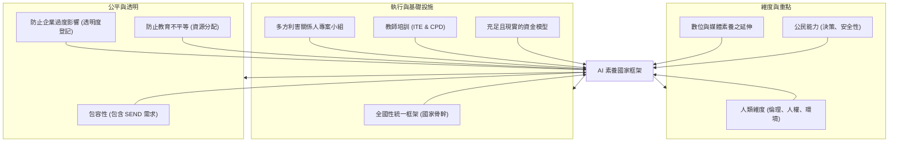

---

## Part 20

Source note: AI-literacy-frameworks (Part 20)

Original range: lines 1162-1228
Original chars: 142787-151128

<!-- source: AI-literacy-frameworks (Part 20).md -->

### 翻譯與對照報告

#### 摘要

本文件節錄自一份關於 AI 素養（AI Literacy）框架的政策建議報告。內容重點在於如何建立一個健全、公平且具前瞻性的 AI 教育體系。核心建議包括：提防企業力量過度介入導致課程偏向工具化；透過試辦計畫與縱向研究建立實證基礎；將 AI 素養與現有的數位、媒體及數據素養進行整合，避免資源重複與教學孤立；開發以批判性思考為核心而非僅限於編程技術的評量工具；支持基層教育創新；以及最終將 AI 素養全面嵌入跨學科的課程之中，而非將其視為單一的技術科目。

#### 翻譯內文

（接續前文）...讓各類學院信託（MATs）與學校能夠在不取代核心讀寫與算術教學的前提下，試行相關計畫。

###### **8. 提防不當的企業影響力**

在全球範圍內的 AI 素養倡議中，企業資助與產業合作已扮演重要角色。雖然這些合作能帶來寶貴的資源與專業知識，但也存在著將課程窄化為（特定）工具採用、供應商鎖定（lock-ins）、生產力導向或技能供應鏈目標（旨在服務常被轉化為勞動力市場需求的企業利益）的風險。若缺乏保障措施，AI 素養政策可能會偏離教育與公民利益，轉而服務於商業利益。

政府應建立企業參與 AI 素養倡議的透明度登記制度（類似蘇格蘭的案例），明確披露資助來源、資源與動機。任何企業資助的計畫在規模化採用前，都應進行強制性的獨立評估。擬議成立的國家 AI 素養任務部（National AI Literacy Task Force）應納入獨立且具批判性的聲音（學術界、公民社會、工會），以平衡企業觀點，並確保素養教育仍錨定於公共利益。此外，教育部（DfE）與國王商務服務局（Crown Commercial Service）應強制要求所有教育技術/AI 採購必須符合開放標準與互操作性（interoperability），以防止供應商鎖定，並讓學校能在不產生中斷與額外成本的情況下切換技術。

###### **採取迭代且具回應性的實施方法**

###### **9. 委託試辦計畫與縱向研究**

支持並資助試辦計畫與獨立研究，以針對學校中有效的 AI 素養干預措施建立穩健的實證基礎。

在我們探討的所有框架與案例研究中，獨立評估都相當匱乏。許多目前的倡議（例如擬議中的政府與公開大學內容商店）缺乏具體的指導、培訓或問責措施。政府應資助「試辦優先」的路徑，並透過透明的證據來確定哪些做法在實務上有效，特別是關於如何納入所有兒童，包括特殊教育需求與身心障礙（SEND）兒童。這能防止大規模採用未經測試、可能無效甚至危險的工具，並確保政策決策是基於證據，而非基於假設或意見。

###### **10. 與現有的數位素養工作保持一致**

將任何新的 AI 素養框架與現有的數位、媒體及數據素養倡議進行協調，以避免重複與混淆。

英國目前的素養領域已相當擁擠：數位素養、媒體素養、數據素養、資訊素養等等。AI 素養面臨著被視為一個新的、孤立領域的風險，即與現有工作平行發展。這種「筒倉式」（siloed）的方法會為教師、課程開發者與政策制定者帶來混淆，同時造成資源重複並增加學校負擔。此外，這也可能削弱作為 AI 素養基礎基石的基礎素養（如閱讀、寫作、數據與媒體素養）。

為了避免碎片化，AI 素養應被框架化為現有素養議程的進階發展，而非一個獨立或競爭性的優先事項。這意味著應將 AI 素養視為數位能力（如威爾斯的數位能力框架）、數據素養（已是計算與數學課程的核心）以及媒體素養（現已納入 Ofcom 的數位素養職責）的延伸。AI 素養應透過增加 AI 的技術、實務，尤其是「人類維度」，來強化這些既有領域，而非取代或重複它們。

透過將 AI 素養與既有倡議進行協調，英國可以建立一個連貫的策略，利用過去在課程、基礎設施與教師持續專業發展（CP型）上的投資。這將為教育工作者提供清晰度，減少政策領域間的重複，並確保 AI 素養能為數位時代的整合式教育願景做出貢獻。

###### **11. 開發 AI 素養專用的評量工具**

評量是英國教育政策中最敏感且負擔最重的面向之一。學生與教師已面臨高風險考試與問責制度帶來的巨大壓力，任何新要求都有可能加劇這種負擔。同時，若缺乏清晰且符合情境的 AI 素養衡量方式，AI 素養恐將淪為一種願景式的修辭，而非教育中有意義的一部分。

目前的評量方法往往狹隘地集中在技術技能上，例如編寫演算法或程式練習。雖然這些技能對某些孩子很重要，但並非普遍適用，且存在著排除那些「AI 素養核心在於意識、判斷與負責任使用」之學生的風險。一種更廣泛、更適切的評量方法應捕捉對所有孩子都重要的能力：批判性地與 AI 互動、質疑輸出結果、識別偏見，並理解其對社會、民主與公平的影響。

這需要開發平衡兩個關鍵原則的 AI 專用評量工具。首先，它們必須超越衡量「如何操作」或工具使用，以捕捉更深層的意識、批判性思考與倫理推理。其次，設計時必須敏銳地意識到工作量與系統壓力：評量應是輕量化的，嵌入現有的學科與教學計畫中，並與更廣泛的素養與公民目標相結合，而非作為一項新的、獨立的負擔。

在國際上，部分系統已開始朝此方向邁進。例如，烏拉圭將 AI 素養整合至其計算思維框架中，並輔以由遠端專家共同指導的專題式評量。美國馬里蘭州則試行了以社區為核心的計畫，評量學生如何將 AI 概念應用於解決在地挑戰。這些方法展示了評量如何從考試轉向真實、有意義的理解展示。

###### **12. 梳理並支持基層 AI 素養倡議**

AI 素養的許多創新已在學校層級湧現，特別是在多學院信託（MATs）與獨立學校中，通常由積極的教師或地方領導者驅動。這些努力是寶貴的試驗場，但目前仍處於分散、缺乏紀錄且資源分配不均的狀態。若缺乏能見度，政策制定者可能會忽視基層實踐，錯失向早期採用者學習的機會，並導致實驗 AI 的學校與無法實驗的學校之間差距擴大。

英國應參考德國高等教育地圖（Germany's tertiary education mapping）等模式，委託進行一項全國性的學校與學院信託層級 AI 素養活動調查。這將建立更清晰的基層實驗圖像，突顯優良實踐，並識別能力缺口。調查結果應回饋至國家試辦計畫與框架開發中，確保基層的能量能以公平的方式被利用與規模化。

##### **打造面向未來的英國**

###### **13. 將 AI 素養嵌入跨學科課程**

AI 素養不應作為一門獨立科目引入，而應嵌入現有的各個學科中。將其視為孤立的主題，存在著將範圍窄化為技術技能或工具使用的風險，並可能重蹈數位、數據與編程素養發展時的覆轍——當時工具的激增讓教師感到不知所措且缺乏明確指導。跨學科的嵌入能確保所有孩子——而不僅是追求計算科學的孩子——都能在 AI 塑造社會的情境中，獲得理解與批判性評估 AI 的能力。

這意味著必須超越「僅限電腦科學」的模型。歷史與公民教育可以探討民主、監控與權力；英文與媒體研究可以探索作者身份、偏見與智慧財產權；藝術與設計可以質疑 AI 賦能的創造力與文化遺產；科學與設計技術則可以涵蓋數據、機器人技術與永續發展。

透過這種嵌入方式，AI 素養將變得更具相關性、易於接觸且符合情境，同時也能將責任分散給更廣泛的教學團隊，而非集中在少數的計算專家身上。

#### 詞彙與關鍵術語

| 英文術語 | 繁體中文翻譯 | 說明 |
| :--- | :--- | :--- |
| AI Literacy | AI 素養 | 理解、使用及批判性評估人工智慧的能力。 |
| Multi-Academy Trusts (MATs) | 多學院信託 / 集團 | 英國的一種學校管理架構，由多所學校組成一個信託。 |
| Lock-in (Vendor Lock-in) | 供應商鎖定 | 使用者因技術標準或成本因素，難以更換其他供應商的狀態。 |
| Longitudinal research | 縱向研究 | 針對同一對象在長時間跨度內進行的追蹤研究。 |
| SEND (Special Educational Needs and Disabilities) | 特殊教育需求與身心障礙 | 指需要額外支持與資源的學生。 |
| Interoperability | 互操作性 / 互通性 | 不同系統、設備或軟體之間交換與使用資訊的能力。 |
| Siloed approach | 筒倉式方法 / 孤立式方法 | 各部門或領域各自為政，缺乏溝通與整合的模式。 |
| Grassroots | 基層 / 草根 | 指由底層、地方或學校現場發起的自發性行動。 |
| CPD (Continuing Professional Development) | 持續專業發展 | 教師在職期間不斷提升專業技能的學習過程。 |

#### 邏輯架構圖

```mermaid
graph TD
    root["AI 素養政策架構"]

    subgraph "風險防範層"
        risk["防範企業影響力"]
        risk1["透明度登記制度"]
        risk2["開放標準與互操作性"]
        risk --> risk1
        risk --> risk2
    end

    subgraph "實施策略層"
        strat["實施與整合策略"]
        strat1["試辦計畫與縱向研究"]
        strat2["與現有素養（數位/媒體/數據）整合"]
        strat --> strat1
        strat --> strat2
    end

    subgraph "評量與支持層"
        eval["評量與基層支持"]
        eval1["開發批判性評量工具"]
        eval2["支持基層創新與調查"]
        eval --> eval1
        eval --> eval2
    end

    subgraph "最終目標層"
        goal["跨學科嵌入"]
        goal1["將 AI 素養融入歷史、英文、藝術、科學等學科"]
        goal --> goal1
    end

    root --> risk
    root --> strat
    root --> eval
    root --> goal
```

---

## Part 21

Source note: AI-literacy-frameworks (Part 21)

Original range: lines 1224-1271
Original chars: 150106-158341

<!-- source: AI-literacy-frameworks (Part 21).md -->

### 翻譯與對照報告

#### 摘要

本文件翻譯了關於「AI 素養框架」的核心策略建議。內容強調 AI 素養不應僅被視為單一的技術技能，而應透過跨學科的整合（Cross-curricular Integration）來落實。文件提出了三個關鍵支柱：首先是 **促進公平與無障礙性**，確保弱勢學校獲得必要資源；其次是 **安全保障**，防範 AI 帶來的偏見、隱蔽監控與自主權喪失風險；最後是 **連結教室與社會**，讓學生能參與社區議題，成為形塑 AI 未來的參與者。最終目標是建立一個以人為本、具備倫理深度且能應對全球挑戰的教育框架。

#### 翻譯內文

將 AI 素養視為一個孤立的主題，存在著將其範疇限縮於技術技能或工具使用的風險，這可能會重蹈過去數位、數據與程式編寫素養（digital, data, and coding literacy）的覆轍——當時工具的激增讓教師感到應接不暇且缺乏明確指引。透過將其嵌入各學科之中，能確保所有孩子——而不僅是那些追求計算科學的孩子——都能具備在形塑社會的脈絡下，理解並批判性評估 AI 的能力。

這意味著必須超越單一電腦科學的模型。歷史與公民教育可以探討民主、監控與權力；英文與媒體研究可以探索作者身份、偏見與知識產權；藝術與設計可以審視 AI 驅動的創意與文化遺產；科學與設計技術則可以涵蓋數據、機器人技術與永續性。

透過這種嵌入式教學，能使 AI 素養更具相關性、易於接觸且符合情境，同時將責任分散到更廣泛的教學團隊中，而非集中在少數的計算科學專家身上。

然而，整合過程必須符合現實情況並具備情境敏感度。鑑於教師短缺以及學科資源分配不均，AI 素驗應與現有的課程優先事項及教師專業知識相結合。至關重要的是，課程設計應由教師、學生與社區共同參與（co-creation），以確保教材具備高品質、易於取得且不會增加教師工作負擔。此外，嵌入式教學應強化基礎素養——如閱讀、寫作、數據與媒體素養——使 AI 素養能建立在這些基本技能與公平目標之上，而非取代它們。

###### **14. 處理公平性與無障礙性問題**

實施相關措施，以確保所有學校，特別是弱勢地區的學校，都擁有有效教授 AI 素養所需的資源與支持。教育部（DfE）及地方教育部門應為弱勢學校（包括學生轉介單位和特殊學校）撥出專用的「AI 素養準備」補助金，以確保可靠的網路連接、輔助技術以及教師的教學釋放時間。教育部（DfE）的採購框架應要求所有教室使用的 AI 與數位工具皆須符合無障礙與互操作性標準（例如符合 WCAG 標準、具備離線/低頻寬模式），且任何進入教室的技術都必須強制遵守此規範。此外，應資助並支持包含特殊教育需求（SEND）面向的在職專業發展（CPD），內容涵蓋 AI 素養基礎、批判性與倫理使用，以及針對失讀症、自閉症、感官與溝通需求等特定學習需求與障礙進行教學調整。

###### **15. 保護兒童安全**

AI 系統為教育帶來了遠超傳統安全保障（safeguarding）關注範圍的風險。自動化評分與適應性學習工具可能加深偏見；推薦引擎在缺乏透明度的情況下形構學習路徑；生成式 AI（GenAI）可能鼓勵捷徑與過度依賴；而監控系統則會侵蝕隱私。這些發展不僅威脅到安全，也威脅到自主權、公平性與身心健康。

###### **16. 將教室與社會連結**

AI 素養不應侷限於教室內的技術知識。為了使其具有意義，必須將孩子與 AI 更廣泛的社會、倫理與公民影響連結起來。這意味著要為學生建立路徑，讓他們能在社區中批判性地參與 AI 議題，並將自己視為形塑 AI 未來的行動者。

政府與地方當局應支持以社區為核心的 AI 素養計畫，將學校與公民組織、家庭及地方挑戰連結起來。諸如蘇格蘭的「與 AI 共生」（Living with AI）以及馬里蘭州以社區為根基的 AI 素養計畫，皆展示了教室如何與更廣泛的社會接軌。對於英國而言，這可能意味著擴大個人、社會、健康與經濟教育（PSHE）與公民教育的課程範疇，將 AI 的公民影響納入其中；支持青年議會針對 AI 議題進行辯論；並資助學校與社區的夥伴關係，讓孩子獲得真實的機會去質疑並影響他們世界中的 AI。

#### **10. 結語**

透過實施本文概述的英國專屬路徑——即在技術與實務層面的 Alongside，優先考慮 AI 的人文維度——英國可以超越目前碎片化的現狀，為所有孩子建立一個連貫且高品質的 AI 素養框架。這種統一的跨學科策略，借鑒全球各國經驗，並輔以強大的教師培訓、迭代的試辦計畫、對技術供應商的嚴格問責，以及包含批判性聲音在內的廣泛利害關係人參與，將能幫助孩子在日益受 AI 影響的世界中，具備必要的批判性思考與倫理理解能力。同時，這也將使英國在以社會與地球福祉為先導的負責任且公平的教育與創新領域中，確立全球領導地位。

#### 詞彙與關鍵術語

| 英文術語 | 繁體中文翻譯 | 說明 |
| :--- | :--- | :--- |
| AI Literacy | AI 素養 | 理解、使用及批判性評估人工智慧的能力。 |
| Cross-curricular | 跨學科 / 跨課程 | 將特定主題整合進不同學科的教學方法。 |
| Safeguarding | 安全保障 / 保護機制 | 確保兒童在教育環境中免受傷害與風險的機制。 |
| Equity and Accessibility | 公平性與無障礙性 | 確保資源分配公正且所有學生（含障礙者）皆能使用。 |
| SEND (Special Educational Needs and Disabilities) | 特殊教育需求與障礙 | 指學生在學習、溝通或感官方面需要的額外支持。 |
| CPD (Continuing Professional Development) | 在職專業發展 | 教師在職期間持續提升專業技能的培訓。 |
| Devolution / Devolved departments | 地方分權 / 地方教育部門 | 指英國各組成國（如蘇格蘭、威爾斯）擁有的自主教育權。 |
| Generative AI (GenAI) | 生成式人工智慧 | 能夠創造新內容（文字、圖像等）的 AI 技術。 |

#### 邏輯架構圖

```mermaid
graph TD
    root["AI 素養框架核心策略"]

    subgraph "整合策略 (Integration)"
        direction TB
        A1["超越單一電腦科學模型"]
        A2["跨學科嵌入 (歷史、英文、藝術、科學)"]
        A3["建立於基礎素養之上 (閱讀、寫作、數據)"]
    end

    subgraph "公平與無障礙 (Equity & Accessibility)"
        direction TB
        B1["資源分配 (針對弱勢學校的補助金)"]
        B2["技術標準 (符合 WCAG 規範)"]
        B3["教師培訓 (包含 SEND 特殊需求支援)"]
    end

    subgraph "風險與責任 (Risks & Responsibility)"
        direction TB
        C1["安全保障 (防範偏見、隱私與監控)"]
        C2["社會連結 (教室與社區、公民組織連結)"]
    end

    root --> A1
    root --> B1
    root --> C1

    A1 --> A2
    A2 --> A3

    B1 --> B2
    B1 --> B3

    C1 --> C2
```

---

## Part 22

Source note: AI-literacy-frameworks (Part 22)

Original range: lines 1268-1295
Original chars: 157318-165534

<!-- source: AI-literacy-frameworks (Part 22).md -->

### 翻譯與對照報告

#### 摘要

本文件整理自一系列關於「人工智慧素養（AI Literacy）」與「教育應用」的學術文獻、政策指南及新聞報導。內容涵蓋了全球多個地區（如英國、歐洲、南韓、北愛爾蘭）對於生成式人工智慧（Generative AI）進入教育體系的規範、挑戰、研究成果以及數位能力框架的討論。翻譯重點在於精確呈現各國政府機關與教育組織的官方術語，並保留文獻引用的完整性。

#### 翻譯內文

以下為文獻清單的分類翻譯與整理：

##### 1. 政策、指南與官方文件 (Policy, Guidelines & Official Documents)

* **歐洲委員會 (Council of Europe)**, 2025. 《關於 AI 素養建議草案的討論文件》(Discussion paper on Draft Recommendation on AI literacy)。
* **英國教育部 (Department for Education, UK)**, 2023. 《生成式人工智慧 (AI) 在教育中的應用》。
* **英國教育部 (Department for Education, UK)**, 2024. 《生成式 AI 在教育中的應用：教育工作者與專家的觀點》。
* **英國教育部 (Department for Education, UK)**, 2025. 《在教育環境中使用 AI：支援材料》。
* **英國政府數位服務局 (Government Digital Service)**, 2025. 《英國政府人工智慧使用指南 (HTML 版)》。
* **歐洲委員會 (European Commission)**, 無日期. 《數位教育行動計畫：政策背景》。
* **歐洲議會 (European Parliament)**, 2024. 《關於制定人工智慧法規 (EU) 2024/... 統一規則之修正案 (人工智慧法案)》。
* **威爾斯 Hwb (Hwb Wales)**, 無日期. 《生成式人工智慧在教育中的應用》。
* **北愛爾蘭教育局 (Education Authority Northern Ireland)**, 無日期. 《北愛爾．AI 在教育中的應用》。

##### 2. 學術研究與框架 (Academic Research & Frameworks)

* **Falloon, G.**, 2020. 「從數位素養到數位能力：教師數位能力 (TDC) 框架」。
* **Fontaine, G. 等人**, 2025. 「推進實施科學理論、模型與框架的選擇：範圍界定綜述與 SELECT-IT 元框架之開發」。
* **Hillman, V. 等人**, 2024. 「AIED (人工智慧教育) 與教育科技採購：政策與治理的挑戰」。
* **Holmes, A.**, 2025. 《教育體系中的生成式人工智慧》。
* **KSII 網路與資訊系統期刊**, 19(2). 關於 Delphi 調查研究之文獻。

##### 3. 產業觀察、新聞與社會影響 (Industry Observations, News & Social Impact)

* **The Korea Herald**, 2025. 「南韓停止推行 AI 教科書」。
* **CIPD**, 2025. 「僅四分之一招募年輕人的雇主認為他們已為工作做好準備」。
．
* **Internet Matters**, 2025. 「AI 研究警告學校尚未為人工智慧做好準備」。
* **Internet Matters**, 2025. 《生成式 AI 在教育中的應用報告》。
* **Google for Education**, 無日期. 「透過 AI 推進教育」。
* **Education Endowment Foundation**, 2024. 「ChatGPT 在課前準備中的應用：教師選擇實驗」。

#### 詞彙與關鍵術語

| 英文術語 | 繁體中文翻譯 | 說明 |
| :--- | :--- | :--- |
| AI Literacy | AI 素養 | 指理解、使用及批判性評估 AI 技術的能力。 |
| Generative AI | 生成式人工智慧 | 能夠創造新內容（如文字、圖像）的 AI 技術。 |
| Digital Competence | 數位能力 | 在數位環境中有效運用資訊與技術的綜合能力。 |
| Implementation Science | 實施科學 | 研究如何將研究發現轉化為有效實踐的科學領域。 |
| AIED (AI in Education) | 人工智慧教育 | 將 AI 技術整合進教學與學習過程的領域。 |
| Procurement | 採購 | 在教育政策中，指政府或學校購買教育科技產品的過程。 |
| Framework | 框架 / 構架 | 用於指導政策或教學實踐的結構化模型。 |

#### 邏輯結構圖

```mermaid
graph TD
    root["AI 教育文獻來源分類"]

    subgraph "政策與規範層"
        policy["政策與規範"]
        uk_gov["英國教育部 (DfE)"]
        eu_gov["歐洲委員會/議會"]
        ni_gov["北愛爾尼教育局"]
    end

    subgraph "學術與研究層"
        research["學術與研究"]
        framework["教學框架 (TDC/SELECT-IT)"]
        procurement["採購與治理挑戰"]
    end

    subgraph "社會與產業層"
        society["社會與產業觀察"]
        news["新聞報導 (如南韓教科書政策)"]
        industry["產業報告 (如 Google/CIPD)"]
    end

    root --> policy
    root --> research
    root --> society

    policy --> uk_gov
    policy --> eu_gov
    policy --> ni_gov

    research --> framework
    research --> procurement

    society --> news
    society --> industry
```

---

## Part 23

Source note: AI-literacy-frameworks (Part 23)

Original range: lines 1290-1317
Original chars: 164511-172820

<!-- source: AI-literacy-frameworks (Part 23).md -->

```

### 翻譯與對照報告

#### 摘要

本文件整理並翻譯了關於「AI 素養框架」與「數位能力」的核心參考文獻。這些文獻涵蓋了國際組織（如 OECD）、各國教育政策（如韓國、英國、威爾斯）、數位能力標準（如 DigComp, DigCompEdu）以及生成式人工智慧（Generical AI）對教育系統、教師專業發展與評估機制之影響的研究。本報告將原始的文獻清單轉化為結構化的 Wiki 知識庫，以便於研究者快速檢索不同維度的研究資源。

#### 翻譯內文

### AI 素養與數位能力研究文獻庫

#### 1. 國際政策與教育標準 (International Policy & Educational Standards)

此類文獻定義了全球教育體系在應對人工智慧浪潮時的政策方向與標準化框架。

* **OECD (2025)**: 《賦能 AI 時代的學習者：中小學 AI 素養框架（審查草案）》。
* **OECD (n.d.)**: 《PISA 2029：媒體與人工智慧素養》。
* **韓國教育部 (2020)**: 《人工智慧時代的教育政策方向與關鍵任務》。
* **Hwb Wales (n.d.)**: 《教育中的生成式人工智慧》。
* **英國政府 (Ofqual, 2024)**: 《Ofqual 對於規範資格認證領域使用人工智慧之方法》。

#### 2. 數位能力與教師專業框架 (Digital Competence & Teacher Professionalism)

探討數位技能的標準化定義，以及 AI 如何影響教師的教學與專業發展。

* **DigComp (Punie et al., 2013)**: 《DigComp：歐洲數位能力發展與理解框架》。
* **DigCompEdu (Redecker, 2017)**: 《教育工作者數位能力歐洲框架》。
* **Pei et al. (2025)**: 《賦能準教師的 AI 素養：現狀理解、影響因素與改進策略》。
* **National Education Union (2025)**: 《「你看到第 8 頁投影片了嗎？」：標準化課程對教師專業性的影響》。
* **Royal Society of Chemistry (2024)**: 《科學教學調查：44% 的教師已使用 AI，但工作量並未改變》。

#### 3. 生成式 AI 在教育中的應用與挑戰 (Generative AI in Education: Applications & Challenges)

關注生成式 AI 帶來的學習機會、評估變革以及學校面臨的準備程度。

* **Holmes (2025)**: 《教育系統中的生成式人工智慧》。
* **Internet Matters (2025)**: 《AI 研究警告學校對人工智慧準備不足》及《教育中的生成式 AI 報告》。
* **Joint Council for Qualifications (JCQ, 2025)**: 《更新 JCQ 關於評量中使用 AI 的文件》。
* **Manassas City Public Schools (MCPSVA, n.d.)**: 《MCPS AI 素養計畫》。
* **Mannila (2024)**: 《K-12 教育的 AI 素養共同設計》。

#### 4. 研究方法、模型與評估理論 (Research Methodology, Models & Evaluation Theories)

提供研究 AI 素養與教育實施時應採用的科學模型與評估工具。

* **Mislevy et al. (2003)**: 《證據中心設計 (ECD) 簡介》。
* **Stufflebeam (2007)**: 《CIPP 評估模型檢查表》。
* **Stracke et al. (2023)**: 《針對人工智慧與教育 (AI&ED) 科學文獻系統綜述的標準化 PRISMA 協議》。
* **Smith et al. (2024)**: 《實施科學理論、模型與框架在藥品實施研究中的應用：範圍綜述》。

#### 5. 社會影響與倫理 (Social Impact & Ethics)

探討 AI 技術在更廣泛社會脈絡下的倫理與結構性問題。

* **Ricaurte (2022)**: 《多數世界（Majority World）的倫理：AI 與大規模暴力問題》。
* **Merriman & Sanz Sáiz (2024)**: 《我們能像訓練 AI 一樣快速提升 Z 世代的技能嗎？》。

#### 邏輯結構圖

```mermaid
graph TD
    root["AI 素養文獻庫"]

    subgraph "政策與標準層"
        policy["國際政策與標準"]
        oecd["OECD 框架 (PISA/中小學)"]
        gov["國家政策 (韓國/英國/威爾斯)"]
    end

    subgraph "能力框架層"
        framework["數位能力框架"]
        digcomp["DigComp (數位能力)"]
        digcompedu["DigCompEdu (教師能力)"]
    end

    subgraph "實務應用層"
        practice["教育實務與挑戰"]
        genai["生成式 AI 應用"]
        teacher["教師專業與工作量"]
        assessment["評估與學術誠信"]
    end

    subgraph "方法論層"
        method["研究方法與模型"]
        ecd["證據中心設計 (ECD)"]
        cipp["CIPP 評估模型"]
        prisma["PRISMA 系統綜述"]
    end

    root --> policy
    root --> framework
    root --> practice
    root --> method

    policy --> oecd
    policy --> gov

    framework --> digcomp
    framework --> digcompedu

    practice --> genai
    practice --> teacher
    practice --> assessment

    method --> ecd
    method --> cipp
    method --> prisma
```

#### 詞彙與關鍵術語

| 英文原文 | 繁體中文翻譯 | 註解 |
| :--- | :--- | :--- |
| AI Literacy | AI 素養 | 指理解、使用及批判性評估人工智慧的能力。 |
| Generative AI (GenAI) | 生成式人工智慧 | 能夠創造新內容（文字、圖像等）的 AI 技術。 |
| Digital Competence | 數位能力 | 使用數位技術進行資訊尋找、評估與溝通的能力。 |
| Evidence-Centered Design (ECD) | 證據中心設計 | 一種基於證據來設計評量工具的架構。 |
| CIPP Evaluation Model | CIPP 評估模型 | 包含背景 (Context)、投入 (Input)、流程 (Process)、產出 (Product) 的評估架構。 |
| K-12 Education | K-12 教育 | 指從幼兒園到高中的基礎教育階段。 |
| Preservice Teachers | 準教師 | 正在接受師資培訓、尚未正式執教的學生。 |
| Implementation Science | 實施科學 | 研究如何將研究發現轉化為有效實務的科學領域。 |

---

## Part 24

Source note: AI-literacy-frameworks (Part 24)

Original range: lines 1313-1356
Original chars: 171797-180033

<!-- source: AI-literacy-frameworks (Part 24).md -->

### 翻譯與對照報告

#### 摘要

本文件整理並翻譯了關於「AI 素養」（AI Literacy）與「數位能力」（Digital Competence）領域的關鍵研究文獻、政策文件與新聞報導。內容涵蓋了從歐洲數位能力框架（DigComp 2.2）到教師數位能力框架（TDC）等核心理論架構，並探討了生成式 AI 對教育公平、心理健康及教師工作負擔的深遠影響。此彙編旨在為建立 AI 素養評估標準與教育政策提供學術與實務的依據。

#### 翻譯內文

### Wiki 條目：AI 素養與數位能力研究文獻彙編

#### 1. 核心框架與數位能力標準 (Core Frameworks & Standards)

本節彙整了定義數位素養與 AI 能力的關鍵標準與模型：

* **DigComp 2.2 (數位能力框架)**：由歐盟出版，提供了公民在數位時代所需的知識、技能與態度的最新範例。
* **TDC 框架 (教師數位能力框架)**：探討從數位素養轉向數位能力的演進，專注於教師專業發展。
* **AI 學習五大核心概念 (Five Big Ideas in AI)**：由 Touretzky 等人提出，用於機器學習與 AI 教育的基礎教學架構。
* **WCAG 2.2 (網頁內容無障礙指南)**：確保 AI 介面與數位內容具備高度可存取性（Accessibility）的技術標準。
* **PRISMA 協定**：用於 AI 與教育（AI&ED）科學文獻系統性回顧的標準化流程。

#### 2. AI 對教育與社會的衝擊 (Socio-Educational Impact)

AI 技術的導入帶來了機會與嚴峻的挑戰：

* **教育公平與數位落差**：研究指出，12-17 歲青少年擔心 AI 可能擴大同儕間的學業成就差距（Vodafone Foundation, 2024）。
* **心理健康風險**：治療師警告，使用 AI 聊天機器人進行心理健康支持可能帶來潛在風險（The Guardian, 2025）。
* **教師負擔與悖論**：儘စွာ生成式 AI 被視為節省勞動力的技術，但實際上可能增加教師的教學準備工作量（Critical EdTech, 2025）。
* **學術誠信與事實查核**：17-27 歲的歐洲與英國青年中，有 49% 的人在批判性評估 AI 局限性（如辨識 AI 虛構事實）方面感到困難。

#### 3. 全球政策與經濟展望 (Global Policy & Economic Outlook)

* **UNESCO 願景**：透過「重新想像我們的未來」倡議，建立教育的新社會契約。
* **經濟效益**：Tony Blair 研究所強調了「AI 賦能教育」對促進經濟繁榮的關鍵作用。
* **國家戰略**：包括英國政府（GOV.UK）關於生成式 AI 在教育環境中使用的指導材料，以及北愛爾蘭（AI for NI）的戰略概覽。

#### 4. 關鍵數據觀察 (Key Observations)

| 對象群體 | 觀察到的現象/數據 | 來源 |
| :--- | :--- | :--- |
| 17-27 歲青年 | 49% 難以辨識 AI 虛構事實或其局限性 | Merriman & Sanz Sá依 (2024) |
| 12-17 歲青少年 | 49% 擔心 AI 會加劇學業成就的不平等 | Vodafone Foundation (2024) |
| 教師群體 | 生成式 AI 可能導致教學工作量增加的「技術悖論」 | Critical EdTech (2025) |

#### 詞彙與關鍵術語

| 英文術語 | 繁體中文翻譯 | 語境說明 |
| :--- | :--- | :--- |
| AI Literacy | AI 素養 | 指理解、使用及批判性評估 AI 技術的能力。 |
| Digital Competence | 數位能力 | 比數位素養更廣泛，包含技能、知識與態度。 |
| Generative AI | 生成式 AI | 能創造新內容（文字、圖像等）的 AI 技術。 |
| Systematic Review | 系統性回顧 | 一種嚴謹的文獻研究方法，旨在全面蒐集特定主題的研究。 |
| Implementation Research | 實施研究 | 研究如何將新技術或政策有效地應用於實際環境中。 |
| Scoping Review | 範圍界定回顧 | 用於確定研究範圍、界定關鍵概念或識別研究缺口的初步研究。 |
| Accessibility | 無障礙性 / 可存取性 | 確保身心障礙者亦能平等使用數位內容的特性。 |

#### 邏輯架構圖

```mermaid
graph TD
    root["AI 素養研究領域"]

    subgraph "核心框架層"
        frameworks["能力框架"]
        standards["技術標準"]
        frameworks --> DigComp22公民["DigComp 2.2 (公民)"]
        frameworks --> TDC教師["TDC (教師)"]
        standards --> WCAG22無障礙["WCAG 2.2 (無障礙)"]
        standards --> PRISMA研究方法["PRISMA (研究方法)"]
    end

    subgraph "社會影響層"
        impacts["衝擊與挑戰"]
        impacts --> 教育公平數位落差["教育公平 (數位落差)"]
        impacts --> 心理健康AI聊天機器人["心理健康 (AI 聊天機器人)"]
        impacts --> 教師負擔技術悖論["教師負擔 (技術悖論)"]
    end

    subgraph "政策與經濟層"
        policy["全球戰略"]
        policy --> UNESCO教育契約["UNESCO (教育契約)"]
        policy --> 經濟繁榮AI賦能["經濟繁榮 (AI 賦能)"]
    end

    root --> 核心框架層
    root --> 社會影響層
    root --> 政策與經濟層
```

---

## Part 25

Source note: AI-literacy-frameworks (Part 25)

Original range: lines 1348-1398
Original chars: 179010-187250

<!-- source: AI-literacy-frameworks (Part 25).md -->

### 翻譯與對照報告

#### 摘要

本文件彙整了全球關於人工智慧素養（AI Literacy）的關鍵框架、教師數位能力（Teacher Digital Competence）以及各國教育政策的參考文獻。內容涵蓋了從基礎的 AI 概念（如 AI4K12 的「五大核心概念」）到高階的數位能力架構（如 DigCompEdu 與芬蘭國家課程）。此外，文件深入探討了將 AI 導入教育（AIED）時所面臨的結構性挑戰，包括採購難題、基礎設施的長期成本、技術過時風險，以及 AI 可能加劇既有教育不平等（數位落差）的隱憂。

#### 翻譯內文

根據提供的參考文獻，我們可以將其核心內容歸納為以下四個維度：

##### 1. 全球 AI 素養框架 (Global AI Literacy Frameworks)
國際組織與學術界正致力於建立標準化的 AI 素養指標：
* **AI4K12 框架**：由美國電腦科學教師協會（CSTA）與 AI 推進協會（AAAI）共同贊助，提出了「五大核心概念」（Five Big Ideas），作為 K-12 教育的基礎。
* **UNESCO 與 OECD 角色**：UNESCO 提供全球性的 AI 教育指導原則；OECD 則透過 PISA 2029 等計畫，將媒體與 AI 素養納入國際評量標準。
* **歐洲標準**：歐洲議會與委員會（Council of Europe）正研議 AI 素養的建議草案，強調數位能力與多重素養（Multiliteracy）的整合。

##### 2. 教師數位能力與素養發展 (Teacher Digital Competence & Development)
教育者的能力提升是 AI 落地成功的關鍵：
* **TDC 框架 (Teacher Digital Competency)**：由 Falloon (2020) 提出，強調教師從數位素養轉向數位能力（Digital Competence）的演進過程。

* **DigCompEdu**：歐洲教師數位能力框架，為教育工作者提供了數位化教學的標準化路徑。
* **芬蘭模式**：芬蘭已將數位能力與多重素養納入其國家核心課程，並針對 9-13 歲學生進行 AI 素養的案例研究。

##### 3. AIED 導入的挑戰與風險 (Challenges and Risks in AIED)
文獻中對 AI 導入教育的「成本」提出了批判性的視角：
* **隱性成本與依賴性**：將 AI 成本僅視為「初始成本」是錯誤的。這忽略了後續的培訓、更新、維護、技術過時風險，以及對數位基礎設施的高度依賴。
* **系統性分歧 (Systemic Divides)**：若缺乏獨立且強健的評估機制，AI 政策可能非但無法解決教育不平等，反而會因資源分配不均而擴大既有的社會與教育差距。
* **採購與實施科學**：在 AIED 的採購過程中，面臨著技術複雜度高與長期維護成本難以預估的挑戰。

##### 4. 國家政策與經濟脈絡 (National Policy & Economic Context)
* **英國與韓國**：英國政府已推出 AI 機會行動計畫與技能提升基金；韓國則在 AI 時代制定了教育政策方向，旨在塑造未來的教育藍圖。
* **勞動力市場連結**：文獻指出，隨著 AI 發展，畢業生就業市場與技能需求正發生劇變，教育體系必須因應這些經濟結構的調整。

#### 詞彙與關鍵術語

| 英文術語 | 繁體中文翻譯 | 語境說明 |
| :--- | :--- | :--- |
| AI Literacy | AI 素養 | 指理解、使用及批判性評估 AI 技術的能力。 |
| Teacher Digital Competency (TDC) | 教師數位能力 | 教師運用數位工具進行教學、評量與專業發展的能力。 |
| Digital Competence | 數位能力 | 比「數位素養」更強調實際操作與應用技術的專業程度。 |
| AIED (AI in Education) | 人工智慧教育 | 將 AI 技術整合至教學、學習與行政管理中的領域。 |
| Systemic Divides | 系統性分歧 / 結構性差距 | 指因技術獲取不平等而導致的社會與教育階級差距。 |
| Implementation Science | 實施科學 | 研究如何將研究成果（如 AI 框架）有效地轉化為實際教育實踐的科學。 |
| Procurement Challenges | 採購挑戰 | 指在教育行政中，面對 AI 技術複雜性、合規性與成本預測的困難。 |
| Infrastructure Dependency | 基礎設施依賴 | 指教育系統對硬體、軟體與網路等數位基礎設施的依賴程度。 |

#### 視覺化邏輯

```mermaid
graph TD
    root(("AI 教育生態系統"))

    subgraph "框架層 (Frameworks)"
        A["全球 AI 素養框架<br>(AI4K12, UNESCO, OECD)"]
    end

    subgraph "能力層 (Competence)"
        B["教師數位能力 (TDC)<br>與 數位能力 (DigCompEdu)"]
    end

    subgraph "政策與實施 (Policy & Implementation)"
        C["國家政策<br>(英國, 韓國, 芬蘭)"]
        D["實施科學與<br>採購挑戰"]
    end

    subgraph "風險與挑戰 (Risks)"
        E["數位落差與<br>系統性分歧"]
        F["長期成本與<br>基礎設施依賴"]
    end

    root --> A
    root --> B
    root --> C
    C --> D
    D --> E
    D --> F
    A -.-> B
    B -.-> D
```

---
