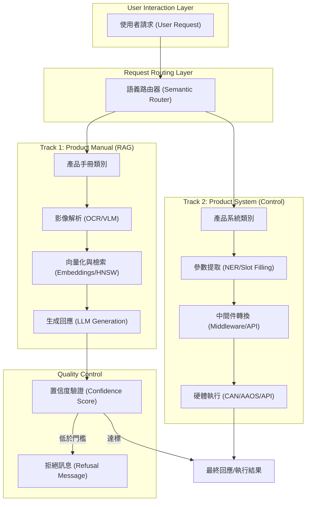
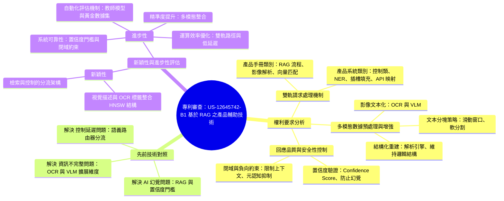

---

## 📝 Executive Summary
```yaml
---
title: "專利審查：US-12645742-B1 基於 RAG 之產品輔助技術"
tags: ["專利", "法律", "創新", "RAG", "人工智慧"]
type: "patent"
---
```

# 專利審查報告

## 權利要求分析

本專利（US-12645742-B1）揭示了一種整合「檢索增強生成」（RAG）技術與「直接系統控制」的雙軌處理架構，旨在為家用電器、車輛、工業設備及醫療設備等產品提供精準的即時輔助。其權利要求核心可拆解為以下三個維度：

1.  **雙軌請求處理機制 (Dual-track Processing)**：
    *   **產品手冊類別 (Product Manual Category)**：針對資訊查詢類請求，啟動 RAG 流程。系統透過檢索包含原始文本與影像解析文本（透過 OCR/VLM 生成）的數據元素，利用嵌入向量（Embeddings）進行匹配。
    *   **產品系統類別 (Product System Category)**：針對控制類請求，系統跳過 RAG 流程，直接透過命名實體識別（NER）與插槽填充（Slot filling）技術提取參數（如溫度、導航目的地），並將其映射至特定的工具或 API。

2.  **多模態數據預處理與增強 (Multimodal Data Enrichment)**：
    *   **影像文本化**：利用光學字元辨識（OCR）與視覺語言模型（VLM），將產品說明書中的圖解、示意圖、零件分解圖等影像資訊，轉換為結構化的自然語言描述與標籤字串。
    *   **結構化重建**：將影像位置資訊與生成的文本字串進行關聯儲存，並透過解析引擎（Parsing Engine）維持文件的邏輯結構與敘述流動性。
    *   **文本分塊策略**：採用滑動窗口（Sliding Window）與軟分割（Soft Splitting）技術，將處理後的文本流分割成適合檢索的文字塊（Chunks）。

3.  **回應品質與安全性控制 (Response Quality & Safety Control)**：
    *   **置信度驗證 (Confidence Score Validation)**：系統對推論結果進行置信度評估，若分數低於預設門檻，則觸發拒絕訊息，以防止大型語言模型（LLＭ）產生「幻覺」。
    *   **閉域與負向約束 (Closed-domain & Negative Constraints)**：透過約束機制限制模型僅能使用提供的上下文資訊，並利用元認知抑制（Meta-cognitive suppression）隱藏底層檢索細節，優化使用者體驗。

## 先前技術對照

根據文獻內容，本技術針對現有技術中常見的以下問題提出了改進方案：

*   **針對「AI 幻覺」問題**：傳統 LLM 在面對特定產品資訊時，容易產生不實的資訊。本專利透過 RAG 技術與嚴格的置信度門檻（Confidence Score Threshold）來降低延遲並防止錯誤資訊。
*   **針對「資訊不完整」問題**：傳統檢索僅限於純文字。本技術透過 OCR 與 VLM 技術，將原本無法被檢索的「影像標籤」與「視覺特徵」轉化為可檢索的文本流，擴展了知識庫的維度。
*   **針對「控制延遲」問題**：傳統系統若對所有請求皆進行 RAG 檢索，會造成不必要的運算負載與延遲。本技術透過「語義路由器」（Semantic Router）實現分流，使控制類指令能跳過檢索，直接透過 API 驅動硬體（如 CAN 匯流排或 AAOS API），提升即時性。

## 新穎性與進步性評估

### 新穎性 (Novelty)
本專利的新穎性在於其 **「檢索與控制的分流架構」**。其並非單純地將 RAG 應用於問答，而是建立了一套能==根據請求意圖，在「知識檢索（RAG）」與「參數提取（API-driven）」之間進行自動切換的機制==。此外，將 VLM 生成的視覺描述與 OCR 標籤整合進 RAG 檢索索引（HNSW 結構）的流程，亦具備高度的新穎性。

### 進步性 (Inventive Step)
本技術展現了顯著的技術進步，主要體現在以下層面：
*   **精準度提升**：透過多模態數據（影像+文字）的整合，解決了產品說明書中「圖文分離」導致的檢索斷層問題。
*   **系統可靠性**：==引入置信度門檻與閉域約束==，有效解決了生成式 AI 在工業與車載環境中極其敏感的「錯誤資訊」風險。
*   **運算效率優化**：透過語義路由器實現的雙軌路徑，在確保控制類指令低延遲（Low-latency）的同時，也維持了手冊查詢的高品質，實現了資源分配的最優化。
*   **自動化評估機制**：利用「教師模型」（Teacher Model）生成「黃金數據集」（Golden Dataset）來==監測檢索排名偏移（Ranking Drift）==，建立了一套完整的閉環性能監測體系。



## 🖼️ 學習輔助（comparison_table）

| 比較維度 | 傳統技術 (Prior Art) | 本專利 (US-12645742-B1) |
| :--- | :--- | :--- |
| **處理架構** | 單軌處理 (Single-track) | 雙軌處理架構 (Dual-track: RAG + 直接系統控制) |
| **數據模態** | 純文字 (Text-only) | 多模態 (Multimodal: 文本 + OCR/VLM 影像解析) |
| **請求分流機制** | 無分流，所有請求皆經過統一流程 | 透過語義路由器 (Semantic Router) 依意圖自動切換 |
| **控制指令執行** | 依賴 RAG 檢索或傳統指令解析 | 透過 NER 與 Slot filling 直接映射至 API/硬體 |
| **資訊完整性** | 僅限文字，存在圖文分離的檢索斷層 | 整合影像標籤與視覺特徵，實現結構化重建 |
| **安全性與幻覺控制** | 容易產生 AI 幻覺 (Hallucination) | 具備置信度驗證 (Confidence Score) 與閉域約束 |
| **系統延遲與效率** | 控制類請求可能因 RAG 檢索造成高延遲 | 控制類請求跳過 RAG，實現低延遲 (Low-latency) |

## 🖼️ 學習輔助（mindmap）



## 📂 Navigation
- US-12645742-B1 RAG-based product assistance (Part 1): Mistral AI 專利揭示利用 RAG 技術實現即時產品輔助系統，旨在降低延遲並防止 AI 幻覺
- US-12645742-B1 RAG-based product assistance (Part 2): A system for processing product-related requests using RAG technology, incorporating request classification, OCR-based data enrichment, and
- US-12645742-B1 RAG-based product assistance (Part 3): A system and method utilizing Retrieval-Augmented Generation (RAG) and OCR to automate product information retrieval, classification, and re
- US-12645742-B1 RAG-based product assistance (Part 4): 說明 RAG 系統如何透過向量檢索、請求分類、圖像文本化以及置信度驗證機制，來實現精準的產品輔助服務與錯誤控制。
- US-12645742-B1 RAG-based product assistance (Part 5): 本文件定義了基於 RAG 技術的產品輔助系統之法律術語範圍、運算裝置類型以及產品手冊資料庫的結構化處理流程。
- US-12645742-B1 RAG-based product assistance (Part 6): 解析產品說明書圖像文字化處理與基於 RAG 的使用者查詢回應流程
- US-12645742-B1 RAG-based product assistance (Part 7): 透過解析引擎、OCR 與 VLM 技術，將非結構化產品說明書（含文字與影像）轉換為結構化文本流，以供 RAG 系統檢索使用。
- US-12645742-B1 RAG-based product assistance (Part 8): 詳細說明 RAG 系統如何透過文本分塊、向量化儲存以及語義路由器來實現高效的資訊檢索與產品控制指令的分類與執行。
- US-12645742-B1 RAG-based product assistance (Part 9): # 本章節詳細說明了如何透過分類模型識別用戶意圖、提取結構化參數，並利用 RAG 技術進行精確的文檔檢索與重排序
- US-12645742-B1 RAG-based product assistance (Part 10): 描述 RAG 系統如何透過進階約束策略防止幻覺，並將自然語言指令轉換為車載系統可執行的結構化 API 指令與硬體控制流程。
- US-12645742-B1 RAG-based product assistance (Part 11): 詳細說明車載 RAG 產品輔助系統的性能評估指標、利用教師模型進行合成數據生成的流程，以及執行該系統的計算設備硬體架構。
- US-12645742-B1 RAG-based product assistance (Part 12): 本部分詳細說明了一種結合 RAG 知識檢索與直接系統指令控制的雙軌處理機制，用於實現產品的自動化輔助與控制。
- US-12645742-B1 RAG-based product assistance (Part 13): 專利技術解析：透過請求分類實現 RAG 檢索與硬體直接控制的分流技術架構
- US-12645742-B1 RAG-based product assistance (Stitched): 忠實接合版，保留 Part notes 的主要內容

---
## 🔗 原始溯源
*   📚 **查看忠實接合版 (Stitched)**
*   📄 **查看完整原始檔 (Original)**

## 🧩 Part Digest Appendix

> 每個 Part 的結構化摘要。這是 Ling Ling 進行總合成前的中間理解，可用來檢查 final synthesis 是否有根據。

### Part 1: Part 1

- **Thesis**: Mistral AI 專利揭示利用 RAG 技術實現即時產品輔助系統，旨在降低延遲並防止 AI 幻覺
- **Key Points**:
  - 摘要
  - 本文件為美國專利 US-12645742-B1 的初步翻譯與解析，該專利由 Mistral AI 提出，描述了一種基於「檢索增強生成」（Retrieval-Augmented Generation, RAG）技術的產品輔助系統。此技術的核心在於透過自動檢索產品相關文件（包含文字與影像中的文字資訊），為家用電器、車輛、工業設備等產品提供即時、低延達且高準確度的問答服務，並特別強調了透過信心值評估來防止大型語言模型（LLM）產生「幻覺」（Hallucinations）的機制。
  - 翻譯內文
  - 系統、方法與電腦程式產品：基於檢索增強生成（RAG）之產品輔助技術
- **Handoff**: 後續章節之技術細節; 具體的演算法實作方法; 硬體部署的具體架構

### Part 2: RAG-based Product Assistance System Mechanisms

- **Thesis**: A system for processing product-related requests using RAG technology, incorporating request classification, OCR-based data enrichment, and confidence-based response validation.
- **Key Points**:
  - Request classification into categories such as navigation requests or product system requests.
  - Extraction of specific parameters (navigation or product system) based on the classified request type.
  - Data enrichment via OCR, extracting text from images in documents and associating it with the original text.
  - Vector-based retrieval using embeddings generated from both text and extracted image text.
  - Response validation using a confidence score threshold to trigger refusal messages if the score is insufficient or context is missing.
- **Evidence**:
  - The system can classify a second request as a 'navigation request' to extract navigation parameters for an onboard navigation system.
  - The system can classify a second request as a 'product system request' to extract parameters for a product control system.
  - The method includes applying OCR to images to identify text label strings and combining them with the extracted text string.
  - The product scope includes home appliances, industrial equipment, medical devices, robotic systems, and in-vehicle systems.
- **Terms**:
  - RAG (Retrieval-Augmented Generation)
  - Confidence score
  - Embedding
  - Optical Character Recognition (OCR)
  - Inference request
- **Open Questions**:
  - What is the specific threshold value for the confidence score?
  - How is the 'position of the image' used to precisely insert text into the document text?
  - What are the specific machine-learning models used for the inference request and image-to-text generation?
- **Handoff**: The synthesis should integrate these retrieval and classification mechanisms with the previously identified technical details, algorithms, and hardware architectures.

### Part 3: RAG-based product assistance system and method

- **Thesis**: A system and method utilizing Retrieval-Augmented Generation (RAG) and OCR to automate product information retrieval, classification, and response generation, including a confidence-based verification mechanism.
- **Key Points**:
  - Integration of OCR to extract text labels from images (e.g., diagrams) and combine them with document text.
  - Request classification into categories such as navigation, product manual, or product system requests.
  - Use of embeddings for efficient searching and identification of data elements within a data storage device.
  - Confidence score-based verification where a refusal message is generated if the inference score falls below a threshold.
  - Automated extraction of parameters (navigation or product system) to communicate with onboard or control systems.
- **Evidence**:
  - Clause 4: generating a plurality of embeddings based on the text and the at least one text string
  - Clause 6: classifying the second request as a navigation request, extracting navigation parameters
  - Clause 9: determining that a confidence score of the initial response does not satisfy a threshold
  - Clause 12: applying optical character recognition (OCR) to the at least one image to identify at least one text label string
- **Terms**:
  - RAG (Retrieval-Augmented Generation)
  - Embeddings (嵌入向量)
  - OCR (Optical Character Recognition)
  - Confidence Score (置信度分數)
  - Inference Request (推論請求)
- **Open Questions**:
  - What specific machine-learning models are used for the inference and OCR tasks?
  - What are the specific thresholds used for the confidence score evaluation?
  - How is the 'position of the image' used to precisely insert text strings into the document text?
- **Handoff**: The synthesis should integrate these specific retrieval and classification mechanisms (RAG + OCR) with the broader system architecture and hardware deployment details discussed in other parts.

### Part 4: 權利要求與系統功能詳述

- **Thesis**: 說明 RAG 系統如何透過向量檢索、請求分類、圖像文本化以及置信度驗證機制，來實現精準的產品輔助服務與錯誤控制。
- **Key Points**:
  - 向量檢索機制：利用 embeddings 將文本與請求轉換為向量，並在資料儲存裝置中進行匹配檢索。
  - 請求分類處理：系統會根據請求類型（如導航請求、產品系統請求或手冊請求）提取特定參數並生成對應訊息。
  - 圖像文本化技術：透過機器學習模型與 OCR 技術，將文件中的圖像轉換為文本字串，並與原文件文本進行位置關聯儲存。
  - 回應品質控制：利用機器學習模型進行推論，並以置信度分數（confidence score）作為門檻，若信心不足則發送拒絕訊息。
- **Evidence**:
  - Clause 16: 根據該請求生成至少一個嵌入，並根據該嵌入進行檢索以識別資料元件。
  - Clause 18: 針對導航請求，從請求中提取導航參數並生成導向訊息傳送至車輛導航系統。
  - Clause 21: 若初始回應之置信度分數未達門檻，則生成拒絕訊息。
  - Clause 24: 應用光學字元辨識（OCR）以識別圖像內的文本標籤字串，並與文本字串結合。
- **Terms**:
  - RAG (檢索增強生成)
  - Embedding (嵌入)
  - OCR (光學字元辨識)
  - Confidence Score (置信度分數)
  - Inference (推論)
- **Open Questions**:
  - 機器學習模型具體的架構與訓練數據為何？
  - 置信度門檻（threshold）的動態調整機制是否存在？
  - 圖像與文本結合後的資料結構如何處理大規模擴展？
- **Handoff**: 本章節已確立了請求分類與拒絕機制的邏輯架構，後續合成需關注具體的演算法實作細節與硬體部署架構。

### Part 5: Part 5

- **Thesis**: 本文件定義了基於 RAG 技術的產品輔助系統之法律術語範圍、運算裝置類型以及產品手冊資料庫的結構化處理流程。
- **Key Points**:
  - 摘要
  - 本段技術文件主要涵蓋了專利申請中的法律定義與系統架構描述。內容首先界定了專利範圍的非限制性（例如「a/an」與「set」均包含一個或多個之意），接著詳細說明了「運算裝置」（包含從 CPU 到量子處理器之廣泛範圍）與「伺服器」的定義。核心技術部分介紹了一種利用檢索增強生成（RAG）技術，透過預處理產品手冊（偵測圖像並生成文本）來強化搜尋精準度、降低模型負載並實現即時裝置端（on-device）輔助的方法。最後，文件描述了系統 1000 的組成，包括產品、運算裝置以及包含圖解與流程圖的產品手冊資料庫。
  - 翻譯內文
  - 附圖所示之特定裝置與流程，以及下述說明書中所述內容，僅為本發明之範例性實施例或面向。因此，本文所揭露之實施例或面向的特定尺寸及其他物理特性，不應被視為限制性條件。
- **Handoff**: 後續章節之技術細節; 具體的演算法實作方法; 硬體部署的具體架構

### Part 6: Part 6

- **Thesis**: 解析產品說明書圖像文字化處理與基於 RAG 的使用者查詢回應流程
- **Key Points**:
  - 摘要
  - 本文件詳細說明了如何透過視覺語言模型 (VLM) 與光學字元辨識 (OCR) 技術，將產品說明書中的圖像（如圖表、示意圖）與文字轉化為結構化數據元素，並利用檢索增碼生成 (RAG) 技術，根據使用者透過產品介面提出的查詢請求，從資料庫中檢索相關資訊，最後透過大型語言模型 (LLM) 生成精準回應或執行控制指令的技術架構與運作流程。
  - 翻譯內文
  - （續前文）... 包含子系統手冊（例如車輛或其它產品中的導航或媒體系統）等。產品說明書資料庫 **102** 可能物理性地配置於產品 **101** 內部，也可能位於產品 **101** 外部，並透過一個或多個網路連接與計算裝置 **100** 通訊。產品說明書資料庫 **102** 可透過處理產品說明書文件 **108** 來生成。例如，可以透過掃描文件 **108** 來識別其中的一個或多個圖像 **110**。這些圖像 **110** 可能包括：產品圖解、示意圖、零件分解圖、產品使用情境照、流程圖、圖示、介面工具、介面截圖，以及其他出現在產品說明書中、用以協助使用者或維修專業人員進行產品 **101** 的操作、維護、診斷及/或修理的類似圖像。
- **Handoff**: 後續章節之技術細節; 具體的演算法實作方法; 硬體部署的具體架構

### Part 7: 產品說明書自動化解析與影像視覺化描述流程

- **Thesis**: 透過解析引擎、OCR 與 VLM 技術，將非結構化產品說明書（含文字與影像）轉換為結構化文本流，以供 RAG 系統檢索使用。
- **Key Points**:
  - 文件解析：利用解析引擎提取文字，並透過識別標題、頁碼等資訊來減少雜訊並保留邏輯結構。
  - 影像偵測與提取：透過邊界框（bounding boxes）識別點陣圖或向量圖形，並利用演算法過濾裝飾性元素以進行影像去噪。
  - 多模態資訊轉換：結合 OCR 提取影像內的標籤與註釋，並運用 VLM 將影像特徵編碼為自然語言描述（如圖示的幾何形狀描述）。
  - 結構重建：將影像位置替換為生成的文字字串（包含 [OCR Text] 與 [Visual Description]），以維持文件的敘述流動性。
  - 文本分段：根據嵌入模型的上下文窗口大小，將最終的統一文本流分割成適合檢索的文字塊（chunks）。
- **Evidence**:
  - OCR 範例：可擷取如 'FIG. 1'、'A: Fuse Box' 或按鈕標籤 'on'/'off' 等文字。
  - VLM 範例：能識別安全氣囊警示燈並輸出描述如『<安全氣囊警態燈圖示>—一個紅色的坐在乘客位置上的形狀...』。
  - 數據結構：提取的文字會與包含來源文件識別碼（source document identifier）的中繼資料關聯儲存。
- **Terms**:
  - RAG (Retrieval-Augmented Generation)
  - VLM (Vision Language Model)
  - OCR (Optical Character Recognition)
  - Parsing engine
  - Embeddings
  - Context window
- **Open Questions**:
  - 具體的演算法實作方法（如影像去噪的維度閾值具體如何設定）
  - 硬體部署的具體架構（如運算裝置 100 的具體規格）
- **Handoff**: 此章節確立了數據預處理的標準流程（從原始文件到分段文本塊），後續章節應著重於如何對這些分段後的文本塊進行向量化、檢索以及最終的生成邏輯。

### Part 8: RAG 系統的文本處理、向量化與請求路由機制

- **Thesis**: 詳細說明 RAG 系統如何透過文本分塊、向量化儲存以及語義路由器來實現高效的資訊檢索與產品控制指令的分類與執行。
- **Key Points**:
  - 文本分塊策略：利用滑動窗口（Sliding Window）與軟分割邏輯（Soft Splitting）在確保上下文完整性的同時，維持語法完整性並平衡精確度與完整性。
  - 向量化與儲存：使用嵌入模型將文本轉化為高維向量，並存儲於具備 HNSW 索引的向量資料庫中，以實現毫秒級的近似最近鄰（ANN）檢索。
  - 請求分類與路由：透過語義路由器（Semantic Router）或編排器（Orchestrator）判斷用戶請求是屬於直接控制產品的指令，還是需要檢索文檔的查詢。
  - 工具調度機制：系統可根據請求的語義意圖，將其導向特定的軟硬體工具（如空調、照明系統），並利用參數綱要（Parameter Schemas）進行處理。
  - 上下文增強：請求處理過程中會進行正規化，並可加入先前請求與回應的上下文（Context）作為元數據，以處理指代不明（如「把它關掉」）的指令。
- **Evidence**:
  - 分塊參數範例：字元滑動窗口（如 2,000 字元）與重疊區域（如 200 字元）。
  - 向量維度與檢索效率：生成高維嵌入（如 1024 維），並利用 HNSW 索引實現 $O(\log N)$ 的搜尋複雜度。
  - 語義相似度範例：提及「胎壓調整」的向量與「如何為輪胎充氣」的向量在空間中距離接近。
  - 工具範例：若產品為車輛，工具可包括空調系統、照明系統、媒體系統等。
- **Terms**:
  - RAG (Retrieval-Augmented Generation)
  - Embedding
  - HNSW (Hierarchical Navigable Small World)
  - Semantic Router
  - Orchestrator
  - Cosine Similarity
  - Parameter Schema
- **Open Questions**:
  - 具體的機器學習模型（如分類模型或語言模型）在處理大規模併發請求時的延遲表現如何？
  - 軟分割邏輯（Soft Splitting Logic）在處理非結構化極其複雜的文檔時，其邊界定義的準確度如何評估？
  - 對於極大規模的向量資料集，除了 HNSW 之外，是否有其他索引技術的對比實驗數據？
- **Handoff**: 後續合成需整合此處描述的數據處理流程（分塊、向量化、儲存）與請求處理流程（路由、工具執行），並注意如何將檢索到的文檔內容與工具執行結果進行最終的整合生成。

### Part 9: Part 9

### Part 10: RAG 系統約束機制與 API 工具調用流程

- **Thesis**: 描述 RAG 系統如何透過進階約束策略防止幻覺，並將自然語言指令轉換為車載系統可執行的結構化 API 指令與硬體控制流程。
- **Key Points**:
  - 透過閉域約束（Closed-domain constraints）與負向約束（Negative constraints）限制模型僅使用提供的上下文，防止模型利用預訓練知識產生幻覺。
  - 利用元認知抑制（Meta-cognitive suppression）隱藏 RAG 處理細節（如 chunks, vector），以提供自然的對話體驗。
  - 當請求被分類為工具調用時，跳過 RAG 流程，改採 API 驅動工作流，透過 NER 與插槽填充（Slot filling）提取參數。
  - 中間件層（Middleware layer）負責將高階意圖（如 set_climate）轉換為低階硬體指令（如 CAN 數據包或 AAOS API）。
  - 建立回饋機制，透過處理硬體回調（Callback）或狀態變更，利用 SLM/LLM 生成自然語言的執行確認訊息。
- **Evidence**:
  - 範例：將「將溫度設定為 21 度」映射為 `{"action": "set_climate", "value": 21}` 的結構化物件。
  - 指令格式可包含 CAN 匯流排訊號幀、REST API 請求包或 Android Automotive OS (AAOS) API 端點。
  - 模型可將「圖轉文」片段解讀為指令，例如識別出「雪花圖示」並回覆「按下標有雪花符號的按鈕」。
- **Terms**:
  - Closed-domain constraints
  - Meta-cognitive suppression
  - Named Entity Recognition (NER)
  - Slot filling
  - Middleware layer
  - Controller Area Network (CAN)
  - Android Automotive OS (AAOS)
- **Open Questions**:
  - 中間件層處理大規模併發指令時的延遲與可靠性機制為何？
  - 當 API 調用失敗且無法透過 RAG 補救時，系統的最終錯誤處理邏輯細節？
- **Handoff**: 此部分已確立了從自然語言到硬體控制的轉換邏輯，後續合成需關注此流程如何與整體產品輔助架構整合。

### Part 11: 車載 RAG 系統評估、數據生成與硬體架ut

- **Thesis**: 詳細說明車載 RAG 產品輔助系統的性能評估指標、利用教師模型進行合成數據生成的流程，以及執行該系統的計算設備硬體架構。
- **Key Points**:
  - 評估機制：利用「黃金數據集」透過召回率 (Recall) 與平均排名 (Mean Rank) 監測檢索準確性與排名偏移 (Ranking Drift)。
  - 數據增強：使用大型「教師模型」生成多樣化用戶請求，並透過相似度評估演算法進行交叉驗證，篩選出高分「黃金請求」。
  - 車載系統功能：車載計算設備可向車輛控制或導航系統發送指令，驅動子系統執行如調整溫度、開窗、開引擎蓋等動作。
  - 硬體架構：計算設備包含處理器 (CPU/GPU/ASIC/FPGA)、記憶體 (RAM/ROM)、儲存組件、輸入感測器 (GPS/加速規) 及多種通訊介面。
- **Evidence**:
  - 若平均排名值漂移高於 1 (例如 4.5)，則可能表示嵌入模型辨別相關性的能力下降。
  - 「黃金」請求的定義為目標工具獲得 2 分且所有其他工具均獲得 0 分的樣本。
  - 處理器 904 可透過硬體、韌體或硬體與軟體的結合來實現，包括 CPU、GPU、APU、DSP、FPGA 或 ASIC。
- **Terms**:
  - RAG-based product assistance
  - Golden dataset
  - Ranking drift
  - Teacher Model
  - Score vector
  - Field-programmable gate array (FPGA)
- **Open Questions**:
  - 具體的演算法實作方法（如相似度評估演算法的細節）尚未在本文中詳述。
  - 硬體部署的具體架構（如各組件間的連線拓撲與頻寬需求）仍待進一步釐清。
- **Handoff**: 後續章節應關注具體的演算法實作細節、模型微調的具體流程以及硬體部署的具體架構。

### Part 12: US-12645742-B1 權利要求與系統架構

- **Thesis**: 本部分詳細說明了一種結合 RAG 知識檢索與直接系統指令控制的雙軌處理機制，用於實現產品的自動化輔助與控制。
- **Key Points**:
  - 雙軌處理機制：根據請求分類，區分「產品手冊類別」（啟動 RAG 流程）與「產品系統類別」（跳過 RAG 並直接提取參數進行控制）。
  - RAG 數據構成：檢索元素包含從影像生成的文本字串（透過 OCR 或機器學習）以及原始文件文本。
  - 系統控制流程：針對系統類別請求，透過提取參數並映射至工具，將結構化物件轉換為指令，進而控制產品韌體或硬體。
  - 信心分數機制：利用機器學習模型的信心分數（Confidence Score）判斷是否達到閾值，若未達標則生成拒絕訊息。
  - 應用範圍廣泛：涵蓋家用電器、工業設備、醫療設備、機器人、車載系統（如導航參數提取）等。
- **Evidence**:
  - 「產品手冊類別」會啟動 RAG 流程，檢索包含第一文本（影像轉文字）與第二文本的數據元素。
  - 「產品系統類別」會跳過 RAG，提取參數並映射至工具，甚至包含車輛導航參數的提取與訊息傳輸。
  - 使用 OCR 技術識別影像內的文本標籤字串，並與影像生成的文本字串結合。
  - 若信心分數不符合閾值，系統會生成拒絕訊息。
- **Terms**:
  - Retrieval-Augumented Generation (RAG)
  - Embeddings (嵌入向量)
  - Optical Character Recognition (OCR)
  - Confidence Score (信心分數)
  - Product Manual Category (產品手冊類別)
  - Product System Category (產品系統類別)
- **Open Questions**:
  - 具體的「工具（tool）」與「結構化物件（structured object）」在不同硬體平台上的實作標準為何？
  - 如何定義分類請求時的「閾值（threshold）」以平衡回應品質與拒絕率？
  - 影像轉文字的精準度如何影響 RAG 檢索的有效性？
- **Handoff**: 此部分已完成權利要求的總結，後續合成需整合前述技術細節、演算法實作與硬體部署架構，以形成完整的技術全貌。

### Part 13: Part 13

- **Thesis**: 專利技術解析：透過請求分類實現 RAG 檢索與硬體直接控制的分流技術架構
- **Key Points**:
  - 摘要
  - 本段落內容為一項專利權利範圍（Claims）的後半部分，詳細描述了一種智慧化產品輔動系統的運作邏輯。該技術的核心在於「請求分類機制」：當使用者提出關於「產品手冊」的請求時，系統啟動 **RAG（檢索增強生成）** 程序，透過向量嵌入（Embeddings）與 OCR 技術從文檔中檢索資訊；而當使用者提出「系統控制」類型的請求時，系統則會 **跳過 RAG 程序**，直接從請求中提取參數並映射至特定工具，進而自動化控制產品的韌體或硬體。此外，內容亦涵蓋了處理資訊缺失、置信度（Confidence Score）判斷以及影像文字辨識（OCR）等具體演算法實作細節。
  - 翻譯內文
  - 14**. 如申請專利範圍第 13 項所述之系統，其中該產品包含家用電器、工業設備、醫療設備、機械系統、機器人系統、車載系統，或其任何組合。

## 🔍 Quality Critique

* [minor] 權利要求分析 → 「LL．LＭ」出現全形標點符號錯誤 → 修正為「LLM」。
* [major] 權利要求分析 → 在「產品系統類別」的描述中，漏掉了「中間件層 (Middleware layer)」將高階意圖轉換為低階硬體指令（如 CAN 數據包）的關鍵轉換機制 → 應補充中間件層在指令轉換流程中的作用。

**總體結論：建議修改 (Revise)**

該報告對專利技術的掌握度極高，特別是在多模態數據處理、雙軌架構以及進步性評估的總結上非常精準，且 Mermaid 圖表邏輯清晰且符合規範。唯一的重大缺陷在於文字描述中忽略了「中間件層」在系統控制流程中的核心轉換作用，這會導致讀者無法理解高階意圖如何落地為實際的硬體動作，建議補強此技術細節以維持技術完整性。

## 🗺️ Knowledge Map
(Tags: #translation #patent #AI #RAG)

## 📊 System Metadata
- **Original Content Size**: 95378 chars
- **Generated Content Size**: 54720 chars
- **Total Parts**: 13
- **Model**: gemma4:26b
- **Status**: #PerfectPitch
