> 忠實接合版：保留各 Part note 的主要內容，移除每篇的 navigation、metadata 與 digest appendix。這份文件偏向完整閱讀，不等同於洞察型 Synthesis。

## 🔗 Navigation
- 查看洞察總結 (Synthesis)
- 查看完整原始檔 (Original)

---

## Part 1

Source note: V-JEPA 2 Self-Supervised Video Models Enable Understanding, Prediction and Planning (Part 1)

Original range: lines 1-35
Original chars: 0-8573

<!-- source: V-JEPA 2 Self-Supervised Video Models Enable Understanding, Prediction and Planning (Part 1).md -->

### 透過結合大規模網路影片的自我監督預訓練與少量機器人互動數據的後訓練，開發出具備理解、預測與規劃能力的視覺世界模型。

#### 摘要

本報告針對論文《V-JEPA 2：自我監督影片模型實現理解、預測與規劃》的第一部分進行翻譯與解析。該研究介紹了一種名為 V-JEPA 2 的新型人工智慧架構，其核心在於透過大規模的網路影片數據進行「自我監督學習」，使模型能夠在無需大量人工標註的情況下，學習理解物理世界的動態、預測未來狀態，並最終應用於機器人的規劃任務。研究重點在於如何結合大規模的觀測數據（影片）與小規模的互動數據（機器人軌跡），以實現具備高度泛化能力的「世界模型」。

#### 預覽譯文

##### 標題
**V-JEPA 2：自我監督影片模型實現理解、預測與規劃**

##### 摘要
現代人工智慧面臨的一個重大挑戰，是如何透過觀察來學習理解世界並學習行動。本文探索了一種自我監督的方法，將網路規模的影片數據與少量的互動數據（機器人軌跡）相結合，以開發出能夠在物理世界中進行理解、預測與規劃的模型。

我們首先在包含超過 100 萬小時網路影片的影像與影片數據集上，預訓練了一個不含動作指令的聯合嵌入預測架構（Action-free joint-embedding-predictive architecture）——V-JEPA 2。V-JEPA 2 在運動理解方面取得了強大的性能（在 Something-Something v2 達到 77.3% 的 top-1 準確率），並在人類動作預測方面達到了尖端水準（在 Epic-Kitchens-100 達到 39.7% 的 recall-at-5），超越了以往的特定任務模型。此外，在將 V-JEPA 2 與大型語言模型（LLM）對齊後，我們展示了其在多項影片問答任務中具備尖端性能（例如在 PerceptionTest 達到 84.0，在 TempCompass 達到 76.9），其參數規模達 80 億。

最後，我們展示了如何透過使用來自 Droid 數據集、少於 62 小時的無標籤機器人影片進行後訓練，將潛在動作條件化世界模型（V-JEPA 2-AC）應用於機器人規劃任務。我們在兩個不同的實驗室中，將 V-JEPA 2-AC 以「零樣本」（zero-shot）的方式部署於 Franka 機械臂上，並透過以影像為目標的規劃，實現了物體的抓取與放置。值得注意的是，這是在完全沒有收集這些環境中的機器人數據，且沒有任何特定任務訓練或獎勵函數的情況下實現的。==這項工作證明了透過網路規模的數據與少量機器人互動數據進行自我監督學習，可以產生一個能夠在物理世界中進行規劃的世界模型。==

##### 1. 引言
人類在面對新任務與陌生環境時，具有適應與泛化的能力。多種認知學習理論指出，人類透過整合低階感官輸入來代表並預測未來狀態，從而建立內在的世界模型；這些理論進一步假設，這種世界模型形塑了我們在任何特定時刻的感知，並在理解現實方面發揮關鍵作用。此外，預測自身行為對世界未來狀態影響的能力，對於目標導向的規劃也至關重要。建立能夠從影片等感官數據中學習世界模型的智慧代理人（Artificial agents），可以使它們能夠「理解」物理世界、「預算」未來狀態，並像人類一樣在新的情境中進行有效的「規劃」，從而開發出能夠應對未遇過任務的系統。

（圖 1 說明：V-JEPA 2 概覽。利用 100 萬小時的網路規模影片與 100 萬張影像，我們使用視覺遮罩去噪目標預訓練 V-JEPA 2 影片模型，並透過與 LLM 主幹對齊，將此模型應用於動作分類、物體識別、動作預測及影片問答等下游任務。預訓練後，我們還可以凍結影片編碼器，並利用學到的表示法，在少量的機器人互動數據上訓練新的動作條件化預測器，並利用此動作條件化模型 V-JEPA 2-AC，透過模型預測控制迴路中的規劃，來執行下游的機器人操控任務。）

以往的研究探索了從包含「狀態-動作序列」的互動數據中開發預測性世界模型的方法，但通常也依賴於來自環境的顯式獎勵回饋來推斷目標。然而，現實世界互動數據的有限性限制了這些方法的可擴展性。為了克服此限制，近期的研究嘗試利用網路規模的影片與互動數據來訓練用於機器人控制的動作條件化影片生成模型，但在使用基於模型的控制進行機器人執行方面，成果仍相當有限。特別是這類研究往往強調預測的忠實度與視覺品質，而非規劃能力，這可能是因為透過生成影片來進行規劃的計算成本過高。

在本文中，我們基於「自我監督假設」來構建世界模型，旨在從觀察中大量獲取世界的背景知識。具體而言，我們利用了聯合嵌入預決策架構（JEPA），該架構透過在學習到的表示空間中進行預測來進行學習。與專注於完全從互動數據中學習的方法不同，自我監督學習使我們能夠利用網路規模的影片（這些影片描述了狀態序列，但沒有直接觀察到動作指令）來學習如何表示影片觀測，並在該表示空間中學習世界動力學的預測模型。此外，與基於影片生成的做法相比，JEPA 方法專注於學習場景中「可預測」方面的表示（例如物體運動的軌跡），同時忽略生成式目標所強調的「不可預測」細節（例如田野中每一根草葉或樹上每一片葉子的精確位置），因為後者需要進行像素級的預測。透過擴展 JEPA 的預訓練規模，我們證明了它能產生具備尖端理解與預測能力的影片表示，且這些表示可以作為動作條件化預測模型的基礎，並實現零樣本規劃。

我們的方案 V-JEPA 2 採用階段式訓練程序：首先在網路規模的影片上進行「無動作指令」的預訓練，隨後使用少量的互動數據進行後訓練。在第一階段，我們使用遮罩去噪特徵預測目標，模型在學習到的表示空間中預測影片的遮蔽片段。我們使用高達 10 億參數的 V-JE器進行訓練，並使用了超過 100 萬小時的影片。我們的實驗證實，擴展自我監督影片預訓練能增強編碼器的視覺理解能力，包括廣泛的運動與外觀識別能力。

在網路規模影片預訓練之後，我們利用第一階段學到的表示法，在少量的互動數據集上訓練動作條件化世界模型 V-JEPA 2-AC。我們的動作條件化世界模型是一個擁有 3 億參數的 Transformer 網絡，採用塊因果注意力機制（block-causal attention mechanism），能夠根據動作與先前狀態，自回歸地預測下一幀影片的表示。僅使用來自 Droid 數據集、少於 62 小時的無標籤互動數據，我們證明了訓練潛在世界模型的可行性；該模型在給定子目標的情況下，可用於在 Franka 機械臂上規劃動作，並透過單目 RGB 相機在全新環境中執行抓取操作任務。

#### 詞彙與關鍵術語

| 英文術語 | 繁體中文翻譯 | 說明 |
| :--- | :--- | :--- |
| Self-Supervised Learning (SSL) | 自我監督學習 | 無需人工標籤，利用數據本身結構進行學習的技術。 |
| Joint-Embedding Predictive Architecture (JEPA) | 聯合嵌入預算架構 | 一種在特徵空間（而非像素空間）進行預測的架構，旨在減少計算冗餘。 |
| Action-free | 無動作指令 / 不含動作 | 指預訓練階段僅觀察影片，不包含動作標籤或指令。 |
| Action-conditioned | 動作條件化 | 指模型在預測時，將「動作」作為輸入條件之一。 |
| World Model | 世界模型 | 用於模擬環境動態、預測未來狀態的內部模型。 |
| Zero-shot | 零樣本 | 模型在未經特定任務訓練的情況下，直接執行新任務的能力。 |
| Latent space | 潛在空間 / 隱含空間 | 數據經過編碼後，高度壓縮且具備語義特徵的表示空間。 |
| Mask denoising | 遮罩去噪 | 透過遮蓋部分數據並嘗試還原，來學習數據特徵的訓練方法。 |
| Model Predictive Control (MPC) | 模型預測控制 | 一種利用模型預測未來狀態，並據此優化當前控制動作的技術。 |

#### 文化與語境解析

1.  **「觀察」與「學習」的哲學意義**：
    論文開篇提到人類透過「觀察」來學習，這與傳統機器學習依賴「標籤（Labels）」或「獎勵（Rewards）」的範式不同。這反映了當前 AI 研究正試圖從「模仿學習」轉向更接近生物本能的「預測性學習」。

2.  **JEPA vs. Generative Models (生成式模型)**：
    文中特別強調了 JEPA 與生成式（如 Sora 或其他影片生成模型）的差異。生成式模型試圖重建每一個像素（包括不重要的草葉），這會導致計算資源浪費在「不可預測的雜訊」上；而 JEPA 專注於「可預測的特徵」（如物體移動），這是一種更具效率且更符合物理邏輯的學習策略。

3.  **從「看」到「做」的跨越**：
    ==這篇論文的核心價值在於將「看影片（視覺理解）」與「動機械臂（機器人控制）」這兩個原本分開的領域，透過「世界模型」這個橋樑連接起來。==這代表了 AI 正在從單純的「視覺辨識器」進化為具備「物理常識」的「行動代理人」。

#### 邏輯結構圖

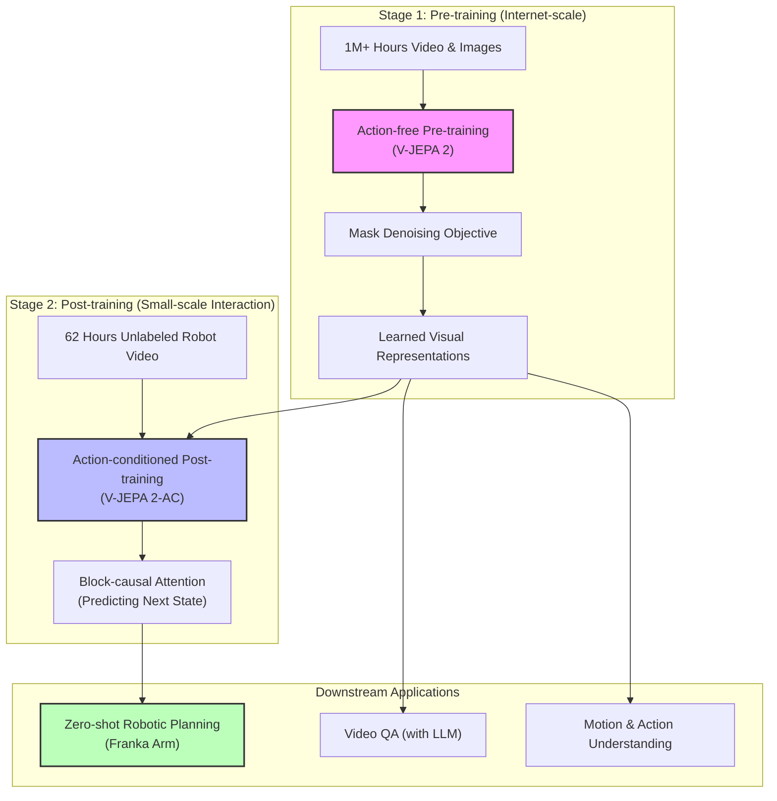
```mermaid
graph TD
    subgraph "Stage 1: Pre-training (Internet-scale)"
        A["1M+ Hours Video & Images"] --> B["Action-free Pre-training<br>(V-JEPA 2)"]
        B --> C["Mask Denoising Objective"]
        C --> D["Learned Visual Representations"]
    end

    subgraph "Stage 2: Post-training (Small-scale Interaction)"
        E["62 Hours Unlabeled Robot Video"] --> F["Action-conditioned Post-training<br>(V-JEPA 2-AC)"]
        D --> F
        F --> G["Block-causal Attention<br>(Predicting Next State)"]
    end

    subgraph "Downstream Applications"
        D --> H["Video QA (with LLM)"]
        D --> I["Motion & Action Understanding"]
        G --> J["Zero-shot Robotic Planning<br>(Franka Arm)"]
    end

    style B fill:#f9f,stroke:#333,stroke-width:2px
    style F fill:#bbf,stroke:#333,stroke-width:2px
    style J fill:#bfb,stroke:#333,stroke-width:2px
```

---

## Part 2

Source note: V-JEPA 2 Self-Supervised Video Models Enable Understanding, Prediction and Planning (Part 2)

Original range: lines 33-68
Original chars: 7551-15767

<!-- source: V-JEPA 2 Self-Supervised Video Models Enable Understanding, Prediction and Planning (Part 2).md -->

### 透過大規模影片自監督預訓練（V-JEPA 2）與少量互動數據的後訓練（V-JEPA 2-AC），構建一個具備理解、預lag 與規劃能力的動作條件化世界模型。

#### 摘要

本文件翻譯了關於 V-JEPA 2 自監督影片模型的研究內容。該研究展示了如何透過大規模網路影片預訓練，結合少量互動數據，建立一個具備「理解」、「預測」與「規劃」能力的「世界模型」（World Model）。重點在於 V-JEPA 2-AC 模型，它能透過動作條件化的方式，在機器人任務（如抓取操作）中展現出強大的零樣本（Zero-shot）遷移能力。

#### 翻譯內文

編碼器（Encoder）具備實現視覺理解的能力，包括廣泛的動作與外觀辨識能力，這已透過探針式評估（Probe-based evaluations）以及將編碼器與語言模型對齊以進行影片問答（Video QA）得到證實。

在完成網路規模（Internet-scale）影片的預訓練後，我們利用第一階段學習到的表示（Representations），在一組小規模的互動數據上訓練一個動作條件化世界模型——V-JEable 2-AC。我們的動作條件化世界模型是一個擁有 3 億個參數的 Transformer 網路，採用了 **塊因果注意力機制（Block-causal attention mechanism）**，能夠在給定動作與先前狀態的條件下，以自回歸（Autoregressive）的方式預測下一影格的表示。僅使用來自 Droid 數據集 62 小時的無標籤互動數據，我們便證明了訓練潛在世界模型的可行性；該模型在給定子目標（Sub-goals）的情況下，能夠被用於 Franka 機器人手臂的動作規劃，並能在新的環境中，僅透過單眼 RGB 相機實現零樣本（Zero-shot）的 **抓取操作（Prehensile manipulation）** 任務。

總結來說，我們展示了從影片中學習的聯合嵌入預測架構（Joint-embedding predictive architectures）可用於構建一個世界模型，使其能夠： **理解** 物理世界、 **預測** 未來狀態，並在新的情境中進行有效的 **規劃**。這是透過利用網路規模的影片與少量的互動數據所實現的。具體而言：

* **理解 — 探針式分類**：擴展自監督影片預訓練，能產生適用於多種任務的影片表示。V-模組 2 在編碼細粒度動作資訊方面表現卓越，在需要動作理解的任務（如 Something-Something v2）中，使用注意力探針（Attentive probe）達到了 $77.3\%$ 的 Top-1 準確率。
* **理解 — 影片問答**：V-JEPA 2 編碼器可用於訓練多模態大型語言模型，以處理影片問答任務。我們觀察到，在多個需要物理世界理解與時間推理的基準測試中（如 MVP、PerceptionTest、TempCompass、TemporalBench 與 TOMATO），其 8B 參數級語言模型表現達到了尖端水準（SOTA）。特別的是，我們證明了即使是在沒有語言監督的情況下預訓練的影片編碼器，也能與語言模型對齊並達到頂尖性能，這打破了傳統的認知。
* **預測**：大規模自監督影片預訓練增強了預測能力。V-JEPA 2 在 Epic-Kitchens-100 人類動作預測任務中，使用注意力探針達到了 $39.7\%$ 的 Recall@5，較之前的最佳模型相對提升了 $44\%$。
* **規劃**：我們證明了透過僅使用 Droid 數據集中 62 小時的無標籤機器人操作數據對 V-JEPA 2 進行後訓練（Post-training）所得到的 V-JEPA 2-AC，可以部署在全新環境中，透過給定子目標的規劃來解決抓取操作任務。在沒有使用實驗室任何額外機器人數據、沒有任何特定任務訓練或獎勵函數的情況下，該模型成功處理了抓取與放置（Grasp and Pick-and-Place）等任務，且能應對全新的物體與環境。

本文其餘章節安排如下：第二節描述 V-JEPA 2 的預訓練流程；第三節介紹如何利用預訓練模型訓練任務無關的動作條件化世界模型 V-JEPA 2-AC；第四節展示如何透過模型化規劃進行機器人控制；第五與第六節進一步探索其在影片理解與預測任務中的性能；第七節展示與語言模型的對齊；第八節討論相關工作，第九節進行總結。

**圖 2：多階段訓練說明。**
（左）首先在網路規模的圖像與影片數據上，使用視覺遮罩去噪（Visual mask denoising）目標預訓練 V-JEPA 2 影片編碼器。影片片段被切分為一系列 Token（塊），並透過丟棄部分 Token 來進行遮罩。編碼器處理遮罩後的序列並輸出嵌入向量。接著，將編碼器輸出與可學習的遮罩 Token 拼接，再由預測器處理。最後使用 L1 損失將預測器輸出回歸至預測目標。預測目標由 EMA 編碼器計算。
（右）預訓練後，凍結影片編碼器，並在已學習的表示之上訓練新的動作條件化預測器 V-JEPA 2-AC。我們採用自回歸特徵預測目標，預測未來影格的表示，條件為過去的影格、動作與末端執行器狀態。該預測器使用塊因果注意力模式，使當前時間步的特徵能關注到當前及先前時間步的特徵、動作與末端執行器狀態。

#### 2 V-JEPA 2：擴展自監督影片預訓練

我們在包含超過 100 萬小時影片的視覺數據集上預訓練 V-JEPA 2。自監督訓練任務基於表示空間中的遮罩去噪，並建立在 V-JEPA 架構之上。本文透過探索更大規模的模型、增加預訓練數據量，以及引入空間與時間漸進式解析度訓練策略，擴展了 V-模組 2 的框架，使其能高效預訓練超越短片段（16 影格）的影片模型。

##### 2.1 方法論

###### 表示空間中的遮碼去噪（Mask-Denoising in Representation Space）

V-JEPA 的目標是從經過遮罩（即隨機丟棄部分塊）的影片視圖 $x$ 中，預測該影片 $y$ 的學習表示。其元架構包含一個提取影片表示的編碼器 $E_{\theta}(\cdot)$，以及一個預測遮罩部分表示的預測器 $P_{\phi}(\cdot)$。編碼器與預測器透過以下目標函數同時進行訓練：

$$
\text{minimize}_{\theta,\phi,\Delta_{y}}\quad\lVert P_{\phi}(\Delta_{y},E_{\theta}(x))-\text{sg}(E_{\overline{\theta}}(y))\rVert_{1}
$$

其中 $\Delta_{y}$ 是指示丟棄塊位置的可學習遮罩 Token。損失函數使用了停止梯度（Stop-gradient）操作 $\text{sg}(\cdot)$ 以及編碼器權重 $\theta$ 的指數移動平均（EMA）$\overline{\theta}$，以防止表示崩潰（Representation collapse）。損失僅應用於遮罩塊的預測結果。

###### 架構（Architecture）

編碼器 $E_{\theta}(\cdot)$ 與預算器 $P_{\phi}(\cdot)$ 皆參數化為 Vision Transformer (ViT)。為了在 Transformer 中編碼相對位置資訊，我們採用了 RoPE（旋轉位置嵌入）而非傳統的絕對正弦餘弦（sincos）位置嵌入。我們對傳統的 1D-RoPE 進行了三維擴展，將特徵維度劃分為三個大致相等的段（分別對應時間、高度與寬度軸），並分別對各軸段應用 1D 旋轉。我們發現使用 3D-RoPE 取代絕對位置嵌入有助於穩定大型模型的訓練。為了處理影片，我們首先將其切分為大小為 $2\times 16\times 16$ ($T\times H\times W$) 的管狀塊（Tubelets），並採用與 V-JEPA 相同的多塊遮罩策略。

#### 詞彙與關鍵術語

| 英文術語 | 繁體中文翻譯 | 說明 |
| :--- | :--- | :--- |
| Self-Supervised Learning | 自監督學習 | 透過數據本身結構進行學習，無需人工標籤。 |
| Action-conditioned predictor | 動作條件化預測器 | 以動作作為輸入條件來預測未來狀態的組件。 |
| Block-causal attention mechanism | 塊因果注意力機制 | 一種特殊的注意力機制，確保資訊流向符合因果邏輯（過去影響未來）。 |
| Prehensile manipulation | 抓取操作 / 鉗夾操作 | 機器人使用末端執行器夾取或操縱物體的動作。 |
| World Model | 世界模型 | 用於模擬物理環境動力學的模型。 |
| Mask Denoising | 遮罩去噪 | 透過重建被遮蓋的部分來學習特徵的訓練任務。 |
| Zero-shot | 零樣本 | 模型在未經特定任務訓練的情況下直接執行任務的能力。 |
| Tubelets | 管狀塊 | 在影片中，將空間塊沿時間軸延伸形成的立體小塊。 |
| 3D-RoPE | 三維旋轉位置嵌入 | 將旋轉位置編碼擴展至時間、高度、寬度三個維度。 |

#### 技術語境解析

1.  **從預訓練到世界模型**：==這篇論文的核心邏輯在於「分階段訓練」。==第一階段（V-JEPA 2）是為了學習「如何看懂世界」（視覺表示），第二階段（V-JEPA 2-AC）則是學習「如何與世界互動」（動作預測）。這種解耦設計讓模型能從海量影片中學習物理規律，再用極少量的機器人數據學會如何控制。
2.  **因果性與預測**：在影片處理中，「因果性」（Causality）至關重要。使用「塊因果注意力機制」是為了確保模型在預測下一影格時，不會「偷看」到未來的資訊，從而模擬真實物理世界中時間流逝的單向性。
3.  **表示空間的去噪**：不同於傳統圖像的像素級去噪，這裡是在「表示空間」（Representation Space）進行去噪。這意味著模型不是在重建像素，而是在重建高層次的語義特徵，這大大降低了計算複雜度並提升了對大規模數據的處理能力。

#### 邏輯流程圖

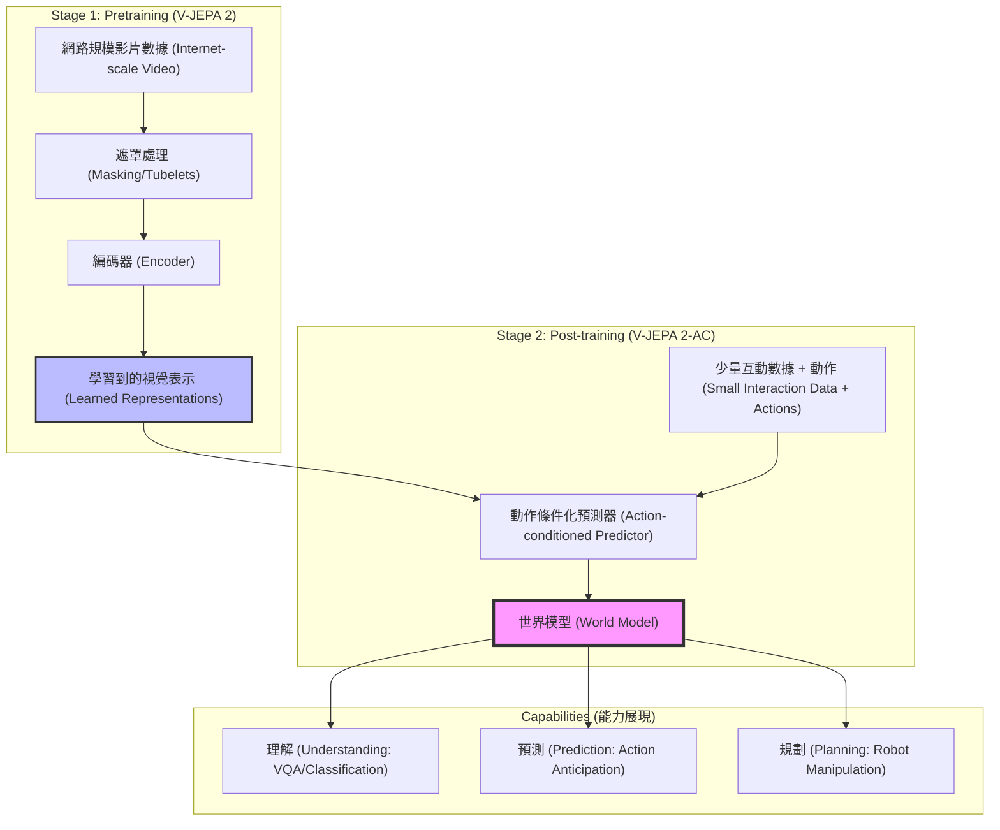
```mermaid
graph TD
    subgraph "Stage 1: Pretraining (V-JEPA 2)"
        A["網路規模影片數據 (Internet-scale Video)"] --> B["遮罩處理 (Masking/Tubelets)"]
        B --> C["編碼器 (Encoder)"]
        C --> D["學習到的視覺表示 (Learned Representations)"]
    end

    subgraph "Stage 2: Post-training (V-JEPA 2-AC)"
        D --> E["動作條件化預測器 (Action-conditioned Predictor)"]
        F["少量互動數據 + 動作 (Small Interaction Data + Actions)"] --> E
        E --> G["世界模型 (World Model)"]
    end

    subgraph "Capabilities (能力展現)"
        G --> H["理解 (Understanding: VQA/Classification)"]
        G --> I["預測 (Prediction: Action Anticipation)"]
        G --> J["規劃 (Planning: Robot Manipulation)"]
    end

    style G fill:#f9f,stroke:#333,stroke-width:4px
    style D fill:#bbf,stroke:#333,stroke-width:2px
```

---

## Part 3

Source note: V-JEPA 2 Self-Supervised Video Models Enable Understanding, Prediction and Planning (Part 3)

Original range: lines 64-121
Original chars: 14745-23948

<!-- source: V-JEPA 2 Self-Supervised Video Models Enable Understanding, Prediction and Planning (Part 3).md -->

### V-JEPA 2 achieves significant performance gains through a multi-dimensional scaling strategy involving data volume, model parameters, training duration, and resolution, supported by a curated large-scale video dataset (VM22M).

#### 摘要

本段文本詳細介紹了 V-JEPA 2 模型的核心架構改進、擴展策略（Scaling Ingredients）以及預訓練數據集的構建過程。研究人員透過四個關鍵維度進行擴展：增加數據量（從 200 萬增加至 2200 萬影片）、提升模型參數（從 3 億增加至 10 億）、延長訓練迭代次數，以及提高解析度與影片長度。此外，文中強調了「數據策展」（Data Curation）的重要性，==透過對大規模 YouTube 數據進行清洗與分佈調整，能有效提升模型在視覺理解任務上的表現。==

#### 翻譯內文

為了防止表徵崩塌（representation collapse），網路會應用損失函數，但僅針對被遮蔽斑塊（masked patches）的預測結果進行計算。

###### 架構

編碼器 $E_{\theta}(\cdot)$ 與預測器 $P_{\phi}(\cdot)$ 分別採用視覺 Transformer (ViT) 作為參數化結構。為了在視覺 Transformer 中編碼相對位置資訊，我們採用了旋轉位置嵌入（RoPE）而非先前研究中所使用的絕對正弦餘弦（sincos）位置嵌入。我們對傳統的 1D-RoPE 進行了三維擴展，方法是將特徵維度劃分為三個大致相等的區段（分別對應時間、高度與寬度軸），並在各軸的區段上分別應用 1 軸旋轉。我們發現，==使用 3D-RoPE 代替絕對正弦餘弦位置嵌入有助於穩定大型模型的訓練。==為了使用 Transformer 編碼器處理影片，我們首先將其切分為大小為 $2\times 16\times 16$ ($T\times H\times W$) 的管狀斑塊（tubelets）序列，並採用與先前研究相同的多塊遮蔽策略。

###### 擴展關鍵要素

在本節中，我們介紹並研究了四個額外的關鍵要素，這些要素使得我們能將 V-JEPA 的預訓練原則擴展至 V-JEPA 2 模型。

1. **數據擴展**：透過利用與整理額外的數據源，我們將數據集規模從 200 萬影片增加到 2200 萬影片。
2. **模型擴展**：我們將編碼器架構從 3 億參數擴展到超過 10 億參數，從 ViT-L 提升至 ViT-g。
3. **延長訓練**：採用「預熱-恆定-衰減」（warmup-constant-decay）的學習率調度方案，簡化了超參數調優，並使我們能夠將訓練從 9 萬次迭代延長至 25.2 萬次，從而有效地利用新增的數據。
4. **更高解析度**：我們利用預熱-恆定-衰減調度，==透過在預熱與恆定階段使用較短、較低解析度的片段進行訓練，並在最後的衰減階段增加解析度與/或片段長度，從而高效地擴展至更高解析度的影片與更長的影片片段。==

本節剩餘部分將詳細描述每一項要素，並透過接下來描述的評估協議來量化各項要素的影響。

（圖 3 說明：擴展要素對 6 項影像與影片分類任務的平均準確度影響。）

###### 評估協議

模型預訓練的目標是將通用的視覺理解能力注入編碼器中。因此，我們透過評估模型在六項動作與外觀分類任務上的學習表徵品質，來衡量模型與數據設計選擇的成效。這些任務包括：Something-Something v2、Diving-48、Jester、Kinetics、COIN 與 ImageNet。我們採用凍結評估協議：凍結編碼器權重，並在其表徵上訓練一個特定任務的 4 層注意力探針（attentive probe）以輸出預測類別。在本節中，我們主要關注這六項理解任務的平均準確度。

##### 2.2 擴展自監督影片學習

我們首先總結擴展分析的主要發現，研究這四個關鍵要素對下游任務平均性能的影響。圖 3 展示了這些擴展干預措施在 6 項分類任務上的效果（基準模型為在 200 萬影片上使用 V-JE驗證目標預訓練的 ViT-L/16）。將數據集從 200 萬增加到 2200 萬影片 (VM22M) 帶來了 1.0 個百分點的提升。將模型從 3 億參數擴展到 10 億參數 (ViT-g/16) 提供了額外的 1.5 個百分點增益。將訓練從 9 萬次延長至 25.2 萬次次迭代貢獻了另外 0.8 個百分點的提升。最後，在預訓練與評估期間同時提升空間解析度 ($256\rightarrow 384$) 與時間長度 ($16\rightarrow 64$ 幀)，將性能提升至 88.2%，相較於 ViT-L/16 基準模型實現了累計 4.0 個百分點的提升。每一項單獨的改變都帶來了正面影響，證實了擴展在影片自監督學習 (SSL) 中的潛力。

##### 2.3 預訓練數據集

接下來，我們描述構成預訓練數據集的影片與影像來源，以及我們整理數據集的方法。

**表 1：VideoMix22M (VM22M) 預訓練數據集。** 為了構建我們的觀察預訓練數據集，我們結合了四種不同的影片來源與一個影像數據集。我們在訓練期間使用特定來源的採樣機率，並對 YT1B 進行基於檢索的策展，以減少雜訊內容（例如：卡通或剪貼畫風格）。

（表格內容略，包含 SSv2, Kinetics, Howto100M, YT-Temporal-1B, ImageNet 之來源、樣本數、類型、總時數、是否策展及權重。）

###### 擴展數據規模

我們透過結合公開可用的數據源來構建大規模影片數據集。使用公開數據源使其他研究人員能夠重現這些結果。整體數據集包括來自 SSv2 的第一人稱視角（ego-centric）影片、來自 Kinetics 400/600/700 的第三人稱視角（exo-centric）動作影片、來自 HowTo100M 的 YouTube 教學影片，以及來自 YT-Temporal-1B (YT1B) 的一般 YouTube 影片。我們也加入了 ImageNet 的影像以增加預訓練數據的視覺覆蓋範圍。為了實現影像與影片的共同預訓練，我們在時間維度上複製影像，將其視為 16 幀完全相同的影片。在訓練期間，我們根據經驗手動調整的權重係數從每個數據源進行採樣。最終形成的數據集稱為 VideoMix22M (VM22M)，包含 2200 萬個樣本。

（圖 4 左側說明：比較 VM22M 與較小的 VM2M 數據集之性能。）

在 VM22M 上訓練的 ViT-L/16 模型與在 VM2M 上訓練的模型相比，在視覺理解任務的平均性能上提升了 +1 個百分點。在基於外觀的任務（如 Kinetics-400, COIN, ImageNet）上，性能提升更加顯著，這顯示了增加視覺覆蓋範圍對這些任務的重要性。

###### 數據策展

YT1B 是一個龐大的影片數據集，包含 140 萬小時的影片，與較小的數據集相比，其缺乏策展且過濾極少。由於未經策展且不平衡的數據可能會阻礙模型性能，我們透過改進現有的基於檢索的策展流程來過濾 YT1B。具體而言，我們從 YT1B 影片中提取場景，計算每個場景的嵌入向量，然後使用基於集群的檢索過程，根據目標分佈（由 Kinetics, SSv2, COIN 與 EpicKitchen 訓練集組成）來選擇影片場景。

在圖 4（右側）中，我們比較了使用未經策展的 YT-1B 數據預訓練的 ViT-L 模型，與使用我們策展後的 YT-1B 數據預訓練的同級模型在視覺理解評估上的平均性能。使用策展數據集訓練比未經策展的基準模型提升了 +1.4 個百分點的平均性能。值得注意的是，在 ViT-L 規模下，使用策展後的 YT-1B 訓練的模型達到了與完整 VM22M 數據集相當的競爭力。然而，更大規模的模型從 VM22M 訓練中獲益更多，這表明將策展後的 YT-1B 與其他數據源結合能增強擴展性。

#### 詞彙與關鍵術語

| 英文術語 | 繁體中文翻譯 | 說明 |
| :--- | :--- | :--- |
| Representation collapse | 表徵崩塌 | 模型學到的特徵失去差異性，導致所有輸入都映射到相同的向量。 |
| 3D-RoPE (Rotary Position Embedding) | 三維旋轉位置嵌入 | 一種將旋轉位置資訊擴展到時間、高度、寬度三個維度的技術。 |
| Tubelets | 管狀斑塊 | 在影片中，將連續幀的相同位置區域切分為一組序列，形成「管狀」結構。 |
| Scaling Ingredients | 擴展關鍵要素 | 用於提升模型性能的各項技術手段（如數據、模型、訓練長度等）。 |
| Attentive probe | 注意力探針 | 在凍結編碼器的情況下，使用輕量化注意力層來測試表徵品質的技術。 |
 	| Ego-centric | 第一人稱視角 / 自我中心 | 攝影機位於觀察者視角（如穿戴式設備）。 |
| Exo-centric | 第三人稱視角 / 外部中心 | 攝影機位於觀察者外部的視角。 |
| Data Curation | 數據策展 / 數據清洗 | 透過篩選、整理與平衡，提升數據品質的過程。 |

#### 邏輯架構圖

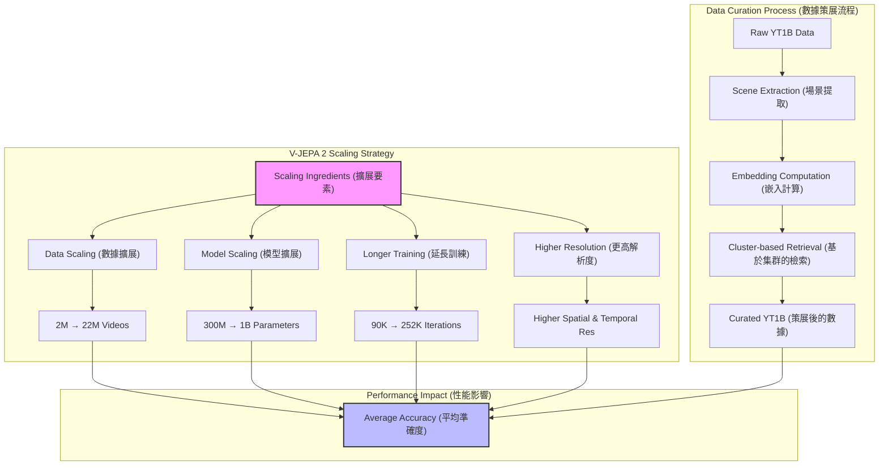
```mermaid
graph TD
    subgraph "V-JEPA 2 Scaling Strategy"
        direction TB
        A["Scaling Ingredients (擴展要素)"] --> B["Data Scaling (數據擴展)"]
        A --> C["Model Scaling (模型擴展)"]
        A --> D["Longer Training (延長訓練)"]
        A --> E["Higher Resolution (更高解析度)"]

        B --> B1["2M → 22M Videos"]
        C --> C1["300M → 1B Parameters"]
        D --> D1["90K → 252K Iterations"]
        E --> E1["Higher Spatial & Temporal Res"]
    end

    subgraph "Data Curation Process (數據策展流程)"
        direction LR
        F["Raw YT1B Data"] --> G["Scene Extraction (場景提取)"]
        G --> H["Embedding Computation (嵌入計算)"]
        H --> I["Cluster-based Retrieval (基於集群的檢索)"]
        I --> J["Curated YT1B (策展後的數據)"]
    end

    subgraph "Performance Impact (性能影響)"
        K["Average Accuracy (平均準確度)"]
        B1 --> K
        C1 --> K
        D1 --> K
        E1 --> K
        J --> K
    end

    style A fill:#f9f,stroke:#333,stroke-width:2px
    style K fill:#bbf,stroke:#333,stroke-width:2px
```

---

## Part 4

Source note: V-JEPA 2 Self-Supervised Video Models Enable Understanding, Prediction and Planning (Part 4)

Original range: lines 119-153
Original chars: 22926-31944

<!-- source: V-JEPA 2 Self-Supervised Video Models Enable Understanding, Prediction and Planning (Part 4).md -->

### 介紹 V-JEPA 2 的擴展性實驗（模型規模、解析度、訓練時程）以及如何透過動作條件化預測器將預訓練模型轉化為具備規劃能力的機器人世界模型。

#### 摘要

本段文本詳細介紹了 V-JEPA 2 的預訓練策略與模型擴展（Scaling）實驗結果。研究重點在於透過「精選資料集（Curated-YT-1B）」與「漸進式解析度訓練（Progressive-Resolution Training）」來提升訓練效率與性能。此外，文本介紹了 V-JEPA 2-AC，這是一種基於動作條件化（Action-conditioned）的世界模型，旨在透過學習機器人互動數據（如 Droid 資料集），使模型具備在機器人控制與規劃（如模型預測控制 MPC）中的應用潛力。

#### 翻譯內文

...檢索過程 [^87] 以根據目標分佈選擇影片場景，該分佈由 Kinetics、Something-Something v2、COIN 以及 EpicKitchen 訓練資料集組成。我們在第 10.2 節中描述了資料集構建程序的細節。與 [^87] 類似，我們確保目標驗證集中的影片均未包含在初始的未經篩選（uncurated）資料池中。

在圖 4（右）中，我們比較了在未經篩選的 YT-1B 資料上預訓練的 ViT-L 模型，與在我們的精選 YT-1B（Curated-YT-1B）資料集上訓練的同規模模型在視覺理解評估上的平均性能。使用精選資料集進行訓練，比未經篩選的基準模型在平均性能上提升了 $+1.4$ 分。值得注意的是，在 ViT-L 規模下，經過 Curated-YT-1B 訓練的模型達到了與完整的 VM22M 資料集相當的競爭力。然而，更大規模的模型從 VM22M 訓練中獲益更多（見第 10.2 節），這表明將 Curated-YT-1B 與其他資料源結合可以增強擴展性（scalability）。

##### 2.4 預訓練配方

###### 模型規模擴展 (Scaling Model Size)

為了探索模型的擴展行為，我們訓練了一系列參數數量從 3 億（ViT-L）到 10 億（Vi-g）的編碼器模型。所有編碼器架構的細節均在附錄的表 12 中提供。請注意，每個編碼器都使用相同的預測器架構，類似於 ViT-small。我們在圖 5（左）中報告了這些編碼器在視覺理解任務上的平均性能。將模型規模從 3 億（ViT-L）擴展到 10 億（Vi-g）參數，可帶來 $+1.5$ 分的平均性能提升。運動與外觀理解任務皆從擴展中獲益，其中 SSv2 提升了 $+1.6$ 分，Kinetics 提升了 $+1.5$ 分（參見表 4）。這些結果證實，自監督影片預訓練能有效地利用更大的模型容量，最高可達 10 億參數的 ViT-g。

（圖 5 說明：模型擴展。我們探索了模型規模與輸入影片解析度對性能的影響... 漸進式訓練可提供高達 8 倍的加速，顯著降低了預訓練的計算需求...）

###### 訓練時程 (Training Schedule)

V-JEPA 2 模型的訓練採用「熱身—恆定學習率—冷卻階段（warmup-constant learning rate schedule followed by a cooldown phase）」的時程 [^123] [^51]。與 [^51] 類似，我們發現此時程的表現與半餘弦（half-cosine）時程 [^76] 相當；此外，它也讓探索長時程訓練更具成本效益，因為可以從恆定階段的不同檢查點（checkpoints）啟動多個冷卻運行。我們簡化了 [^6] 的配方，保持固定的教師模型 EMA 與權重衰減係數，而非使用漸增（ramp-up）時程，因為這些變化對下游理解任務的影響極小。圖 3 顯示，將訓練時程從 90K 擴展到 252K 迭代，ViT-g 模型的平均性能提升了 $+0.8$，驗證了延長訓練時程的益處。==此時程也透過在冷卻階段逐步增加影片解析度，促進了漸進式訓練。==

###### 高效的漸進式解析度訓練 (Efficient Progressive-Resolution Training)

雖然大多數先前的影片編碼器專注於 16 幀（約數秒）的短片段 [^6] [^113] [^111]，但我們探索了使用更高空間解析度、長達 64 幀（16 秒）的長片段進行訓練。然而，訓練時間會隨著時長與解析度的增加而劇增——若在 $64 \times 384 \times 384$ 的輸入上訓練 ViT-g 模型，大約需要 60 個 GPU 年（見圖 5 中）。為了降低此成本，我們採用了漸進式解析度策略 [^106] [^87]，在維持下游性能的同時提升訓練效率。我們的訓練流程始於熱身階段，在 12K 迭代中使用 16 幀、$256 \times 256$ 解析度的影片進行線性學習率熱身，隨後進入恆定學習率的主訓練階段（228K 迭代）。接著，在冷卻階段，我們增加影片時長與解析度，並在 12K 迭代內線性衰減學習率。因此，與在長時長、高解析度影片上訓練相關的額外計算開銷，僅發生在最後的冷算階段。這種方法實現了高效的高解析度訓練：如圖 5（中）所示，與全程使用全解析度直接從頭訓練相比，我們在處理 64 幀、$384 \times 384$ 解析度輸入的模型上，減少了 8.4 倍的 GPU 時間。此外，我們仍觀察到處理長時長與高解析度輸入帶來的益處。

###### 擴展影片的時間與空間解析度 (Scaling temporal and spatial video resolution)

圖 5 檢視了輸入影片解析度如何影響下游任務性能。當在預訓練期間將片段時長從 16 幀增加到 64 幀，同時保持固定的 16 幀評估時長時，我們觀察到平均性能提升了 $+0.7$ 個百分點（圖 5 右）。此外，我們發現增加評估時的影片時長與解析度，會導致各項任務的顯著提升（參見表 4 與第 10.4.2 節）。這些結果證明，影片自監督預訓練能從訓練與評估階段增加的時間解析度中獲益。雖然我們嘗試了更長的影片片段（128 與 256 幀），但在這組理解任務上，超過 64 幀後並未觀察到進一步的提升。

#### 3 V-JEPA 2-AC：學習動作條件化世界模型

預訓練完成後，V-JEPA 2 模型可以對影片中的缺失部分進行預測。然而，這些預測並未直接考慮代理人（agent）可能採取的動作所產生的因果效應。在本節描述的下一階段訓練中，我們專注於利用少量的互動數據，使模型對規劃（planning）具有實用價值。為此，我們在凍結的 V-JEPA 2 影片編碼器之上，學習一個「幀因果動作條件化預測器（frame-causal action-conditioned predictor）」（圖 2 右）。我們使用來自 Droid 資料集 [^60] 的數據來訓練模型，該數據集包含透過遠端操作（teleoperation）收集的、使用桌面式 Franka Panda 機械臂進行實驗的數據。我們將生成的動作條件化模型稱為 V-JEPA 2-AC，並在第 4 節中展示了 V-JEPA 2-AC 可用於模型預測控制（MPC）規劃迴圈中，以在全新環境中規劃動作。

##### 3.1 動作條件化世界模型訓練

我們的目標是利用預訓練後的 V-JEPA 2 模型，獲得一個潛在的世界模型（latent world model），該模型可透過閉迴路模型預測控制（closed-loop MPC）來控制具身智能系統（embodied agentic system）。為了實現這一點，我們訓練了 V-JE 2-AC，這是一個自回歸（autoregressive）模型，它能在控制動作與本體感覺觀測（proprioceptive observations）的條件下，預測未來影片觀測的表示。

在本節中，我們描述了此框架在具有固定外向相機（exocentric camera）的桌面機械臂上的具體實例化，其中控制動作對應於末端執行器（end-effector）指令。模型使用來自原始 Droid 資料集約 62 小時的無標籤影片進行訓練，該資料集包含 7 自由度（7-DoF）Franka Emika Panda 機械臂（配備雙指夾具）的短影片，通常長度為 3-4 秒。此處的「無標籤」是指我們不使用任何指示獎勵、任務類型或任務是否成功的額外元數據（meta-data）。相反地，我們僅使用資料集中的原始影片與末端執行器狀態信號（資料集中的每個影片都附帶了指示每幀末端執行器狀態的元數據——包含位置的三維、方向的三維以及夾具狀態的一維）。

#### 詞彙與關鍵術語

| 英文術語 | 繁體中文翻譯 | 說明 |
| :--- | :--- | :--- |
| Uncurated data | 未經篩選/整理的資料 | 指未經過人工或自動化品質篩選的原始資料。 |
| Curated dataset | 精選資料集 | 經過清洗、篩選與品質優化的資料集。 |
| Scaling behavior | 擴展行為 | 描述模型參數、數據量或計算量增加時，性能如何隨之變化的規律。 |
| Progressive-Resolution Training | 漸進式解析度訓練 | 訓練過程中由低解析度逐步提升至高解析度的策略。 |
| Action-conditioned predictor | 動作條件化預測器 | 以動作作為輸入條件，用以預測未來狀態的預測模型。 |
| Model Predictive Control (MPC) | 模型預測控制 | 一種利用模型預測未來狀態，並以此優化當前控制動作的控制策略。 |
| Proprioceptive observations | 本體感覺觀測 | 機器人自身感測器回傳的狀態（如關節角度、末端位置等）。 |
| End-effector | 末端執行器 | 機械臂最末端的工具或夾具。 |
| Exocentric camera | 外向相機 | 相機位於物體外部，從外部視角觀察物體的設置。 |

#### 邏輯流程圖

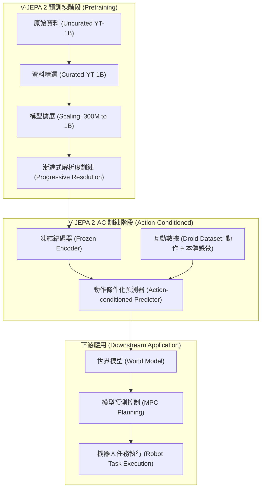
```mermaid
graph TD
    subgraph "V-JEPA 2 預訓練階段 (Pretraining)"
        A["原始資料 (Uncurated YT-1B)"] --> B["資料精選 (Curated-YT-1B)"]
        B --> C["模型擴展 (Scaling: 300M to 1B)"]
        C --> D["漸進式解析度訓練 (Progressive Resolution)"]
    end

    subgraph "V-JEPA 2-AC 訓練階段 (Action-Conditioned)"
        D --> E["凍結編碼器 (Frozen Encoder)"]
        E --> F["動作條件化預測器 (Action-conditioned Predictor)"]
        G["互動數據 (Droid Dataset: 動作 + 本體感覺)"] --> F
    end

    subgraph "下游應用 (Downstream Application)"
        F --> H["世界模型 (World Model)"]
        H --> I["模型預測控制 (MPC Planning)"]
        I --> J["機器人任務執行 (Robot Task Execution)"]
    end
```

---

## Part 5

Source note: V-JEPA 2 Self-Supervised Video Models Enable Understanding, Prediction and Planning (Part 5)

Original range: lines 151-209
Original chars: 30922-39852

<!-- source: V-JEPA 2 Self-Supervised Video Models Enable Understanding, Prediction and Planning (Part 5).md -->

### V-JEPA 2-AC is trained using unlabeled video via teacher-forcing and rollout losses to enable zero-shot robot control through energy minimization-based planning.

#### 摘要

本文件詳細介紹了 V-JEPA 2-AC（動作條件化預測器）的訓練流程與推論規劃機制。訓練過程利用大規模無標籤影片數據，==透過「教師強迫（Teacher-forcing）」與「展開損失（Rollout loss）」兩大損失函數，強化模型對未來狀態特徵的預測能力==，並透過「塊因果注意力機制」處理時空資訊。在推論階段，該模型展現了強大的「模型預測控制（MPC）」能力，透過「交叉熵方法（CEM）」最小化目標狀態與預測狀態之間的能量函數，實現了在全新環境下的「零樣本（Zero-shot）」機器人控制任務（如到達、抓取與取放）。

#### 翻譯內文

##### 訓練細節：輸入與損失函數

本節描述了此框架在固定外觀相機（exocentric camera）下的桌面機械臂具體實例化，其中控制動作對應於末端執行器（end-effector）的指令。模型使用來自原始 Droid 數據集約 62 小時的 **無標籤** 影片進行訓練。此處「無標籤」是指我們不使用任何指示獎勵、任務類型或任務成功與否的額外元數據（meta-data），僅使用原始影片與末端執行器的狀態訊號（包含位置、姿態與夾爪狀態）。

###### 模型輸入
在每次訓練迭代中，我們從 Droid 數據集中隨機抽取 4 秒長的影片片段。影片解析度為 $256\times 256$，幀率為 4 fps，形成包含 16 幀的序列 $(x_{k})_{k\in[16]}$。機器人的末端執行器狀態由 7 維實數向量 $(s_{k})_{k\in[16]}$ 表示（前三維為笛卡爾位置，次三維為歐拉角姿態，最後一維為夾爪狀態）。我們透過計算相鄰幀之間末端執行器狀態的變化來構建動作序列 $(a_{k})_{k\in[15]}$。此外，我們對影片片段應用了隨機縮放與裁剪（random-resize-crop）增強。

###### 損失函數
我們使用 V-JEPA 2 編碼器 $E(\cdot)$ 作為影像編碼器，將每一幀獨立編碼以獲得特徵圖序列 $(z_{k})_{k\in[16]}$。在訓練過程中，編碼器是凍結的。特徵圖、末端執行器狀態與動作序列在時間上交錯排列為 $(a_{k},s_{k},z_{k})_{k\in[15]}$，並輸入 Transformer 預測器網路 $P_{\phi}(\cdot)$，以獲得下一狀態表示的預測值 $(\hat{z}_{t+1})_{k\in[15]}$。

我們採用兩種損失函數進行優化：
1.  **教師強迫損失 ($\mathcal{L}_{\text{teacher-forcing}}$)**：計算預測特徵與實際特徵之間的一階範數（L1）差異。
2.  **展開損失 ($\mathcal{L}_{\text{rollout}}$)**：為了提升模型在推論時進行自回歸展開（autoregressive rollouts）的能力，我們計算兩步展開的損失，以減少誤差累積。

最終的總訓練目標是最小化上述兩者之和：$L(\phi) = \mathcal{L}_{\text{teacher-forcing}} + \mathcal{L}_{\text{rollout}}$。

###### 模型架構
預測器網路 $P_{\phi}(\cdot)$ 是一個擁有約 3 億參數的 Transformer 網路，包含 24 層、16 個注意力頭、1024 維隱藏層及 GELU 激活函數。我們使用 **3D-RoPE** 實作來表示每個影片補丁（patch）的時空位置。此外，預測器採用 **塊因果注意力機制（block-causal attention pattern）**，使得給定時間步的每個補丁特徵不僅能關注當前時間步的動作、狀態與其他特徵，還能關注先前時間步的資訊。

##### 透過規劃推論動作

###### 能量最小化
給定目標狀態的影像後，我們透過規劃來執行下游任務。具體而言，在每個時間步，我們==透過最小化一個「目標條件化能量函數」來規劃固定時域內的動作序列==。我們優化動作序列 $(a^{\star}_{i})_{i\in[T]}$，使得模型「想像」出的未來狀態特徵與目標影像特徵之間的 L1 距離最小化。在實作中，我們使用 **交叉熵方法（Cross-Entropy Method, CEM）** 來求解，並採用 **遞迴時域控制（receding horizon control）** 策略：僅執行規劃序列中的第一個動作，隨後觀察新狀態並重新規劃。

##### 規劃：零樣本機器人控制
本節展示了 V-JEPA 2-AC 如何透過模型預測控制實現基本的機器人技能，如「到達（reaching）」、「抓取（grasping）」以及「取放（pick-and-place）」。實驗證明，V-JEPA 2-AC 能夠在全新的環境中展現出強大的 **零樣本（zero-shot）** 泛化能力。

#### 詞彙與關鍵術語

| 英文術語 | 繁體中文翻譯 | 說明 |
| :--- | :--- | :--- |
| End-effector | 末端執行器 | 機器人手臂末端的工具或夾爪。 |
| Unlabeled video | 無標籤影片 | 不含任務標籤、獎勵或成功與否資訊的原始影片。 |
| Teacher-forcing | 教師強迫 | 訓練時將真實的標籤（或前一時刻的真實狀態）作為輸入，以加速收斂。 |
| Rollout loss | 展開損失 / 滾動損失 | 透過多步預測來計算的損失，旨在減少長程預測的誤差累積。 |
| Block-causal attention | 塊因果注意力機制 | 一種特殊的注意力模式，允許模型在時間維度上進行因果性的資訊流動。 |
| Energy minimization | 能量最小化 | 在規劃中透過尋找使代價函數（能量函數）最小的參數來決定動作。 |
| Cross-Entropy Method (CEM) | 交叉熵方法 | 一種用於優化隨機策略或尋找最佳動作序列的迭代採樣演算法。 |
| Receding horizon control | 遞迴時域控制 | 每次規劃一段時間的動作，但僅執行第一步，隨後重新規劃的控制策略。 |
| Zero-shot | 零樣本 | 模型在未經特定任務訓練的情況下，直接處理新任務或新環境的能力。 |

#### 邏輯流程圖

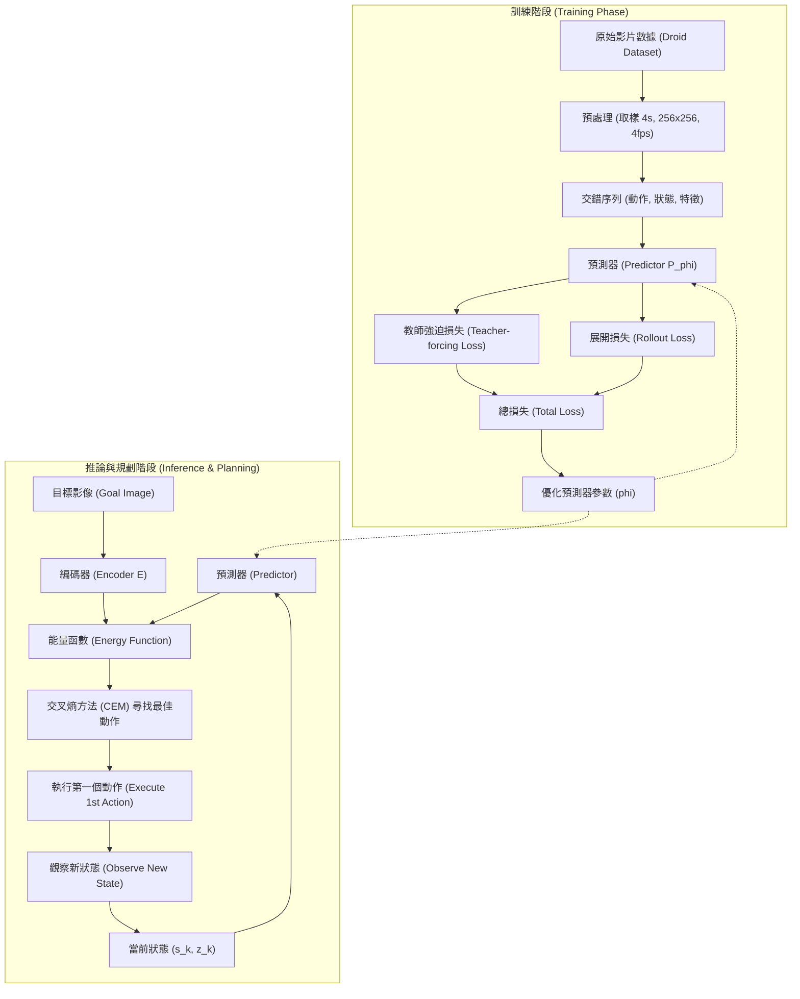
```mermaid
graph TD
    subgraph "訓練階段 (Training Phase)"
        direction TB
        Data["原始影片數據 (Droid Dataset)"] --> Preprocess["預處理 (取樣 4s, 256x256, 4fps)"]
        Preprocess --> Input["交錯序列 (動作, 狀態, 特徵)"]
        Input --> Predictor["預測器 (Predictor P_phi)"]
        Predictor --> TF_Loss["教師強迫損失 (Teacher-forcing Loss)"]
        Predictor --> Rollout_Loss["展開損失 (Rollout Loss)"]
        TF_Loss --> Total_Loss["總損失 (Total Loss)"]
        Rollout_Loss --> Total_Loss
        Total_Loss --> Optimize["優化預測器參數 (phi)"]
    end

    subgraph "推論與規劃階段 (Inference & Planning)"
        direction TB
        Goal_Img["目標影像 (Goal Image)"] --> Goal_Enc["編碼器 (Encoder E)"]
        Current_State["當前狀態 (s_k, z_k)"] --> Predictor_Inf["預測器 (Predictor)"]
        Goal_Enc --> Energy_Func["能量函數 (Energy Function)"]
        Predictor_Inf --> Energy_Func
        Energy_Func --> CEM["交叉熵方法 (CEM) 尋找最佳動作"]
        CEM --> Execute["執行第一個動作 (Execute 1st Action)"]
        Execute --> Observe["觀察新狀態 (Observe New State)"]
        Observe --> Current_State
    end

    Optimize -.-> Predictor
    Optimize -.-> Predictor_Inf
```

---

## Part 6

Source note: V-JEPA 2 Self-Supervised Video Models Enable Understanding, Prediction and Planning (Part 6)

Original range: lines 205-245
Original chars: 38830-47491

<!-- source: V-JEPA 2 Self-Supervised Video Models Enable Understanding, Prediction and Planning (Part 6).md -->

### V-JEPA 2-AC enables effective robot control through model-predictive control (MPC) by minimizing the L1 distance between imagined future states and goal representations, demonstrating zero-shot generalization to unseen environments.

#### 摘要

本文件節錄自關於 V-JEPA 2 自監督影片模型的論文，重點討論了該模型在機器人控制領域的應用，特別是「模型預測控制 (Model Predictive Control, MPC)」的實現。研究展示了如何透過最小化未來想像狀態與目標表示之間的 L1 距離，來規劃動作序列。文中詳細說明了實驗設置，包括與 Octo（基於行為複製）及 Cosmos（基於影片生成）等基準模型的對比，並驗證了模型在「單目標到達 (Single-goal reaching)」與「抓取操作 (Prehensile manipulation)」任務中的零樣本 (Zero-shot) 遷移能力。結果顯示，V-JEPA 2-AC 展現了優異的空間理解能力與動作預測能力，且其能量地貌 (Energy landscape) 具有平滑且局部凸性的特徵，有利於規劃。

#### 翻譯內文

**模型預測控制 (Model-predictive control)**。我們專注於具有視覺目標指定的任務，並展示了 ==V-JEPA 2-AC 能夠零樣本地泛化至新環境。==

（圖 7 說明：規劃。我們透過最小化世界模型在未來 $T$ 個時間步長內所想像的狀態表示與目標表示之間的 L1 距離，來規劃一個固定時間範圍 $T$ 的動作序列。L1 損失函數透過交叉熵方法 (Cross-entropy method) 對動作 $(a_k)_{k \in [T]}$ 進行優化。具體而言，在每個規劃步驟中，我們從一組初始均值為零、方差為一的高斯分佈序列中，對規劃範圍內的每個點進行動作座標採樣。我們利用前 $k$ 個最佳動作軌跡的群體統計數據來更新高斯分佈的均值與方差。此過程會重複多次迭代，最後將高斯序列的均值作為所選定的動作軌跡返回。）

##### 4.1 實驗設置

###### 基準模型 (Baselines)

我們將 V-JEPA 2-AC 的性能與兩個基準模型進行比較：一個是使用行為複製 (Behavior cloning) 訓練的視覺-語言-動作模型，另一個是基於影片生成的生成式世界模型。

第一個基準模型是基於 Octo 視覺-語言-動作模型，該模型允許目標影像的條件化輸入。我們從 *octo-base-1.5* 版本的開源權重開始，該模型已在包含超過 100 萬條軌跡的 *Open-X Embodiment* 數據集上進行預訓練。我們使用事後重新標記 (Hindsight relabeling) 技術，在整個 Droid 數據集上透過行為複製對 Octo 模型進行微調，並結合影像目標與末端執行器狀態。具體而言，我們在訓練期間從 Droid 數據集中隨機採樣軌跡片段，並均勻地採樣軌跡中未來最多 20 個時間步長的目標影像。我們使用了官方開源的微調代碼，包含所有標準的 Droid 優化超參數，並利用 $256 \times 256$ 解析度的單側影像視圖輸入、兩個前序幀的上下文以及 4 個未來動作的規劃範圍。

第二個比較的基準模型是基於 Cosmos 影片生成模型。我們從 Cosmos 無動作 (Action-free) 模型的開源權重（具有連續分詞器的 7B 潛在擴散模型）開始，該模型已在 2 億小時的影片上進行訓練，並且我們使用官方發佈的動作條件化微調代碼在 Droid 數據集上對其進行微調。為了提升在 Droid 上的訓練性能，我們：(i) 降低了學習率以匹配影片條件化 Cosmos 的訓練方案；(ii) 移除了影片條件化中的 Dropout 以改善訓練動態；(iii) 將噪聲水平提高了 $e^2$ 倍，因為我們觀察到使用較低噪聲因子的模型難以利用條件幀中的資訊。雖然 Cosmos 技術報告提到將世界模型用於規劃或模型預測控制是未來的應用方向，但就我們所知，這是首次報導使用 Cosmos 模型進行機器人控制的嘗試。

###### 機器人部署 (Robot deployment)

所有模型均零樣本部署於位於兩個不同實驗室的 Franka Emika Panda 機械臂及 RobotiQ 夾具上，且這兩個實驗室均未出現在 Droid 數據集中。視覺輸入是透過一個未經標定的低解析度單目 RGB 相機提供的。機器人使用完全相同的模型權重與推理代碼，以及基於操作空間控制 (Operational space control) 的相似低階控制器。我們對 V-JE動 2-AC 世界模型與 Cosmos 世界模型均採用阻塞式控制 (Blocking control)（即系統會等待最後一個指令動作完成後，才向控制器發送新動作）；對於 Octo，我們實驗了阻塞式與非阻塞式控制，並報告了兩者中的最佳性能。在使用 V-JEPA 2-AC 與 Cosmos 進行規劃時，我們將每個採樣動作限制在以原點為中心、半徑為 $0.075$ 的 L1 球 (L1-Ball) 內，這對應於每個單一動作的最大末端執行器位移約為 13 公分，因為過大的動作對於模型而言屬於相對的分布外 (Out-of-distribution) 數據。

（圖 8 說明：單目標到達。單目標到達任務涉及根據單一目標影像，將末端執行器移動到空間中的預定位置。此任務旨在衡量模型對動作的基本理解，以及從單目 RGB 相機中獲取場景（包括深度）的 3D 空間理解能力。在每個步驟中，我們使用 V-JEPA 2-AC 透過最小化模型想像的未來狀態表示與目標幀表示之間的 L1 距離來規劃動作序列。接著執行第一個動作，然後在下一個時間步長重新進行規劃。在規劃期間，我們僅在以原點為中心、半徑為 0.075 的 L1 球內採樣單個動作。因此，單步中與目標之間笛卡爾距離的最大可實現減少量為 0.13（約 13 公分）。）

##### 4.2 結果

###### 單目標到達 (Single-goal reaching)

首先，我們在單目標到達任務上進行評估，該任務涉及根據單一目標影像將末端執行器移動到空間中的預定位置。此任務衡量了對動作的基本理解，以及從單目 RGB 相機中獲取場景（包括深度）的 3D 空間理解能力。

圖 8 展示了機器人在執行三種不同單目標到達任務期間，末端執行器與其目標位置之間的歐幾里得距離。在所有案例中，模型都能將末端執行器移動到距離目標位置不到 4 公分處，並選擇能導致誤差單調遞減的動作。這可以被視為一種視覺伺服 (Visual servoing) 的形式，即利用來自相機的視覺回饋來控制機器人的運動。然而，與傳統的視覺伺服方法不同，V-JEPA 2-AC 是透過在未標記的真實世界影片數據上進行訓練來實現這一點的。

在圖 9 中，我們可視化了 V-JEPA 2-AC 在 $\Delta y$ 到達任務中，關於單一笛卡爾控制動作的能量地貌 (Energy landscape)，其中固定 $\Delta z=0$ 並掃描 $\Delta x$ 與 $\Delta 𝑦$。==能量函數在接近真實動作處達到最小值，這進一步證明了模型已學會如何在不需要精準感測的情況下，合理地推斷動作的效果。==有趣的是，==由 V-JEPA 2-AC 產生的能量地貌相對平滑且具有局部凸性，這應有助於規劃。==

（圖 9 說明：V-JEPA 2-AC 能量地貌。單目標到達任務中，末端執行器笛卡爾控制動作的能量地貌（固定 $\Delta z=0$，掃描 $\Delta x$ 與 $\Delta y$）；將目標影像與起始幀關聯的真實動作位於 $(\Delta x, \Delta y) = (0, -0.1)$。我們可以看到能量函數在 $(\Delta x, \Delta y) \approx (0, -0.05)$ 附近達到最小值，表明模型已學會合理推斷動作效果，而無需精準感測。）

###### 抓取操作 (Prehensile manipulation)

接下來，我們在更具挑戰性的抓取操作任務上評估所有模型，即「抓取 (Grasp)」、「攜物到達 (Reach with object)」以及「取放 (Pick-and-place)」。成功率記錄於表 2 與表 3 中，並是在 10 次實驗中取平均值，實驗中對任務進行了各種排列組合（例如物體位置、起始姿勢等）。對於「抓取」與「攜物到達」任務，模型會看到單一目標影像。對於「取放」任務，除了最終目標外，我們還向模型提供兩個子目標影像。第一個目標影像顯示物體被抓取，第二個目標影像顯示物體位於目標位置附近。模型首先針對第一個子目標優化動作 4 個時間步長，然後自動切換到第二個子目標進行接下來的 10 個時間步長，最後在最後 4 個時間步長切換到第三個目標。圖 10 展示了「取放」任務的機器人執行範例。實驗室 1 中所有個別任務的起始與目標幀詳見第 11.2 節。==「抓取」任務需要透過視覺回饋進行精確控制以正確夾持物體。==「攜物到達」任務要求模型在持物時進行導航，這需要對直覺物理學 (Intuitive physics) 有基本的理解以避免掉落物體。最後，「取放」任務則測試了組合這些原子技能 (Atomic skills) 的能力。

#### 詞彙與關鍵術語

| 英文術語 | 繁體中文翻譯 | 說明 |
| :--- | :--- | :--- |
| Model Predictive Control (MPC) | 模型預測控制 | 利用模型預測未來狀態，並優化當前動作序列的控制策略。 |
| Cross-Entropy Method (CEM) | 交叉熵方法 | 一種用於優化隨機參數（如動作序列）的迭代採樣演算法。 |
| Behavior Cloning (BC) | 行為複製 | 模仿學習的一種，直接從專家演示數據中學習策略。 |
| End-effector | 末端執行器 | 機器人手臂末端的工具或夾具（如夾爪）。 |
| Visual Servoing | 視覺伺服 | 利用視覺回饋來控制機器人運動以達成目標的技術。 |
| Prehensile Manipulation | 抓取操作 / 具抓取性的操控 | 涉及使用夾具或手指抓取並移動物體的操控任務。 |
| Energy Landscape | 能量地貌 / 能量景觀 | 描述目標函數（如損失函數）在參數空間中的分佈特徵。 |
| Zero-shot | 零樣本 | 模型在未見過的任務或環境上直接進行推論的能力。 |
| Out-of-distribution (OOD) | 分布外 | 數據點超出了模型訓練時所覆蓋的數據範圍。 |

#### 邏輯流程圖

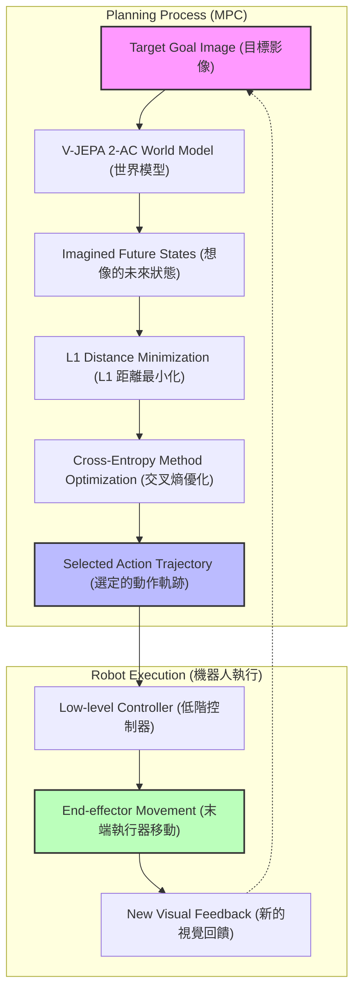
```mermaid
graph TD
    subgraph "Planning Process (MPC)"
        A["Target Goal Image (目標影像)"] --> B["V-JEPA 2-AC World Model (世界模型)"]
        B --> C["Imagined Future States (想像的未來狀態)"]
        C --> D["L1 Distance Minimization (L1 距離最小化)"]
        D --> E["Cross-Entropy Method Optimization (交叉熵優化)"]
        E --> F["Selected Action Trajectory (選定的動作軌跡)"]
    end

    subgraph "Robot Execution (機器人執行)"
        F --> G["Low-level Controller (低階控制器)"]
        G --> H["End-effector Movement (末端執行器移動)"]
        H --> I["New Visual Feedback (新的視覺回饋)"]
        I -.-> A
    end

    style A fill:#f9f,stroke:#333,stroke-width:2px
    style F fill:#bbf,stroke:#333,stroke-width:2px
    style H fill:#bfb,stroke:#333,stroke-width:2px
```

---

## Part 7

Source note: V-JEPA 2 Self-Supervised Video Models Enable Understanding, Prediction and Planning (Part 7)

Original range: lines 245-275
Original chars: 46469-56071

<!-- source: V-JEPA 2 Self-Supervised Video Models Enable Understanding, Prediction and Planning (Part 7).md -->

### V-JEPA 2-AC demonstrates superior efficiency and success rates in complex robot manipulation tasks compared to diffusion-based models, despite limitations in camera sensitivity and long-horizon planning.

#### 摘要

本文件探討了 V-JEPA 2-AC 模型在機器人操控任務（特別是「拿起並放置」任務）中的表現。該模型透過將複雜任務分解為多個子目標（抓取、移動至目標附近、放置）來實現精準操控。實驗結果顯示，相較於基於潛在擴散（Latent Diffusion）的 Cosmos 模型，V-模組在執行效率上具有巨大優勢（每步動作僅需 16 秒，而 Cosmos 需要 4 分鐘），且在處理物體互動任務時表現更為出色。然而，研究也指出了目前的局限性，包括對相機位置的敏感度、長時程規劃中的誤差累積，以及目前仍高度依賴圖像目標而非自然語言指令。

#### 翻譯內文

當模型接收到單一目標圖像時，對於「拿起並放置」（pick-and-place）任務，我們除了最終目標外，還向模型提供了兩個子目標圖像。第一個目標圖像顯示物體正被抓取，第二個目標圖像顯示物體位於目標位置附近。模型首先針對第一個子目標優化動作 4 個時間步，接著自動切換到第二個子目標進行接下來 10 個時間步的優化，最後在最後 4 個時間步切換到第三個目標。圖 10 展示了機器人執行「拿起並放置」任務的範例。實驗室 1 中所有個別任務的起始與目標幀（frames）如第 11.2 節所示。「抓取」（grasp）任務需要透過視覺回饋進行精確控制，以正確握住物體；「帶著物體到達」（reach with object）任務要求模型在持物移動時具備基本的直覺物理理解，以避免掉落物體；最後，「拿起並放置」任務則測試了組合這些原子技能（atomic skills）的能力。

雖然所有模型在「到達」（reach）任務上都達到了很高的成功率，但在涉及物體互動的任務中，性能差異變得更加明顯。我們觀察到，所有模型的成功率都取決於所操控物體的類型。例如，我們發現杯子通常很容易透過將一根手指放入物體內部並沿著杯緣抓取來完成；然而，如果模型產生的控制動作不夠精確，機器人將錯過杯緣並導致抓取失敗。在操控盒子時，雖然存在更多可行的抓取配置，但模型需要更精確的夾具控制，以確保夾爪張開得足夠寬以抓取物體。我們發現，對於所有模型而言，成功率隨物體類型的變化是由次優動作（sub-optimal actions）與操控特定物體所帶來的獨特挑戰共同造成的。儘管如此，我們看到 ==V-JEPA 2-AC 模型在所有任務中均達到了最高的成功率，凸顯了機器人操控中潛在空間規劃（latent planning）的可行性。==

在表 3 中，我們比較了使用 V-JEPA 2-AC 與基於潛在擴散的 Cosmos 動作條件化影片生成模型進行規劃時的性能。在這兩種情況下，我們都利用交叉熵方法（cross-entropy method）在單張 NVIDIA RTX 4090 GPU 上優化動作序列，並透過在模型的潛在空間中對目標幀進行編碼來構建能量函數（如公式 5 所示）。在使用 Cosmos 時，若設定 80 個樣本、10 個精煉步驟（refinement steps）且規劃時程（planning horizon）為 1，則每個規劃步驟計算單個動作需要 4 分鐘。雖然使用 Cosmos 在「到達」任務上達到了 80% 的高成功率，但在物體互動任務上的表現較弱。值得注意的是，在每步動作需要 4 分鐘的規劃時間下，一個完整的「拿起並放置」軌跡需要超過一小時的機器人執行時間。相比之下，V-JEPA 2-AC 世界模型在每個精煉步驟中使用多出 10 倍的樣本，每個動作僅需 16 秒，且在所有考慮的機器人技能中都帶來了更高的性能。在未來的研究中，我們可以透過利用額外的計算資源進行規劃、減少每個時間步使用的樣本與精細步驟數量、在世界模型的「想像」中訓練前饋策略（feed-forward policy）來初始化規劃問題，或者在 V-JEPA 2-AC 的情況下利用基於梯度的規劃，來潛在地減少這兩種模型的規劃時間。

##### 4.3 局限性

###### 對相機位置的敏感度
由於 V-JEPA 2-AC 模型是在給定末端執行器（end-effector）笛卡兒控制動作的情況下，被訓練來預測下一幀影片的表示（representations），且沒有任何顯式的相機校準，因此它必須從單目 RGB 相機輸入中隱式地推斷動作的座標軸。然而，在許多情況下，機器人基座在相機畫面中是不可見的，因此推斷動作座標軸的問題並未被明確定義，導致世界模型出現誤差。在實務上，我們在嘗試了不同的相機位置後，最終選定了一個在所有實驗中表現良好的位置。我們在第 11.4 節對 V-JEPA 2-AC 世界模型對相機位置的敏感度進行了定量分析。

###### 長時程規劃
使用世界模型進行長時程規劃受到多種因素的限制。首先，==自迴歸預測（autoregressive prediction）存在誤差累積（error accumulation）的問題==：表示空間預測的準確度會隨著自迴歸展開（rollouts）的增加而降低，從而增加了在長時程內進行可靠規劃的難度。其次，長時程規劃會增加搜索空間的大小：隨著規劃時程的線性增加，可能的動作軌跡數量呈指數級增長，這使得長時程規劃在計算上具有挑戰性。另一方面，長時程規劃對於解決非貪婪（non-greedy）預測任務是必要的，例如沒有圖像子目標的「拿起並放置」任務。未來探索用於長時程規劃的世界模型，將使解決更多複雜且有趣的任務成為可能。

###### 圖像目標
遵循許多先前關於目標條件化機器人操控的研究，我們目前的優化目標公式假設我們可以獲取視覺目標。然而，在野外（in-the-wild）部署機器人時，使用其他形式（例如語言）來表達目標可能更為自然。==未來將潛在動作條件化世界模型與語言模型對齊的工作，將邁向透過自然語言進行更通用任務指定的目標。==

#### 詞彙與關鍵術語

| 英文術語 | 繁體中文翻譯 | 說明 |
| :--- | :--- | :--- |
| Pick-and-place | 拿起並放置 / 抓取與放置 | 一種典型的機器人操控任務，將物體從一處移至另一處。 |
| Sub-goal | 子目標 | 複雜任務中較小的、階段性的中間目標。 |
| Latent planning | 潛在空間規劃 | 在模型學習到的低維度潛在表示空間中進行路徑規劃。 |
| Cross-entropy method | 交叉熵方法 | 一種用於優化隨機序列（如動作序列）的隨機搜索算法。 |
| Autoregressive prediction | 自迴歸預決 | 根據過去的預測結果來預測下一個狀態的預測方式。 |
| Error accumulation | 誤差累積 | 在連續預測過程中，微小的誤差隨時間推移而擴大的現象。 |
| End-effector | 末端執行器 | 機器人手臂末端的工具或夾具。 |
| Zero-shot | 零樣本 | 在沒有針對特定新任務進行額外訓練的情況下直接執行任務。 |
| Latent diffusion | 潛在擴散 | 在潛在空間中進行的擴散生成模型技術。 |

#### 邏輯流程圖

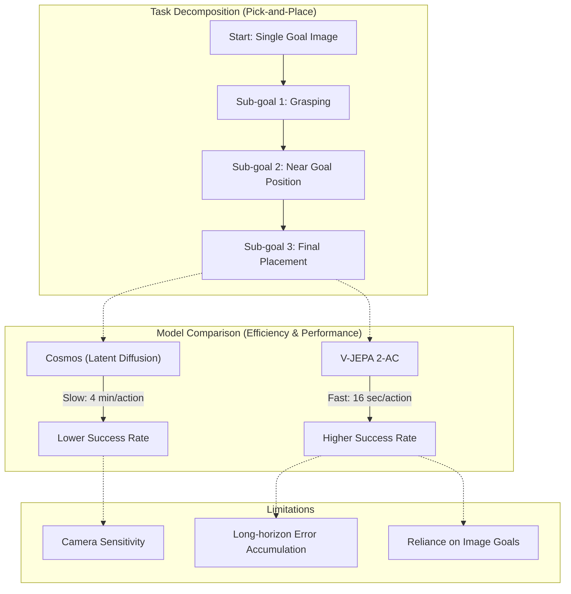
```mermaid
graph TD
    subgraph "Task Decomposition (Pick-and-Place)"
        A["Start: Single Goal Image"] --> B["Sub-goal 1: Grasping"]
        B --> C["Sub-goal 2: Near Goal Position"]
        C --> D["Sub-goal 3: Final Placement"]
    end

    subgraph "Model Comparison (Efficiency & Performance)"
        direction LR
        E["Cosmos (Latent Diffusion)"] -- "Slow: 4 min/action" --> F["Lower Success Rate"]
        G["V-JEPA 2-AC"] -- "Fast: 16 sec/action" --> H["Higher Success Rate"]
    end

    subgraph "Limitations"
        I["Camera Sensitivity"]
        J["Long-horizon Error Accumulation"]
        K["Reliance on Image Goals"]
    end

    D -.-> E
    D -.-> G
    F -.-> I
    H -.-> J
    H -.-> K
```

---

## Part 8

Source note: V-JEPA 2 Self-Supervised Video Models Enable Understanding, Prediction and Planning (Part 8)

Original range: lines 271-299
Original chars: 55049-64841

<!-- source: V-JEPA 2 Self-Supervised Video Models Enable Understanding, Prediction and Planning (Part 8).md -->

### V-JEPA 2 demonstrates superior motion understanding capabilities compared to state-of-the-art encoders, while facing computational challenges in long-horizon planning.

#### 摘要

本文件節錄自關於 V-JEPA 2 自監督影片模型的論文，主要探討了長時程規劃（Long-horizon planning）的挑戰，以及如何透過「探針式分類」（Probe-based Classification）來評估 V-模組在「動作理解」與「外觀理解」兩大維度的表現。研究指出，長時程規劃雖然會因搜尋空間呈指數級增長而增加計算難度，但對於解決非貪婪預測任務（如無子目標的取放動作）至關重要。實驗結果顯示，V-JEPA 2 在動作理解任務（如 SSv2, Diving-48, Jester）上顯著超越了現有的視覺編碼器，而在外觀理解任務（如 K400, COIN, ImageNet）上則展現出極具競爭力的性能。

#### 翻譯內文

##### 長時程規劃的挑戰與未來方向

==長時程規劃會增加搜尋空間的大小：隨著規劃時程（Planning horizon）呈線性增加，可能的動作軌跡數量會呈指數級增長==，這使得在長時程範圍內進行規劃在計算上變得極具挑戰性。另一方面，長時程規劃對於解決非貪婪預測任務（non-greedy prediction tasks）是必要的，例如在沒有影像子目標的情況下進行「取放」（pick-and-place）操作。未來探索用於長時程規劃的世界模型（World models），將能實現更多複雜且有趣的任務解決方案。

###### 圖像目標

承襲許多先前關於「以目標為條件的機器人操控」（goal-conditioned robot manipulation）的研究，我們目前的優化目標公式假設我們可以取得視覺目標。然而，當機器人在真實世界環境（in-the-wild）中部署時，使用其他形式（例如語言）來表達目標可能會更自然。未來將「動作條件化世界模型」與「語言模型」對齊的工作，將邁向透過自然語言進行更通用任務定義的目標。

##### 理解：基於探針的分類

如前所述，像 V-JEPA 2-AC 這樣的表示空間世界模型，其能力本質上受限於學習到的表示空間中所編碼的狀態資訊。在本節及後續章節中，我們將對 V-JEPA 2 所學習到的表示進行探測（Probe），並將 V-JEPA 2 編碼器與其他視覺編碼器在視覺分類任務上的表現進行比較。

視覺分類任務可以分為「外觀理解」（appearance understanding）或「動作理解」（motion understanding）。外觀理解任務通常可以透過輸入影片剪輯中單一影格的可見資訊來解決（即使分類標籤描述的是動作）；而動作理解任務則需要多個影格才能正確分類影片。為了確保對動作與外決評估的平衡，我們選擇了三個動作理解任務，即 Something-Something v2 (SSv2)、Diving-48 和 Jester，這些任務要求模型理解人類的手勢與動作。對於外觀理解，我們選擇了 Kinetics400 (K400)、COIN 和 ImageNet (IN1K)，這些任務涉及識別動作、場景與物體。實驗結果顯示，==V-JEPA 2 在動作理解任務上優於最先進的視覺編碼器，而在外觀理解任務上則具有競爭力==。

###### 注意力探針 (Attentive Probe)

我們在凍結的編碼器輸出之上，使用各個任務的訓練數據訓練了一個 4 層的注意力探針。==我們的注意力探針由四個 Transformer 區塊組成，其中最後一個區塊使用一個可學習的查詢標記（learnable query token）透過交叉注意力層（cross-attention layer）取代了標準的自注意力機制==。按照標準做法，在推理期間會從影片中採樣若干個具有固定影格數的剪輯，然後對所有剪輯的分類 Logits 取平均值。我們保持解析度與 V-JEPA 2 預訓練時使用的解析度相似。

###### 評估協議

我們將 V-JEPA 2 在動作與外觀任務上的表現，與幾種其他視覺編碼器進行比較：DINOv2 (搭配 registers) 是目前圖像自監督學習的最先進模型；SigLIP2 與 Perception Encoder PE core G 是圖像-文本對比預訓練的兩大先進模型。我們也考慮了兩個影片編碼器：自監督的 V-解析器 (V-JEPA) 以及主要依賴視覺-文本對比預訓練的 InternVideo2-s2-1B。

我們對所有基準模型與 V-JEPA 2 採用相同的評估協議，即在凍結的編碼器之上學習一個注意力探針。我們參考既有程序，將基於圖像的模型改造成適用於影片的模型，方法是將每個輸入影格的特徵進行串聯。儘儘管使用了共同的評估協議，但基準編碼器是在不同的數據集上訓練的，因此無法直接進行比較；我們只能在「系統層級」上比較不同的方法，即在訓練協議與數據不同的情況下，使用一致的評估協議。

###### 實驗結果

表 4 報告了 V-JEPA 2、我們評估的其他編碼器以及文獻中其他顯著結果的分類性能。V-JEPA 2 ViT-g（解析度 256）在動作理解任務上顯著優於其他視覺編誠器。在 SSv2 任務上，它達到了 75.3 的 Top-1 準確率，相比之下 InternVideo 為 69.7，PE core G 為 55.4。V-JEPA 2 在外觀任務上同樣具備競爭力，在 ImageNet 上達到了 84.6（比 V-JEPA 提升了 4.6 個百分點）。整體而言，與其他影片與圖像編碼器相比，V-JEPA 2 在所有六個任務中獲得了最佳的平均性能。解析度更高、持續時間更長的 V-JEPA 2 ViT-g 384 在所有任務中均展現出進一步的提升，平均性能達到 88.2。

#### 詞彙與關鍵術語

| 英文術語 | 繁體中文翻譯 | 說明 |
| :--- | :--- | :--- |
| Long-horizon planning | 長時程規劃 | 指在較長的時間跨度內規劃一系列動作的過程。 |
| Search space | 搜尋空間 | 在規劃過程中，所有可能動作路徑的集合。 |
| Action trajectories | 動作軌跡 | 機器人或代理人在時間序列中執行的連續動作路徑。 |
| Goal-conditioned manipulation | 以目標為條件的操控 | 機器人的動作由預設的目標（如影像或語言）所驅動。 |
| Appearance understanding | 外觀理解 | 識別影像中物體、場景、顏色等靜態特徵的能力。 |
| Motion understanding | 動作理解 | 識別影像中物體或人體運動、手勢、變化等動態特徵的能力。 |
| Attentive probe | 注意力探針 | 在凍結的特徵提取器之上，使用注意力機制進行下游任務預測的小型網路。 |
| Frozen encoder | 凍結的編碼器 | 在訓練下游任務時，不更新權重的預訓練模型。 |
| Cross-attention layer | 交叉注意力層 | 一種注意力機制，允許一個序列（如 Query）與另一個序列（如 Key/Value）進行交互。 |
| In-the-wild | 真實世界環境 | 指機器人離開實驗室，進入充滿變數的自然或真實應用場景。 |

#### 邏輯結構圖

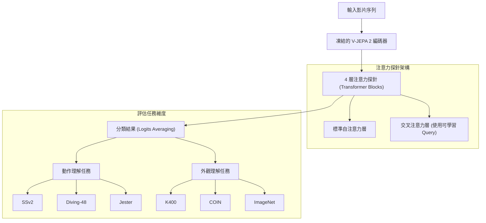
```mermaid
graph TD
    輸入影片序列 --> 凍結的VJEPA2編碼器["凍結的 V-JEPA 2 編碼器"]
    凍結的VJEPA2編碼器["凍結的 V-JEPA 2 編碼器"] --> 4層注意力探針TransformerBlocks["4 層注意力探針 (Transformer Blocks)"]

    subgraph "注意力探針架構"
        4層注意力探針TransformerBlocks["4 層注意力探針 (Transformer Blocks)"] --> 標準自注意力層
        4層注意力探針TransformerBlocks["4 層注意力探針 (Transformer Blocks)"] --> 交叉注意力層使用可學習Query["交叉注意力層 (使用可學習 Query)"]
    end

    4層注意力探針TransformerBlocks["4 層注意力探針 (Transformer Blocks)"] --> 分類結果LogitsAveraging["分類結果 (Logits Averaging)"]

    subgraph "評估任務維度"
        分類結果LogitsAveraging["分類結果 (Logits Averaging)"] --> 動作理解任務
        分類結果LogitsAveraging["分類結果 (Logits Averaging)"] --> 外觀理解任務

        動作理解任務 --> SSv2
        動作理解任務 --> Diving-48
        動作理解任務 --> Jester

        外觀理解任務 --> K400
        外觀理解任務 --> COIN
        外觀理解任務 --> ImageNet
    end
```

---

## Part 9

Source note: V-JEPA 2 Self-Supervised Video Models Enable Understanding, Prediction and Planning (Part 9)

Original range: lines 295-335
Original chars: 63819-72478

<!-- source: V-JEPA 2 Self-Supervised Video Models Enable Understanding, Prediction and Planning (Part 9).md -->

### V-JEPA 2 在影片分類與動作預期任務上展現了卓越的性能，且其預測能力隨模型規模呈現線性增長。

#### 摘要

本文件節錄自關於 V-JEPA 2 自監督影片模型的論文，重點討論了該模型在「分類任務」與「動作預期（Action Anticipation）」兩大領域的表現。在分類任務中，V-JE．JEPA 2 在動作理解任務上顯著優於其他視覺編碼器，且在影像外觀任務上亦具競爭力。在動作預期方面，研究利用 EK100 基準測試，證明了 V-JEPA 2 的性能會隨著模型規模（參數量）的增加而呈現線性增長。此外，==透過在凍結的主幹網路（Frozen Backbone）上訓練一個「注意力探針（Attentive Probe）」，該模型在預測動作的動詞、名詞及完整動作時，表現均超越了現有的尖端技術（SOTA）。==

#### 翻譯內文

e. 特別地，我們分享了在我們所考慮的分類任務中，VideoMAEv2 [^111]、InternVideo-1B 與 6B [^113] 以及 VideoPrism [^127] 的報告結果（若有可用數據）。我們在第 12.1 節中提供了完整的評估結果與超參數。

###### 結果

表 4 報告了 V-JEPA 2、我們評估的其他編碼器以及文獻中其他顯著結果的分類性能。在動作理解任務上，V-JEPA 2 ViT-g（解析度為 256）顯著優於其他視覺編碼器。在 SSv2 數據集上，它達到了 75.3 的 Top-1 準確率，相比之下，InternVideo 為 69.7，PE $\text{Core}$ G 為 55.4。V-JEPA 2 在外觀任務上亦具競爭力，在 ImageNet 上達到了 84.6（較 V-JEPA 提升了 $+4.6$ 個百分點）。總體而言，與其他影片與影像編碼器相比，V-JEPA 2 在所有六項任務中獲得了最佳的平均性能。具備更高解析度、更長時長的 V-JEPA 2 ViT-g $\text{384}$ 在所有任務中展現了進一步的提升，平均性能達到 $88.2$。

#### 6 預測：基於探針的動作預期

**表 5：預測：人類動作預期。** 在 EK100 動作預期基準測試上與現有尖端技術（SOTA）的比較。我們報告了驗證集上動詞（Verb）、名詞（Noun）與動作（Action）的平均類別 Top-5 召回率（mean-class recall-at-5）。V-JEPA 2 的性能隨模型規模呈線性增長，且在所有模型規模下均優於先前的尖端技術。

（表格數據略，內容顯示 V-JEPA 2 從 300M 到 1B 參數規模下，其動作預期的召回率持續上升，且顯著高於 InAViT、Video-LLaMA 與 PlausiVL。）

動作預期包含在給定一段上下文影片片段（該片段在動作發生前的一段時間內）的情況下，預測未來的動作。利用 Epic-Kitchens-100 (EK100) 基準測試 [^24]，我們證明了 V-JEPA 2 的動作預期性能隨著模型規模穩定增長。此外，儘管僅是在 V-JEPA 2 的表示層之上使用一個經過訓練的注意力探針，我們仍展現出 V-JEPA 2 顯著優於專為此任務設計的先前尖端方法。

###### 任務

EK100 數據集包含 100 小時從第一人稱視角（egocentric perspective）記錄的廚房環境烹飪活動，橫跨 45 個廚房場景。EK100 中的每個影片都標註了動作片段，包括開始時間戳、結束時間戳與動作標籤。共有 3,568 個唯一的動作標籤，每個標籤由一個動詞和一個名詞類別組成，總計包含 97 個動詞類別與 300 個名詞類別。EK100 動作預期任務涉及從發生在動作片段開始時間戳之前的影片片段（稱為「上下文」）中，預測名詞、動詞與動作（即同時預測動詞與名詞）。上下文結束與動作片段開始之間的間隔即為「預期時間」，預設為 1 秒。鑑於給定的上下文中可能出現不同的未來動作，我們使用平均類別 Top-5 召回率（mean-class recall-at-5）作為衡量性能的指標 [^24]。

###### 預期探針

一個注意力探針（Attentive Probe）被訓練在凍結的 V-JEPA 2 編碼器與預測器之上，用以預期未來動作。具體而言，我們採樣一個在動作開始前 1 秒結束的影片片段。此影片上下文被送入 V-JEPA 2 編碼器。預測器接收編碼器的表示，連同對應於未來 1 秒處影格的遮罩標記（mask tokens），並預測未來影片影格的表示。預測器與編碼器的輸出沿著標記維度（token dimension）進行拼接，並送入一個與第 5 節架構相似的注意力探針中；不同之處在於，預期探針的最終交叉注意力層學習三個查詢標記（而非一個），且每個查詢輸出都會送入不同的線性分類器，分別預測動作類別、動詞類別與名詞類別。我們對每個分類器獨立應用焦點損失（Focal Loss）[^70]，並在透過探針的共享注意力區塊進行反向傳播前進行總和。我們在第 13.1 節提供了更多細節與評估超參數。

###### 基準模型

我們將模型與三個專為動作預期訓練的基準模型進行比較：InAViT [^93] 是一種利用顯式手物交互建模的監督學習方法；Video-LLaMA [^124] 與 PlausiVL [^82] 則是利用大型語言模型（參數高達 70 億）的方法。

###### 結果

表 5 總結了 EK100 動作預期基準測試的結果。我們比較了 V-JEPA 2 ViT-L、ViT-H 與 ViT-g 編碼器，參數量從 3 億增加到 10 億。這三者均使用解析度為 $256\times 256$、每秒 8 幀、共 32 幀的影片作為上下文。我們也報告了使用 $384\times 384$ 解析度的 ViT-g $\text{384}$ 的結果。在動作預測的 Top-5 召回率方面，V-JEPA 2 展現出隨模型規模變化的線性擴展行為。擁有 3 億參數的 V-JEPA 2 ViT-L 達到了 $32.7$ 的召回率。將模型規模增加到 10 億參數後，動作召回率提升了 $+5.3$ 個百分點，達到 $38.0$。此外，V-JEPA 2 受益於使用更高解析度的上下文，解析度為 $3傳384\times 384$ 的 V-JEPA 2 ViT-g $\text{384}$ 比使用 $256\times 256$ 解析度的其他模型又提升了 $+1.7$ 個百分點。

即使僅使用 3 億參數，V-JEPA 2 的表現仍大幅超越了先前擁有 80 億參數的尖端模型 PlausiVL。特別是 V-JEPA 2 ViT-g $\text{384}$ 在動作召回率上比 PlausiVL 提升了 $+12.1$ 個百分點，相當於 $44\%$ 的相對提升。

（圖 11 視覺化說明：展示了模型在成功案例中能準確預測動作，並提出具連貫性的 Top 2 到 Top 5 候選動作；在失敗案例中，雖然能提出連貫動作，但無法精準辨識物體細節，如「茶包」。）

###### 局限性

V-JEPA 2 與 EK100 基準測試存在若干局限性。首先，V-JEPA 2 並未完全解決 EK100 的問題，存在動詞、名詞或兩者皆錯的失敗案例。其次，我們目前專注於預期 1 秒後的動作，當預期時間範圍拉長時，準確度會下降。第三，EK1K100 基準測試侷限於廚房環境，且詞彙表是封閉且定義明確的，我們尚不清楚 V-JEPA 2 對其他環境的泛化能力。最後，EK100 的動作是從固定類別集中選取的，因此無法泛化到訓練集中未出現的動作類別。

#### 詞彙與關鍵術語

| 英文術語 | 繁體中文翻譯 | 說明 |
| :--- | :--- | :--- |
| Action Anticipation | 動作預期 | 根據過去的影像預測未來即將發生的動作。 |
| Attentive Probe | 注意力探針 | 在預訓練模型之上訓練的一個輕量化模組，用於執行特定任務（如預測）。 |
| Egocentric perspective | 第一人稱視角 | 從佩戴於頭部或眼睛位置的視角進行拍攝（如 GoPro）。 |
| Frozen Backbone | 凍結的主幹網路 | 在訓練過程中參數不更新的預訓練模型基礎架構。 |
| Mean-class recall-at-5 | 平均類別 Top-5 召回率 | 在前 5 個預測結果中包含正確標籤的平均比例。 |
| Linear scaling | 線性擴展性 | 性能隨模型參數規模增加而呈比例增長的特性。 |
| Mask tokens | 遮罩標記 | 在自監督學習中，被遮蓋掉的部分所對應的佔位符。 |

#### 視覺化邏輯

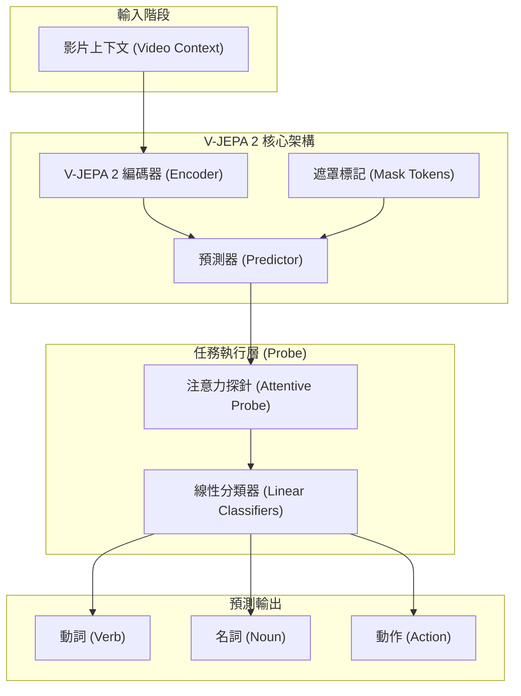
```mermaid
graph TD
    subgraph "輸入階段"
        A["影片上下文 (Video Context)"]
    end

    subgraph "V-JEPA 2 核心架構"
        B["V-JEPA 2 編碼器 (Encoder)"]
        C["預測器 (Predictor)"]
        D["遮罩標記 (Mask Tokens)"]
    end

    subgraph "任務執行層 (Probe)"
        E["注意力探針 (Attentive Probe)"]
        F["線性分類器 (Linear Classifiers)"]
    end

    subgraph "預測輸出"
        G["動詞 (Verb)"]
        H["名詞 (Noun)"]
        I["動作 (Action)"]
    end

    A --> B
    B --> C
    D --> C
    C --> E
    E --> F
    F --> G
    F --> H
    F --> I
```

---

## Part 10

Source note: V-JEPA 2 Self-Supervised Video Models Enable Understanding, Prediction and Planning (Part 10)

Original range: lines 331-359
Original chars: 71456-79991

<!-- source: V-JEPA 2 Self-Supervised Video Models Enable Understanding, Prediction and Planning (Part 10).md -->

### 探討 V-JEPA 2 在 EK100 任務中的局限性，並展示其作為視覺編碼器整合至 MLLM 架構中，在影片問答任務上達到最先進性能的過程與實驗結果。

#### 摘要

本段文本探討了 V-JEPA 2 模型在 EK100 基準測試中的局限性，並詳細介紹了其在「影片問答」（VidQA）任務中的表現。研究重點在於如何將 V-JEPA 2 作為視覺編碼器，透過「早期融合」（early fusion）架構整合進多模態大型語言模型（MLLM）中。文中描述了透過「視覺指令微調」（visual instruction tuning）的三階段訓練流程，以及透過擴展編碼器規模與解析度來提升模型性能的實驗結果。

#### 翻譯內文

對於失敗案例，V-JEPA 2 仍能提出連貫的動作，例如「關閉門」和「放下香料包」，但無法準確識別物件的具體性質（例如：「茶包」）。

###### 局限性

V-JEPA 2 與 EK100 基準測試存在若干局限性。首先，V-JEPA 2 並未完全解決 EK100 的問題，存在模型錯誤識別動詞、名詞或兩者皆錯的失敗案例。我們在第 13.2 節研究了這些失敗案例的分佈。其次，本文重點在於預測具有 1 秒預見時間（anticipation time）的動作。當預測的時間跨度（time horizons）變長時，V-進度 V-JEPA 2 的準確度會下降，詳見第 13.2 節。第三，EK100 基準測試僅限於廚房環境，且具有封閉且定義明確的詞彙表，我們尚不清楚 V-JEPA 2 對於其他環境的泛化能力如何。這限制了在 EK100 上訓練的模型之實用性與適用性。最後，EK100 中的動作是從固定的類別集中選取的，因此無法泛化到訓練集中不存在的動作類別。

#### 7 理解力：影片問答 (Video Question Answering)

在本節中，我們探索 V-JEPA 2 執行開放式語言影片問答（VidQA）的能力。為了賦予語言能力，我們採用了類似於 LLaVA 系列模型所推廣的「非標記化早期融合」（non-tokenized early fusion）設置，並使用 V-JEPA 2 作為視覺編碼器來訓練多模態大型語言模型（MLLM）。在此類 MLLM 家族中，透過將視覺編碼器的輸出特徵（patch embeddings）投影到大型語言模型（LLM）的輸入嵌入空間中，實現視覺編碼器與大型語言模型的對齊。隨後，可以對 MLLM 進行端到端訓練，或是保持視覺編碼器凍結狀態進行訓練。在用於 VidQA 的 MLLM 中，大多數使用的編碼器通常是影像編碼器，對於影片輸入，它們是針對每一影格獨立運作的。這類編碼器的常見實例包括 CLIP、SigLIP 和 Perception Encoder，選擇這些編碼器主要是因為它們透過影像-說明對（image-caption pairs）的預訓練，獲得了與語言的語義對齊。據我們所知，==我們的工作是首個使用「無需任何語言監督預訓練」的影片編碼器來訓練 VidQA MLLM 的研究。==

MLLM 在下游任務上的表現也高度依賴於對齊數據。在這些實驗中，我們使用了包含 8,850 萬個影像與影片-文本對的數據集，這與訓練 PerceptionLM 時使用的數據集相似。為了證明 V-JEPA 2 編碼器的有效性，我們首先在第 7.2 節的受控數據設置下，使用 1,800 萬個樣本的子集，將 V-JEPA 2 與其他最先進的視覺編碼器進行比較。接著，在相同的受控設置下，我們在第 7.3 節展示了擴展視覺編碼器規模與輸入解析度均能一致地提升 VidQA 的性能。最後，我們在第 7.4 節擴展了對齊數據，使用完整的 8,850 萬個樣本，來測試 V-JEPA 2 在語言對齊方面的極限。我們的結果表明，在受控數據設置下，與其他視覺編碼器相比，V-JEPA 2 在開放式 VidQA 任務中獲得了具競爭力的性能。隨著對齊數據的擴展，V-模組 V-JEPA 2 在多個 VidQA 基準測試中達到了最先進（SOTA）的性能。

##### 7.1 實驗設置

###### 影片問答任務

我們在 PerceptionTest 上進行評估，該測試衡量模型在記憶、抽象、物理和語義等不同技能上的表現。此外，我們在用於物理世界理解的 MVP 數據集上進行評估，該數據集利用最小影片對評估框架來減輕文本與外觀偏差。我們還在 TempCompass、TemporalBench 和 TOMATO 上進行評估，以調查模型的時序理解與記憶能力。最後，我們使用 MVBench 報告通用理解能力的結果（該基準測試偏向單影格外觀特徵）以及 TVBench（文獻中提議作為通用與時序理解之替代方案，用以減輕偏差）。

###### 視覺指令微調

為了評估 V-JEPA 2 表徵在視覺問答任務上的表現，我們使用 LLaVA 框架中的視覺指令微調程序將 V-JEPA 2 與 LLM 進行對齊。此過程涉及使用一個可學習的投影模組（通常是 MLP）將視覺編碼器的輸出（或視覺標記）轉換為 LLM 的輸入。我們遵循三階段漸進式流程來訓練 MLLM：第一階段，僅在影像說明數據上訓練投影器；第二階段，在大型影像問答數據上訓練完整模型；第三階段，在大型影片說明與問答數據上進一步訓練模型。==透過這種分階段訓練方法，LLM 能逐步提升其對視覺標記的理解。==視覺編碼器可以選擇凍結，或是與 MLLM 的其餘部分一同進行微調。我們探索了這兩種設置，因為凍結視覺編碼器能提供關於視覺特徵品質更純淨的訊號，而微調視覺編碼器則能獲得更好的整體性能。視覺指令訓練的更多細節見第 14 節。

**表 6：在凍結編碼器設置下，現成影像編碼器與 V-JEPA 2 的比較。** 所有實驗均使用相同的 LLM 骨幹網絡 (Qwen2-7 億參數指令微調版)、數據與訓練設置，且視覺編碼器保持凍結。PerceptionTest 準確度報告於 SFT 後的驗證集上。

| 方法 | 參數 (編碼器/LLM) | 平均值 | PerceptionTest (SFT/準確度) | MVP (配對準確度) | TempCompass (多選) | TemporalBench (MBA-短問答) | TVBench (準確度) | TOMATO (準確度) | MVBench (準確度) |
| :--- | :--- | :--- | :--- | :--- | :--- | :--- | :--- | :--- | :--- |
| **現成影像編碼器** | | | | | | | | | |
| DINOv2 ViT-g 518 | 1.1B/7B | 45.7 | 67.1 | 22.4 | 62.3 | 26.8 | 47.6 | 32.0 | 61.8 |
| SigLIP2 ViT-g 384 | 1.1B/7B | 48.1 | 72.4 | 26.2 | 66.8 | 25.7 | 48.7 | 33.2 | 64.0 |
| PE ViT-G/14 448 | 1.9B/7B | 49.1 | 72.3 | 26.7 | 67.0 | 27.5 | 51.6 | 34.0 | 64.7 |
| V-JEPA 2 ViT-g 512 | 1B/7B | 52.3 | 72.0 | 31.1 | 69.2 | 33.3 | 55. | 37.0 | 67.7 |

**表 7：擴展視覺編碼器規模與解析度。** 我們將視覺編碼器從 3 億參數擴展至 10 億參數，並將輸入解析度從 256 像素擴展至 512 像素。所有實驗均使用相同的 LLM 骨幹網絡 (Qwen2-7 億參數指令微調版)、數據與端到端訓練（不凍結視覺編碼器）設置。PerceptionTest 準確度報告於 SFT 後的驗證集上。==增加 V-JEPA 2 編碼器規模與解析度可提升 VidQA 任務的平均性能。==

| 方法 | 參數 (編碼器/LLM) | 平均值 | PerceptionTest (SFT/準確度) | MVP (配對準確度) | TempCompass (多選) | TemporalBench (MBA-短問答) | TVBench (準確度) | TOMATO (準確度) | MVBench (準確度) |
| :--- | :--- | :--- | :--- | :--- | :--- | :--- | :--- | :--- | :--- |
| **端到端評估** | | | | | | | | | |
| V-JEPA 2 ViT-L 256 | 300M/7B | 51.7 | 74.6 | 32.3 | 70.1 | 30.2 | 50.9 | 36.5 | 67.1 |
| V-JEPA 2 ViT-H 256 | 600M/7B | 52.0 | 74.7 | 30.6 | 70.9 | 29.8 | 54.6 | 35.1 | 68.0 |
| V-JEPA 2 ViT-g 256 | 1B/7B | 52.3 | 75.5 | 31.9 | 70.7 | 28.3 | 54.2 | 37.3 | 68.3 |
| V-JEPA 2 ViT-g 384 | 1B/7B | 54.0 | 76.5 | 33.0 | 71.7 | 33.1 | 56.5 | 39.0 | 68.5 |
| V-JEPA 2 ViT-g 512 | 1B/7 | 54.4 | 77.7 | 33.7 | 71.6 | 32.3 | 57.5 | 38.5 | 69.5 |

#### 詞彙與關鍵術語

| 英文術語 | 繁體中文翻譯 | 說明 |
| :--- | :--- | :--- |
| Early fusion | 早期融合 | 在模型處理的初期階段就將不同模態（如影像與文字）的資訊進行整合。 |
| Visual instruction tuning | 視覺指令微調 | 透過指令式的任務（如問答）來訓練模型，使其能理解視覺內容並以語言回應。 |
| Projector module | 投影模組 | 用於將視覺編碼器的輸出特徵空間轉換（投影）至語言模型輸入空間的層（如 MLP）。 |
| End-to-end training | 端到端訓練 | 從輸入到輸出直接進行訓練，不經過中間的人為人工特徵處理步驟。 |
| Off-the-shelf | 現成的 / 現有的 | 指直接使用現有的、未經特定任務修改的預訓練模型。 |
| Time horizons | 時間跨度 / 預見時間 | 模型預測未來動作所涵蓋的時間範圍。 |
| Visual tokens | 視覺標記 | 視覺編碼器輸出的特徵向量，在語言模型中被視為一種特殊的「單詞」。 |

#### 邏輯架構圖

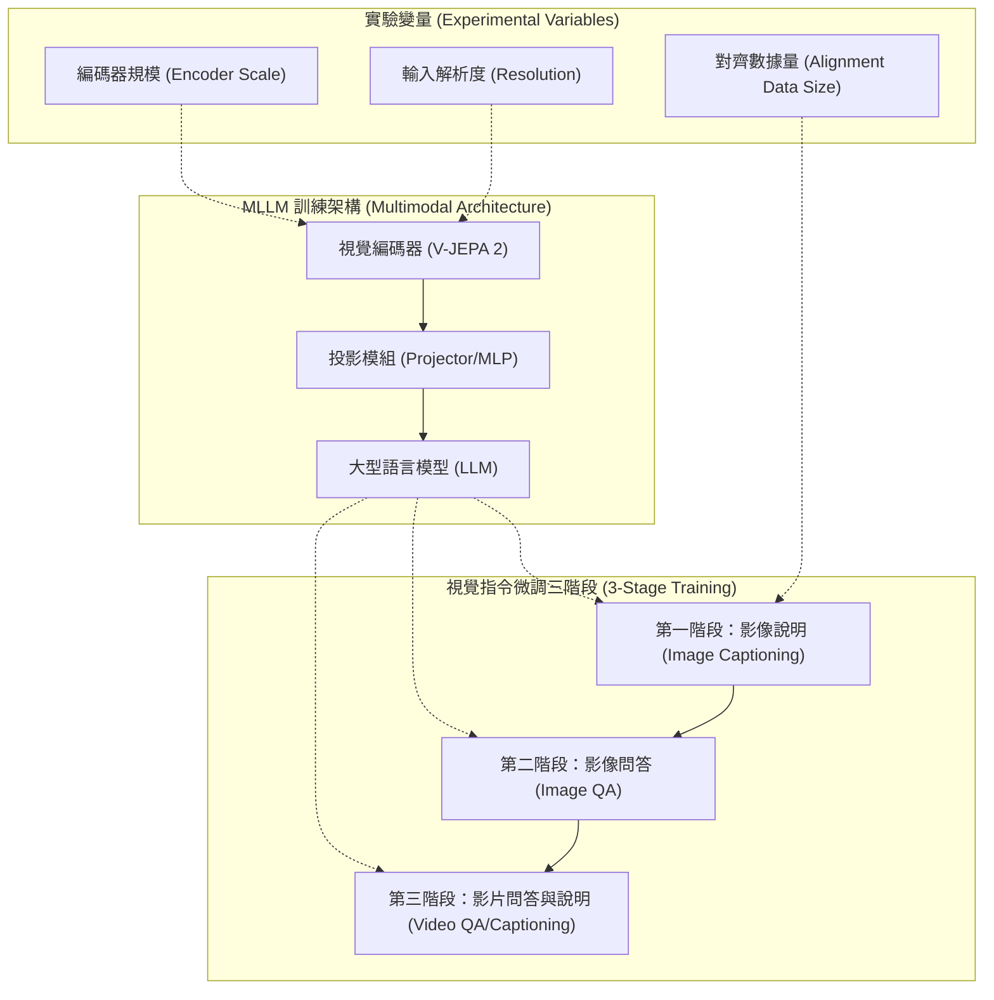
```mermaid
graph TD
    subgraph "MLLM 訓練架構 (Multimodal Architecture)"
        A["視覺編碼器 (V-JEPA 2)"] --> B["投影模組 (Projector/MLP)"]
        B --> C["大型語言模型 (LLM)"]
    end

    subgraph "視覺指令微調三階段 (3-Stage Training)"
        S1["第一階段：影像說明 (Image Captioning)"]
        S2["第二階段：影像問答 (Image QA)"]
        S3["第三階段：影片問答與說明 (Video QA/Captioning)"]

        S1 --> S2
        S2 --> S3
    end

    subgraph "實驗變量 (Experimental Variables)"
        V1["編碼器規模 (Encoder Scale)"]
        V2["輸入解析度 (Resolution)"]
        V3["對齊數據量 (Alignment Data Size)"]
    end

    C -.-> S1
    C -.-> S2
    C -.-> S3
    V1 -.-> A
    V2 -.-> A
    V3 -.-> S1
```

---

## Part 11

Source note: V-JEPA 2 Self-Supervised Video Models Enable Understanding, Prediction and Planning (Part 11)

Original range: lines 359-385
Original chars: 78969-87646

<!-- source: V-JEPA 2 Self-Supervised Video Models Enable Understanding, Prediction and Planning (Part 11).md -->

### Scaling the vision encoder size, input resolution, and alignment dataset size significantly improves V-JEPA 2's performance, enabling state-of-the-art results in video question answering (VidQA) and demonstrating task-agnostic generalization.

#### 摘要

本文件節錄自關於 V-JEPA 2 自監督影片模型的論文，重點探討了視覺編碼器（Vision Encoder）的規模化（Scaling）對多模態大型語言模型（MLLM）性能的影響。研究內容涵蓋三個核心維度：
1. **與影像編碼器的比較**：證明了不具語言監督的影片編碼器在時空理解任務上，能超越傳統具語言監督的影像編碼器（如 DINOv2, SigLIP）。
2. **編碼器規模與解析度**：透過增加參數規模（從 300M 提升至 1B）與增加輸入解析度（從 256 提升至 512），顯著提升了視覺問答（VidQA）的表現。
3. **數據規模化**：將影像-文本對齊數據集從 1,800 萬擴大至 8,850 萬，使模型在多項基準測試中達到技術領先地位（SOTA）。
最後，文章將此工作置於「世界模型（World Models）」的脈絡下，強調其具備任務無關（Task-agnostic）的泛化能力。

#### 翻譯內文

##### 7.2 與影像編碼器的比較

為了分離視覺編碼器對 MLLM 性能的貢獻，並將其與 V-JEPA 2 進行比較，我們建立了一個受控實驗環境：我們使用相同的 LLM 骨幹網路與訓練設定，分別使用不同的尖端（SOTA）編碼器來訓練個別的 MLLM。在此受控設定中，我們使用 Qwen2-7B-模組，並凍結視覺編碼器。我們使用了 1,800 萬個影像與影片-文本對齊的樣本。我們首先將預訓練於 $512 \times 512$ 解析度的 V-JEPA 2 與 DINOv2、SigLIP-2 及 Perception Encoder (PE) 進行比較。

我們觀察到，在凍結編碼器的設定下，V-JEPA 2 展現了極具競爭力的性能，在所有測試的基準測試中均優於 DINOv2、SigLIP 與 PE（如表 6 所示），唯獨在 PerceptionTest 任務中，V-JEPA 2 的表現略遜於 SigLIP 與 PE。這種進步在特別側重於時序理解（Temporal Understanding）的基準測試（如 MVP、TemporalBench 與 TVBench）中尤為明顯。此外，由於我們僅改變了視覺編碼器，這提供了一個證據：與傳統觀念相反，==一個在沒有語言監督下訓練的影片編碼器，其表現可以超越那些經過語言監督訓練的編碼器。==結果也顯示，在影片問答（VidQA）中使用影片編碼器而非影像編碼器，能提升時空理解（Spatiotemporal Understanding）的能力，這凸顯了開發更佳影片編碼器的必要性。

##### 7.3 擴展視覺編碼器規模與輸入解析度

先前研究指出，對於自監督影像編碼器而言，==擴大視覺編碼器的規模與輸入解析度能顯著提升視覺問答（VQA）的性能。==因此，我們將 V-JEPA 2 的參數規模從 3 億（300M）擴展至 10 億（1B），並將輸入解析度從 256 像素提升至 512 像素，結果如表 7 所示。在固定 256 像素解析度的情況下，當視覺編碼器容量從 300M 增加到 1B 時，我們觀察到 PerceptionTest 提升了 0.9 分、TVBench 提升了 3.3 分，以及 MVBench 提升了 1.2 分。此外，將輸入解析度提高到 512 像素，在所有下游任務中都帶來了進一步的提升，例如 PerceptionTest 提升了 2.2 分、TemporalBench 提升了 4.0 分，以及 TVBench 提升了 3.3 分。這些結果表明，進一步擴展視覺編碼器規模與輸入解析度是提升 VidQA 性能的一個極具前景的方向。

（表 8 說明：與現有技術領先水平的比較。我們使用完整的 8,850 萬樣本對齊數據集，並使用與 PLM 8B 相同的訓練方法，採用 Llama 3.1 作為骨幹網路。我們觀察到下游評估中有顯著進步，在 8B 參數級別的模型中取得了技術領先（SOTA）的結果。）

##### 7.4 透過擴展數據量提升技術領先地位

在受控實驗中深入了解 V-JEPA 2 訓練 MLLM 的能力後，我們研究了增加對齊數據集規模以提升 VidQA 技術領先地位的效果。正如先前研究觀察到的，下游任務性能的階段性躍升通常是透過增加訓練數據規模來實現的。為此，我們將 MLLM 的訓練數據從 1,800 萬規模擴大到了完整的 8,850 萬（擴大了 4.7 倍）。雖然增加模型解析度有助於提升下游性能，但也帶來了在 LLM 輸入中容納大量視覺標記（Visual Tokens）的挑戰。因此，我們選擇了 V-JEPA 2 ViT-g 384，這導致每幀產生 288 個視覺標記。我們遵循與 PLM 8B 相同的配方來訓練 V-JEPA 2 ViT-g 384，並使用 Llama 3.1 作為骨幹網路。為了簡化訓練過程，我們使用了一個不含池化（Pooling）功能的 MLP 投影模組。

數據規模化的擴展一致性地提升了下游基準測試的性能，在多個基準測試中（PerceptionTest, MVP, TempCompass, TemporalBench 與 TOMATO）取得了技術領先（SOTA）的結果。與目前的技術領先者 PerceptionLM 8B 相比，我們觀察到 PerceptionTest 測試集準確度增加了 1.3 分、MVP 配對準確度增加了 4.8 分、TempCompass 增加了 4.2 分、TemporalBench 短問答部分的雙進位（Multi-binary）準確度增加了 8.4 分，以及 TOMATO 準確度增加了 7.1 分。雖然 V-JEPA 2 在 TVBench 與 MVBench 上尚未超越 PerceptionLM，但其表現仍顯著優於其他相關的基準模型（如 InternVL 2.5, Qwen2VL 與 Qwen2.5VL）。這些結果強調了擴大視覺語言對齊訓練數據的需求，並證明了像 V-JEPA 2 這樣在沒有語言監督下預訓練的編碼器，在具備足夠規模時也能達到技術領先的水平。

#### 8 相關工作

###### 世界模型與規劃

早在相關研究中，人工智慧研究人員就一直致力於構建能夠使用「內部世界模型」的代理人（Agents）——透過對世界動力學（Dynamics）以及靜態環境地圖的建模，來實現高效的規劃與控制。先前的工作已在模擬任務、以及現實世界的移動與操作任務中研究了世界模型。這些世界模型方法或是直接在像素空間中學習預測模型，或是於學習到的表示空間中進行，亦或是利用更具結構化的表示空間（如關鍵點表示）。過去在機器人任務中展現出現實世界性能的方法，多半是訓練特定任務的世界模型，且依賴於機器人部署環境中的交互數據。其評估重點在於展示世界建模方法在既有任務空間內的性能，而非對新環境或未知物體的泛化能力。而在本研究中，==我們訓練的是一個「任務無關（Task-agnostic）」的世界模型，並展示了其對新環境與新物體的泛化能力。==

#### 詞彙與關鍵術語

| 英文術語 | 繁體中文翻譯 | 語境說明 |
| :--- | :--- | :--- |
| Self-Supervised | 自監督 | 指模型在沒有人工標籤的情況下，透過數據自身結構進行學習。 |
| Vision Encoder | 視覺編碼器 | 負責從影像或影片中提取特徵的網路組件。 |
| Language Supervision | 語言監督 | 使用文本標籤或描述來引導模型學習的過程。 |
| Spatiotemporal Understanding | 時空理解 | 同時理解影像中的空間結構與時間序列變化的能力。 |
| State-of-the-art (SOTA) | 技術領先地位 / 當前最佳 | 指目前在特定領域或任務中達到的最高性能標準。 |
| Task-agnostic | 任務無關 / 任務通用 | 指模型不針對特定任務設計，具備處理多種不同任務的能力。 |
| Alignment dataset | 對齊數據集 | 用於將視覺特徵與語言特徵映射到同一語義空間的數據。 |
| MLP Projector | MLP 投影模組 | 使用多層感知器將視覺特徵維度轉換至與 LLM 匹配的結構。 |

#### 邏輯架構圖

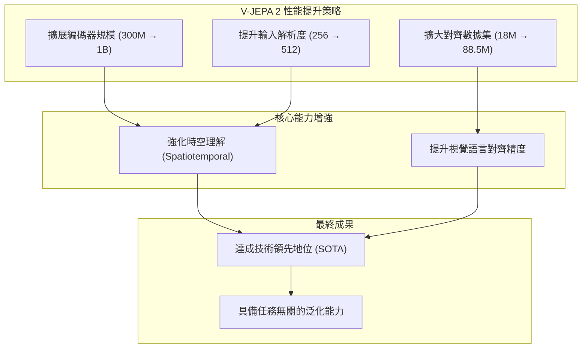
```mermaid
graph TD
    subgraph "V-JEPA 2 性能提升策略"
        A["擴展編碼器規模 (300M → 1B)"]
        B["提升輸入解析度 (256 → 512)"]
        C["擴大對齊數據集 (18M → 88.5M)"]
    end

    subgraph "核心能力增強"
        D["強化時空理解 (Spatiotemporal)"]
        E["提升視覺語言對齊精度"]
    end

    subgraph "最終成果"
        F["達成技術領先地位 (SOTA)"]
        G["具備任務無關的泛化能力"]
    end

    A --> D
    B --> D
    C --> E
    D --> F
    E --> F
    F --> G
```

---

## Part 12

Source note: V-JEPA 2 Self-Supervised Video Models Enable Understanding, Prediction and Planning (Part 12)

Original range: lines 385-443
Original chars: 86624-95385

<!-- source: V-JEPA 2 Self-Supervised Video Models Enable Understanding, Prediction and Planning (Part 12).md -->

### V-JEPA 2 introduces a task-agnostic world model that leverages self-supervised learning from web-scale and interaction data to enable zero-shot robotic planning and manipulation via Model Predictive Control (MPC).

#### 摘要

本文件節錄自關於 V-JEPA 2 自我監督影片模型的論文。內容重點討論了 V-JEPA 2 在世界模型（World Models）領域的定位，特別是它如何透過「任務通用型」（task-agnostic）的設計，與傳統依賴特定任務或專家軌跡（expert trajectories）的模型進行區隔。文中強調了使用「模型預測控制」（Model Predictive Control, MPC）而非單純的「策略學習」（policy learning）來避免對高品質遠端操作數據的依賴，並展示了該模型在零樣本（zero-shot）抓取操作任務中的潛力。此外，文中也概述了預訓練的超參數設定與未來研究方向，如處理更長時程（longer-horizon）的任務與整合語言指令。

#### 翻譯內文

##### 世界模型與控制

先前的工作已在模擬任務中研究了世界模型，以及在現實世界的移動與操作任務中進行了探索。世界模型的方法可以是在像素空間（pixel-space）中直接學習預測模型、在學習到的表示空間（representation space）中學習，或是利用更具結構化的表示空間（例如關鍵點表示法）。過去在機器人任務中展現出現實世界性能的方法，通常訓練的是特定任務的世界模型，且依賴於機器人部署環境中的交互數據。其評估重點在於展示世界模型方法在已探索任務空間內的性能，而非對新環境或未知物體的泛化能力。在本文中，我們訓練了一個任務通用型（task-agnostic）的世界模型，並展示了其對新環境與新物體的泛化能力。

近期的一些研究利用了網路規模的影片與交互數據，來訓練用於自主機器人的通用型（任務通用型）動作條件化影片生成模型。然而，到目前為止，這些方法僅展示了在給定機器人動作時生成視覺上有效計畫的能力，但尚未展示出使用這些模型來實際控制機器人的能力。

其他研究探索了將生成式建模整合到策略學習中。與此類研究不同，==我們的目標是透過「模型預測控制」（Model Predictive Control, MPC）來利用世界模型，而非透過策略學習，以避免需要專家軌跡的模仿學習階段。==這兩種方法是正交的，並可以在未來的研究中結合。與我們最接近的工作顯示，可以分階段或端到端地學習世界模型，並使用它來零樣本地解決規劃任務。雖然那些先前的工作專注於小規模的規劃評估，但我們展示了類似的原理可以擴展並用於解決現實世界的機器人任務。

###### 用於機器人控制的視覺-語言-動作模型

近期在現實世界機器人控制中的模仿學習方法，在學習具有日益增強泛化能力的策略方面取得了顯著進步。這是透過利用在網路規模的影片與文本數據上預訓練的視覺-語言模型來實現的，隨後透過使用專家演示的行為複製（behavior cloning）進行微調（或適應），使其也能預測動作。儘尋雖然這些方法展示了極具前景的泛化結果，但由於缺乏明確的世界預測模型且未利用推理時計算進行規劃，目前尚不清楚它們是否能夠學習預測訓練數據中未曾演示過的行為。這些方法需要高品質的大規模遠端操作數據，且只能利用成功的軌跡。相比之下，我們專注於利用任何交互數據，無論是與環境的成功交互還是失敗交互。

###### 視覺基礎模型

電腦視覺中的影片基礎模型已經證明，由圖像和/或影片組成的大規模觀測數據集，可以透過圖像的自我監督學習方法，被用來學習在廣泛下游任務中表現良好的通用視覺編碼器，或是利用弱語言監督，或是兩者的結合。然而，先前的工作往往傾向於在與大型語言模型對齊後，使用探針式評估（probe-based evaluation）或視覺問答（VQA）任務進行理解能力的評估。雖然這些任務推動了進步，但讓代理人（agent）能夠與物理世界互動，仍是視覺系統的一個重要目標。除了視覺理解任務的結果外，我們還研究了來自影片的大規模自我監督學習如何能夠以零樣本的方式解決新環境中的規劃任務。

#### 9 結論

本研究證明了聯合嵌入預測架構（JEPA）如何透過從網路規模數據和少量機器人交互數據中進行自我監督學習，產生一個能夠在物理世界中進行理解、預測與規劃的世界模型。V-JEPA 2 在需要運動理解與人類動作預測的動作分類任務上達到了尖端性能（SOTA）。當與大型語言模型對齊時，V-JEPA 2 在影片問答任務上也優於先前的視覺編碼器。此外，使用 V-解析表示空間對動作條件化世界模型（V-JEPA 2-AC）進行後訓練，使得在現實機器人上實現成功的零樣本抓取操作任務（例如取放操作，Pick-and-Place）成為可能。這些發現表明，V-JEPA 2 是開發能夠在環境中有效感知與行動的高級人工智慧系統的一大步。

###### 未來工作

未來研究有幾個重要的方向可以解決 V-JEPA 2 的局限性。首先，在本研究中，我們專注於需要預測未來大約 16 秒的任務。這使得從單一目標圖像進行簡單操作任務（如抓取與攜帶物體）的規劃成為可能。然而，若要在不需要子目標的情況下，將此擴展到更長時程（longer-horizon）的任務（如取放操作或更複雜的任務），將需要建模方面的進一步創新。==開發能夠在不同抽象層級、跨多個空間與時間尺度進行預測的分層模型，是一個充滿前景的方向。==

其次，如第 4 節所述，V-JEPA 2-AC 目前依賴於指定為圖像目標的任務。雖然這對某些任務來說很自然，但在其他情況下，基於語言的目標指定可能更為理想。將 V-JEPA 2-AC 擴展到接受基於語言的目標（例如，讓模型能夠將基於語言的目標嵌入到 V-JEPA 2-AC 的表示空間中），是未來工作另一個重要的方向。第 7 節中描述的將 V-JEPA 2 與語言模型對齊的結果，可以作為一個起點。

最後，在本研究中，我們將 V-JEPA 2 模型擴展到了適度的 10 億（1B）參數規模。第 2 節的結果顯示，在擴展到此規模時性能持續提升。先前的工作已研究將視覺編碼器擴展到高達 200 億（20B）參數。在這一方向上，需要進一步的工作來開發可擴展的預訓練方案，以實現隨規模擴大而持續的性能提升。

#### 10 V-JEPA 2 預訓練

##### 10.1 預訓練超參數

如第 2.4 節所述，我們的訓練流程包含兩個階段：1) 恆定學習率階段，以及 2) 冷卻階段。對於所有模型，我們在第一階段訓練，直到我們觀察到在 IN1K、COIN 和 SSv2 任務上的性能達到平台期或下降。此時，我們啟動冷卻階段。

**表 9：預訓練超參數。大型電腦視覺模型預訓練的通用參數。我們報告了主要訓練階段與冷卻階段的這些參數。**

| 參數 | 主要階段 | 冷卻階段 |
| --- | --- | --- |
| 幀數 (Number of frames) | 16 | 64 |
| 每秒幀數 (FPS) | 4.0 | 4.0 |
| 裁剪尺寸 (Crop Size) | 256 | \[256, 384, 512\] |
| 隨機縮放長寬比 (Random Resize Aspect Ratio) | \[0.75, 1.35\] | \[0.com, 1.35\] |
| 隨機縮放比例 (Random Resize Scale) | \[0.3, 1.0\] | \[0.3, 1.0\] |
| 步數 (Steps) | 可變 | 12000 |
| 預熱步數 (Warmup Steps) | 12000 | 不適用 |
| 批次大小 (Batch Size, 全域) | 3072 | 3072 |
| 起始學習率 (Starting Learning Rate) | 1e-4 | 5.25e-4 |
| 最終學習率 (Final Learning Rate) | 5.25e-4 | 1e-6 |
| 權重衰減 (Weight Decay) | 0.04 | 0.04 |
| 指數移動平均 (EMA) | 0.99925 | 0.99925 |
| 空間遮罩比例 (Spatial Mask Scale) | \[0.15, 0.7\] | \[0.15, 0.7\] |
| 時間遮罩比例 (Temporal Mask Scale) | \[1.0, 1.0\] | \[1.0, 1.0\] |
| 遮罩長寬比 (Mask Aspect Ratio) | \[0.75, 1.5\] | \[0.75, 1.5\] |
| Tubelet 大小 (Tubelet Size) | 2 | 2 |
| Patch 大小 (Patch Size) | 16 | 16 |

#### 詞彙與關鍵術語

| 英文術語 | 繁體中文翻譯 | 說明 |
| :--- | :--- | :--- |
| Task-agnostic | 任務通用型 / 任務無關的 | 指模型不針對特定任務設計，具備處理未知任務的能力。 |
| Model Predictive Control (MPC) | 模型預測控制 | 一種利用預測模型來規劃未來動作的控制策略。 |
| Policy learning | 策略學習 | 透過數據學習如何從特定狀態轉向動作的過程。 |
| Imitation learning | 模仿學習 | 透過模仿專家軌跡來學習行為的學習範式。 |
| Behavior cloning | 行為複製 | 模仿學習中最基礎的方法，直接從專家數據中學習映射。 |
| Zero-shot | 零樣本 | 在沒有針對特定新任務進行額外訓練的情況下直接執行任務。 |
| Prehensile manipulation | 抓取操作 / 夾持操作 | 涉及使用機器人末端執行器夾持或移動物體的任務。 |
| Long-horizon tasks | 長時程任務 | 需要一系列複雜、跨越較長時間步驟的任務。 |

#### 邏輯架構圖

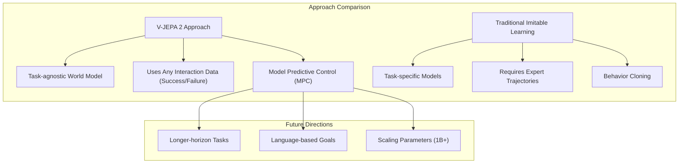
```mermaid
graph TD
  subgraph "Approach Comparison"
    A["V-JEPA 2 Approach"] --> B["Task-agnostic World Model"]
    A --> C["Uses Any Interaction Data (Success/Failure)"]
    A --> D["Model Predictive Control (MPC)"]

    E["Traditional Imitable Learning"] --> F["Task-specific Models"]
    E --> G["Requires Expert Trajectories"]
    E --> H["Behavior Cloning"]
  end

  subgraph "Future Directions"
    I["Longer-horizon Tasks"]
    J["Language-based Goals"]
    K["Scaling Parameters (1B+)"]
  end

  D --> I
  D --> J
  D --> K
```

---

## Part 13

Source note: V-JEPA 2 Self-Supervised Video Models Enable Understanding, Prediction and Planning (Part 13)

Original range: lines 421-501
Original chars: 94363-102586

<!-- source: V-JEPA 2 Self-Supervised Video Models Enable Understanding, Prediction and Planning (Part 13).md -->

### 詳細說明 V-JEPA 2 的預訓練超參數設置、透過聚類與加權採樣進行的 YT1B 數據策劃流程，以及模型規模從 ViT-L 到 ViT-g 的擴展細節。

#### 摘要

本文件詳細說明了 V-JEPA 2 模型在預訓練階段的超參數設置、數據策劃（Data Curation）流程以及模型規模擴展（Scaling）的策略。內容涵蓋了從「主要階段」（Primary Phase）到「冷卻階段」（Cooldown Phase）的學習率調整、幀數與裁剪尺寸的變化，並深入解析了如何透過場景提取、聚類（Clustering）與加權採樣技術，將原始的 YT1B 數據集精煉為符合目標分佈的策劃數據集。此外，文中也記錄了編碼器從 ViT-L 到 ViT-g 的參數規模擴展細節。

#### 翻譯內文

在 IN1K、COIN 和 SSv2 任務上取得成果後，我們此時啟動了冷卻階段。

**表 9：預訓練超參數。** 大型電腦視覺模型預訓練的常用參數。我們分別報告了主要訓練階段與冷變階段的這些參數。

| 參數 | 主要階段 | 冷卻階段 |
| --- | --- | --- |
| 幀數 (Number of frames) | 16 | 64 |
| 每秒幀數 (FPS) | 4.0 | 4.0 |
| 裁剪尺寸 (Crop Size) | 256 | \[256, 384, 512\] |
| 隨機縮放長寬比 (Random Resize Aspect Ratio) | \[0.75, 1.35\] | \[0.75, 1.35\] |
| 隨機縮放比例 (Random Resize Scale) | \[0.3, 1.0\] | \[0.3, 1.0\] |
| 訓練步數 (Steps) | 可變 | 12000 |
| 預熱步數 (Warmup Steps) | 12000 | 無 |
| 批量大小 (Batch Size, 全域) | 3072 | 3072 |
| 起始學習率 (Starting Learning Rate) | 1e-4 | 5.25e-4 |
| 最終學習率 (Final Learning Rate) | 5.25e-4 | 1e-6 |
| 權重衰減 (Weight Decay) | 0.04 | 0.04 |
| 指數移動平均 (EMA) | 0.99925 | 0.99925 |
| 空間遮罩比例 (Spatial Mask Scale) | \[0.15, 0.7\] | \[0.15, 0.7\] |
| 時間遮罩比例 (Temporal Mask Scale) | \[1.0, 1.0\] | \[1.0, 1.0\] |
| 遮罩長寬比 (Mask Aspect Ratio) | \[0.75, 1.5\] | \[0.75, 1.5\] |
| Tubelet 大小 (Tubelet Size) | 2 | 2 |
| Patch 大小 (Patch Size) | 16 | 16 |

第一階段的訓練始於 12,000 步的學習率預熱，隨後在該階段剩餘時間內保持恆定學習率。我們每 60,000 步進行一次評估檢查。冷卻階段始於 5.25e-4 的學習率，並線性下降至最終學習率。在兩個階段中，所有其他超參數均保持不變。

在冷卻階段，我們增加了每個片段的幀數，同時保持每秒幀數（FPS）不變，因為我們觀察到餵入更多幀數對模型帶來了顯著益處（參見圖 5）。此外，我們在此階段也增加了模型的裁剪尺寸，這對 IN1K 等任務帶來了實質性的提升，其表現從 256 裁剪尺寸下的 84.6 提升至 384 裁剪尺寸下的 85.1。兩個階段的超參數總結於表 9。

**表 10：簡化版預訓練超參數。** 大型電腦視覺模型預訓練的常用參數，針對我們的簡化方案（Abbreviated Recipe）。

| 參數 | 簡化方案 |
| --- | --- |
| 幀數 (Number of frames) | 16 |
| 每秒幀數 (FPS) | 4.0 |
| 裁剪尺寸 (Crop Size) | 256 |
| 隨機縮放長寬比 (Random Resize Aspect Ratio) | \[0.75, 1.35\] |
| 隨機縮放比例 (Random Resize Scale) | \[0.3, 1.0\] |
| 訓練步數 (Steps) | 90000 |
| 預熱步數 (Warmup Steps) | 12000 |
| 批量大小 (Batch Size, 全域) | 3072 |
| 起始學習率 (Starting Learning Rate) 2e-4 | 6.25e-4 |
| 最終學習率 (Final Learning Rate) | 1e-6 |
| 起始權重衰減 (Starting Weight Decay) | 0.04 |
| 最終權重衰減 (Final Weight Decay) | 0.4 |
| 起始 EMA (Starting EMA) | 0.999 |
| 最終 EMA (Final EMA) | 1.0 |
| 空間遮罩比例 (Spatial Mask Scale) | \[0.15, 0.7\] |
| 時間遮罩比例 (Temporal Mask Scale) | \[1.0, 1.0\] |
| 遮罩長寬比 (Mask Aspect Ratio) | \[0.75, 1.5\] |
| Tubelet 大小 (Tubelet Size) | 2 |
| Patch 大度 (Patch Size) | 16 |

在整個附錄中，我們所指的「簡化」訓練方案是指遵循 [^6] 流程、總計 90,000 步的訓練。與簡化方案相比，有幾個關鍵差異。首先是學習率：簡化方案始於線性預熱，隨後進行餘弦退火（Cosine Decay）。其次是權重衰減與 EMA 的排程，它們從起始值線性增加到最終值。最後是總步數，被限制在 90,000 步。我們在多種數據混合的消融實驗中使用簡化排程，因為這允許我們在較短的計算預算下探究數據策劃（Data Curation）的效果。

##### 10.2 預訓練數據

我們透過應用 PySceneDetect 函式庫進行場景提取，從而開始 YT1B 的數據策劃，該函式庫會在場景轉換處將影片分割成片段。我們捨棄了短於 4 秒的場景，保留了 3.16 億個場景。接著，將 DINOv2 ViT-L 模型應用於每個片段的中間幀，以提取場景嵌入（Embeddings）。隨後，使用與 [^87] 相同的聚類策略，將 YT1B 的嵌入向量聚類為 150 萬個簇（Clusters）。對於目標分佈中的所有影片，也以相同方式提取嵌入，並分配到最近的 YT1B 簇中。我們僅保留至少分配到一個目標影片的簇——在原始 150 萬個簇中約剩餘 21 萬個。保留下來的簇包含 1.15 億個場景。

基於簇的檢索雖然能匹配目標分佈的內容，但無法匹配其權重。因此，我們使用一種加權採樣方案來重新平衡數據，使其更好地匹配目標分佈。我們使用加權採樣策略從簇中進行採樣：$w_{c}=\sum_{format d=1}^{D}w_{d}\times\frac{N_{d,c}}{N_{d}}$，其中 $w_{c}$ 是第 $c$ 個簇的權重係數，$w_{d}$ 是第 $d$ 個目標數據集的權重係數（來自表 11），$N_{d,c}$ 是第 $d$ 個數據集中出現在第 $c$ 個簇中的樣本數，$N_{d}$ 是第 $d$ 個數據集的總樣本數，$D$ 是目標數據集的總數。我們根據每個目標數據集檢索到的場景數量來分配檢索權重，並為 EpicKitchen 分配了額外的權重。這最終得到了一個在統計特性上與文獻中手工製作的數據集更接近的策劃數據集。我們發現，單獨使用策劃過的 YT1B 取代未經策劃的版本，在下游理解任務上能獲得更好的結果（參見圖 4）。

**表 11：數據策劃統計數據。** 我們總結了從 YT1B 提取的各個簇中提取出的場景數量與影片時長。最後一行包含了 K710、SSv2、COIN 和 EpicKitchen 檢索中的重複部分。

| 檢索目標 | 簇數量 | 場景數量 | 檢索權重 |
| --- | --- | --- | --- |
| 未經策劃的 YT1B | 1.5M | 316M | |
| K710 | 170k | 100M | 0.7 |
| SSv2 | 41k | 19M | 0.125 |
| COIN | 37k | 21M | 0.125 |
| EpicKitchen | 4k | 13k | 0.05 |
| 最終策劃數據集 (包含重複) | 210k | 115M | |

使用此策略檢索到的簇與場景總量統計如表 11 所示。整體數據集向 K710 檢索到的簇傾斜。結合其 0.7 的檢索權重，使得整體策劃數據集具有較重的 Kinetics 權重，這反映在我們消融實驗的 K400 性能表現中（參見第 10.4.1 節）。如正文表 1 所示，我們將此策劃過的 YT1B 與 SSv2、Kinetics、HowTo100M 和 ImageNet 相結合，構建了最終的 VM22M 數據集。

##### 10.3 模型規模擴展

模型架構的細節如表 12 所示。所有模型都參數化為視覺 Transformer (Vision Transformers)，使用標準的 $16\times 16$ Patch 大小。在擴展模型規模時，我們將編碼器從 ViT-L（3 億參數）增加到 ViT-g（10 億參數），而預測器（Predictor）的大小在所有預訓練實驗中保持固定。

**表 12：模型架構細節。** V-JEPA 2 預訓練期間使用的編碼器與預測器架構系列，包含部分主要參數。

| 模型 | 參數 (Params) | 寬度 (Width) | 深度 (Depth) | 標頭 (Heads) | MLP | 嵌入器 (Embedder) |
| --- | --- | --- | --- | --- | --- | --- |
| **編碼器 (Encoders): $E_{\theta}(\cdot)$** | | | | | | |
| ViT-L | 300M | 1024 | 24 | 16 | 4096 | $2\times 16\times 16$ 步長卷積 |
| ViT-H | 600M | 1280 | 32 | 16 | 5120 | $2\times 16\times 16$ 步長卷積 |
| ViT-g | 1B | 1408 | 40 | 22 | 6144 | $2\times 16\times 16$ 步長卷積 |
| **預測器 (Predictor): $P_{\phi}(\cdot)$** | | | | | | |
| ViT-s | 22M | 384 | 12 | 12 | 1536 | N.A. |

#### 詞彙與關鍵術語

| 英文術語 | 繁體中文翻譯 | 說明 |
| --- | --- | --- |
| Primary Phase | 主要階段 | 預訓練的第一階段，通常包含學習率預熱。 |
| Cooldown Phase | 冷卻階段 | 預訓練的第二階段，用於微調模型權重與參數。 |
| Data Curation | 數據策劃 | 透過篩選、清洗與重組數據，以優化訓練品質的過程。 |
| Learning rate warmup | 學習率預熱 | 在訓練初期以較低學習率開始，逐漸增加至目標值的技術。 |
| Weighted sampling | 加權採樣 | 根據預設權重來決定樣本被選中機率的抽樣方法。 |
| Encoder | 編碼器 | 模型中負責提取特徵的核心組件。 |
| Predictor | 預測器 | 在自監督學習中，負責根據遮蔽特徵預測缺失資訊的組件。 |
| Scene extraction | 場景提取 | 從影片中識別並分割出不同場景的過程。 |
| Embedding | 嵌入 | 將高維數據（如影像）轉換為低維向量表示的過程。 |

#### 數據策劃流程邏輯

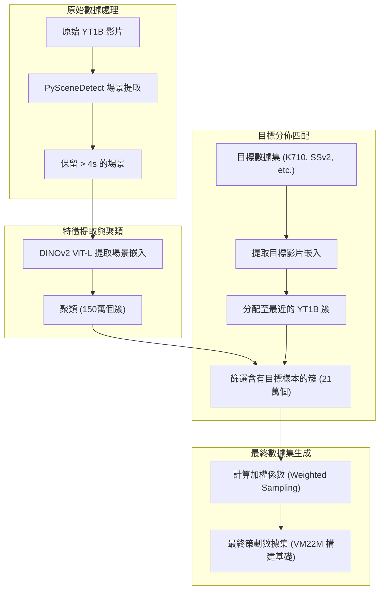
```mermaid
graph TD
    subgraph "原始數據處理"
        A["原始 YT1B 影片"] --> B["PySceneDetect 場景提取"]
        B --> C["保留 > 4s 的場景"]
    end

    subgraph "特徵提取與聚類"
        C --> D["DINOv2 ViT-L 提取場景嵌入"]
        D --> E["聚類 (150萬個簇)"]
    end

    subgraph "目標分佈匹配"
        F["目標數據集 (K710, SSv2, etc.)"] --> G["提取目標影片嵌入"]
        G --> H["分配至最近的 YT1B 簇"]
        E --> I["篩選含有目標樣本的簇 (21萬個)"]
        H --> I
    end

    subgraph "最終數據集生成"
        I --> J["計算加權係數 (Weighted Sampling)"]
        J --> K["最終策劃數據集 (VM22M 構建基礎)"]
    end
```

---

## Part 14

Source note: V-JEPA 2 Self-Supervised Video Models Enable Understanding, Prediction and Planning (Part 14)

Original range: lines 501-553
Original chars: 101564-110067

<!-- source: V-JEPA 2 Self-Supervised Video Models Enable Understanding, Prediction and Planning (Part 14).md -->

### 探討數據策劃、訓練時程與評估參數對 V-JEPA 2 模型性能的影響，並定義 V-JEPA 2-AC 的後訓練超參數與機器人任務規劃邏輯。

#### 摘要

本文件節錄自關於 V-JEPA 2 自監督影片模型的論文，主要探討了三個關鍵實驗維度：
1. **數據策劃（Data Curation）的影響**：分析了使用精選數據（Curated）與混合數據（Mixed）在不同模型規模（ViT-L 與 ViT-g）下的表現差異。
2. **訓練時程與冷卻階段（Cooldown）**：探討了兩階段訓練策略，特別是學習率退火（Annealing）與冷卻階段對性能提升的貢獻。
3. **評估時影片長度的作用**：證實增加推理時的影片幀數能顯著提升下游任務的準確度。
此外，文件詳細記錄了 **V-JEPA 2-AC** 模型在機器人操作任務（如抓取、取放）中的後訓練超參數設定與子目標（Sub-goal）規劃邏輯。

#### 翻譯內文

##### 10.4 附加結果

###### 10.4.1 數據策劃的效果

表 13 展示了數據策劃對下游分類任務子集的影響結果。在此實驗中，我們使用原版 V-JEPA [^6] 的簡化訓練方案，分別在 ViT-L 和 ViT-g 規模下進行訓練。==當訓練較小規模的模型（ViT-L）時，使用精選版的 YT1B 數據進行訓練，相較於未經策劃的版本，表現呈現全面性的提升。==然而，當轉向混合數據設定（即加入圖像與人工選取的影片）時，使用精選數據的模型在部分任務上的性能反而下降，例如在 SSv2 任務上，VM22M（混合+精選 YT1 1B）的得分為 72.8，低於 Mixed+Uncurated YT1B 的 73.3。在某些案例中，僅使用精選 YT1B 訓練的模型優於混合數據模型，例如在 COIN（86.5 vs. 86.25）和 K400（84.6 vs. 83.7）評估任務中。這個結果有些令人驚訝，因為儘管在混合設定中加入了 K710 訓練數據，我們發現對於 K400 評估任務，它並未比精選 YT1B 帶來更好的性能。

（表 13 略：展示了 ViT-L 與 Vi-Tg 規模下，不同數據集組合對 IN1K, COIN, SSv2, K400 任務的影響。）

然而，這種行為並非在所有規模下都一致。在 ViT-g 規模下，VM22M（混合+精選 YT1B）在所有任務上均優於 Mixed+Uncurated YT1B。

（圖 12 說明：V-JEPA 2 預訓練的數據策劃效果。展示了模型性能隨預訓練「週期（epoch）」變化的趨勢。使用未經策劃數據的模型在 600 週期後性能開始下降。）

當採用長訓練時程時，如圖 12 所示，我們在 ViT-g 規模下繼續觀察到 VM22M 與 Mixed+Uncurated YT1B 之間的差異。初始階段，兩者的提升速率大致相同，但在 600 週期後性能出現分歧，此時使用未經策劃數據的模型無法持續進步。

###### 10.4.2 長訓練時程與冷卻階段的效果

在表 14 中，我們展示了兩階段訓練過程的效果。與表 13 中的 ViT-g 結果相比，我們發現相較於冷卻階段前的恆定學習率時程，簡化時程表現更佳。==主要的效益來自於冷卻階段，該階段結合了 64 幀的預訓練與學習率衰減（Ramped down learning rate）。==這使得所有評估指標均獲得了超過一個百分點的顯著提升。

（表 14 略：展示了 ViT-g 模型在不同解析度下，進行冷卻階段後的性能提升。）

###### 10.4.3 評估時影片長度的影響

（圖 13 說明：評估期間影片時長的影響。透過在較長的影片片段上進行推理，任務性能會進一步提升。所有評估均使用在 256 $\times$ 256 解析度下使用 64 幀進行退火訓練的 ViT-g 模型。受限於記憶體，結果採用單片段評估協議。==在推理時增加處理的幀數，可將平均性能提升高達 +9.7 個百分點。==）

圖 13 檢驗了輸入影片時長如何影響評估期間的下游任務性能。使用在 64 幀片段上預訓練的模型，當評估時的影片時長從 16 幀增加到 6 幀時，我們觀察到平均提升了 $+9.7$ 個百分點。

##### 11 V-JEPA 2-AC 後訓練

###### 11.1 後訓練超參數

V-JEPA 2-AC 模型使用 AdamW [^77] 優化器進行訓練，採用「預熱-恆定-衰減（warmup-constant-decay）」的學習率策略，並使用 $0.04$ 的恆定權重衰減。我們在 4500 次迭代中將學習率從 $7.5\times 10^{-5}$ 線性預熱至 $4.25\times 10^{-4}$，隨後保持恆定 85500 次迭代，最後在 4500 次迭代中衰減至 $0$。我們使用的 Batch Size 為 256，包含從 Droid 原始數據集中隨機採樣的 4 秒影片片段（幀率為 4 fps）。==我們針對 Droid 的左側外接相機視角進行訓練——雖然也可以使用右側相機視角，但我們發現若不額外加入相機位置的條件化，同時使用左右視角訓練反而會降低性能。==為求簡化，我們捨棄了任何短於 4 秒的影片，最終用於訓練的影片總時長不足 62 小時。我們對採樣的影片片段應用了隨機縮放裁剪（random-resize-crop）增強，長寬比採樣範圍為 (0.75, 1.35)。

###### 11.2 機器人任務定義

圖 14 展示了在實驗室 1 中進行「杯子抓取操作」任務的起始幀與目標幀範例。對於「抓取（grasp）」與「攜帶物體到達（reach with object）」任務，模型僅接收單一目標圖像。==對於「取放（pick-and-place）」任務，除了最終目標外，我們還向模型提供兩個子目標圖像。==第一個目標圖像顯示物體正被抓取，第二個目標圖像顯示物體位於目標位置附近。模型首先針對第一個子目標優化 4 個時間步的動作，隨後自動切換到第二個子目標進行接下來的 10 個時間步，最後在最後 4 個時間步切換到第三個目標。在使用 V-JEPA 2-AC 進行規劃時，我們使用 800 個樣本，並基於前一次迭代的前 10 個樣本進行 10 步精煉，規劃時界（planning horizon）設定為 $1$。由於所有考慮的任務都相對具備貪婪性（greedy），我們發現短規劃時界對於我們的設定已足夠。雖然較長的規劃時界也能運作良好，但會消耗更多的規劃時間。

（圖 14(a) 說明：抓取杯子。）

#### 詞彙與關鍵術語

| 英文術語 | 繁體中文翻譯 | 語境說明 |
| :--- | :--- | :--- |
| Data Curation | 數據策劃 / 數據篩選 | 指對原始數據進行篩選、清洗以提升品質的過程。 |
| Annealed / Cooldown | 退火 / 冷卻階段 | 指在訓練後期降低學習率以穩定模型性能的過程。 |
| Planning Horizon | 規劃時界 | 在模型預測控制中，指模型考慮未來動作的時間範圍。 |
| Prehensile manipulation | 抓取操作 | 機器人學中涉及使用夾具或手指抓取物體的動作。 |
| Sub-goal | 子目標 | 將複雜任務分解為一系列較小的中間目標。 |
| Learning rate decay | 學習率衰減 | 隨著訓練進行逐漸降低學習率的技術。 |
| Greedy | 貪婪的 | 在規劃中指僅考慮當前步的最優解，而不考慮長遠影響。 |

#### 邏輯結構圖

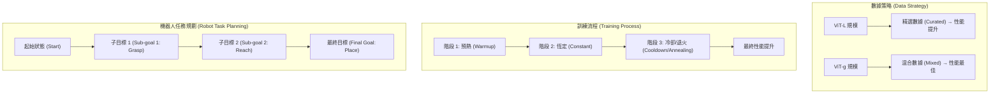
```mermaid
graph TD
    subgraph "數據策略 (Data Strategy)"
        ViTL規模["ViT-L 規模"] --> 精選數據Curatedrightarrow性能提["精選數據 (Curated) → 性能提升"]
        ViTg規模["ViT-g 規模"] --> 混合數據Mixedrightarrow性能最佳["混合數據 (Mixed) → 性能最佳"]
    end

    subgraph "訓練流程 (Training Process)"
        階段1預熱Warmup["階段 1: 預熱 (Warmup)"] --> 階段2恆定Constant["階段 2: 恆定 (Constant)"]
        階段2恆定Constant["階段 2: 恆定 (Constant)"] --> 階段3冷卻退火CooldownAnnealing["階段 3: 冷卻/退火 (Cooldown/Annealing)"]
        階段3冷卻退火CooldownAnnealing["階段 3: 冷卻/退火 (Cooldown/Annealing)"] --> 最終性能提升
    end

    subgraph "機器人任務規劃 (Robot Task Planning)"
        起始狀態Start["起始狀態 (Start)"] --> 子目標1Subgoal1Grasp["子目標 1 (Sub-goal 1: Grasp)"]
        子目標1Subgoal1Grasp["子目標 1 (Sub-goal 1: Grasp)"] --> 子目標2Subgoal2Reach["子目標 2 (Sub-goal 2: Reach)"]
        子目標2Subgoal2Reach["子目標 2 (Sub-goal 2: Reach)"] --> 最終目標FinalGoalPlace["最終目標 (Final Goal: Place)"]
    end
```

---

## Part 15

Source note: V-JEPA 2 Self-Supervised Video Models Enable Understanding, Prediction and Planning (Part 15)

Original range: lines 549-590
Original chars: 109045-118870

<!-- source: V-JEPA 2 Self-Supervised Video Models Enable Understanding, Prediction and Planning (Part 15).md -->

### The V-JEPA 2-AC world model demonstrates intuitive physics understanding through visual reconstruction, but its inferred coordinate axis is sensitive to camera position, potentially causing systematic rotation errors.

#### 摘要

本文件節錄自關於 V-JEPA 2 自監督影片模型的論文，主要討論了兩個核心議題：首先是 **世界模型預測的可視化**，透過訓練一個幀解碼器（frame decoder）來將隱含表示轉換為像素，展示了模型在捕捉顯著特徵與直覺物理（如重力、物體恆常性）方面的能力；其次是 **相機位置敏感度分析**，研究發現模型推論的座標軸會隨相機位置改變而產生旋轉誤差，並提出了一種透過線性最小平方法進行「無監督校準」的潛在方法。

#### 翻譯內文

##### 11.2 任務規劃細節（續）

在實驗室的實驗中，對於「抓取 (grasp)」與「帶著物體觸及 (reach with object)」任務，模型會接收單一目標圖像。對於「取放 (pick-and-place)」任務，除了最終目標外，我們還會向模型提供兩個子目標圖像：第一個目標圖像顯示物體正被抓取，第二個目標圖像顯示物體位於目標位置附近。模型首先針對第一個子目標進行 4 個時間步的動作優化，接著自動切換至第二個子目標進行接下來的 10 個時間步，最後在最後 4 個時間步切換至第三個目標。在使用 V-JEPA 2-AC 進行規劃時，我們使用 800 個樣本，並基於前一次迭代中前 10 個最佳樣本進行 8 次精煉步驟，規劃時界（planning horizon）設定為 $1$。由於所有考慮的任務都相對而言是「貪婪型 (greedy)」的，我們發現較短的規劃時界對於我們的設置已足夠。雖然較長的規劃時組件也能運作得相當不錯，但會需要更多的規劃時間。

##### 11.3 可視化世界模型預測

為了可視化模型的預測結果，我們在 Droid 數據集上訓練了一個幀解碼器，將 V-JEPA 2 的表示轉換為人類可理解的像素。具體而言，我們使用凍結的 V-JEPA 2 影片編碼器處理 4 個幀片段，使用解碼器網路分別解碼每一幀，然後使用均方誤差 (L2) 像素重建損失來更新解碼器權重。該解碼器是一個前饋網路（一種完全確定性的回歸模型，內部不使用任何採樣），輸出維度為 $256\times 256\times 3$，並以 ViT-L 進行參數化。我們使用 AdamW 優化器進行 150,000 次優化步驟，設定固定的權重衰減為 $0.1$，梯度裁剪為 $1.0$，批次大小為 1024 幀。學習率在 2000 步內進行線性預熱，達到峰值 $5\times 10^{-4}$，隨後遵循餘弦退火（cosine schedule）衰減。在推理階段，我們直接將在 V-JEPA 2 編碼器上訓練好的解碼器，套用到 V-JEPA 2-AC 預測器產生的表示上。選擇僅使用簡單的前饋架構並在幀層級（而非影片層級）進行解碼，是為了更好地將解碼器作為一種可解釋性工具，用以分析一系列機器人動作序列下的 V-JEPA 2-AC 滾動（rollouts）。

在圖 15(a) 中，我們展示了實驗室機器人真實軌跡的影片幀（頂行）、解碼後的 V-JEPA 2 編碼器表示（中行），以及使用真實動作序列與單一起始幀作為上下文的 V-JEPA 2-AC 世界模型滾動結果（底行）。V-JEPA 2 表示的重建結果顯示，編碼器捕捉到了視覺控制所需的場景顯著部分；背景模糊的生成部分歸因於我們前饋幀解碼器的容量較低。V-JEPA 2-AC 滾動的重建結果顯示，動作條件化世界模型成功地使機器人動起來，同時保持背景與未交互物體（例如層架）不受影響。我們也觀察到，當夾具閉合時，模型能正確預測杯子隨手臂移動，這表明==模型具備合理的直覺物理理解（例如物體恆常性、形狀恆常性與重力）==；然而，我們確實觀察到誤差累積現象，即世界模型在最後一幀預測的杯子位置比真實軌跡略低。在圖 15(b) 中，我們探討了在相同動作序列下，使用閉合夾具（頂行）與開啟夾具（底行）時，V-JEPA 2-AC 預測的變化。當使用開啟夾具的動作序列時，世界模型預測杯子的位置在時間步中保持不變。

##### 11.4 評估對相機位置的敏感度

在實務中，我們在確定最適合實驗的相機位置之前，曾手動嘗試過不同的位置；隨後在所有任務與實驗中，相機均保持在同一位置。在本節中，我們對 V-進 V-JEPA 2-AC 世界模型對相機位置的敏感度進行了定量分析。雖然理想情況下，模型推論出的座標軸應與相機位置無關，但我們觀察到==推論出的座標軸對相機位置具有敏感性==；這是一個問題，因為推論座標軸的巨大誤差會降低下游任務的成功率。

我們圍繞機器人基座掃描了數個相機位置，我們將其描述為繞著桌面中心的順時針角度位置，其中 0 度位於機器人基座，90 度位於機器人基座左側。由於我們是在 Droid 數據集的左側外中心（exocentric）相機視角上進行訓練，因此我們將相機位置掃描範圍設定在約 35 度至 85 度之間。接著，針對每個相機位置，我們收集了 201 步機器人在水平 x-y 平面內的隨機運動軌跡。對於這 201 步軌跡中的每一對相鄰幀，我們計算由 V-JEPA 2-AC 推論出的最佳動作，即在 1 步滾動下使公式 (5) 中的能量函數最小化的動作。這使我們能為每個相機位置構建一個包含「真實動作」與「推論動作」對的數據集。在分析中，我們僅關注 $\Delta x$ 與 $\Delta y$ 的笛卡兒控制動作（動作向量的前兩個維度）。令 $A\in\mathbb{R}^{200\times 2}$ 表示推論動作，$B\in\mathbb{R}^{200\times 2}$ 表示真實動作。基於此，我們可以求解一個線性最小平方法問題，以識別將推論動作 $A$ 映射到真實動作 $轉$ 的線性變換矩陣 $W^{\star}\in\mathbb{R}^{2\times 2}$：

$$
W^{\star}=\underset{W\in\mathbb{R}^{2\times 2}}{\text{argmin}}\ \lVert AW-B\rVert_{2}.
$$

所有相機位置的平均絕對預測誤差大約為 $1.6$ cm（相對於真實位移約 $5$ cm），這表明誤差是系統性的。此外，我們觀察到對於每個相機位置，矩陣 $W^{\star}$ 的條件數 $\approx 1.5$，即在固定標量係數的情況下，$W^{\star}$ 近似於一個旋轉矩陣，因此我們可以使用以下方式計算推論座標軸的旋轉誤差：

$$
W^{\star}\approx\overline{W}^{\star}=\begin{bmatrix}\cos\theta&-\sin\theta\\
\sin\theta&\cos\theta\end{bmatrix},
$$

其中 $\overline{W}^{\star}\coloneq UV^{\top}$，且 $U$ 與 $V$ 分別為 $W^{\star}$ 的左、右奇異向量。

圖 16 展示了相機位置與 V-JEPA 2-AC 推論座標軸旋轉誤差之間的關係。我們觀察到==推論座標軸的旋轉誤差幾乎是相機位置的線性函數==。在圖 8 的單目標觸及實驗中，我們可以最清楚地看到推論座標軸旋轉誤差的影響。雖然模型始終能夠根據單眼 RGB 相機的視覺回饋將手臂移動到目標 4 cm 範圍內，但推論座標軸的旋轉誤差導致每個規劃步驟的動作相對次優，使得與目標的距離在每一步雖然呈單調下降，但並非達到最大值的下降。

有趣的是，由於推論座標軸的誤差主要是基於旋轉的，因此==可以透過簡單地將所有推論動作旋轉 $W^{\star}$ 來「校準」世界模型==，從而引入所需的相機位置不變性。這種無監督校準階段將涉及機器人執行隨機動作，透過比較其推論的最佳動作與實際執行的動作來求解線性最小平方法問題，然後在任務執行期間將其推論動作乘以旋轉矩陣後再發送給控制器。雖然這種方法很有趣，但我們必須強調，在我們的實驗中我們「並未進行此類校準」。

#### 詞彙與關鍵術語

| 英文術語 | 繁體中文翻譯 | 說明 |
| :--- | :--- | :--- |
| Action-conditioned world model | 動作條件化世界模型 | 指預測結果會根據輸入動作指令而改變的模型。 |
| Ground-truth trajectory | 真實軌跡 / 真值軌跡 | 機器人實際執行的標準參考路徑。 |
| Feedforward frame decoder | 前饋幀解碼器 | 一種不含循環結構、直接從隱含表示映射到像素的網路。 |
| Salient parts | 顯著部分 | 影像中對於任務執行最重要的特徵（如物體邊緣）。 |
| Intuitive physics | 直覺物理 | 模型對重力、碰撞、物體恆常性等物理規律的內在理解。 |
| Error accumulation | 誤差累積 | 在多步預測中，微小誤差隨時間推移而放大的現象。 |
| Inferred coordinate axis | 推論座標軸 | 模型根據視覺輸入所推斷出的空間坐標系統。 |
| Linear least squares problem | 線性最小平方法問題 | 用於尋找最佳線性變換矩陣的數學優化方法。 |
| Unsupervised calibration | 無監督校準 | 無需標籤數據，僅透過觀察自身動作與預測之差異進行修正。 |

#### 邏輯流程圖

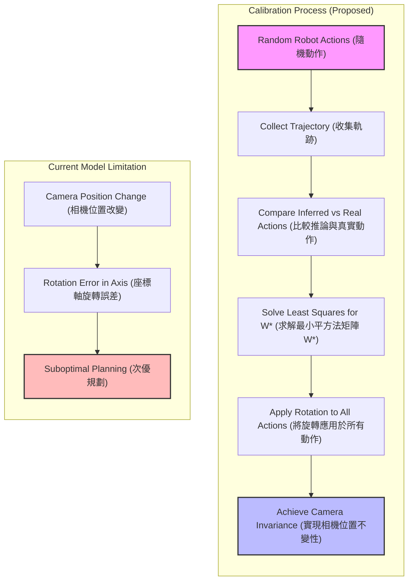
```mermaid
graph TD
    subgraph "Calibration Process (Proposed)"
        direction TB
        A["Random Robot Actions (隨機動作)"] --> B["Collect Trajectory (收集軌跡)"]
        B --> C["Compare Inferred vs Real Actions (比較推論與真實動作)"]
        C --> D["Solve Least Squares for W* (求解最小平方法矩陣 W*)"]
        D --> E["Apply Rotation to All Actions (將旋轉應用於所有動作)"]
        E --> F["Achieve Camera Invariance (實現相機位置不變性)"]
    end

    subgraph "Current Model Limitation"
        direction TB
        G["Camera Position Change (相機位置改變)"] --> H["Rotation Error in Axis (座標軸旋轉誤差)"]
        H --> I["Suboptimal Planning (次優規劃)"]
    end

    style A fill:#f9f,stroke:#333,stroke-width:2px
    style F fill:#bbf,stroke:#333,stroke-width:2px
    style I fill:#fbb,stroke:#333,stroke-width:2px
```

---

## Part 16

Source note: V-JEPA 2 Self-Supervised Video Models Enable Understanding, Prediction and Planning (Part 16)

Original range: lines 588-670
Original chars: 117848-126277

<!-- source: V-JEPA 2 Self-Supervised Video Models Enable Understanding, Prediction and Planning (Part 16).md -->

### This part details the experimental setup, hyperparameters, and ablation studies for evaluating V-JEPA 2 on visual classification and action anticipation tasks.

#### 摘要

本文件翻譯了關於 V-JEPA 2 自監督影片模型評估細節的技術文獻。內容涵蓋了視覺分類任務的評估程序、超參數設定、探針架構（Attentive Probe）的設計，以及針對不同數據集（如 K400, SSv2, ImageNet, Jester 等）的實驗配置。此外，文中也討論了透過消融實驗（Ablation Study）探討探針層數與編碼器層數對模型性能的影響，並提及了一種透過旋轉矩陣校準世界模型以實現相機位置不變性的方法。

#### 翻譯內文

手臂始終能夠根據單眼 RGB 相機的視覺回饋，在距離目標 4 公分範圍內移動；推論座標軸中的旋轉誤差會導致每個規劃步驟中的動作相對次優，從而導致與目標距離的減少是非最大化但單調的。

有趣的是，由於推論座標軸的誤差主要是基於旋轉，因此可以透過簡單地將所有推算動作旋轉 $W^{\star}$，來「校準」其世界模型，並藉此引入所需的相機位置不變性。這種無監督的校準階段將涉及機器人執行隨機動作，透過比較其推論的最佳動作與實際執行的動作來解決線性最小二乘問題，然後在任務執行期間將推論動作乘以旋轉矩陣後再傳送至控制器。雖然這種方法很有趣，但我們強調，在我們的實驗中 **並未進行此類校準**。

#### 12 視覺分類

我們詳細描述了第 5 節中所述分類任務所使用的評估程序。

##### 12.1 超參數

###### 探針架構

我們使用來自每個下游任務的訓練數據，在凍結的編碼器輸出之上訓練一個注意力探針（Attentive Probe）。==我們的注意力探針由四個 Transformer 區塊組成，每個區塊在注意力層中使用 16 個注意力頭。==前三個區塊使用標準的自注意力機制；最後一個區塊使用帶有可學習查詢標記（Query Token）的交叉注意力層。最後一個區塊中交叉注意力層的輸出在應用該區塊其餘部分（LayerNorm，隨後是帶有單個 GeLU 激活函數的 MLP）之前，會作為殘差連接加回到查詢標題中。Transformer 區塊之後接著一個最終的線性分類層。

###### 評估設置參數

除了我們的 V-JEPA 2 ViT-g $\text{384}$ 之外，所有模型都遵循相同的評估協議，並使用 $256\times 256$ 的解析度。對於影片評估，我們從每個輸入影片中採樣了多個片段。在驗證期間，我們還從每個片段中提取了三個空間視角（而非訓練期間的一個視角）。每個評估的片段數量、幀步長參數和全局批量大小（Global Batch Size）各不相同；每個評估使用的參數可以在表 15 中找到。預設情況下，我們對於 SSv2 使用 $16\times 2\times 3$ 的輸入（16 幀片段、2 個時間裁剪、3 個空間裁剪），對於 K400 使用 $16\times 8\times 3$，對於 COIN 使用 $32\times 8\times 3$，對於 Diving-48 和 Jester 使用 $32\times 4\times 3$。V-JEPA 2 ViT-g $\text{384}$ 在 K400、COIN、Diving-48 和 Jester 上使用更高的解析度 $384\times 384$，在 ImageNet 上使用 $512\times 512$，在 SSv2 上使用 $384\times 3傳輸$ 搭配 $64\times 2\times 3$ 的輸入。

###### ImageNet 評估

對於 ImageNet，我們重複每個輸入圖像以產生一個 16 幀的影片片段。我們還使用了更大的全局批量大小（1024 而非 256 或 128），且不對每個樣本使用多個片段或視角。

###### Jester 與 Diving-48 評估

我們的 ==Jester 與 Diving-48 動作分類評估任務在幾方面與其他理解性評估不同，主要是我們採用了多層策略。==我們不僅關注編碼器最後一層的標記（Tokens），而是從四個編碼器層（最後一層及三個中間層）提取標記並對其進行注意力處理。（表 16 顯示了我們為每個編碼器尺寸所使用的層次。）我們還為這兩項評估訓練了僅包含三個分類頭的探針（而非其他評估的 20 個），但訓練了 100 個輪次（Epochs，而非 20 個），因為這些評估能從更長的訓練中獲益。這兩項評估的全局批量大小均為 128。

###### 優化

對於每次評估，我們同時訓練具有不同超參數（學習率與權重衰減）的多個分類器頭，並報告表現最佳的分類器準確率。對於我們的大多數評估（Kinetics, SSv2, COIN 和 ImageNet），我們訓練 20 個輪次並使用 20 個頭，每個頭使用五種學習率值和四種權重衰減值之一，且學習率根據餘弦退火（Cosine Schedule）進行衰減。我們在表 15 中提供了所有超參數的摘要。

**表 15：視覺分類評估參數。** 視覺分類評估使用的預設參數，各評估任務的非預設值（* 表示預設）。所有注意力探針均使用 4 個 Transformer 區塊與 16 個注意力頭。

| 參數 | 預設 (K400) | ImageNet | SSv2 | COIN | Jester/Diving-48 |
| :--- | :--- | :--- | :--- | :--- | :--- |
| 幀數 | 16 | 16 | 16 | 32 | 32 |
| 片段 / 片段內 | 8 | 1 | 2 | 8 | 4 |
| 視角 / 片段 | 3 | 1 | * | * | * |
| 幀步長 | 4 | 不適用 | * | * | 2 |
| 訓練輪次 | 20 | * | * | * | 100 |
| 批量大小 (全局) | 256 | 1024 | * | 128 | 128 |
| 解析度 | $256\times 256$ | * | * | * | * |
| 分類器頭數 | 20 (4x5) | * | * | * | 3 (3x1) |
| 變更學習率 | [5e-3, 3e-3, 1e-3, 3e-4, 1e-4] | * | * | * | [1e-3, 3e-4, 1e-4] |
| 權重衰減 | [.8, .4, .1, .01] | * | * | * | [.8] |

**表 16：Jester/Diving-48 的輸入層。** 對於每個編碼器尺寸，用於 Jester 與 Diving-48 評估中線性分類器輸入的四個編碼器層索引。

| 編碼器 | 層數 | 參與注意力的層 |
| :--- | :--- | :--- |
| ViT-L | 24 | 17, 19, 21, 23 |
| ViT-H | 32 | 25, 27, 29, 31 |
| ViT-g | 40 | 24, 29, 34, 39 |

##### 12.2 額外結果

###### 探針大小

由於我們在這些評估中使用四層注意力探針，我們研究了使用較小的探針是否會影響評估性能。我們使用僅包含一個具有 16 個注意力頭的交叉注意力區塊的較小探針，重新運行了六項理解性評估（針對兩種模型尺寸：ViT-L 與 ViT-g）。與第 5 節不同，我們在所有評估中均使用 16 幀，包括 Diving-48 與 Jester。參見表 18 的分類性能——==我們確認我們的四層探針在所有理解性評估（除 Jester 外）中均優於單層注意力探針==，ViT-L 平均提升了 $+1.4$ 個百分點，ViT-g 提升了 $+1.0$ 個百分點。

###### 編碼器多層影響

我們研究了在評估期間將來自編碼器多個層的標記饋送至注意力探針的影響。表 17 顯示，==Diving-48 與 Jester 從編碼器更深層的資訊中強烈獲益。==

**表 17：編碼器多層消融實驗。** 我們改變饋送至注意力探針的編碼器層數。我們報告了在 $256\times 256$ 解析度、16 幀條件下，在 V-JEPA 2 之上訓練的注意力探針分類性能。

| 模型 | 編碼器層數 | Diving-48 | Jester |
| :--- | :--- | :--- | :--- |
| ViT-g | 1 | 82.9 | 96.1 |
| ViT-g | 4 | 86.7 | 97.6 |

**表 18：探針大小消融實驗。** 我們改變探針中的層數。我們報告了在 $256\times 256$ 解析度、16 幀條件下，在 V-JEPA 2 之上訓練的注意力探針分類性能。

| 模型 | 探針層數 | 平均 | SSv2 | Diving-48 | Jester | K400 | COIN | IN1K |
| :--- | :--- | :--- | :--- | :--- | :--- | :--- | :--- | :--- |
| ViT-L | 1 | 84.0 | 72.0 | 83.2 | 97.7 | 83.3 | 85.9 | 81.8 |
| ViT-L | 4 | 85.6 | 73.6 | 87.1 | 97.7 | 85.1 | 86.8 | 83.5 |
| ViT-g | 1 | 86.0 | 74.8 | 85.3 | 97.8 | 85.6 | 88.9 | 83.5 |
| ViT-g | 4 | 87.0 | 75.6 | 86.7 | 97.6 | 86.6 | 90.7 | 84.6 |

#### 13 動作預期

我們提供了與第 6 節中 Epic-Kitchen 100 動作預期評估相關的額外細節、結果與消融實驗。

##### 13.1 超參數

###### 探針架構

我們用於動作預期的探針架構遵循第 12.1 節中所述的分類探針架構，由四個 Transformer 區塊組成，包括一個帶有一組可學習查詢標記的最後交叉注意力層，隨後為每個查詢標記提供一個最終的線性分類層。

#### 詞彙與關鍵術語

| 英文術語 | 繁體中文翻譯 | 說明 |
| :--- | :--- | :--- |
| Attentive probe | 注意力探針 | 基於注意力機制構建的下游任務評估模組。 |
| Cross-attention | 交叉注意力 | 一種注意力機制，用於處理兩個不同序列之間的交互。 |
| Ablation study | 消融實驗 | 通過移除模型組件來研究其對性能影響的實驗方法。 |
| Action anticipation | 動作預期 | 根據當前觀察預測未來即將發生的動作。 |
| Weight decay | 權重衰減 | 一種正則化技術，用於防止模型過擬合。 |
| Residual connection | 殘差連接 | 在神經網路中跳過某些層的連接方式，有助於梯度傳播。 |
| Learnable query token | 可學習的查詢標記 | 在注意力機制中作為查詢輸入、並在訓練中更新的參數化標記。 |
| Invariance | 不變性 | 模型在面對特定變換（如旋轉、平移）時保持輸出不變的能力。 |

#### 評估流程邏輯

```mermaid
graph TD
    subgraph "輸入處理層"
        A["輸入影片 (Input Video)"] --> B["採樣片段與視角 (Sampling Clips/Views)"]
    end

    subgraph "特徵提取層 (Encoder)"
        B --> C["編碼器 (Encoder)"]
        C --> D["提取特定層標記 (Multi-layer Tokens)"]
    end

    sublagraph "任務探針層 (Attentive Probe)"
        D --> E["Transformer 區塊 (Self-Attention)"]
        E --> F["交叉注意力層 (Cross-Attention)"]
        F --> G["可學習查詢標記 (Learnable Query)"]
    end

    subgraph "輸出層"
        G --> H["線性分類器 (Linear Classifier)"]
        H --> I["任務結果 (Classification/Anticipation)"]
    end
```

---

## Part 17

Source note: V-JEPA 2 Self-Supervised Video Models Enable Understanding, Prediction and Planning (Part 17)

Original range: lines 660-733
Original chars: 125255-134612

<!-- source: V-JEPA 2 Self-Supervised Video Models Enable Understanding, Prediction and Planning (Part 17).md -->

### This part details the evaluation of V-JEPA 2 on action anticipation tasks and the methodology for integrating it into Multi-modal Large Language Models (MLLMs).

#### 摘要

本文件翻譯了關於 V-JEPA 2 自監督影片模型研究論文的技術細節部分。內容涵蓋了兩個核心領域：
1. **動作預期 (Action Anticipation)**：詳細說明了在 Epic-Kitchen 100 (EK100) 基準測試上的評估參數、探查器 (Probe) 架構、以及實驗結果（包括架構影響、解析度影響與長期預測能力的分析）。
2. **影片問答 (Video Question Answering)**：描述了如何將 V-JEPA 2 整合進多模態大型語言模型 (MLLM) 的訓練流程，涉及 LLaVA 框架、投影模組的使用、數據規模化策略，以及處理影像與影片輸入時的技術手段（如動態 $S^2$ 策略）。

#### 翻譯內文

##### 13 動作預期

我們提供了與第 6 節中 Epic-Kitchen 100 動作預期評估相關的額外細節、結果與消融實驗。

###### 13.1 超參數

**探查器架構 (Probe Architecture)**
我們用於動作預期的探查器架構遵循第 12.1 節所述的分類探查器架構，由四個 Transformer 區塊組成，其中包括一個帶有一組可學習查詢標記 (query tokens) 的最後交叉注意力層，隨後是針對每個查詢標記的最終線性分類層。

**評估設置參數**
在訓練探查器時，我們使用了 Focal Loss，其中 $\alpha=0.25$ 且 $\gamma=2.0$；此損失函數更適合處理長尾且類別不平衡的分佈。對於 V-JEPA 2 ViT-L、ViT-H 與 ViT-g，我們使用 32 幀的上下文，幀率為每秒 8 幀，解析度為 $25 6\times 256$；對於 V-JEPA 2 ViT-g$_{384}$，則使用 $384\times 384$ 的解析度。在探查器訓練期間，我們隨機採樣介於 $0.25$ 至 $1.75$ 秒之間的預期時間，以及介於 $0.0$ 至 $0.25$ 之間的預期點。 **預期點 (Anticipation point)** 用於識別動作片段中進行預期的起始位置；即預期點為 $0$ 表示我們在將片段輸入探查器之前，先使用 V-JEPA 2 預測器預測動作片段第一幀的表示；而預期點為 $1$ 則表示我們預測動作片段最後一幀的表示。驗證集的預期時間設定為 1 秒，預期點設定為 $0$。表 19 提供了包含優化參數在內的超參數摘要。

**表 19：動作預期評估參數。用於 EK100 動作預期評估的預設參數。**

| 參數 | EK100 |
| --- | --- |
| 訓練預期時間 | 0.25s – 1.75s |
| 訓練預期點 | 0.0 – 0.25 |
| 驗證預期時間 | 1s |
| 驗證預期點 | 0.0 |
| 幀數 | 32 |
| 每秒幀率 (fps) | 8 |
| 訓練輪數 (Epochs) | 20 |
| 預熱輪數 (Warmup epochs) | 0 |
| 批次大小 (全域) | 128 |
| 分類器標頭 (Classifier Heads) | 20 (4x5) |
| 分類器學習率 | [5e-3, 3e-3, 1e-3, 3e-4, 1e-4] |
| 分類器權重衰減 | [1e-4, 1e-3, 1e-2, 1e-1] |

###### 13.2 額外結果

**架構影響**
表 20 研究了向動作預期探查器提供 V-JEPA 2 編碼器、預測器或兩者輸出之影響。僅使用編碼器輸出已能在 EK100 任務上取得具競爭力的性能。==加入預測器在動作 (action)、動詞 (verb) 與名詞 (object) 類別中均帶來了微小但一致的提升。==此外，使用預測器輸出雖然能獲得不容忽視的性能，但仍遠低於使用編組器時的表現，這表明 EK100 任務主要需要強大的語義理解能力，而非預測能力。

**表 20：EK100：預期探查器輸入之影響。**

| | | 動作預期 | | |
| --- | --- | --- | --- | --- |
| **編碼器** | **預測器** | **動詞** | **名詞** | **動作** |
| ✓ | | 61.3 | 57.0 | 39.1 |
| | ✓ | 48.7 | 34.7 | 20.2 |
| ✓ | ✓ | 63.6 | 57.1 | 39.7 |

**輸入解析度的影響**
我們在圖 17 中報告了輸入解析度與幀採樣參數的影響。總結來說，V-JEPA 2 受益於更長的上下文、更高的幀率以及更高的解析度，直到性能達到飽和或輕微下降為止。最佳性能是在使用 32 幀上下文長度、8 幀率以及 $384\times 3規$ 解析度進行訓練時獲得的。

**長期預測**
我們在圖 18（左）報告了透過改變預期時間（1s, 2s, 4s, 10s）來進行更長期預測的影響。對於每個預期時間，我們報告了多個召回率 (recall) 數值（1, 5, 10, 20）。結果顯示，隨著預期時間增加，性能會急劇下降，這是預料之中的，因為在 EK100 中預測未來是一個非確定性的任務。

**失敗案例分析**
我們在圖 18（右）報告了 EK100 驗證集上，動詞、名詞與動作之預測成功與失敗配置的分佈。模型表現非常出色，因此最常見的配置是動詞、名詞與動作皆完全成功。最常見的失敗配置皆包含「無法識別動作」。

##### 14 影片問答

在本節中，我們提供訓練 V-JEPA 2 多模態大型語言模型 (MLLM) 的細節。我們遵循 LLaVA 框架來訓練 MLLM，其中視覺骨幹網路使用 V-JEPA 2，而 LLM 骨幹網路可以使用任何現成的預訓練 LLM，這與非標記化的早期融合 (early fusion) 設置類似。==MLLM 接收視覺編碼器的輸出嵌入 (embeddings)，並透過一個投影模組 (projector module) 將其投影至 LLM 骨幹網路的隱藏維度中。==該投影模組通常是一個兩層的 MLP。MLLM 透過一系列漸進式訓練步驟，使用影像-文本與影片-文本配對數據的混合進行訓練。

為了瞭解數據規模的影響，我們使用了包含 8,850 萬對影像-文本與影片-文本數據集，這與訓練 PerceptionLM 時所使用的規模相似。如第 7 節所述，我們研究了兩種設置：(a) 受控設置 (controlled)，我們使用 1,800 萬對影像與影片-文本進行訓練，並在完全相同的 MLLM 訓練設置下評估 V-JEPA 2 與其他編碼器；(b) 擴展設置 (scaling)，我們使用 V-JEPA 2 ViT-g$_{384}$ 並使用完整的對齊數據集。為了進一步測試 V-JE12 2 的通用性，我們在受控實驗中使用 Qwen2-7B-Instruct 作為語言骨幹網路，在擴展實驗中使用 Llama 3.1 8B Instruct。我們將在後續章節中說明訓練細節。

###### 14.1 將影像與影片作為輸入進行處理

由於影片問答使用的是影片而非影像輸入，與影像問答相比，輸出視覺標記 (visual tokens) 的數量顯著增加。如有需要，我們可以使用池化 (pooling) 方法來減少視覺標記的數量。常見的池化方法包括自適應 2x2 池化、Perceiver Sampler、注意力池化 (Attentive Pooling) 等。

此外，我們觀察到從影像-文本對中學習對於下游基準測試的高性能至關重要。為了使用影像進行訓練，一種簡單的方法是將給定的影像重複 $k$ 幀，其中 $k$ 是 V-JEPA 2 支持的最大幀數。然而，在初步實驗中，我們發現這種策略對於提升下游性能無效，因為它無法讓模型提取細粒度的資訊。因此，==我們採用了由 [75] 提出的改良版動態 $S^2$ 策略，為 V-JEPA 2 在訓練期間提供更高的解析度粒度。==該方法透過建立一系列 V-JEPA 2 支持的最大尺寸圖塊 (tiles)，自適應地以不同長寬比處理原始解析度的影像，以保留其原始解析度。在處理影片時，我們選擇使用固定的幀數 $f_n$ 進行訓練，藉此在視覺標記數量與計算預算之間取得平衡。

#### 詞彙與關鍵術語

| 英文術語 | 繁體中文翻譯 | 說明 |
| --- | --- | --- |
| Action Anticipation | 動作預期 | 根據當前影像預測未來即將發生的動作。 |
| Probe Architecture | 探查器架構 | 在預訓練模型之上訓練的小型網路，用於評估特徵能力。 |
| Query Tokens | 查詢標記 | Transformer 中用於從特徵中提取資訊的學習向量。 |
| Focal Loss | 焦點損失 | 用於解決類別不平衡問題的損失函數。 |
| 傳 | | |
| Multi-modal Large Language Model (MLLM) | 多模態大型語言模型 | 能同時處理並理解文字、影像與影片等多種模態的模型。 |
| Projector Module | 投影模組 | 將視覺特徵維度轉換至語言模型維度的網路層（通常為 MLP）。 |
| Visual Tokens | 視覺標記 | 影像或影片經過編碼後，在模型中表示為序列的向量單元。 |
| Dynamic $S^2$ Strategy | 動態 $S^2$ 策略 | 一種用於提升影像訓練解析度粒度的技術。 |

#### 邏輯流程圖

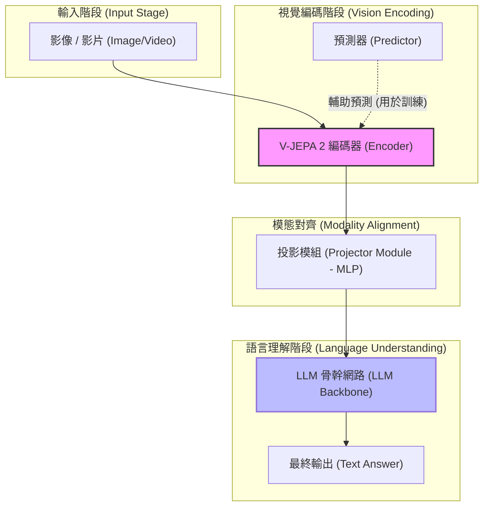
```mermaid
graph TD
    subgraph "輸入階段 (Input Stage)"
        A["影像 / 影片 (Image/Video)"]
    end

    subgraph "視覺編碼階段 (Vision Encoding)"
        B["V-JEPA 2 編碼器 (Encoder)"]
        C["預測器 (Predictor)"]
    end

    subgraph "模態對齊 (Modality Alignment)"
        D["投影模組 (Projector Module - MLP)"]
    end

    subgraph "語言理解階段 (Language Understanding)"
        E["LLM 骨幹網路 (LLM Backbone)"]
        F["最終輸出 (Text Answer)"]
    end

    A --> B
    B --> D
    C -.->|"輔助預測 (用於訓練)"| B
    D --> E
    E --> F

    style B fill:#f9f,stroke:#333,stroke-width:2px
    style E fill:#bbf,stroke#333,stroke-width:2px
```

---

## Part 18

Source note: V-JEPA 2 Self-Supervised Video Models Enable Understanding, Prediction and Planning (Part 18)

Original range: lines 731-771
Original chars: 133590-142103

<!-- source: V-JEPA 2 Self-Supervised Video Models Enable Understanding, Prediction and Planning (Part 18).md -->

### V-JEPA 2 utilizes a multi-stage training pipeline and a dynamic $S^2$ strategy to achieve superior spatiotemporal understanding, demonstrating linear performance scaling with increased video duration compared to traditional image encoders.

#### 摘要

本文件詳細介紹了 V-JEPA 2 模型的受控訓練設置（Controlled Setup）與數據擴展策略（Data Scaling Setup）。==核心內容涵蓋了如何透過「注意力池化器」（Attentive Pooler）作為投影模組來減少視覺標記（Visual Tokens）數量，以及透過「動態 $S^2$ 策略」來提升訓練時的解析度細粒度。==此外，文中對比了 V-JEPA 2 與 DINOv2、SigLIP2 等現成影像編碼器的表現，特別強調了 V-JEPA 2 在增加影片幀數時，其時空推理能力呈現線性增長的潛力，而傳統影像編碼器則會遇到性能瓶頸。

#### 翻譯內文

... 2x2 池化 [^20]、Perceiver Sampler [^57]、注意力池化 [^6] 等。

此外，我們觀察到，從圖文對（image-text pairs）中學習對於在下游基準測試中取得高性能至關重要。為了使用影像進行訓練，一種簡單的方法是將給定的影像重複 $k$ 幀，其中 $k$ 是 V-JEPA 2 支持的最大幀數。然而，在我們的初步實驗中，我們發現這種策略對於提升下游性能並無顯著效果，因為它無法讓模型提取細粒度的資訊。因此，我們採用了由 [^75] 提出的改良版「動態 $S^2$ 策略」（Dynamic $S^2$ strategy），以在訓練期間為 V-JEPA 2 提供更高的解析度粒度。該方法透過建立一系列最大尺寸（由 V-JEPA 2 支持）的切片（tiles），自適應地以原始解析度與不同長寬比來處理影像，從而保留其原始解析度。至於影片部分，我們選擇以固定的幀數 $f_{n}$ 進行訓練，透過在計算預算與視覺標記（visual tokens）數量之間取得平衡來進行優化。

##### 14.2 受控設置

###### 訓練細節

在受控設置中，我們遵循 LLaVA-NEXT 框架 [^72] [^126]，並使用 Qwen2-7B-Instruct [^118] 作為所有編碼器的基礎大型語言模型（LLM）。為了減少視覺標記的數量，我們採用了一個縮放因子為 4 到 16 的注意力池化器（attentive pooler），具體取決於計算預算與視覺補丁（visual patches）的數量。詳情請參閱表 21。

我們的訓練流程遵循 LLaVA-NeXT 管道 [^67]，包含多個階段性的訓練階段。具體而言，這些階段包括：a) 將注意力池化器與影像描述數據進行對齊（第一階段），b) 在高品質影像描述數據上訓練完整模型（第一階段 1.5），以及 c) 在大規模影像問答數據上訓練完整模型（第二階段）。我們額外增加了一個階段，用於大規模影片描述與問 答的訓練（第三階段）。我們使用了 1800 萬條影像與影片-文本對齊數據。經過多階段訓練後，LLM 會逐步提升其對視覺標記的理解能力，其中在第三階段之後，影片問答任務的提升最為顯著。

我們探索了「凍結」（frozen）與「微調」（finetuned）編碼器對齊的設置。在這兩種設置中，LLM 與投影模組（projector）的全參數均會參與訓練；而在後者中，V-JEPA 2 的參數也會被解凍。為了減少視覺標記數量並保持多模態大模型（MLLM）的上下文長度固定，除非另有說明，否則我們使用注意力池響器作為投影模組，將視覺標記數量減少 4 倍。此受控研究所使用的實作基於 LLaVA-NEXT 代碼庫，並使用 PyTorch 2.5.1、Transformers 4.46.0、Flash Attention 2 以及 DeepSpeed 0.14.4 分別用於模型實作、加速訓練與多 GPU 模型分片。我們使用 128 顆 H100 GPU 進行訓練，所有階段的有效批次大小（batch size）均為 256。我們使用 AdamW 優化器進行所有優化，權重衰減（weight decay）為 0。對於第一與第一階段 1.5，我們使用 1e-5 的學習率搭配餘弦退火（cosine decay）；對於第二與第三階段，我們使用 5e-6 的恆定學習率。在所有階段中，訓練前 3% 的步數均使用線性預熱（linear warmup）。訓練超參數列於表 21。

###### 基準模型

為了評估 V-JEPA 2 在影片問答（VidQA）中捕捉時空細節的能力，我們與領先的現成影像編碼器進行比較。具體而言，我們與 DINOv2 [^87]、SigLIP2 [^107] 以及 Perception Encoder [^10] 進行對比。DINOv2 是一個自監督影像模型，而 SigLIP2 與 Perception Encoder 則是使用帶有噪聲的圖文標題進行語言監督訓練的。我們在每個影片幀上，分別以各自的「原始」預訓練解析度（分別為 518px、384px 與 448px）應用所有影像編碼器。

我們保持所有訓練細節一致，唯獨將注意力池化比例增加到 16，以使各模型間的影像標記數量保持相對接近。詳情請參閱表 21。

（表 21 略）

圖 19：視覺指令微調期間影片時長的影響。我們研究了在視覺指令微調期間增加幀數的效果，此時編碼器處於凍結狀態。==我們觀察到，與基於自監督學習（SSL）的影像編碼器 DINOv2 相比，隨著幀數增加，V-JEPA 2 的性能呈現線性增長，這展示了 V-JEPA 2 隨著更多幀數擴展的潛力。==

###### 評估

為了評估 V-JEPA 2 透過影片與語言理解世界的潛力，我們選擇了專為測試時空推理能力而設計的流行評估數據集。為了確保評估的可重複性，我們使用 `lmms-解析` 函式庫 [^66] [^125] 進行實驗，該函式庫是 `llm-eval-harness` [^40] 的視覺模型版本。在受控設置中，針對每個模型與數據集，我們透過均勻幀採樣機制進行評估，並在推論期間選擇 128 幀。對於 PerceptionTest，我們在訓練集上進一步對模型進行了 5 個 epoch 的訓練。

###### 影片時長的影響

在受控設置中，我們進行了分析以了解 V-JEPA 2 在長影片理解方面的能力。我們在 V-JEPA 2 與 DINOv2 上訓練 MLLM，並保持編碼器凍結，同時增加訓練與測試中所使用的幀數。我們觀察到，隨著幀數增加，V-JEPA 2 在下游任務上的性能線性提升，而 DINOv2 的性能則會下降並趨於平緩（圖 19）。==這突顯了如 V-JEPA 2 等影片編碼器的潛力，即透過使用 V-JEPA 2 作為視覺編碼器來適應 LLM，從而實現對自然語言查詢的長影片理解。==

##### 14.3 數據擴展設置

（表 22 略）

#### 詞彙與關鍵術語

| 英文術語 | 繁體中文翻譯 | 說明 |
| :--- | :--- | :--- |
| **Attentive pooler** | 注意力池化器 | 一種用於減少視覺標記數量的機制，文中作為投影模組使用。 |
| **Projector module** | 投影模組 | 負責將視覺編碼器的特徵空間對齊到語言模型空間的模組。 |
| **Dynamic $S^2$ strategy** | 動態 $S^2$ 策略 | 一種透過切片（tiles）處理影像，以在訓練時保留高解析度細節的技術。 |
| **Visual instruction tuning** | 視覺指令微調 | 使用指令式數據來訓練模型，使其能理解視覺指令並進行問答。 |
| **Spatiotemporal reasoning** | 時空推理 | 理解影片中物體在空間位置與時間演變上的邏輯能力。 |
| **Visual tokens** | 視覺標記 / 視覺 Token | 影像或影片經過編碼後，輸入給語言模型處理的最小語義單元。 |
| **Long-form video understanding** | 長影片理解 | 對於時長較長的影片內容進行語義分析與問答的能力。 |
| **Off-the-shelf encoder** | 現成編碼器 | 指直接使用預訓練好的、無需額外改動結構的現成模型（如 DINOv2）。 |

#### 邏輯流程圖

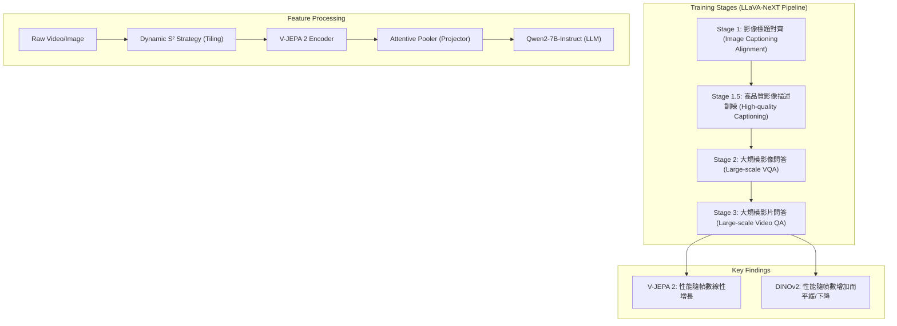
```mermaid
graph TD
    subgraph "Training Stages (LLaVA-NeXT Pipeline)"
        direction TB
        S1["Stage 1: 影像標題對齊 (Image Captioning Alignment)"] --> S1_5["Stage 1.5: 高品質影像描述訓練 (High-quality Captioning)"]
        S1_5 --> S2["Stage 2: 大規模影像問答 (Large-scale VQA)"]
        S2 --> S3["Stage 3: 大規模影片問答 (Large-scale Video QA)"]
    end

    subgraph "Feature Processing"
        direction LR
        Input["Raw Video/Image"] --> S2_Strategy["Dynamic S² Strategy (Tiling)"]
        S2_Strategy --> Encoder["V-JEPA 2 Encoder"]
        Encoder --> Pooler["Attentive Pooler (Projector)"]
        Pooler --> LLM["Qwen2-7B-Instruct (LLM)"]
    end

    subgraph "Key Findings"
        direction TB
        V_JEPA["V-JEPA 2: 性能隨幀數線性增長"]
        DINOv2["DINOv2: 性能隨幀數增加而平緩/下降"]
    end

    S3 --> V_JEPA
    S3 --> DINOv2
```

---

## Part 19

Source note: V-JEPA 2 Self-Supervised Video Models Enable Understanding, Prediction and Planning (Part 19)

Original range: lines 771-807
Original chars: 141081-149614

<!-- source: V-JEPA 2 Self-Supervised Video Models Enable Understanding, Prediction and Planning (Part 19).md -->

### 描述 V-JEPA 2 在擴展規模（Scaling）下的三階段漸進式訓練架構、硬體配置及與現有基準模型的比較方法。

#### 摘要

本段落詳細描述了 V-JEPA 2 模型在擴展規模（Scaling）訓練時的技術細節。內容涵蓋了訓練架構的修改（例如使用 **MLP 投影模組** 取代傳統的池化機制）、三階段漸進式訓練流程（從圖像對齊到影片-文本對齊）、硬體資源的使用（51ck H100 GPU），以及用於衡量模型性能的基準模型（Baselines）與評估流程。

#### 翻譯內文

##### 訓練參數摘要 (節錄自表 22)

| 參數名稱 | 階段 2 數值 | 階段 3 數值 |
| :--- | :--- | :--- |
| 步數 (Steps) | 35,000 | 28,000 |
| 預熱步數 (Warmup Steps) | 200 | 168 |
| 全域批次大小 (Batch Size, global) | 2,048 | 1,024 |
| 學習率 (Learning Rate) | 4e-5 | 1e-5 |
| 最終學習率 (Final Learning Rate) | 4e-7 | 1e-7 |
| 權重衰減 (Weight Decay) | 0.05 | 0.05 |
| 最大序列長度 (Max sequence length) | 1,920 | 12,800 |
| 圖像分塊數 (Image tiles) | 16 | 32 |
| 影片幀數 (Video frames) | 16 | 32 |

##### 訓練細節

在擴展配置中，我們遵循用於訓練 Perception LM 8B 的框架 [^20]。具體而言，我們利用了基於 Lingua [^109] 開源的程式碼庫。我們修改了程式碼以使用 V-JE 2 編碼器，並採用 Llama 3.1 8B Instruct [^44] 作為骨幹大型語言模型 (LLM)。與 [^20] 不同的是，我們不使用池化（pooling）機制，而是使用 **MLP 投影模組 (MLP projector)** 來訓練 V-JEPA 2 ViT-g <sub_384，這使得每一幀能產生 288 個標記 (tokens)。

==訓練設置包含三個漸進式階段：==
1. **第一階段**：將 MLP 池化器與圖像描述 (image captioning) 數據進行對齊。
2. **第二階段**：在圖像-文本描述與問答 (QA) 數據的混合集上進行訓練。
3. **第三階段**：在影片-文本描述與問答數據上進行訓練。

我們將數據規模擴展至 8,850 萬個樣本。我們的設置使用 PyTorch 2.5.1 以及經過 V-JEPA 2 編碼器修改過的 Perception LM 訓練程式碼5。在第二與第三階段，我們分別使用 512 顆 H100 GPU，全域批次大小分別為 2,048 與 1,024。訓練超參數的詳細資訊請參閱表 22。

##### 基準模型 (Baselines)

我們將我們的擴展實驗結果與 Qwen2VL [^112]、Qwen2.5VL [^89]、InternVL-2.5 [^19] 以及 PerceptionLM 8B [^20] 進行比較。除了 MVP 是由我們自行運行測試外，其餘基準數據均直接取自原論文。

##### 評估 (Evaluation)

我們遵循與受控實驗設置中相同的評估流程，並使用 `lmms-eval` 函式庫。我們報告的是模型在 32 幀影像下的評估結果。

#### 詞彙與關鍵術語

| 英文原文 | 繁體中文翻譯 | 說明 |
| :--- | :--- | :--- |
| Scaling setup | 擴展配置 | 指增加模型參數或數據規模的訓練設定。 |
| Backbone LLM | 骨幹大型語言模型 | 作為模型核心架構的語言模型（此處為 Llama 3.1）。 |
| MLP projector | MLP 投影模組 | 使用多層感知器將視覺特徵投影到語言模型的維度空間。 |
| Image captioning | 圖像描述 / 圖像標註 | 為圖像生成文字描述的任務。 |
| Progressive stages | 漸進式階段 | 訓練過程由簡單任務逐步過渡到複雜任務的策略。 |
| Global batch size | 全域批次大小 | 在分散式訓練中，所有 GPU 加總後的總批次量。 |
| Image tiles | 圖像分塊 | 將大圖切割成較小塊以處理高解析度資訊。 |

#### 訓練流程邏輯

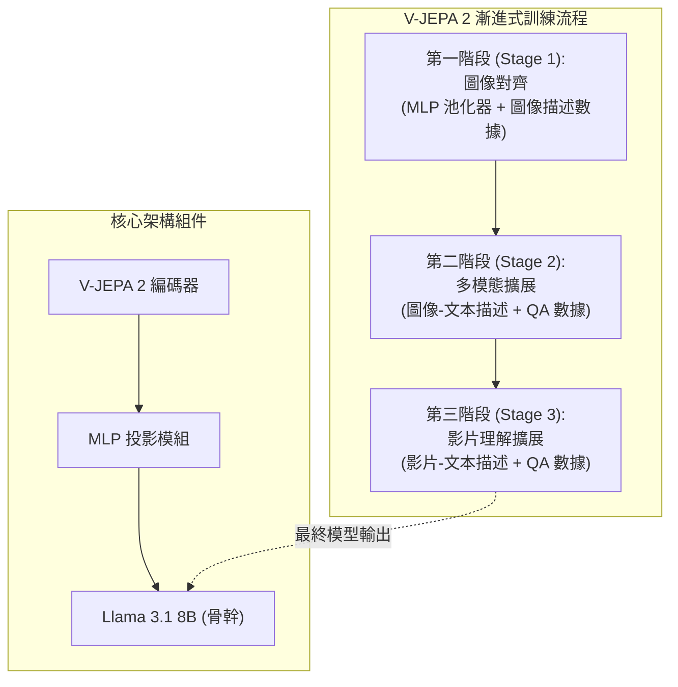
```mermaid
graph TD
    subgraph "V-JEPA 2 漸進式訓練流程"
        direction TB
        S1["第一階段 (Stage 1):<br/>圖像對齊<br/>(MLP 池化器 + 圖像描述數據)"]
        S2["第二階段 (Stage 2):<br/>多模態擴展<br/>(圖像-文本描述 + QA 數據)"]
        S3["第三階段 (Stage 3):<br/>影片理解擴展<br/>(影片-文本描述 + QA 數據)"]

        S1 --> S2
        S2 --> S3
    end

    subgraph "核心架構組件"
        Encoder["V-JEPA 2 編碼器"]
        Projector["MLP 投影模組"]
        LLM["Llama 3.1 8B (骨幹)"]

        Encoder --> Projector
        Projector --> LLM
    end

    S3 -.->|"最終模型輸出"| LLM
```

---

## Part 20

Source note: V-JEPA 2 Self-Supervised Video Models Enable Understanding, Prediction and Planning (Part 20)

Original range: lines 805-857
Original chars: 148592-156819

<!-- source: V-JEPA 2 Self-Supervised Video Models Enable Understanding, Prediction and Planning (Part 20).md -->

### This part provides a comprehensive bibliography of foundational and state-of-the-art research supporting the development of V-JEPA 2, covering video understanding, embodied AI, and multimodal pre-training.

#### 摘要

本文件整理並翻譯了關於 **V-JEPA 2** 研究論文中所引用的關鍵學術文獻。==這些文獻構成了當前「具身智能」（Embodied AI）、「影片理解」（Video Understanding）以及「多模態大模型」（Multimodal Large Models）領域的技術基石。==文獻涵蓋了從早期的機器人控制理論、自監督學習（Self-supervised Learning）到最新的視覺-語言-動作模型（VLA Models）如 RT-2 與 PaLM-E。

#### 翻譯內文

為了方便理解，我將原始的引用清單按研究領域進行了分類與翻譯：

##### 1. 影片理解與時間維度基準測試 (Video Understanding & Temporal Benchmarking)
==此類文獻關注於如何衡量模型對影片中時間流動與動作細節的理解能力。==

*   **[13] Temporalbench**: 衡量多模態影片模型細粒度時間理解能力的基準測試 (2024)。
*   **[14] Kinetics-600**: 關於 Kinetics-600 數據集的簡短說明 (2018)。
*   **[15] Kinetics-700**: 關於 Kinetics-700 人類動作數據集的簡短說明 (2019)。
*   **[22] TVBench**: 重新設計影片-語言評估標準 (2024)。
*   **[24] Epic-Kitchens-100**: 重新縮放第一人稱視角視覺：Epic-Kitchens-100 的收集、流程與挑戰 (2022)。

##### 2. 具身智能、機器人控制與規劃 (Embodied AI, Robotics & Planning)
此類文獻探討如何將預訓練的知識轉化為機器人的實際動作與環境互動能力。

*   **[12] Genie**: 生成式互動環境 (2024)。
*   **[18] Actionable Models**: 機器人技能的非監督式離線強化學習 (2021)。
*   **[29] PaLM-E**: 一種具身多模態語言模型 (2023)。
*   **[31] Video Language Planning**: 影片語言規劃 (2024)。
*   **[33] Visual Foresight**: 基於視覺的機器人控制模型預測強化學習 (2018)。
*   **[36] Deep Visual Foresight**: 用於規劃機器人運動的深度視覺預見 (2/2017)。
*   **[37] Unsupervised Learning**: 透過影片預測進行物理交互的非監督式學習 (2016)。

##### 3. 多模態預訓練與大規模視覺模型 (Multimodal Pre-training & Large-scale Vision Models)
此類文獻==涉及如何利用大規模數據與 Transformer 架構來學習通用的視覺與語言表徵。==

*   **[19] Scaling Multimodal Models**: 透過模型、數據與測試時擴展來擴張開源多模態模型的性能邊界 (2024)。
*   **[20] PerceptionLM**: 用於詳細視覺理解的開源數據與模型 (2025)。
*   **[28] ViT (Vision Transformer)**: 圖像即是 16x16 個單詞：用於大規模圖像識別的 Transformer (2020)。
*   **[34] Scaling Language-free Visual Representation**: 擴展無語言視覺表徵學習的性能 (2025)。
*   **[35] Multimodal Autoregressive Pre-training**: 大型視覺編碼器的多模態自回歸預訓練 (2024)。

#### 詞彙與關鍵術語

| 英文術語 | 繁體中文翻譯 | 語境說明 |
| :--- | :--- | :--- |
| **Self-Supervised Learning** | 自監督學習 | 無需人工標籤，透過數據自身結構進行學習的技術。 |
| **Embodied AI** | 具身智能 | 強調智能體（Agent）必須與物理或虛擬環境進行互動。 |
 | **Generative Interactive Environments** | 生成式互動環境 | 指能根據用戶輸入即時生成並允許互動的虛擬世界。 |
| **Visual Foresight** | 視覺預見 / 視覺前瞻 | 模型透過預測未來影像來規劃當前動作的能力。 |
| **Vision-Language-Action (VLA)** | 視覺-語言-動作 | 一種整合了視覺感知、語言理解與動作執行指令的模型架構。 |
| **Temporal Understanding** | 時間維度理解 | 理解影片中事件發生的先後順序與持續時間的能力。 |

#### 邏輯結構圖

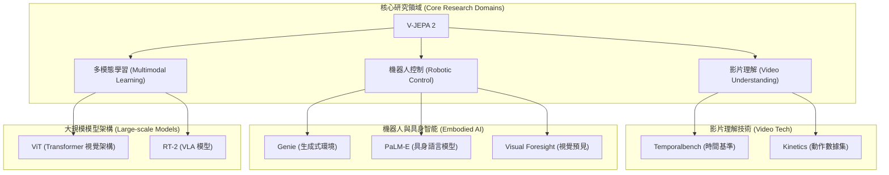
```mermaid
graph TD
    subgraph "核心研究領域 (Core Research Domains)"
        VJEPA2["V-JEPA 2"] --> 影片理解VideoUnderstanding["影片理解 (Video Understanding)"]
        VJEPA2["V-JEPA 2"] --> 機器人控制RoboticControl["機器人控制 (Robotic Control)"]
        VJEPA2["V-JEPA 2"] --> 多模態學習MultimodalLearning["多模態學習 (Multimodal Learning)"]
    end

    subgraph "影片理解技術 (Video Tech)"
        影片理解VideoUnderstanding["影片理解 (Video Understanding)"] --> Temporalbench時間基準["Temporalbench (時間基準)"]
        影片理解VideoUnderstanding["影片理解 (Video Understanding)"] --> Kinetics動作數據集["Kinetics (動作數據集)"]
    end

    subgraph "機器人與具身智能 (Embodied AI)"
        機器人控制RoboticControl["機器人控制 (Robotic Control)"] --> Genie生成式環境["Genie (生成式環境)"]
        機器人控制RoboticControl["機器人控制 (Robotic Control)"] --> PaLME具身語言模型["PaLM-E (具身語言模型)"]
        機器人控制RoboticControl["機器人控制 (Robotic Control)"] --> VisualForesight視覺預見["Visual Foresight (視覺預見)"]
    end

    subgraph "大規模模型架構 (Large-scale Models)"
        多模態學習MultimodalLearning["多模態學習 (Multimodal Learning)"] --> ViTTransformer視覺架構["ViT (Transformer 視覺架構)"]
        多模態學習MultimodalLearning["多模態學習 (Multimodal Learning)"] --> RT2VLA模型["RT-2 (VLA 模型)"]
    end
```

---

## Part 21

Source note: V-JEPA 2 Self-Supervised Video Models Enable Understanding, Prediction and Planning (Part 21)

Original range: lines 849-907
Original chars: 155797-164207

<!-- source: V-JEPA 2 Self-Supervised Video Models Enable Understanding, Prediction and Planning (Part 21).md -->

### 本部分透過對引用文獻的結構化分類，展示了 V-JEPA 2 研究在視覺表示學習、世界模型、機器人學及認知科學領域的學術基礎與技術演進脈絡。

#### 摘要

==本文件整理並分類了 V-JEPA 2 研究論文中所引用的關鍵參考文獻（編號 34 至 62）。==這些文獻構成了該研究的學術基礎，涵蓋了自監督視覺表示學習、世界模型（World Models）、機器人操縱與規劃、以及大規模視覺數據集等核心領域。透過將零散的引用文獻按研究主題進行結構化重組，本報告旨在呈現 V-JEPA 2 技術演進的脈絡。

#### 翻譯內文

本節將原始的引用列表按學術領域進行結構化分類，以便於理解其技術關聯性。

##### 1. 視覺表示學習與預訓練 (Visual Representation Learning & Pre-training)
此領域的研究關注如何從無標籤的影像或影片中學習具備語義與物理特徵的特徵表示。
* **大規模視覺表示學習**：探討不依賴語言的視覺表示學習規模化技術 [^34]。
* **多模態自回歸預訓練**：大型視覺編碼器的多模態預訓練方法 [^35]。
* **遮罩視覺預訓練 (Masked Visual Pre-training)**：如 MaskViT 等利用遮罩機制進行影片預測的研究 [^46]。
* **通用架構**：如 Perceiver IO 等處理結構化輸入與輸出的通用架構 [^57]。
* **自監督學習方法**：如 BYOL (Bootstrap Your Own Latent) 等自監督學習新範式 [^45]。

##### 2. 世界模型與預測性動力學 (World Models & Predictive Dynamics)
==此領域探討如何建立能夠預測未來狀態的內部模型，這是實現自主規劃的核心。==
* **經典世界模型**：奠基性的 World Models 研究 [^47] 以及基於潛在空間想像的 Dream to Control [^4 ม]。
* **潛在動力學學習**：從像素中學習用於規劃的潛在動力學 [^49] 以及大規模領域的掌握 [^50]。
* **生成式世界模型**：如 Gaia-1 在自動駕駛領域的應用 [^55]。
* **預測性控制**：結合模型預測控制 (MPC) 與時序差分學習 (TD Learning) 的技術 [^52, ^53]。

##### 3. 機器人學、操縱與規劃 (Robotics, Manipulation & Planning)
==此領域關注如何將視覺預測轉化為實際的物理動作與任務執行。==
* **視覺預測與規劃**：利用深度視覺預見進行機器人運動規劃 [^36] 以及透過影片預測學習物理交互 [^37, ^38]。
* **目標達成與模仿學習**：透過迭代監督學習達成目標 [^41] 以及機器人模仿學習中的零樣本任務泛化 [^58]。
* **大規模機器人數據集與模型**：如 DROID 機器人操縱數據集 [^60] 與 OpenVLA 視覺-語言-動作模型 [^61]。
* **信念狀態與任務執行**：利用信念狀態 Transformer 學習達成目標 [^56]。

##### 4. 數據集與基準測試 (Datasets & Benchmarks)
==提供訓練與評估模型性能的基礎數據。==
* **動作與常識評估**：如 "Something-Something" 影片數據集 [^43] 與 Kinetics 人類動作數據集 [^59]。
* **物理理解基準**：透過極簡影片對進行物理理解的基準測試 [^6 2]。

##### 5. 理論基礎與認知科學 (Theoretical Foundations & Cognitive Science)
* **自由能原理 (Free-energy Principle)**：大腦統一理論的認知科學基礎 [^39]。
* **生態視覺感知**：吉布森的生態視覺感知理論 [^42]。

---

#### 詞彙與關鍵術語

| 英文術語 | 繁體中文翻譯 | 說明 |
| :--- | :--- | :--- |
| Self-Supervised Learning | 自監督學習 | 無需人工標籤，利用數據本身結構進行學習的技術。 |
| World Models | 世界模型 | 模擬環境物理規律，能預測未來狀態的內部模型。 |
| Model Predictive Control (MPC) | 模型預測控制 | 利用模型預測未來，並根據預測結果優化當前控制動作的方法。 |
| Latent Dynamics | 潛在動力學 | 在低維度隱藏空間（Latent Space）中描述系統隨時間變化的規律。 |
| Visual Representation Learning | 視覺表示學習 | 從影像中提取具備語義、結構與特徵的向量化過程。 |
| Robotic Manipulation | 機器人操縱 | 指機器人手臂或末端執行器對物體進行抓取、移動等物理操作。 |
| Visual Instruction Tuning | 視覺指令微調 | 透過指令形式的對話或任務，使視覺模型具備遵循指令的能力。 |

#### 邏輯結構圖

```mermaid
graph TD
    subgraph "基礎層：數據與理論 (Foundations)"
        A["數據集 (Datasets)<br/>(Kinetics, DROID, SSv2)"]
        B["認知理論 (Cognitive Theory)<br/>(自由能原理, 生態感知)"]
    end

    subgraph "核心層：視覺表示學習 (Core: Visual Learning)"
        C["自監督預訓練 (Self-Supervised)<br/>(BYOL, MaskViT)"]
        D["多模態編碼器 (Multimodal Encoders)"]
    end

    subgraph "進階層：世界模型 (Advanced: World Models)"
        E["潛在動力學 (Latent Dynamics)"]
        F["預測性控制 (Predictive Control)<br/>(MPC, TD-Learning)"]
    end

    subgraph "應用層：機器人與規劃 (Application: Robotics & Planning)"
        G["機器人操縱 (Manipulation)"]
        H["自主規劃 (Autonomous Planning)"]
    end

    A --> C
    B --> C
    C --> D
    D --> E
    E --> F
    F --> G
    F --> H
    D --> G
```

---

## Part 22

Source note: V-JEPA 2 Self-Supervised Video Models Enable Understanding, Prediction and Planning (Part 22)

Original range: lines 903-961
Original chars: 163185-171747

<!-- source: V-JEPA 2 Self-Supervised Video Models Enable Understanding, Prediction and Planning (Part 22).md -->

### This part provides a comprehensive bibliography of the foundational research in robot manipulation, multimodal large language models (MLLMs), and self-supervised video understanding that supports V-JEPA 2.

#### 摘要

本文件整理並分析了與 V-JEPA 2 相關的核心參考文獻。這些文獻構成了當前機器人操作（Robot Manipulation）、多模態大語言模型（MLLMs）以及自我監督影片理解（Self-supervised Video Understanding）的研究基石。文獻內容涵蓋了從大規模機器人操作數據集（如 Droid、OpenVLA）到先進的視覺語言模型（如 LLaVA、Qwen2.5-VL），以及用於評估影片理解能力的基準測試（如 MVBench、TempCompass）。==這些研究共同指向了一個核心目標：開發能夠進行理解、預測與規劃的通用人工智慧系統。==

#### 翻譯內文

根據提供的參考文獻，我們可以將其研究範疇歸納為以下四大核心領域：

##### 1. 機器人操作與動作模型 (Robot Manipulation & Action Models)
==此領域的研究重點在於如何透過大規模數據與視覺語言模型來強化機器人的操作能力。==
* **大規模數據集與策略**：包含 `Droid` (大規模機器人操作數據集) 與 `Octo` (通用機器人策略)。
* **視覺-語言-動作模型 (VLA)**：如 `OpenVLA`，展示了如何將視覺與語言指令轉化為具體的機器人動作。
* **基礎表示學習**：如 `R3m`，旨在為機器人操作提供通用的視覺表示。

##### 2. 多模態大語言模型 (Multimodal Large Language Models, MLLMs)
==研究如何將視覺資訊與語言推理能力進行整合。==
* **指令微調技術**：包含 `LLaVA` 系列（LLaVA-OneVision, LLaVA-Next）以及 `Visual Instruction Tuning`，這些技術透過視覺指令微顯著提升了模型的推理能力。
* **前沿模型**：如 `Qwen2.5-VL` 與 `NVILA`，代表了當前高效能視覺語言模型的最前沿水平。
* **評估框架**：如 `LMMs-Eval`，用於加速多模態模型的開發與評估。

##### 3. 影片理解與時空特徵學習 (Video Understanding & Spatiotemporal Learning)
專注於從影片序列中提取時空資訊，並進行動作預測與物理理解。
* **影片基準測試**：包括 `MVBench` (多模態影片理解基準)、`TempCompass` (測試影片語言模型是否真正理解影片) 以及 `Perception Test`。
* **自我監督與預測**：探討如何透過遮蔽自編碼（Masked Autoencoding）或世界模型（World Models，如 `Modem-v2`）來學習物理世界的動態規律。

##### 4. 物理理解與自主智能 (Physical Understanding & Autonomous Intelligence)
探討機器人如何建立對物理世界的預測模型。
* **世界模型 (World Models)**：研究如何透過視覺-運動模型來模擬真實世界的機器人操作。
* **自主智能路徑**：引用了 Yann LeCun 關於通往自主機器智能之路的理論架構。

#### 詞彙與關鍵術語

| 英文術語 | 繁體中文翻譯 | 語境說明 |
| :--- | :--- | :--- |
| Vision-Language-Action (VLA) | 視覺-語言-動作模型 | 一種能同時處理視覺輸入、語言指令並輸出動作指令的模型。 |
| Robot Manipulation | 機器人操作 | 指機器人使用末端執行器（如夾爪）對物體進行移動或改變狀態的行為。 |
| Self-Supervised Learning | 自我監督學習 | 無需人工標籤，透過數據本身的結構（如遮蔽部分內容）進行學習的技術。 |
| Visual Instruction Tuning | 視覺指令微調 | 透過「圖像+指令」的對應數據，訓練模型遵循特定視覺任務指令的過程。 |
| World Models | 世界模型 | 用於模擬環境動態、預測未來狀態的內部表示模型。 |
| Multimodal Large Language Models (MLLMs) | 多模態大語言模型 | 能夠處理並理解多種感官輸入（如文字、圖像、影片）的大型語言模型。 |
| Spatiotemporal | 時空的 | 涉及時間（序列）與空間（圖像結構）兩個維度的特性。 |

#### 邏輯架構圖

```mermaid
graph TD
    root["V-JEPA 2 研究基礎"]

    subgraph "機器人操作領域"
        A["機器人數據集 (Droid, Octo)"]
        B["動作模型 (OpenVLA, R3m)"]
    end

    subgraph "多模態大模型領域"
        C["視覺指令微調 (LLaVA, Qwen2.5-VL)"]
        D["模型評估 (LMMs-Eval, MVBench)"]
    end

    subgraph "影片理解與物理預測"
        E["時空特徵學習 (Masked Autoencoding)"]
        F["世界模型 (Modem-v2, World Models)"]
    end

    root --> A
    root --> C
    root --> E

    A --> B
    C --> D
    E --> F
    B --> F
    D --> F
```

---

## Part 23

Source note: V-JEPA 2 Self-Supervised Video Models Enable Understanding, Prediction and Planning (Part 23)

Original range: lines 959-1019
Original chars: 170725-179456

<!-- source: V-JEPA 2 Self-Supervised Video Models Enable Understanding, Prediction and Planning (Part 23).md -->

### 本部分整理了 V-JEPA 2 的學術基礎，展示其如何整合多模態影片理解、世界模型預測與強化學習規劃技術。

#### 摘要

本文件針對 V-JEPA 2 研究論文末尾的參考文獻進行了結構化整理與翻譯。這些文獻構成了 V-JEPA 2 的學術基石，涵蓋了四大核心研究領域： **多模態影片基礎模型** （如 Qwen 系列與 InternVideo）、 **世界模型與預測編碼** （如 Gaia-2 與 Daydreamer）、 **強化學習與規劃算法** （如 Sutton 的經典著作），以及 **現代 Transformer 架構改進** （如 RoFormer 與 SigLIP 2）。透過對這些文獻的分類，可以清晰地看出 ==V-JEPA 2 是如何整合視覺理解、預測能力與動作規劃技術的。==

#### 翻譯內文

由於原始素材為學術引用清單，本節將文獻依據其技術貢獻進行主題化分類翻譯：

##### 1. 多模態與影片基礎模型 (Multimodal & Video Foundation Models)
==此類文獻展示了如何透過大規模影片數據進行自監督學習，以建立強大的視覺感知能力。==
* **Qwen2.5-VL 技術報告 (2025)**：關於大規模視覺語言模型（VLM）的最新技術進展。
* **InternVideo2 (2024)**：透過擴展基礎模型來強化多模態影片理解能力。
* **VideoMAE v2 (2023)**：利用雙重遮罩（Dual Masking）技術擴展影片遮罩自編碼器（MAE）的規模。
* **Perception Test (2023)**：針對多模態影片模型的一種診斷性基準測試。

##### 2. 世界模型與預測編碼 (World Models & Predictive Coding)
此類文獻探討了如何建立內在的環境模型，以預測未來狀態並進行規劃。
* **Gaia-2 (2025)**：一種用於自動駕駛的可控多視角生成式世界模型。
* **Daydreamer (2023)**：應用於物理機器人學習的世界模型。
* **視覺皮層中的預測編碼 (1999)**：探討大腦如何透過預測編碼來處理視覺輸入的經典神經科學研究。
* **Mastering memory tasks with world models (2024)**：研究如何利用世界模型來處理記憶任務。

##### 3. 強化學習、規劃與控制 (Reinforcement Learning, Planning & Control)
==此類文獻提供了從感知轉向動作（從預測到規劃）的理論框架。==
* **強化學習：引論 (Sui & Barto, 1998)**：強化學習領域的奠基性教材。
* **AlphaZero 相關研究 (2020)**：透過學習模型進行規劃，以精通 Atari、圍棋、西洋棋與將棋。
* **模型預測控制相關研究**：探討利用潛在動態模型（Latent Dynamics Models）進行規劃的案例。

##### 4. Transformer 架構與注意力機制 (Transformer Architectures & Attention)
此類文獻提供了模型底層的計算結構基礎。
* **Attention is all you need (2017)**：Transformer 架構的開山之作。
* **RoFormer (2024)**：透過旋轉位置嵌入（Rotary Position Embedding）增強的 Transformer。
* **SigLIP 2 (2025)**：具備改進語義理解、定位與密集特徵的多語言視覺語言編碼器。

#### 詞彙與關鍵術語

| 英文術語 | 繁體中文翻譯 | 語境說明 |
| :--- | :--- | :--- |
| Self-Supervised Learning | 自監督學習 | 無需人工標籤，從數據本身學習特徵的學習方式。 |
| Multimodal Foundation Models | 多模態基礎模型 | 能同時處理文字、影像、影片等多種輸入格式的大型模型。 |
| World Models | 世界模型 | 模擬環境動態、預測未來狀態的內部表示模型。 |
| Predictive Coding | 預測編碼 | 一種神經科學理論，認為大腦透過預測感官輸入來減少誤差。 |
| Latent Dynamics | 潛在動態 | 在低維度隱含空間（Latent Space）中描述系統隨時間變化的過程。 |
| Visual Instruction Tuning | 視覺指令微調 | 透過指令對視覺模型進行微調，使其能遵循人類指令執行任務。 |
| Masked Autoencoders (MAE) | 遮罩自編碼器 | 透過遮蓋部分數據並嘗試重建來學習特徵的架構。 |

#### 邏輯結構圖

```mermaid
graph TD
    subgraph "V-JEPA 2 研究支柱"
        direction TB
        A["多模態感知 (Perception)"]
        B["預測能力 (Prediction)"]
        C["動作規劃 (Planning)"]
    end

    subgraph "核心技術來源"
        direction LR
        T1["影片基礎模型<br>(Qwen, InternVideo)"]
        T2["世界模型與預測編碼<br>(Gaia-2, Predictive Coding)"]
        T3["強化學習與控制理論<br>(Sutton & Barto, MPC)"]
    end

    T1 --> A
    T2 --> B
    T2 --> C
    T3 --> C

    style A fill:#f9f,stroke:#333,stroke-width:2px
    style B fill:#bbf,stroke  :#333,stroke-width:2px
    style C fill:#bfb,stroke:#333,stroke-width:2px
```

---

## Part 24

Source note: V-JEPA 2 Self-Supervised Video Models Enable Understanding, Prediction and Planning (Part 24)

Original range: lines 1017-1047
Original chars: 178434-183092

<!-- source: V-JEPA 2 Self-Supervised Video Models Enable Understanding, Prediction and Planning (Part 24).md -->

### This final part provides a comprehensive bibliography of foundational works in video understanding, world models, and robot learning.

#### 摘要

本文件整理並翻譯了關於 V-JEPA 2 及其相關領域（如世界模型、機器人學習、大規模視覺語言模型）的核心參考文獻。這些文獻涵蓋了從影片理解（Video Understanding）到物理機器人操作（Physical Robot Manipulation）的技術演進，特別強調了「世界模型」（World Models）在預測、規劃與視覺指令微調（Visual Instruction Tuning）中的關鍵作用。

#### 翻譯內文

以下為參考文獻的內容摘要與分類整理：

##### 1. 機器人學習與世界模型 (Robot Learning & World Models)
* **Daydreamer (2023b)**: ==探討用於物理機器人學習的世界模型。==
* **Learning interactive real-world simulators (2024b)**: 研究如何學習具備互動性的真實世界模擬器。
* **Experience-embedded visual foresight (2020)**: 提出經驗嵌入式的視覺預見技術。
* **FLARE (2025)**: ==透過隱式世界建模（Implicit World Modeling）來進行機器人學習。==
* **DINO-WM (2024)**: ==利用預訓練視覺特徵上的世界模型來實現零樣本規劃（Zero-shot Planning）。==
* **Unified world models (2025)**: ==結合影片與動作擴散（Action Diffusion）技術，用於大型機器人數據集的預訓練。==

##### 2. 大規模視覺語言與多模態模型 (Large Vision-Language & Multimodal Models)
* **Qwen2 Technical Report (2024a)**: Qwen2 系列模型的技術報告。
* **Tarsier2 (2025)**: 推動大型視覺語言模型從詳細的影片描述邁向全面的影片理解。
* **Merlot Reserve (2022)**: 透過視覺、語言與聲音整合神經劇本知識（Neural Script Knowledge）。
* **Scaling Vision Transformers (2022)**: 關於擴展視覺 Transformer (ViT) 規模的研究。
* **Video-Llama (2023)**: 一種用於影片理解的指令微調音視訊語言模型。
* **Lmms-eval (2024a)**: 對大型多模態模型（LMMs）評估標準的現實檢驗。
* **LLaVA-NeXT (2024b)**: 一個強大的零樣本（Zero-shot）影片理解模型。
* **Video Instruction Tuning (2024c)**: 使用合成數據進行影片指令微調的研究。
* **VideoPrism (2024)**: 用於影片理解的基礎視覺編碼器（Foundational Visual Encoder）。
* **CoT-VLA (2025)**: ==視覺鏈式思考（Visual Chain-of-Thought）推理於視覺-語言-動作模型（VLA）中的應用。==

#### 詞彙與關鍵術語

| 英文術語 | 繁體中文翻譯 | 語境說明 |
| :--- | :--- | :--- |
| World Models | 世界模型 | 用於模擬環境動態、預測未來狀態的模型。 |
| Instruction Tuning | 指令微調 | 透過特定指令範例訓練模型，使其遵循人類指令。 |
| Zero-shot Planning | 零樣本規劃 | 在未見過的任務中，直接利用預訓練知識進行路徑或動作規劃。 |
| Visual Foresight | 視覺預見 | 透過視覺資訊預測未來影像或狀態的能力。 |
| Action Diffusion | 動作擴散 | 利用擴散模型技術來生成或優化機器人的動作序列。 |
| Visual Chain-of-Thought | 視覺鏈式思考 | 模仿人類邏輯，將複雜的視覺推理分解為連續步驟。 |
| Implicit World Modeling | 隱式世界建模 | 不直接建立顯式物理規則，而是透過神經網路學習環境的隱含特徵。 |

#### 領域關聯圖

```mermaid
graph TD
    subgraph "視覺理解層 (Perception Layer)"
        A["VideoPrism (基礎編碼器)"] --> B["LLaVA-NeXT (影片理解)"]
        A --> C["Tarsier2 (全面理解)"]
    end

    subgraph "推理與建模層 (Reasoning & Modeling Layer)"
        B --> D["World Models (世界模型)"]
        D --> E["DINO-WM (零樣本規劃)"]
        D --> F["FLARE (隱式建模)"]
        G["CoT-VLA (視覺鏈式思考)"] --> D
    end

    subgraph "執行與控制層 (Action & Control Layer)"
        E --> H["Robot Learning (機器人學習)"]
        F --> H

        I["Unified World Models (動作擴散)"] --> H
    end

    subgraph "核心技術驅動 (Core Drivers)"
        J["Instruction Tuning (指令微調)"] --> B
        J --> G
    end
```

---
