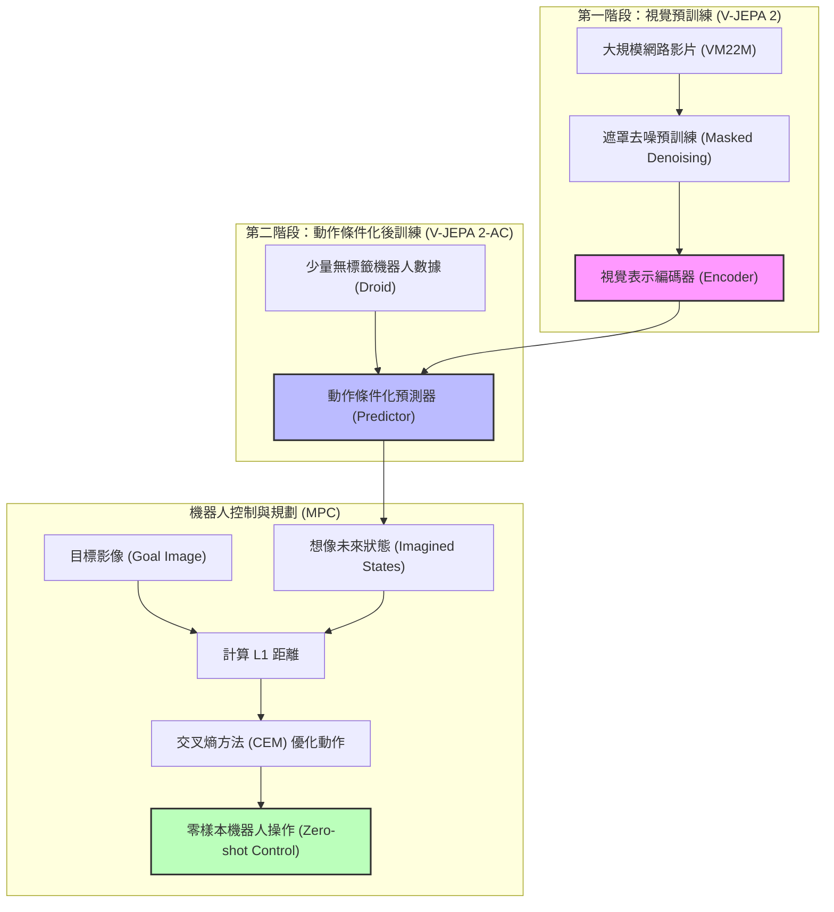
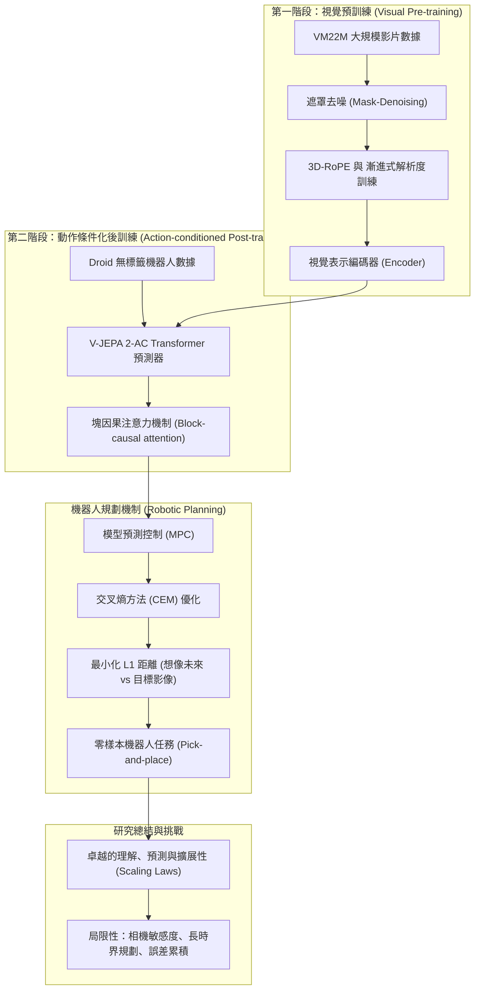
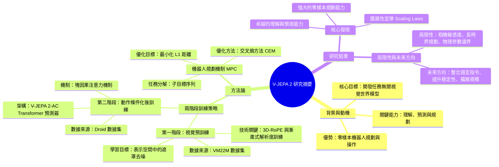

---

## 📝 Executive Summary
```yaml
---
title: "研究摘要：V-JEPA 2 自監督影片模型實現理解、預測與規劃"
tags: ["研究", "論文", "學術"]
type: "論文"
---
```

# 研究報告

## 背景與動機

傳統的機器人學習方法（如模仿學習或行為複製）高度依賴於高品質的專家軌跡，這限制了模型在全新環境中的泛化能力。本研究提出 **V-JEPA 2**，這是一種「任務無關」（Task-agnostic）的視覺世界模型。其核心動機在於開發一個能夠從大規模網路影片中學習物理規律，並僅透過極少量（少於 62 小時）的無標籤機器人互動數據，即可實現 **零樣本（Zero-shot）** 機器人規劃與操作能力的系統。

該研究旨在打破「任務特定型」模型的限制，建立一個具備理解（Understanding）、預測（Prediction）與規劃（Planning）能力的統一框架，使機器人能夠在未經特定環境訓練的情況下，執行如抓取與放置（Pick-and-place）等複雜任務。

## 方法論

V-JEPA 2 的開發採用了兩階段的訓練流程與多維度的擴展策略：

### 1. 兩階段訓練策略
* **第一階段：視覺預訓練 (Visual Pre-training)**
    * **數據來源**：利用大規模的 **VM22M** 數據集（包含超過 2200 萬個影片樣本），整合了來自 SSv2、Kinetics、HowTo100M 等多樣化來源。
    * **學習目標**：採用 **表示空間中的遮罩去噪（Mask-Denoising in Representation Space）**，透過學習預測被遮蔽的視覺特徵來掌握視覺表示。
    * **技術關鍵**：引入 **3D-RoPE（三維旋轉位置嵌入）** 以穩定大型模型的訓練，並採用 **漸進式解析度訓練策略** （從低解析度逐步增加至 512 像素），在維持性能的同時節省了高達 8.4 倍的 GPU 訓練時間。
* **第二階段：動作條件化後訓練 (Action-conditioned Post-training)**
    * **數據來源**：使用來自 **Droid** 數據集的少於 62 小時無標籤機器人互動影片。
    * **架構 (V-JEPA 2-AC)**：在凍結的編碼器上訓練一個 300M 至 1B 參數的 Transformer 預測器。
    * **機制**：採用 **塊因果注意力機制（Block-causal attention mechanism）**，在給定動作指令與先前狀態下，自回歸地預測下一影格的潛在表示。

### 2. 機器人規劃機制 (Robotic Planning)
模型不依賴於策略學習（Policy Learning），而是透過 **模型預測控制 (Model Predictive Control, MPC)** 進行規劃：
* **優化目標**：使用 **交叉熵方法 (Cross-Entropy Method, CEM)**，透過最小化「想像的未來狀態」與「目標影像表示」之間的 **L1 距離** 來優化動作序列。
* **任務分解**：對於複雜任務（如取放），將其分解為一系列子目標（Sub-goals），例如：抓取 $\rightarrow$ 接近 $\rightarrow$ 放下。

## 研究結果與局限性

### 核心發現
* **卓越的理解與預測能力**：
    * 在 **Something-Something v2** 任務中達到 77.3% 的 Top-1 準確率。
    * 在 **Epic-Kitchens-100** 任務中，動作預測性能顯著提升，達到 39.7% 的 Recall@5。
    * 當整合至多模態大語言模型 (MLLM) 架構時，在 **PerceptionTest** 展現了極強的視覺問答 (VidQA) 能力。
* **強大的零樣本規劃能力**：
    * 僅需少量無標籤數據，即可在全新的 Franka 機械臂環境中實現零樣本的抓取與放置任務。
    * 相比於基於擴散模型的 Cosmos，V-JEPA 2-AC 的規劃效率極高（每步動作僅需 16 秒，而 Cosmos 需要 4 分鐘）。
* **擴展性定律 (Scaling Laws)**：
    * 模型的性能隨編碼器規模（300M $\rightarrow$ 1B+）、數據量（2M $\rightarrow$ 22M）及解析度（256 $\rightarrow$ 512）的增加而呈現顯著的增長。

### 局限性與未來方向
* **相機敏感度問題**：模型目前缺乏顯式的相機標定，對於相機角度的變化存在系統性的旋轉誤差，這會導致規劃路徑不夠精確。研究者提出可透過「無監督標定」來緩解此問題。
* **長時界規劃挑戰 (Long-horizon Planning)**：隨著規劃時界的增加，搜尋空間呈指數級增長，且自回歸預測存在 **誤差累積（Error accumulation）** 的問題，限制了處理極長序列任務的能力。
* **物理參數泛化邊界**：雖然具備零樣本能力，但模型對於完全未見過的物理參數（如極端的摩擦力或重量變化）的處理能力仍待驗證。
* **未來研究方向**：研究重點將放在整合 **語言指令** 作為目標、提升長時界規劃的穩定性，以及進一步擴展模型參數規模。



## 🖼️ 學習輔助（flowchart）



## 🖼️ 學習輔助（mindmap）



## 📂 Navigation
- V-JEPA 2 Self-Supervised Video Models Enable Understanding, Prediction and Planning (Part 1): 透過結合大規模網路影片的自我監督預訓練與少量機器人互動數據的後訓練，開發出具備理解、預測與規劃能力的視覺世界模型。
- V-JEPA 2 Self-Supervised Video Models Enable Understanding, Prediction and Planning (Part 2): 透過大規模影片自監督預訓練（V-JEPA 2）與少量互動數據的後訓練（V-JEPA 2-AC），構建一個具備理解、預lag 與規劃能力的動作條件化世界模型。
- V-JEPA 2 Self-Supervised Video Models Enable Understanding, Prediction and Planning (Part 3): V-JEPA 2 achieves significant performance gains through a multi-dimensional scaling strategy involving data volume, model parameters, traini
- V-JEPA 2 Self-Supervised Video Models Enable Understanding, Prediction and Planning (Part 4): 介紹 V-JEPA 2 的擴展性實驗（模型規模、解析度、訓練時程）以及如何透過動作條件化預測器將預訓練模型轉化為具備規劃能力的機器人世界模型。
- V-JEPA 2 Self-Supervised Video Models Enable Understanding, Prediction and Planning (Part 5): V-JEPA 2-AC is trained using unlabeled video via teacher-forcing and rollout losses to enable zero-shot robot control through energy minimiz
- V-JEPA 2 Self-Supervised Video Models Enable Understanding, Prediction and Planning (Part 6): V-JEPA 2-AC enables effective robot control through model-predictive control (MPC) by minimizing the L1 distance between imagined future sta
- V-JEPA 2 Self-Supervised Video Models Enable Understanding, Prediction and Planning (Part 7): V-JEPA 2-AC demonstrates superior efficiency and success rates in complex robot manipulation tasks compared to diffusion-based models, despi
- V-JEPA 2 Self-Supervised Video Models Enable Understanding, Prediction and Planning (Part 8): V-JEPA 2 demonstrates superior motion understanding capabilities compared to state-of-the-art encoders, while facing computational challenge
- V-JEPA 2 Self-Supervised Video Models Enable Understanding, Prediction and Planning (Part 9): V-JEPA 2 在影片分類與動作預期任務上展現了卓越的性能，且其預測能力隨模型規模呈現線性增長。
- V-JEPA 2 Self-Supervised Video Models Enable Understanding, Prediction and Planning (Part 10): 探討 V-JEPA 2 在 EK100 任務中的局限性，並展示其作為視覺編碼器整合至 MLLM 架構中，在影片問答任務上達到最先進性能的過程與實驗結果。
- V-JEPA 2 Self-Supervised Video Models Enable Understanding, Prediction and Planning (Part 11): Scaling the vision encoder size, input resolution, and alignment dataset size significantly improves V-JEPA 2's performance, enabling state-
- V-JEPA 2 Self-Supervised Video Models Enable Understanding, Prediction and Planning (Part 12): V-JEPA 2 introduces a task-agnostic world model that leverages self-supervised learning from web-scale and interaction data to enable zero-s
- V-JEPA 2 Self-Supervised Video Models Enable Understanding, Prediction and Planning (Part 13): 詳細說明 V-JEPA 2 的預訓練超參數設置、透過聚類與加權採樣進行的 YT1B 數據策劃流程，以及模型規模從 ViT-L 到 ViT-g 的擴展細節。
- V-JEPA 2 Self-Supervised Video Models Enable Understanding, Prediction and Planning (Part 14): 探討數據策劃、訓練時程與評估參數對 V-JEPA 2 模型性能的影響，並定義 V-JEPA 2-AC 的後訓練超參數與機器人任務規劃邏輯。
- V-JEPA 2 Self-Supervised Video Models Enable Understanding, Prediction and Planning (Part 15): The V-JEPA 2-AC world model demonstrates intuitive physics understanding through visual reconstruction, but its inferred coordinate axis is
- V-JEPA 2 Self-Supervised Video Models Enable Understanding, Prediction and Planning (Part 16): This part details the experimental setup, hyperparameters, and ablation studies for evaluating V-JEPA 2 on visual classification and action
- V-JEPA 2 Self-Supervised Video Models Enable Understanding, Prediction and Planning (Part 17): This part details the evaluation of V-JEPA 2 on action anticipation tasks and the methodology for integrating it into Multi-modal Large Lang
- V-JEPA 2 Self-Supervised Video Models Enable Understanding, Prediction and Planning (Part 18): V-JEPA 2 utilizes a multi-stage training pipeline and a dynamic $S^2$ strategy to achieve superior spatiotemporal understanding, demonstrati
- V-JEPA 2 Self-Supervised Video Models Enable Understanding, Prediction and Planning (Part 19): 描述 V-JEPA 2 在擴展規模（Scaling）下的三階段漸進式訓練架構、硬體配置及與現有基準模型的比較方法。
- V-JEPA 2 Self-Supervised Video Models Enable Understanding, Prediction and Planning (Part 20): This part provides a comprehensive bibliography of foundational and state-of-the-art research supporting the development of V-JEPA 2, coveri
- V-JEPA 2 Self-Supervised Video Models Enable Understanding, Prediction and Planning (Part 21): 本部分透過對引用文獻的結構化分類，展示了 V-JEPA 2 研究在視覺表示學習、世界模型、機器人學及認知科學領域的學術基礎與技術演進脈絡。
- V-JEPA 2 Self-Supervised Video Models Enable Understanding, Prediction and Planning (Part 22): This part provides a comprehensive bibliography of the foundational research in robot manipulation, multimodal large language models (MLLMs)
- V-JEPA 2 Self-Supervised Video Models Enable Understanding, Prediction and Planning (Part 23): 本部分整理了 V-JEPA 2 的學術基礎，展示其如何整合多模態影片理解、世界模型預測與強化學習規劃技術。
- V-JEPA 2 Self-Supervised Video Models Enable Understanding, Prediction and Planning (Part 24): This final part provides a comprehensive bibliography of foundational works in video understanding, world models, and robot learning.
- [[V-JEPA 2 Self-Supervised Video Models Enable Understanding, Prediction and Planning (Stitched)]]: 忠實接合版，保留 Part notes 的主要內容

---
## 🔗 原始溯源
*   📚 **[[V-JEPA 2 Self-Supervised Video Models Enable Understanding, Prediction and Planning (Stitched)|查看忠實接合版 (Stitched)]]**
*   📄 **查看完整原始檔 (Original)**

## 🧩 Part Digest Appendix

> 每個 Part 的結構化摘要。這是 Ling Ling 進行總合成前的中間理解，可用來檢查 final synthesis 是否有根據。

### Part 1: V-JEPA 2 論文概覽與核心架構

- **Thesis**: 透過結合大規模網路影片的自我監督預訓練與少量機器人互動數據的後訓練，開發出具備理解、預測與規劃能力的視覺世界模型。
- **Key Points**:
  - V-JEPA 2 採用兩階段訓練：首先進行不含動作指令的視覺預訓練，隨後進行動作條件化（Action-conditioned）的後訓練。
  - 第一階段利用超過 100 萬小時的網路影片，透過遮罩去噪（Mask denoising）目標學習視覺表示。
  - 第二階段利用少於 62 小時的無標籤機器人數據，訓練 V-JEPA 2-AC 動作條件化世界模型。
  - V-JEPA 2-AC 採用塊因果注意力機制（Block-causal attention mechanism），能自回歸地預測下一幀的潛在表示。
  - 該模型能實現零樣本（Zero-shot）機器人規劃，在未經特定環境訓練的情況下於 Franka 機械臂上執行抓取與放置任務。
- **Evidence**:
  - V-JEPA 2 在 Something-Something v2 達到 77.3% top-1 準確率。
  - 在 Epic-Kitchens-100 達到 39.7% recall-at-5 的人類動作預測性能。
  - 與 LLM 對齊後的 8B 參數模型在 PerceptionTest 達到 84.0 分。
  - 使用來自 Droid 數據集的少於 62 小時無標籤機器人影片進行訓練。
- **Terms**:
  - V-JEPA 2
  - V-JEPA 2-AC
  - JEPA (Joint-Embedding Predictive Architecture)
  - Action-conditioned
  - Zero-shot
  - Block-causal attention mechanism
  - Model Predictive Control (MPC)
- **Open Questions**:
  - 在「零樣本」部署中，模型如何處理與預訓練數據完全不同的物理參數（如摩擦力、重量）？
  - 使用影像作為目標（image goals）進行規劃時，其精確度與計算成本的平衡點為何？
  - 對於更複雜的非結構化環境，62 小時的數據量是否足以維持規劃的穩定性？
- **Handoff**: 後續章節應關注 V-JEPA 2-AC 的具體架構細節、訓練損失函數的定義，以及在機器人控制迴路（MPC）中具體的規劃演算法。

### Part 2: V-JEPA 2 預訓練與世界模型構建

- **Thesis**: 透過大規模影片自監督預訓練（V-JEPA 2）與少量互動數據的後訓練（V-JEPA 2-AC），構建一個具備理解、預lag 與規劃能力的動作條件化世界模型。
- **Key Points**:
  - V-JEPA 2 採用表示空間中的遮罩去噪（Mask-Denoising）目標，透過擴展模型規模與漸進式解析度訓練策略實現擴展。
  - V-JEPA 2-AC 是一個 300M 參數的 Transformer，利用塊因果注意力機制（Block-causal attention）在給定動作與先前狀態下自回歸預測下一影格表示。
  - 模型展現了強大的理解能力，包括影片問答（Video QA）與細粒度動作辨識（如 Something-Something v2）。
  - 模型具備預測能力，在 Epic-Kitchens-100 人類動作預測任務中較先前最佳模型提升了 44%。
  - 模型具備規劃能力，僅需 62 小時無標籤數據即可在全新環境中實現零樣本（Zero-shot）的抓取操作任務。
- **Evidence**:
  - V-JEPA 2 在 Something-Something v2 任務中使用注意力探針達到 77.3% Top-1 準確率。
  - V-JEPA 2-AC 僅使用來自 Droid 數據集 62 小時的無標籤互動數據進行訓練。
  - 採用 3D-RoPE（三維旋轉位置嵌入）取代傳統絕對位置嵌入，有助於穩定大型模型的訓練。
  - 在 Epic-Kitchens-100 任務中達到 39.7% 的 Recall@5。
- **Terms**:
  - V-JEPA 2-AC
  - 塊因果注意力機制 (Block-causal attention mechanism)
  - 表示空間遮碼去噪 (Mask-Denoising in Representation Space)
  - 3D-RoPE
  - Tubelets
  - 零樣本 (Zero-shot)
- **Open Questions**:
  - 「空間與時間漸進式解析度訓練策略」的具體實作細節與計算效率提升的量化數據。
  - 模型在處理極長影片序列時，塊因果注意力機制的計算複雜度與記憶體限制。
  - 除了 Droid 數據集外，不同領域的互動數據對世界模型泛化能力的影響。
- **Handoff**: 後續合成需關注 V-JEPA 2-AC 如何具體透過模型化規劃（Model-based planning）實現機器人控制，以及其在不同物理任務中的泛化邊界。

### Part 3: V-JEPA 2 Architecture, Scaling, and Dataset Construction

- **Thesis**: V-JEPA 2 achieves significant performance gains through a multi-dimensional scaling strategy involving data volume, model parameters, training duration, and resolution, supported by a curated large-scale video dataset (VM22M).
- **Key Points**:
  - Architecture utilizes 3D-RoPE (Rotary Position Embedding) to stabilize training in large models by partitioning feature dimensions into temporal, height, and width axes.
  - Four key scaling ingredients: Data scaling (2M to 22M videos), Model scaling (300M to 1B+ parameters), Longer training (up to 252K iterations), and Higher resolution/duration.
  - The VM22M dataset integrates diverse sources including SSv2 (ego-centric), Kinetics (exo-centric), HowTo100M, YT-Temporal-1B, and ImageNet.
  - Data curation via cluster-based retrieval on YT1B reduces noise and aligns the distribution with target datasets, yielding a +1.4 point improvement.
  - Evaluation uses a frozen encoder protocol with a 4-layer attentive probe across six motion and appearance classification tasks.
- **Evidence**:
  - Scaling from ViT-L/16 to ViT-g/16 and increasing resolution/duration resulted in a cumulative 4.0-point improvement over the baseline.
  - The VM22M dataset contains 22 million samples, up from the 2 million in the previous VM2M version.
  - Using curated YT1B data achieves performance competitive with the full VM22M dataset at the ViT-L scale.
  - The training uses a 'warmup-constant-decay' learning rate schedule to manage increased complexity and data volume.
- **Terms**:
  - 3D-RoPE
  - Tubelets
  - VM22M (VideoMix22M)
  - Data Curation
  - Attentive probe
  - Ego-centric
  - Exo-centric
  - Representation collapse
- **Open Questions**:
  - What are the specific details of the cluster-based retrieval process mentioned in Section 10.2?
  - How exactly does the 'warmup-constant-decay' schedule handle the transition between different resolutions and clip lengths?
  - What specific 'target distribution' parameters were used to guide the YT1B curation?
- **Handoff**: The next part should focus on the detailed implementation of the dataset construction (Section 10.2) and the specific results of the evaluation protocol mentioned here.

### Part 4: V-JEPA 2 預訓練策略與動作條件化世界模型

- **Thesis**: 介紹 V-JEPA 2 的擴展性實驗（模型規模、解析度、訓練時程）以及如何透過動作條件化預測器將預訓練模型轉化為具備規劃能力的機器人世界模型。
- **Key Points**:
  - 模型擴展性：將編碼器從 300M (ViT-L) 擴展至 1B (ViT-g) 參數可提升平均性能 1.5 分。
  - 漸進式解析度訓練：透過在冷卻階段逐步增加影片時長與解析度，在維持性能的同時減少 8.4 倍的 GPU 訓練時間。
  - 訓練時程優化：採用「熱身—恆定學習率—冷卻階段」時程，並透過延長訓練時程（90K 至 252K 迭代）提升性能。
  - V-JEPA 2-AC 構建：在凍結的編碼器上訓練動作條件化預測器，利用 Droid 資料集（機器人互動數據）學習未來觀測的表示。
  - 世界模型應用：V-JEPA 2-AC 旨在作為潛在世界模型，透過閉迴路模型預測控制 (MPC) 實現機器人任務規劃。
- **Evidence**:
  - 使用 Curated-YT-1B 資料集訓練比未經篩選的基準模型平均性能提升 +1.4 分。
  - 在 64 幀、384x384 解析度下，漸進式訓練相較於全程全解析度訓練可節省 8.4 倍 GPU 時間。
  - 使用約 62 小時來自 Droid 資料集的無標籤影片（包含 7-DoF Franka Panda 機械臂數據）進行訓練。
  - 增加影片時長從 16 幀至 64 幀，在固定 16 幀評估下可提升 0.7 個百分點性能。
- **Terms**:
  - Curated-YT-1B
  - Progressive-Resolution Training
  - V-JEPA 2-AC
  - Model Predictive Control (MPC)
  - Proprioceptive observations
  - End-effector
- **Open Questions**:
  - 在 64 幀之後，增加影片長度對理解任務是否仍有潛在收益（文中提到 64 幀後未觀察到進一步提升，但未探討更長時長的極限）？
  - V-JEPA 2-AC 在處理非桌面式（如移動機器人）環境時的泛化能力如何？
- **Handoff**: 後續合成需關注 V-JEPA 2-AC 如何在具體任務（如第 4 節提到的新環境規劃）中展現其作為世界模型的效能。

### Part 5: V-JEPA 2-AC Training and Planning Mechanisms

- **Thesis**: V-JEPA 2-AC is trained using unlabeled video via teacher-forcing and rollout losses to enable zero-shot robot control through energy minimization-based planning.
- **Key Points**:
  - Training utilizes unlabeled video from the Droid dataset, focusing on end-effector states and actions without task-specific metadata.
  - The loss function combines teacher-forcing loss and a two-step rollout loss to mitigate error accumulation during autoregressive predictions.
  - The predictor architecture uses a 300M parameter Transformer with 3D-RoPE and a block-causal attention pattern.
  - Inference is performed via planning, where an action sequence is optimized to minimize the L1 distance between imagined future states and a goal image.
  - The planning process employs the Cross-Entropy Method (CEM) within a receding horizon control framework.
- **Evidence**:
  - Training data consists of approximately 62 hours of unlabeled video from the Droid dataset.
  - The predictor network features 24 layers, 16 heads, and a 1024 hidden dimension.
  - The rollout loss is computed using a two-step process (T=2) to improve autoregressive stability.
  - The model demonstrates zero-shot generalization to new environments for tasks like reaching, grasping, and pick-and-place.
- **Terms**:
  - V-JEPA 2-AC
  - Teacher-forcing loss
  - Rollout loss
  - Block-causal attention
  - Cross-Entropy Method (CEM)
  - Receding horizon control
  - 3D-RoPE
  - Zero-shot
- **Open Questions**:
  - How does the choice of T=2 for rollout loss specifically impact long-term stability compared to larger T?
  - What are the computational limits of the CEM optimization for more complex, high-dimensional action spaces?
- **Handoff**: The next part should focus on the broader implications of these zero-shot capabilities or specific downstream task performance metrics.

### Part 6: V-JEPA 2-AC Planning and Experimental Evaluation

- **Thesis**: V-JEPA 2-AC enables effective robot control through model-predictive control (MPC) by minimizing the L1 distance between imagined future states and goal representations, demonstrating zero-shot generalization to unseen environments.
- **Key Points**:
  - Planning mechanism: Uses the Cross-Entropy Method (CEM) to optimize action sequences by minimizing L1 distance between imagined and goal state representations.
  - Baseline comparisons: Evaluates against Octo (behavior cloning-based) and Cosmos (video generation-based) models.
  - Robot deployment: Zero-shot testing on Franka Emika Panda arms with RobotiQ grippers in environments not present in the Droid dataset.
  - Single-goal reaching performance: Achieves end-effector precision within 4 cm of the goal, exhibiting visual servoing capabilities.
  - Energy landscape characteristics: V-JEPA 2-AC produces a smooth and locally convex energy landscape, facilitating efficient planning.
  - Prehensile manipulation tasks: Evaluates complex skills including grasp, reach with object, and pick-and-place using multi-stage sub-goals.
- **Evidence**:
  - Action constraint: Each sampled action is constrained to an L1-Ball of radius 0.075, limiting max displacement to ~13 cm.
  - Energy landscape data: For the Δy task, the energy minimum was found near (0, -0.05) compared to the ground truth of (0, -0.1).
  - Baseline setup: Octo was fine-tuned on Droid using hindsight relabeling with 256x256 resolution and 2 previous frames.
  - Cosmos fine-tuning: Involved lowering learning rate, removing dropout, and increasing noise level by a factor of e².
- **Terms**:
  - Model Predictive Control (MPC)
  - Cross-Entropy Method (CEM)
  - Visual Servoing
  - Prehensile Manipulation
  - Energy Landscape
  - L1-Ball
  - Zero-shot
- **Open Questions**:
  - How does the performance of V-JEPA 2-AC compare to Octo and Cosmos in more complex, multi-step manipulation tasks beyond the reported 'pick-and-place'?
  - What are the specific computational overheads of running the CEM optimization loop in real-time for high-frequency control?
- **Handoff**: The next part should focus on the broader implications of these results and any further task complexities or architectural details discussed in the subsequent sections.

### Part 7: V-JEPA 2-AC Performance and Limitations

- **Thesis**: V-JEPA 2-AC demonstrates superior efficiency and success rates in complex robot manipulation tasks compared to diffusion-based models, despite limitations in camera sensitivity and long-horizon planning.
- **Key Points**:
  - Task decomposition: Pick-and-place is achieved by optimizing actions through a sequence of three sub-goals (grasping, moving to vicinity, and final placement).
  - Performance advantage: V-JEPS 2-AC achieves higher success rates in object interaction tasks (e.g., grasping cups and boxes) compared to the Cosmos model.
  - Computational efficiency: V-JEPA 2-AC requires only 16 seconds per action, whereas Cosmos takes 4 minutes per action, making real-time execution feasible.
  - Sensitivity to camera positioning: The model lacks explicit camera calibration and must implicitly infer the action coordinate axis from monocular RGB input.
  - Long-horizon challenges: Planning is hindered by error accumulation in autoregressive prediction and the exponential growth of the search space.
- **Evidence**:
  - V-JEPA 2-AC achieves 80% success rate on 'cup' pick-and-place tasks in Lab 1, while Cosmos shows 0% success for the same task.
  - Planning time comparison: 16 seconds per action for V-JEPA 2-AC vs. 4 minutes per action for Cosmos using 80 samples and 10 refinement steps.
  - The 'grasp' task requires precise visual feedback, while 'reach with object' requires understanding intuitive physics to avoid dropping items.
- **Terms**:
  - V-JEPA 2-AC
  - Cosmos
  - Pick-and-place
  - Latent planning
  - Cross-entropy method
  - Autoregressive prediction
  - Error accumulation
  - End-effector
- **Open Questions**:
  - How can the model be made robust to camera positions without explicit calibration?
  - Can gradient-based planning or feed-forward policy initialization further reduce planning time?
  - How can the model transition from image-based goals to natural language instructions?
- **Handoff**: The next part should address the quantitative analysis of camera sensitivity (Section 11.4) and any further details on task specifications.

### Part 8: V-JEPA 2 Performance Evaluation and Planning Challenges

- **Thesis**: V-JEPA 2 demonstrates superior motion understanding capabilities compared to state-of-the-art encoders, while facing computational challenges in long-horizon planning.
- **Key Points**:
  - Long-horizon planning faces exponential growth in search space as the planning horizon increases linearly.
  - V-JEPS 2-AC capabilities are limited by the state information encoded in its learned representation space.
  - Visual classification is evaluated across two dimensions: appearance understanding (static) and motion understanding (dynamic).
  - The evaluation uses a 4-layer attentive probe with a cross-attention layer and a learnable query token on top of a frozen encoder.
  - V-JEPA 2 achieves state-of-the-art performance in motion tasks (SSv2, Diving-48, Jester) and remains competitive in appearance tasks (K400, COIN, ImageNet).
- **Evidence**:
  - V-JEPA 2 ViT-g achieved 75.3 Top-1 accuracy on SSv2, outperforming InternVideo (69.7) and PE core G (55.4).
  - V-JEPA 2 ViT-g 384 reached an average performance of 88.2 across all six tasks.
  - V-JEPA 2 achieved 84.6 on ImageNet, a +4.6 point improvement over the original V-JEPA.
  - The attentive probe architecture consists of four Transformer blocks, with the final block using cross-attention.
- **Terms**:
  - Long-horizon planning
  - Appearance understanding
  - Motion understanding
  - Attentive probe
  - Cross-attention layer
  - Goal-conditioned robot manipulation
- **Open Questions**:
  - How can language models be aligned with latent action-conditioned world models for more natural task specification?
  - What specific world model architectures will effectively enable long-horizon planning without exponential computational costs?
  - How does the performance of V-JEPA 2 scale when using even higher resolutions or longer temporal durations beyond the tested configurations?
- **Handoff**: The next part should focus on the specific architectural details or downstream applications of the learned representations, noting that the current model relies on visual goals but future work aims for language-based goals.

### Part 9: V-JEPA 2 性能評估：分類與動作預期

- **Thesis**: V-JEPA 2 在影片分類與動作預期任務上展現了卓越的性能，且其預測能力隨模型規模呈現線性增長。
- **Key Points**:
  - V-JEPA 2 在動作理解任務（如 SSv2）上顯著優於 InternVideo 與 PE Core G 等視覺編碼器。
  - 在 EK100 動作預期基準測試中，V-JEPA 2 的性能隨模型參數規模（300M 至 1B）呈線性增長。
  - 透過在凍結的主幹網路（Frozen Backbone）上訓練注意力探針（Attentive Probe），V-JEPA 2 仍能超越專為該任務設計的 SOTA 模型。
  - 模型性能受解析度影響，使用 384x384 解析度的 ViT-g 較 256x256 解析度有進一步提升。
  - 動作預期任務包含同時預測動詞、名詞與完整動作類別。
- **Evidence**:
  - V-JEPA 2 ViT-g 在 SSv2 達到了 75.3 的 Top-1 準確率。
  - V-JEPA 2 ViT-g 384 在動作召回率上比 PlausiVL 提升了 +12.1 個百分點。
  - EK100 數據集包含 100 小時的第一人稱視角烹飪活動，涵蓋 3,568 個動作標籤。
  - 預期探針使用注意力探針的最終交叉注意力層學習三個查詢標記（query tokens）。
- **Terms**:
  - Action Anticipation (動作預期)
  - Attentive Probe (注意力探針)
  - Egocentric perspective (第一人稱視角)
  - Frozen Backbone (凍結的主幹網路)
  - Mean-class recall-at-5 (平均類別 Top-5 召回率)
  - Linear scaling (線性擴展性)
- **Open Questions**:
  - V-JEPA 2 對於非廚房環境（非 EK100 範疇）的泛化能力如何？
  - 當預期時間範圍拉長（超過 1 秒）時，模型的準確度下降程度為何？
  - 模型對於訓練集中未出現過的動作類別的處理能力如何？
- **Handoff**: 後續合成需注意 V-JEPA 2 的規模化特性（Scaling Law）以及其在特定領域（廚房）與特定時間尺度（1秒）下的性能限制。

### Part 10: V-JEPA 2 局限性與影片問答 (VidQA) 能力評估

- **Thesis**: 探討 V-JEPA 2 在 EK100 任務中的局限性，並展示其作為視覺編碼器整合至 MLLM 架構中，在影片問答任務上達到最先進性能的過程與實驗結果。
- **Key Points**:
  - EK100 局限性：存在動詞/名詞識別錯誤、預測長時間跨度準確度下降、環境與動作類別受限於廚房場景。
  - VidQA 整合架構：採用非標記化早期融合 (non-tokenized early fusion)，將 V-JEPA 2 作為視覺編碼器與 LLM 進行對齊。
  - 視覺指令微調三階段：包含影像說明 (Stage 1)、影像問答 (Stage 2) 及影片問答與說明 (Stage 3) 的漸進式訓練。
  - 性能提升因素：擴展視覺編碼器規模 (Encoder Scale) 與輸入解析度 (Resolution) 能一致提升 VidQA 性能。
  - 語言對齊規模：使用 8,850 萬個影像與影片-文本對進行大規模對齊，使 V-JEPA 2 在多個基準測試達到 SOTA。
- **Evidence**:
  - 實驗數據顯示，增加編碼器規模與解析度（如從 300M 擴展至 1B，解析度從 256 提升至 512）可提升平均性能。
  - 在凍結編碼器設置下，V-JEPS 2 ViT-g 512 在 PerceptionTest 達到 72.0% 準確度，優於 DINOv2 與 SigLIP2。
  - 使用 88.5 million image- and video-text pairs 進行大規模語言對齊實驗。
  - 錯誤案例分析：模型能提出連貫動作（如「關閉門」），但可能遺失物件具體性質（如「茶包」）。
- **Terms**:
  - Non-tokenized early fusion
  - Visual instruction tuning
  - Projector module (MLP)
  - Video Question Answering (VidQA)
  - PerceptionTest
  - Temporal understanding
- **Open Questions**:
  - V-JEPA 2 在非廚房環境（EK100 之外）的泛化能力如何？
  - 對於未在訓練集中出現過的動作類別，模型的泛化表現如何？
  - 長時間跨度 (longer time horizons) 的預測準確度下降具體受何種因素影響？
- **Handoff**: 後續合成需關注 V-JEPA 2 在不同任務（如物理理解、時序理解）上的具體表現差異，以及其作為視覺編碼器在多模態模型中的擴展性。

### Part 11: V-JEPA 2 Scaling and SOTA Performance

- **Thesis**: Scaling the vision encoder size, input resolution, and alignment dataset size significantly improves V-JEPA 2's performance, enabling state-of-the-art results in video question answering (VidQA) and demonstrating task-agnostic generalization.
- **Key Points**:
  - V-JEPS 2 outperforms language-supervised encoders (DINOv2, SigLIP) in temporal understanding tasks despite lacking language supervision.
  - Scaling the vision encoder from 300M to 1B parameters and increasing resolution from 256 to 512 pixels yields consistent performance gains.
  - Expanding the alignment dataset from 18M to 88.5M samples drives significant improvements across multiple benchmarks (PerceptionTest, MVP, etc.).
  - V-JEPA 2 achieves SOTA results in the 8B model class, specifically outperforming models like Qwen2VL and InternVL 2.5.
  - The model functions as a task-agnostic world model, demonstrating generalization to new environments and objects unlike task-specific models.
- **Evidence**:
  - Increasing resolution to 512 pixels improved TemporalBench by 4.0 points and TVBench by 3.3 points.
  - Scaling data to 88.5M samples increased TOMATO accuracy by 7.1 points compared to PerceptionLM 8B.
  - V-JEPA 2 ViT-g 384 with Llama 3.1 8B achieved 59.5% average accuracy in Table 8.
  - The use of an MLP projector without pooling was employed to simplify the training process during scaling.
- **Terms**:
  - V-JEPA 2
  - VidQA
  - Spatiotemporal Understanding
  - Task-agnostic
  - World Model
  - MLP Projector
  - Alignment dataset
- **Open Questions**:
  - What are the specific computational costs/trade-offs of using 288 visual tokens per frame?
  - Why does V-JEPA 2 slightly underperform SigLIP and PE specifically on the PerceptionTest benchmark?
  - How does the 'task-agnostic' nature specifically manifest in unseen manipulation or locomotion tasks?
- **Handoff**: The next synthesis should integrate these scaling laws (encoder size, resolution, and data) with the previously discussed architectural components (predictive models, block-causal attention) to form a complete picture of the V-JEPA 2 training paradigm.

### Part 12: V-JEPA 2: World Models, Robotic Control, and Future Directions

- **Thesis**: V-JEPA 2 introduces a task-agnostic world model that leverages self-supervised learning from web-scale and interaction data to enable zero-shot robotic planning and manipulation via Model Predictive Control (MPC).
- **Key Points**:
  - Task-agnostic vs. Task-specific: Unlike previous models that focus on specific tasks or environments, V-JEPS 2 is trained to generalize to new environments and unseen objects.
  - Control Mechanism: The model utilizes Model Predictive Control (MPC) instead of policy learning/imitation learning to avoid the need for expert trajectories.
  - Data Utilization: V-JEPA 2 leverages any interaction data (both successful and failed), whereas imitation learning approaches typically require high-quality, successful expert trajectories.
  - V-JEPA 2-AC Capabilities: Post-training an action-conditioned model (V-JEPA 2-AC) enables successful zero-shot prehensile manipulation tasks like Pick-and-Place.
  - Scaling and Future Work: Future research aims to address longer-horizon tasks, integrate language-based goals, and continue scaling parameters beyond 1B.
- **Evidence**:
  - Achieves SOTA performance on action classification and human action anticipation.
  - Demonstrates zero-shot prehensile manipulation (e.g., Pick-and-Place) using V-JEPA 2-AC.
  - Pretraining hyperparameters include a 1B parameter scale, 16-frame primary phase, and 64-frame cooldown phase.
  - Uses a global batch size of 3072 for both training phases.
- **Terms**:
  - Task-agnostic
  - Model Predictive Control (MPC)
  - Policy learning
  - Imitation learning
  - Behavior cloning
  - Zero-shot
  - Prehensile manipulation
  - Long-horizon tasks
- **Open Questions**:
  - How can the model be extended to handle longer-horizon tasks without requiring sub-goals?
  - How can language-based goal specification be integrated into the V-JEPA 2-AC representation space?
  - What are the optimal pre-training recipes for sustained performance improvements as parameters scale beyond 1B?
- **Handoff**: The model's ability to generalize via MPC is established; the next synthesis should focus on how these architectural components (JEPA, AC, MPC) integrate into a complete autonomous system.

### Part 13: V-JEPA 2 預訓練超參數、數據策劃與模型擴展

- **Thesis**: 詳細說明 V-JEPA 2 的預訓練超參數設置、透過聚類與加權採樣進行的 YT1B 數據策劃流程，以及模型規模從 ViT-L 到 ViT-g 的擴展細節。
- **Key Points**:
  - 預訓練分為主要階段 (Primary Phase) 與冷卻階段 (Cooldown Phase)，後者透過增加幀數與裁剪尺寸來提升性能。
  - 簡化版方案 (Abbreviated Recipe) 採用 90,000 步訓練，並使用線性預熱與餘弦退火 (Cosine Decay) 的學習率排程。
  - 數據策劃流程利用 PySceneDetect 提取場景，並透過 DINOv2 ViT-L 提取嵌入進行 150 萬個簇的聚類。
  - 透過加權採樣策略 (Weighted Sampling) 重新平衡 YT1B 簇，使其分佈更接近目標數據集（如 K710, SSv2）。
  - 模型規模擴展主要針對編碼器 (Encoder)，從 300M (ViT-L) 擴展至 1B (ViT-g) 參數，而預測器大小保持固定。
- **Evidence**:
  - 冷卻階段增加幀數至 64 幀，裁剪尺寸範圍擴大至 [256, 384, 512] 以提升 IN1K 任務表現。
  - 數據策劃將原始 150 萬個簇精煉至 21 萬個包含目標影片的簇，包含 1.15 億個場景。
  - K710 的檢索權重設定為 0.7，使得最終數據集具有較重的 Kinetics 權重。
  - 編碼器架構包含 ViT-L (300M), ViT-H (600M), 與 ViT-g (1B) 三種規模。
- **Terms**:
  - Cooldown Phase (冷卻階段)
  - Data Curation (數據策劃)
  - Weighted sampling (加權採樣)
  - Cosine Decay (餘弦退火)
  - Scene extraction (場景提取)
  - Embedding (嵌入)
- **Open Questions**:
  - 簡化方案中權重衰減從 0.04 增加到 0.4 的具體訓練動機為何？
  - 為何在擴展模型規模時，預測器 (Predictor) 的大小選擇保持固定？
- **Handoff**: 後續合成需注意數據策劃如何透過 YT1B 簇的加權來平衡不同目標數據集的分布，以及模型規模擴展僅針對編碼器而非預測器。

### Part 14: V-JEPA 2 附加結果與後訓練設定

- **Thesis**: 探討數據策劃、訓練時程與評估參數對 V-JEPA 2 模型性能的影響，並定義 V-JEPA 2-AC 的後訓練超參數與機器人任務規劃邏輯。
- **Key Points**:
  - 數據策劃效果隨模型規模變化：ViT-L 在使用精選數據時表現較佳，而 ViT-g 在混合數據（Mixed）設定下性能最優。
  - 兩階段訓練策略：引入冷卻階段（Cooldown phase）結合 64 幀預訓練與學習率衰減，能顯著提升所有評估指標。
  - 評估時影片長度的影響：在推理時增加影片幀數（從 16 幀增加到 64 幀）可使平均性能提升高達 9.7 個百分點。
  - V-JEPA 2-AC 後訓練配置：採用 AdamW 優化器與預熱-恆定-衰減學習率策略，並使用 Droid 數據集進行訓練。
  - 機器人任務規劃邏輯：透過子目標（Sub-goal）序列（如抓取 $\rightarrow$ 接近 $\rightarrow$ 放下）來執行複雜的取放任務。
- **Evidence**:
  - ViT-L 在 SSv2 任務上，VM22M (Mixed+Curated YT1B) 得分為 72.8，低於 Mixed+Uncurated YT1B 的 73.3。
  - 在 64 幀片段上預訓練的模型，評估時長度從 16 幀增加到 64 幀，平均性能提升 $+9.7$ 個百分點。
  - V-JEPA 2-AC 訓練使用 4 秒影片片段，幀率為 4 fps，且僅使用 Droid 的左側外接相機視角。
  - 取放任務（pick-and-place）包含三個階段：第一個子目標（抓取）4 步，第二個子目標（接近）10 步，最後一個目標 4 步。
- **Terms**:
  - Data Curation (數據策劃)
  - Cooldown/Annealing (冷卻/退火)
  - Planning Horizon (規劃時界)
  - Prehensile manipulation (抓取操作)
  - Sub-goal (子目標)
  - Learning rate decay (學習率衰減)
- **Open Questions**:
  - 為何在 ViT-L 規模下，加入 K710 數據的混合設定反而不如僅使用精選 YT1B？
  - 為何同時使用左右相機視角且不加入相機位置條件化會降低性能？
  - 為什麼在機器人任務中選擇較短的規劃時界（Planning Horizon = 1）就已足夠？
- **Handoff**: 後續合成需注意數據策劃在不同模型規模下的矛盾表現，以及 V-JEPA 2-AC 在機器人任務中如何透過子目標序列化來處理複雜操作。

### Part 15: Visualizing World Model Predictions and Assessing Camera Sensitivity

- **Thesis**: The V-JEPA 2-AC world model demonstrates intuitive physics understanding through visual reconstruction, but its inferred coordinate axis is sensitive to camera position, potentially causing systematic rotation errors.
- **Key Points**:
  - Visualizing predictions via a feedforward frame decoder allows for qualitative analysis of the model's ability to capture salient scene features and intuitive physics.
  - The V-JEPA 2-AC world model successfully animates the robot and objects (e.g., cup movement with arm) while maintaining background stability.
  - A systematic rotation error in the inferred coordinate axis is observed as a function of the camera's angular position around the robot base.
  - This rotation error leads to suboptimal planning, where the distance to the goal decreases monotonically but not maximally.
  - A potential 'unsupervised calibration' method exists by using linear least squares to find a rotation matrix $W^{\star}$ to align inferred actions with real actions.
- **Evidence**:
  - The frame decoder is a ViT-L parameterized feedforward network trained with AdamW for 150,000 steps using L2 pixel reconstruction loss.
  - The mean absolute prediction error for all camera positions is approximately 1.6 cm compared to a 5 cm ground-truth delta pose.
  - The condition number of the transformation matrix $W^{\star}$ is approximately 1.5, indicating it is nearly a rotation matrix.
  - The model's inferred coordinate axis rotation error is observed to be almost a linear function of the camera position.
- **Terms**:
  - Action-conditioned world model
  - Feedforward frame decoder
  - Intuitive physics
  - Error accumulation
  - Inferred coordinate axis
  - Unsupervised calibration
- **Open Questions**:
  - How would the implementation of the proposed unsupervised calibration affect the computational overhead during real-time task execution?
  - To what extent does the low capacity of the feedforward decoder contribute to the observed blurry background generation?
- **Handoff**: Remember that while the model understands physics, it suffers from camera-dependent rotation errors in its inferred coordinate system, which can be addressed via a rotation-based calibration.

### Part 16: Visual Classification and Action Anticipation Evaluation Details

- **Thesis**: This part details the experimental setup, hyperparameters, and ablation studies for evaluating V-JEPA 2 on visual classification and action anticipation tasks.
- **Key Points**:
  - Attentive Probe architecture consists of four Transformer blocks: three self-attention blocks and one cross-attention block with learnable query tokens.
  - Evaluation protocols vary by dataset, with different frame counts, temporal/spatial crops, and resolutions (e.g., 256x256 vs 384x384 for ViT-g 384).
  - Jester and Diving-48 tasks utilize a multi-layer strategy, extracting tokens from four specific encoder layers rather than just the last layer.
  - Ablation studies confirm that a four-layer probe outperforms a single-layer probe, and deeper encoder layers benefit Jester/Diving-48 performance.
  - Action anticipation probes follow a similar architecture to classification probes, using learnable query tokens and a linear classifier.
- **Evidence**:
  - ViT-L 4-layer probe achieved 85.6% average accuracy on motion understanding tasks.
  - Jester/Diving-48 evaluation uses 32 frames and 4 segments/clip with a 2-frame step.
  - For ImageNet, input images are repeated to create 16-frame video clips with a global batch size of 1024.
  - The rotation-based calibration method (using $W^{\star}$) was discussed but explicitly not used in the experiments.
- **Terms**:
  - Attentive Probe
  - Cross-attention
  - Learnable query token
  - Multi-layer strategy
  - Action anticipation
  - Cosine schedule
- **Open Questions**:
  - Why was the rotation-based calibration method intentionally omitted from the experiments?
  - What are the specific implications of the 'non-maximal, albeit monotonic' decrease in distance to goal for long-term planning?
- **Handoff**: The next part should focus on the synthesis of results across all tasks, noting the specific architectural advantages of the multi-layer token extraction and the 4-layer probe structure.

### Part 17: Action Anticipation and Video Question Answering

- **Thesis**: This part details the evaluation of V-JEPA 2 on action anticipation tasks and the methodology for integrating it into Multi-modal Large Language Models (MLLMs).
- **Key Points**:
  - Action anticipation on EK10_00 is evaluated using a probe architecture with four Transformer blocks and cross-attention layers.
  - Encoder outputs provide competitive performance for action anticipation, while adding predictor outputs offers a small but consistent improvement.
  - V-JEPA 2 performance in action anticipation scales with longer context, higher frame rates, and higher resolution, up to a saturation point.
  - The MLLM training follows the LLaVA framework, using a projector module (typically 2-layer MLP) to align V-JEPA 2 embeddings with the LLM backbone.
  - A modified Dynamic S² strategy is used to process images at native resolution via tiles to provide higher granularity during training.
- **Evidence**:
  - Optimal action anticipation performance is achieved with 32-frame context, 8 fps, and 384x384 resolution.
  - The MLLM training utilized a dataset of 88.5 million image-text and video-text pairs.
  - In EK100 action anticipation, the most frequent failure configuration involves a failure to identify the action.
  - The MLLM uses Qwen2-7B-Instruct for controlled experiments and Llama 3.1 8B Instruct for scaling experiments.
- **Terms**:
  - Action Anticipation
  - Probe Architecture
  - Multi-modal Large Language Model (MLLM)
  - Projector Module
  - Dynamic S² Strategy
  - Visual Tokens
- **Open Questions**:
  - What are the specific computational costs associated with the scaling experiments using Llama 3.1 8B?
  - How does the choice of pooling method (e.g., Perceiver Sampler vs. Attentive Pooling) specifically impact the performance of the MLLM?
- **Handoff**: Remember the specific hyperparameter settings for EK100 (32 frames, 8 fps) and the use of the Dynamic S² strategy for high-resolution image training in MLLM integration.

### Part 18: V-JEPA 2 Controlled Setup and Data Scaling

- **Thesis**: V-JEPA 2 utilizes a multi-stage training pipeline and a dynamic $S^2$ strategy to achieve superior spatiotemporal understanding, demonstrating linear performance scaling with increased video duration compared to traditional image encoders.
- **Key Points**:
  - Multi-stage training pipeline: Stage 1 (image captioning alignment), Stage 1.5 (high-quality image captioning), Stage 2 (large-scale image VQA), and Stage 3 (large-scale video captioning/VQA).
  - Dynamic $S^2$ strategy: Uses adaptive tiling at native resolution to preserve fine-grained information during training, avoiding the inefficiency of frame repetition.
  - Attentive Pooler as Projector: Employs an attentive pooler with a 4-16x reduction factor to manage visual token counts and maintain fixed MLLM context length.
  - Scalability advantage: Unlike DINOv2, which plateaus or decreases in performance as frame count increases, V-JEPA 2 shows linear performance growth with longer video durations.
  - Controlled comparison setup: Uses Qwen2-7B-Instruct as the base LLM and compares V-JEPA 2 against DINOv2, SigLIP2, and Perception Encoder using uniform frame sampling.
- **Evidence**:
  - Training used 18 million image and video-text aligned data.
  - Implementation utilized 128 H100 GPUs with an effective batch size of 256.
  - Learning rates: 1e-5 (cosine decay) for Stages 1/1.5, and 5e-6 (constant) for Stages 2/3.
  - Comparison models used native resolutions: DINOv2 (518px), SigLIP2 (384px), and PE (448px).
- **Terms**:
  - Attentive pooler
  - Dynamic $S^2$ strategy
  - Visual instruction tuning
  - Spatiotemporal reasoning
  - Visual tokens
  - Long-form video understanding
- **Open Questions**:
  - What are the specific computational trade-offs when increasing the pooling ratio from 4 to 16?
  - How does the 'unfreezing' of V-JEPA 2 parameters in the finetuned setup specifically impact the downstream performance compared to the frozen setup?
- **Handoff**: The next part should focus on the results of the evaluation and the broader implications of the scaling laws observed in this setup.

### Part 19: V-JEPA 2 擴展訓練細節與評估基準

- **Thesis**: 描述 V-JEPA 2 在擴展規模（Scaling）下的三階段漸進式訓練架構、硬體配置及與現有基準模型的比較方法。
- **Key Points**:
  - 採用三階段漸進式訓練：Stage 1 圖像對齊、Stage 2 圖像-文本與 QA 數據、Stage 3 影片-文本與 QA 數據。
  - 架構修改：捨棄傳統池化機制，改用 MLP 投影模組 (MLP projector) 將 V-JEPA 2 ViT-g 轉換為每幀 288 個 tokens。
  - 骨幹模型：使用 Llama 3.1 8B Instruct 作為核心大型語言模型 (Backbone LLM)。
  - 訓練規模：數據量擴展至 8,850 萬個樣本，並使用 512 顆 H100 GPU 進行大規模訓練。
  - 評估基準：與 Qwen2VL、Qwen2.5VL、InternVL-2.5 及 PerceptionLM 8B 等模型進行對比。
- **Evidence**:
  - Stage 2 參數：35,000 步，全域批次大小 2,048，最大序列長度 1,920。
  - Stage 3 參數：28,000 步，全域批次大小 1,024，最大序列長度 12,800。
  - 硬體資源：在第二與第三階段使用 512 顆 H100 GPU。
  - 數據規模：擴展至 8,850 萬個樣本。
- **Terms**:
  - MLP 投影模組 (MLP projector)
  - 骨幹大型語言模型 (Backbone LLM)
  - 漸進式階段 (Progressive stages)
  - 全域批次大小 (Global batch size)
  - 圖像分塊 (Image tiles)
- **Open Questions**:
  - Stage 1 的具體訓練數據類型與規模為何？
  - 為什麼在 Stage 3 中，圖像分塊與影片幀數同時增加到 32？
  - 模型在 32 幀影像下的評估結果具體表現如何（相對於基準模型）？
- **Handoff**: 後續合成需注意 V-JEPA 2 透過 MLP 投影模組取代池化機制，以及其三階段訓練從圖像到影片的演進邏輯。

### Part 20: V-JEPA 2 Reference Bibliography

- **Thesis**: This part provides a comprehensive bibliography of foundational and state-of-the-art research supporting the development of V-JEPA 2, covering video understanding, embodied AI, and multimodal pre-training.
- **Key Points**:
  - Video Understanding: Includes benchmarks like Temporalbench and datasets like Kinetics-60/700 for temporal and action recognition.
  - Embodied AI & Robotics: References key models like RT-2 (VLA), PaLM-E, and Genie, alongside techniques like Visual Foresight and offline reinforcement learning.
  - Multimodal Pre-training: Covers large-scale architectures including Vision Transformers (ViT) and autoregressive pre-training for vision encoders.
  - Research Scope: Spans from early robotics control theory (1985) to cutting-edge 2025 research in visual understanding and scaling laws.
- **Evidence**:
  - RT-2: Vision-language-action models transfer web knowledge to robotic control.
  - Genie: Generative interactive environments (2024).
  - PaLM-E: An embodied multimodal language model (2023).
  - Temporalbench: Benchmarking fine-grained temporal understanding for multimodal video models (2024).
- **Terms**:
  - Vision-Language-Action (VLA)
  - Visual Foresight
  - Embodied AI
  - Self-Supervised Learning
  - Temporal Understanding
- **Open Questions**:
  - How specifically do the cited VLA models (RT-2, PaLM-E) integrate with the V-JEPA 2 architecture?
  - What is the precise relationship between the 'Visual Foresight' techniques cited and the 'Predictor' mechanism in V-JEPA 2?
- **Handoff**: The next part should focus on how these cited foundational works (specifically VLA and Visual Foresight) are integrated into the V-JEPA 2 architecture to enable planning.

### Part 21: V-JEPA 2 參考文獻分類與學術脈絡

- **Thesis**: 本部分透過對引用文獻的結構化分類，展示了 V-JEPA 2 研究在視覺表示學習、世界模型、機器人學及認知科學領域的學術基礎與技術演進脈絡。
- **Key Points**:
  - 視覺表示學習：涵蓋大規模視覺表示學習 [^34]、多模態自回歸預訓練 [^35] 及遮罩視覺預訓練 (MaskViT) [^46]。
  - 世界模型與預測性動力學：包含經典 World Models [^47]、潛在動力學學習 [^49, ^50] 以及生成式世界模型 (Gaia-1) [^55]。
  - 機器人學與規劃：涉及機器人運動規劃 [^36]、物理交互預測 [^37, ^38]、大規模機器人數據集 (DROID) [^60] 及 OpenVLA 模型 [^61]。
  - 理論基礎：整合了自由能原理 (Free-energy Principle) [^39] 與生態視覺感知理論 (Ecological approach to visual perception) [^42]。
  - 數據集與基準測試：依賴 Kinetics [^59]、Something-Something [^43] 及物理理解基準測試 [^62] 作為評估基礎。
- **Evidence**:
  - 引用文獻涵蓋了從 1979 年的生態視覺感知理論到 2025 年的最前沿視覺表示學習研究。
  - 技術路徑展示了從自監督學習 (BYOL) 到潛在空間想像 (Dream to Control) 再到機器人模仿學習 (BC-Z) 的演進。
  - 模型應用範圍從自動駕駛 (Gaia-1) 延伸至大規模機器人操縱 (DROID)。
- **Terms**:
  - Self-Supervised Learning (自監督學習)
  - World Models (世界模型)
  - Model Predictive Control (模型預測控制)
  - Latent Dynamics (潛在動力學)
  - Visual Representation Learning (視覺表示學習)
  - Robotic Manipulation (機器人操縱)
- **Open Questions**:
  - 文獻中提到的不同世界模型架構（如 Gaia-1 與 Dream to Control）在 V-JEPA 2 中的具體整合方式為何？
  - 如何平衡大規模預訓練（如 Llama 3 相關技術）與特定機器人任務（如 DROID）之間的泛化能力？
- **Handoff**: 後續合成需注意這些文獻如何共同支撐 V-JEPA 2 的核心架構，特別是視覺預測如何轉化為機器人規劃的邏輯鏈結。

### Part 22: V-JEPA 2 Reference Analysis

- **Thesis**: This part provides a comprehensive bibliography of the foundational research in robot manipulation, multimodal large language models (MLLMs), and self-supervised video understanding that supports V-JEPA 2.
- **Key Points**:
  - Robot Manipulation & Action Models: Focuses on large-scale datasets (Droid, Octo) and VLA models (OpenVLA, R3m) for translating visual-language instructions into physical actions.
  - Multimodal Large Language Models (MLLMs): Highlights advancements in visual instruction tuning (LLaVA series) and state-of-the-art models like Qwen2.5-VL and NVILA.
  - Video Understanding & Spatiotemporal Learning: Covers benchmarks for evaluating temporal reasoning (MVBench, TempCompass) and methods for learning physical dynamics (Masked Autoencoding, World Models).
  - Physical Understanding & Autonomous Intelligence: Explores the development of internal world models (Modem-v2) to simulate real-world robot manipulation and the path toward autonomous machine intelligence.
- **Evidence**:
  - Reference to 'Droid' as a large-scale in-the-wild robot manipulation dataset.
  - Reference to 'OpenVLA' as an open-source vision-language-action model.
  - Use of 'LLaVA-OneVision' and 'LLaVA-Next' for improved visual task transfer and reasoning.
  - Mention of 'Modem-v2' as a visuo-motor world model for real-world robot manipulation.
- **Terms**:
  - Vision-Language-Action (VLA)
  - Robot Manipulation
  - Self-Supervised Learning
  - Visual Instruction Tuning
  - World Models
  - Multimodal Large Language Models (MLLMs)
  - Spatiotemporal
- **Open Questions**:
  - How specifically do the V-JEPA 2 architectures integrate the advancements from the cited MLLMs (like Qwen2.5-VL) with the action-oriented models (like OpenVLA)?
  - To what extent does the 'Masked Autoencoding' mentioned in the references serve as the underlying mechanism for V-JEPA 2's predictive capabilities?
- **Handoff**: The next synthesis should focus on how the specific architectural components of V-JEPA 2 (like the predictor and encoder) leverage the principles of world models and spatiotemporal learning described in these references.

### Part 23: V-JEPA 2 參考文獻綜述

- **Thesis**: 本部分整理了 V-JEPA 2 的學術基礎，展示其如何整合多模態影片理解、世界模型預測與強化學習規劃技術。
- **Key Points**:
  - 多模態影片基礎模型：利用 Qwen 系列、InternVideo 與 VideoMAE v2 等模型，透過大規模自監督學習建立視覺感知能力。
  - 世界模型與預測編．：整合 Gaia-2、Daydreamer 及預測編碼理論，建立能模擬環境動態並預測未來狀態的內部表示。
  - 強化學習與控制理論：引用 Sutton & Barto 的經典框架，結合模型預測控制 (MPC) 與潛在動態模型進行動作規劃。
  - Transformer 架構演進：依賴 RoFormer (旋轉位置嵌入) 與 SigLIP 2 等現代架構，提供底層的計算結構與語義理解基礎。
- **Evidence**:
  - Qwen2.5-VL (2025) 與 InternVideo2 (2024) 代表了大規模視覺語言模型與影片理解的最新進展。
  - Gaia-2 (2025) 提供了一種用於自動駕駛的可控多視角生成式世界模型範例。
  - Sutton & Barto (1998) 的強化學習理論為從感知轉向動作的規劃提供了理論框架。
- **Terms**:
  - 多模態基礎模型 (Multimodal Foundation Models)
  - 世界模型 (World Models)
  - 預測編碼 (Predictive Coding)
  - 潛在動態 (Latent Dynamics)
  - 遮罩自編碼器 (Masked Autoencoders)
  - 旋轉位置嵌入 (Rotary Position Embedding)
- **Open Questions**:
  - 文獻清單中提到的各個模型（如 Qwen2.5-VL 與 V-JEPA 2）在具體架構設計上有哪些直接的繼承或改進關係？
  - 如何具體將預測編碼的生物學原理轉化為 V-JEPA 2 的損失函數設計？
- **Handoff**: 最後一部分應總結全文，並說明 V-JEPA 2 如何將這些分散的技術支柱（感知、預測、規劃）整合為一個統一的自監督學習框架。

### Part 24: References and Related Works

- **Thesis**: This final part provides a comprehensive bibliography of foundational works in video understanding, world models, and robot learning.
- **Key Points**:
  - Robot Learning & World Models: Includes works on interactive simulators (2024b), implicit world modeling (FLARE, 2025), and zero-shot planning using pre-trained features (DINO-WM, 2024).
  - Large Vision-Language Models: Covers advancements in video understanding from detailed descriptions (Tarsier2, 2025) to instruction-tuned audio-visual models (Video-Llama, 2023) and zero-shot capabilities (LLaVA-NeXT, 2024b).
  - Unified Frameworks: Highlights the integration of video and action diffusion for pretraining on large robotic datasets (Unified world models, 2025).
  - Reasoning Mechanisms: Discusses Visual Chain-of-Thought (CoT-VLA, 2025) as a method for vision-language-action models.
- **Evidence**:
  - DINO-WM (2024) enables zero-shot planning via pre-trained visual features.
  - FLARE (2025) utilizes implicit world modeling for robot learning.
  - VideoPrism (2024) serves as a foundational visual encoder for video understanding.
  - Unified world models (2025) couple video and action diffusion.
- **Terms**:
  - World Models
  - Instruction Tuning
  - Zero-shot Planning
  - Visual Foresight
  - Action Diffusion
  - Visual Chain-of-Thought
  - Implicit World Modeling
- **Open Questions**:
  - How do the specific architectures of V-JEPA 2 integrate with the mentioned 'Unified world models'?
  - What are the performance benchmarks comparing LLaVA-NeXT and Tarsier2 in complex video tasks?
- **Handoff**: This concludes the document; the final synthesis should integrate these references as the foundational landscape for the V-JEPA 2 research.

## 🔍 Quality Critique

## 缺陷清單

- `[critical] 方法論 $\rightarrow$ 2. 動作條件化後訓練 $\rightarrow$ 參數規模描述錯誤 $\rightarrow$ 根據來源（Part 13），模型擴展的主要對象是編碼器（Encoder）從 300M 擴展至 1B，而預測器（Predictor）的大小是保持固定的。候選文本錯誤地將擴展範圍歸於預測器。`
- `[minor] 方法論 $\rightarrow$ 1. 視覺預訓練 $\rightarrow$ 漸進式解析度訓練策略 $\rightarrow$ 建議補充說明該策略包含「冷卻階段 (Cooldown Phase)」，透過增加影片幀數（從 16 幀增加至 64 幀）來提升性能，以增加技術細節的完整性。`
- `[minor] 研究結果與局限性 $\rightarrow$ 核心發現 $\rightarrow$ 卓越的理解與預測能力 $\rightarrow$ 建議明確指出 SSv2 的 77.3% 準確率是透過「注意力探針 (Attentive Probe)」評估得出的，而非僅僅是編碼器本身的直接輸出，以維持技術描述的精確度。`

## 總體評定

**建議修改 (Revise)**。該候選文本在數據引用、研究背景與整體邏輯架構上表現非常出色，精確地捕捉了論文的核心數據（如 62 小時數據、8.4 倍訓練時間、16 秒 vs 4 分鐘等）。然而，文中存在一個關於模型擴展機制（Scaling）的關鍵錯誤，將編碼器的參數擴展誤植為預測器的參數擴展，這會誤導讀者對 V-JEPA 2 核心技術貢獻的理解。修正此架構描述錯誤後，該文本將是一份極高品質的研究摘要。

## 🗺️ Knowledge Map
(Tags: #人工智慧 #電腦視覺 #機器人學 #自我監督學習)

## 📊 System Metadata
- **Original Content Size**: 183092 chars
- **Generated Content Size**: 97242 chars
- **Total Parts**: 24
- **Model**: gemma4:26b
- **Status**: #PerfectPitch
